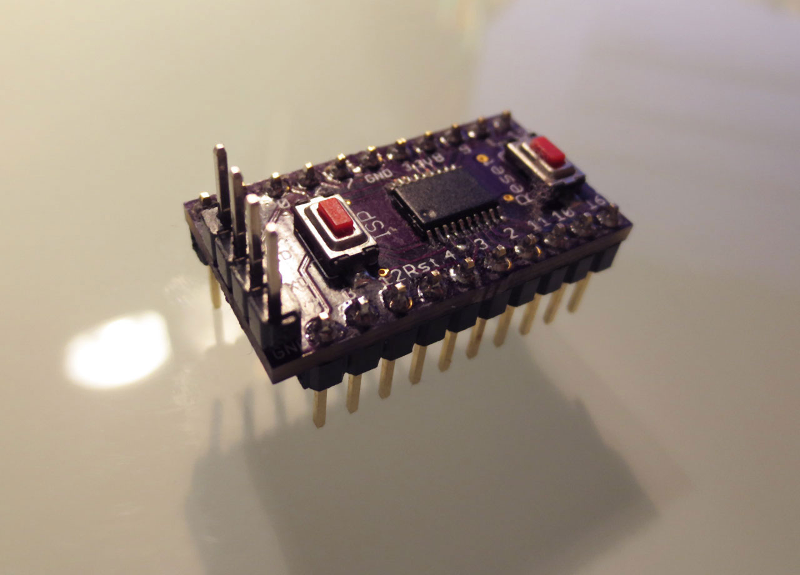

The NXP LPC800 series is an interesting entry in the Cortex M0+ microcontroller market, aiming to replace
8-bit microcontrollers at the low end. The largest member of the family, the LPC812, includes 16 kB of flash
and 4 kB of SRAM. It is available in a TSSOP20 package that is small yet still easy to solder. Since I prefer
working with microcontrollers without unnecessary clutter, I designed a small break-out board for this device.

The board includes push buttons for reset and activating the serial bootloader. It has an integrated 500 mA
3.3 V LDO to supply both the MCU and connected devices from the USB port. The four pins on the top side
(5V, RX, TX, GND) can connect to a low-cost USB-to-serial adapter (under $2 on eBay) and program the device via the
internal bootloader using FlashMagic.

The entire board with the LPC812 is smaller than a DIP LPC1114. Due to its narrow design, it is even useful
on very small 170-pin breadboards.

The [GitHub repository](https://github.com/cpldcpu/LPC812breakout) has all design data.

