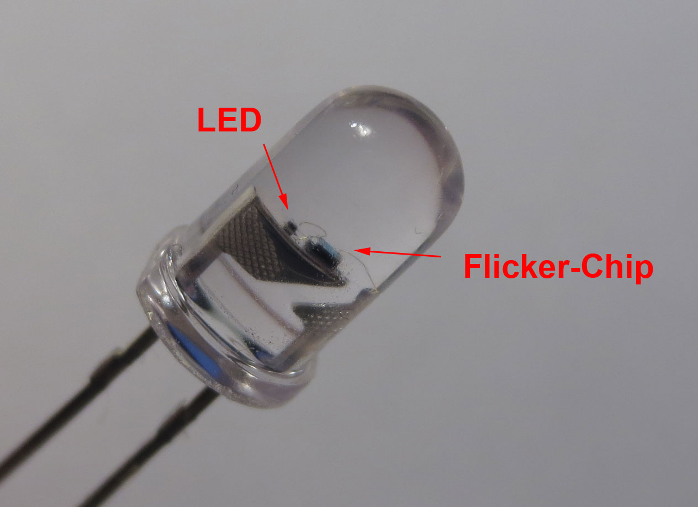
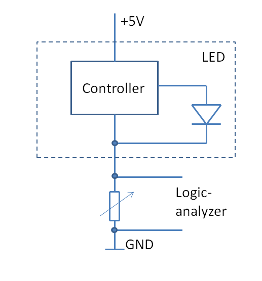
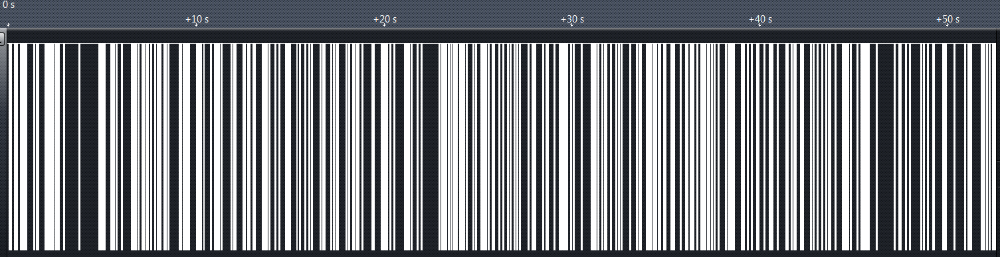
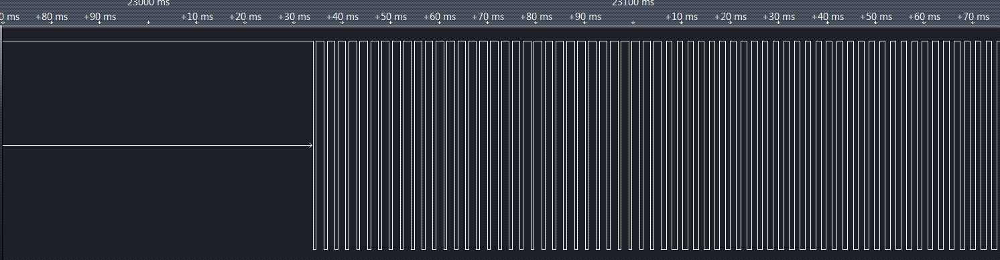
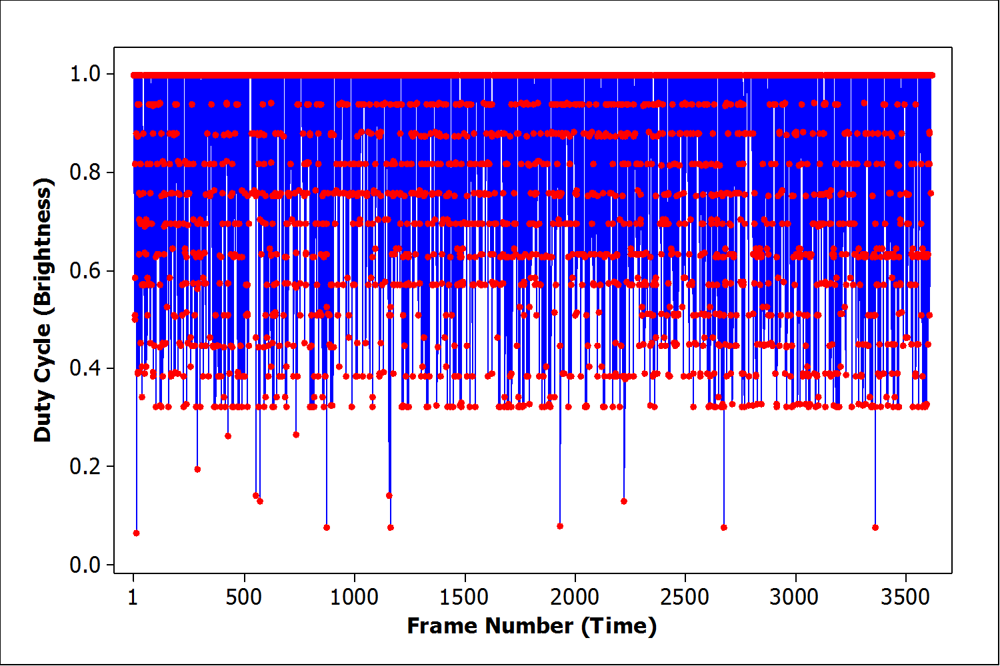
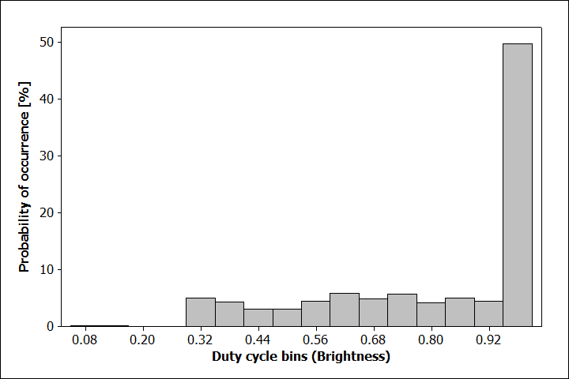
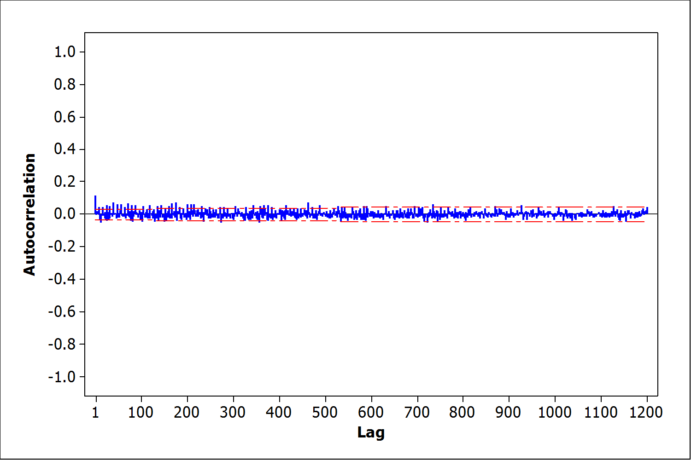

*Let's reverse-engineer a LED, pedantic mode.*

Lately, cheap electronic candles seem to be everywhere. I never paid much attention to them until recently it came to my attention that they actually use a special type of light emitting diode with integrated "candleflicker" controller. Now this is something different - who doesn't like obscure LEDs? Half an hour later I had managed to score a bag of candleflicker-LEDs from the chinese manufacturer.



Very nice, you can not do that with real candles. But the interesting part is of course: *How do they work?* Considering that they literally sell for a few cents a piece, there can not be very expensive electronics involved. This raises another question: Are these cheap LEDs really worse than all the [self-made microcontroller based LED-candles around the web?](https://www.google.com/search?q=candle+flicker+microcontroller)




The construction is relatively simple. The standard 5 mm LED package contains a small LED-Chip and a slightly larger integrated circuit. The controller chip is connected to both the positive and the negative leads. A third bond wire is connected to the anode of the LED chip, while the cathode is connected to the negative lead.

Evil Mad Scientist [looked](http://www.evilmadscientist.com/2011/does-this-led-sound-funny-to-you/) at very similar LEDs a while ago. They showed that they are "musical" by translating brightness variations to sound. They also showed that they can be used to control another LED. This is based on the fact that the LED draws more current when it is turned on by the controller. A second LED connected in series shows a very similar brightness modulation. Alternatively, the voltage drop across a series resistor is modulated in the same way as the LED brightness.



I used this to extract the "control signal" to the LED and capture it with a logic analyzer, as shown in the circuit diagram. The variable resistor has to be adjusted so that it is large enough for the logical analyzer to see a current increase as 'one', but still allow the LED to function properly.



The diagram above shows about a minute of LED brightness variation sampled at 1MHz. It is obvious that there are periods where the LED is fully turned on and there are intervals when the LED is modulated in some way. It is never off for a longer period. The makes sense, because a real candle is at maximum brightness most of the time, interrupted by short periods of "flicker".



A closer look reveals that the signal is pulse width modulated. This means that we are looking at a digital circuit, no weird analog trickery.

Curiously the frequency of the signal is around 440Hz, the [concert pitch standard](http://en.wikipedia.org/wiki/Concert_pitch). Coincidence? Or did the designer lift the oscillator from a music playing circuit? (So there is some truth to the rumor of these LEDs being musical). Each "frame" of equal brightness is exactly 32 cycles and lasts around 72 ms. This corresponds to 13-14 updates per second.

I coded a small program to identify the brightness value of each frame from the duty-cycle of the signal. The program reads a raw stream of samples and outputs a series of floating point numbers, one for each subsequent frame.



Plotting the brightness data versus time reveals some insights: The brightness variation is random, discrete, and not distributed evenly. There seem to be 16 brightness levels, of which the lowest 4 are rarely being used. Only 13 of 3600 samples are found here.



Plotting the histogram reveals the full picture: Only 12 brightness levels are used. Exactly half of the samples are at maximum brightness, while the remaining are almost equally distributed.

How could this be realized in hardware? It seems likely that there is a source of evenly distributed random numbers that are fed through a simple signal shaping function. To generate the observed distribution at least 12*2=24 discrete input levels are required. Half of them are mapped to 1. This is quite curious, since the random number generator will most likely generate a binary number. The most logical random number size would be 5 bit, 32 states. Mapping a 32 state discrete random  variable with a homogeneous distribution to 24 states without altering the distribution is not as simple as it seems. Let's also not forget that this is a completely uncritical circuit and the design was most likely rushed. So the designer  picked the most simple solution or a hack of sorts.

The only simple way that comes to mind would be to simply discard unwanted values and try the next random value.  Unwanted values can be easily identified by a bitmask. Since this is a clocked circuit, only a finite number of attempts are possible until the next frame arrives. If the number of attempts is exceeded, we are stuck with an unwanted value.*Remember the glitches above?*This is how an implementation in Ansi-C could look like:

```
    char attempts=0;
    char out;
    while(attempts++<MAX_ATTEMPTS) 
    { 
        out=RAND()&0x1f; 
        if ((out&0x0c)!=0) break; // rejected values are identified by bit 2 and 3=0 
    } 
    if (out>15) out=15; // map upper half of values to maximum brightness
```

Can we answer how many attempts are made? Statistically, a fraction of `a=0.25` of the random numbers must be rejected and "rerolled". The probably of rolling an invalid number after `n` attempts is `a^n`

```
   n=1      0.25
   n=2      0.0625
   n=3      0.015625
   n=4      0.003906
```

The fraction of "too low" brightness values is `13/3600=0.0036`, which fits very well to `n=4`. So `MAX_ATTEMPTS=4`.

Note that a more simple solution would be to simply use the value from the last frame in case in invalid value is encountered. But this can be ruled out from the autocorrelation below. The most simple solution would probably have been to modify the PWM circuit. But this is not what was done here.

Good, with that out of the way, the last piece of the puzzle is the random number generator itself. A typical way of generating a random bitstream in digital circuits is to use [linear feedback shift registers](http://en.wikipedia.org/wiki/Linear_feedback_shift_register). LFSRs generate pseudorandom sequences of bits that repeat after a maximum of `2^x-1` clock cycles, where x is the number of bits, if a proper configuration is chosen. One characteristic of these sequences (and proper pseudorandom sequences in general) is that their [autocorrelation function](http://en.wikipedia.org/wiki/Autocorrelation) is one only at the origin and multiples of the sequence length and zero elsewhere.



I calculated the autocorrelation of the entire sequence of brightness values. No self similarity was found up to 3500 samples (only 1200 displayed above), meaning that the flickering sequence did not repeat for at least 4 minutes. Since at least 5 bit of random values are required per frame (even more considering the rejection mechanism above), the random sequence is at least 17500 bits long. This would require a LFSR with a length of at last 17, or a true hardware random number generator. In any case, it is interesting that as much care was taken  to not repeat the flicker sequence when designing this product.

To conclude with the questions from the beginning: The flicker LED circuit is far more complex than I anticipated (I had also not expected to spend 4 hours on this). Many of the microcontroller candle implementations only push a LFSR bit directly to the LED output. This commercial flicker-LED uses a more sophisticated PWM output and a brightness shaping algorithm. It seems that definitely some care went into the algorithm design and more than the absolute minimum of chip area was invested. A fraction of a cent well spent.

What is the best candle-algorithm? Can this be improved?**Edit:**I finally got around emulating the LED. You can find an emulation of the LED behavior in ANSI-C [here](https://github.com/cpldcpu/CandleLEDhack/blob/master/Emulator/CandeflickerLED.c). It is written for AVR-Microcontrollers, but can easily be ported to other controllers. The [github repository](https://github.com/cpldcpu/CandleLEDhack) contains all the data and code I have written to reverse engineer the flicker-LED.**Edit 2:** For reference, I added the specifications that came with the LED below. You can find several vendors sellings these on ebay and other auction sites by searching for "candle LED 5 mm" or "kerze LED 5 mm" (german).

```
Material: AlGaInP
Absolute Maximum Rating at Ta =25 degreesC
Power Dissipation: 100 mW
Continuous Forward Current: 35 mA
Derating Linear From 50 degreesC: 0.4 mA/ degreesC
Reverse Voltage: 5V
Operating Temperature Range: -40 degreesC to +80 degreesC
Storage Temperature Range:-40 degreesC to +80 degreesC
Lead Soldering Temperature: 260 degreesC for 5 Seconds
Super high intensity luminosity: 100-2,000 mcd
Current voltage: 1.9-3.8 V
Current electricity: 20 mA
Angles: 25-120 degrees
```
