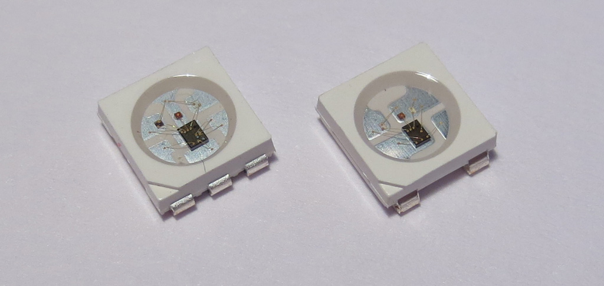
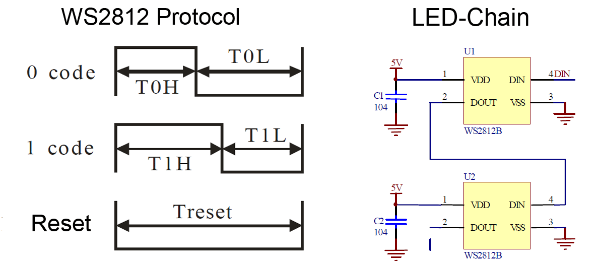
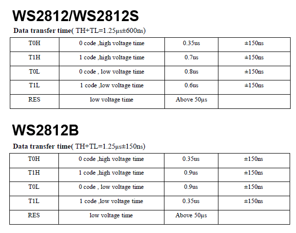
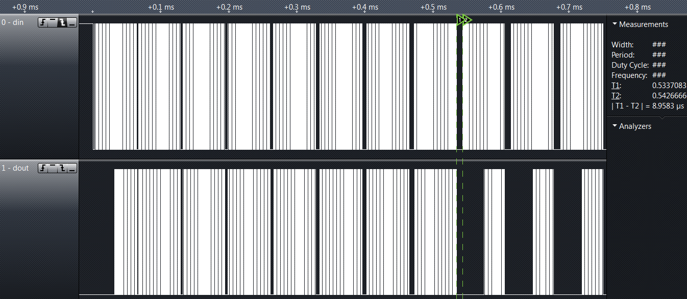
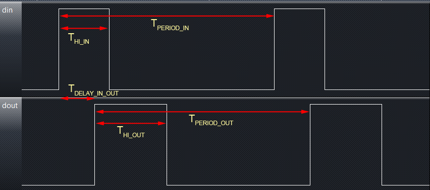
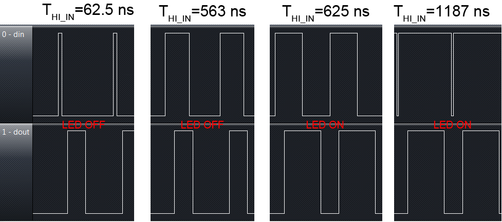
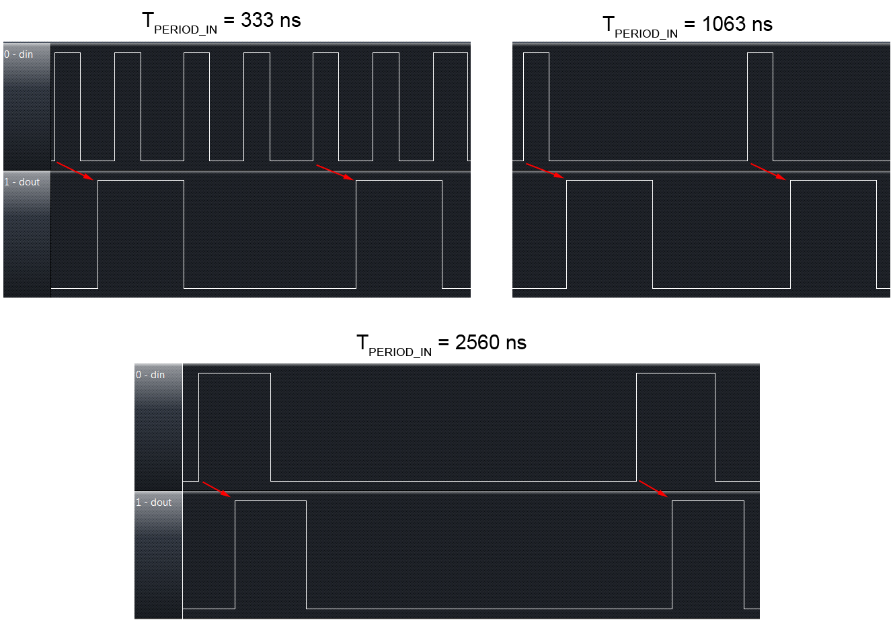
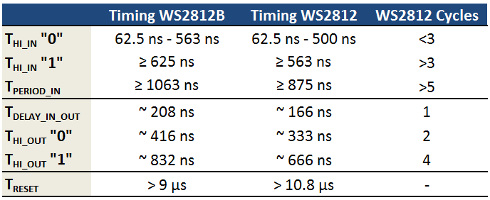
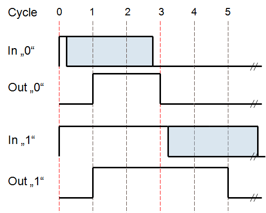

WS2812 LEDs are amazing devices - they combine a programmable constant current controller chip with a RGB LED in a single package. Each LED has one data input and one data output pin. By connecting the data output pin to the data input pin of the next device, it is possible to daisy chain the LEDs to theoretically arbitrary length.

Unfortunately, the single-line serial protocol is not supported by standard microcontroller periphery. It has to be emulated by re-purposing suitable hardware or by software timed I/O toggling, also known as bit-banging. Bit-banging is the preferred approach on 8 bit microcontrollers. However, this is especially challenging with low clock rates due to the relatively high data rate of the protocol. In addition, there are many different revisions of data sheets with conflicting information about the protocol timing. My contribution to this was the [light_ws2812 library](https://github.com/cpldcpu/light_ws2812/) V1.0 for AVR and Cortex-M0, which was published a while ago. A V2.0 rewrite of the lib was in order due to various reasons. And, to do it right, I decided to reverse engineer and understand the WS2812 LED protocol to make sure the lib works on all devices.

As of now, there are two different revisions of the WS2812 on the market: The original 6 pin WS2812(S) and the newer 4 pin WS2812B. The data sheets can be downloaded from the website of [world-semi](https://www.world-semi.com), the original manufacturer, [here](http://www.world-semi.com/uploads/soft/130222/1-130222154S6.pdf) and [here.](http://www.world-semi.com/uploads/soft/130904/1_1500205981.pdf)

The data transmission protocol itself is relatively simple: a digital "1" is encoded as a long high-pulse, "0" as a short pulse on "Din". When the data line is held low for more than 50us, the device is reset. After reset, each device reads the first 24 bit (GRB 8:8:8) of data into an internal buffer. All consecutive bits after the first 24 are forwarded to the next device go through internal data reshaping and are then forwarded via "Dout" to the next device. The internal buffer is written to the PWM controller during the next reset.

So far so good. This is where things get confusing. I copied the timing specification from both datasheets above. As you can see, both devices have slightly different timing for the encoding of the "1". Furthermore, the tolerances for the "data transfer time" are completely different and are in conflict with the "voltage time". So what are the real tolerances and can we find a set of timing parameters that fits both devices?

Luckily there is a relatively easy way to probe the inner workings of the device: When data is forwarded, it is passed through the internal reshaping mechanism. Therefore we can exercise Din and verify the correct interpretation of the input data by comparing it to Dout. To do this, I hooked a single WS2812 to a ATtiny 85 which took the role of a signal generator. I then monitored both Din and Dout with a [Saleae](http://www.saleae.com/) logic analyzer. There are some issues with aliasing, since the maximum sampling speed is only 24 Mhz, but the data seemed still sufficient to understand the WS2812.

In my first experiment I tried to determine the minimum time needed to reset the LED. My program emitted blocks of 48 bits with increasing delay time in between the blocks. As you can see above on the left side, all input data is forwarded to the output if the reset delay is too short. Once a certain delay threshold is reached, a reset is issues and data forwarding will only start after the first 24 bits, as seen on the right side. For the WS2812 under test here, the minimum reset length was 8.95 us, way below the specifications. The suggested reset time of 50 us is therefore more than sufficient to reset the LEDs. On the other hand, it means that no more than 9 us of idle time may occur during data transfer, or a reset may mistakenly be issued.

In the next step I looked at the data timing itself. The image above shows an exemplary measurement of input and reshaped output waveforms. Both waveforms can be described by two parameters each: The duration of the hi pulse and the total period. I programmed the microcontroller to cycle through all possible pulse input combinations between 62.5 ns (1 CPU cycle at 16 MHz) and 4 us with a granularity of 62.5 ns. You can find the code is [here.](https://gist.github.com/cpldcpu/8387639#file-gistfile1-c)

My original intention was to perform an automatic evaluation of the captured data to create a [shmoo plot](http://en.wikipedia.org/wiki/Schmoo_plot). However, I quickly noticed that the behavior was quite regular and instead opted to analyze the data manually.

One of the first observations was that the delay between the leading edge of the input pulse and the leading edge of the output pulse, *T_delay_in_out*, was constant regardless of the timing of the input pulse.

The image above shows a variation of *T_hi_in* for a constant *T_period_in*. The period length, called *total data transfer time* in the datasheet was set to the specification value of 1250 ns. As is obvious, there are only two states of the output signal: A short pulse for a "0" and a long pulse for a "1". Even the shortest input pulse (62.5 ns) is identified as "0", while even the longest input pulse (1250-62.5=1187.5 ns) is identified as a "1". The threshold between "0" and "1" is somewhere between 563 and 625 ns. The LED brightness changes accordingly, suggesting that the observations from the output signal are indeed consistent with the internal state of the LED.

Next, I varied *T_period_in*. When the period time of the input signal was much shorter than 1250 ns, the WS2812 started to reject input pulses. As can be seen for 333 ns, only about every fifth input pulse is replicated in the output pulses. The shortest pulse period time where all input pulses appeared on the data output was 1063 ns. Below that the input pulses were partially or fully rejected. Above this threshold all input pulses were interpreted correctly and the period of the output signal reflected the period of the input signal up to 9 us when the reset condition was met.

This is an interesting observation, because it means that while there is a strict lower limit for the period time of the input signal, there is no real upper limit. For practical purposes, this allows relaxed timing in the software driver.

The table above summarizes my findings from the WS2812 and WS2812B each. It is possible that there are significant differences between production batches of both types, therefore these number can only serve as a rough indication. All timings seem to be a bit shorter on the WS2812. This is consistent with the data-sheet which indicates a longer pulse time for the "1" on the WS2812B.

An interesting observation is that the timing values for both LEDs are multiples of a smaller number, ~208 ns for the WS2812B and ~166 ns of the WS2812. It appears that the internal controller circuit is actually a clocked design - possibly realized by a small state machine.

This becomes much more obvious with the diagram above, which normalizes the timing to "WS2812 cycles". The internal WS2812 state machine only needs to sample the input twice per bit: First, it waits for a rising edge of the input. This will initiate the sequence above. The input is latched again after cycle 2. The voltage of the input pin at this point determines whether a '1' or a '0' is read. Depending on whether the LED already has received 24 bits or not, this value will either be loaded into an internal shift register or decide whether a 2 or 4 cycle 'hi' level signal is emitted. The sequence ends after cycle 5 and repeats again with the next rising edge.

So, what did we learn from this?

- A reset is issued as early as at 9 us, contrary to the 50 us mentioned in the data sheet. Longer delays between transmissions should be avoided.
- The cycle time of a bit should be at least 1.25 us, the value given in the data sheet, and at most ~9 us, the shortest time for a reset.
- A "0" can be encoded with a pulse as short as 62.5 ns, but should not be longer than ~500 ns (maximum on WS2812).
- A "1" can be encoded with pulses almost as long as the total cycle time, but it should not be shorter than ~625 ns (minimum on WS2812B).

Next part: [Optimized "Bit-Banging"](/2014/01/19/light_ws2812-library-v2-0/)
