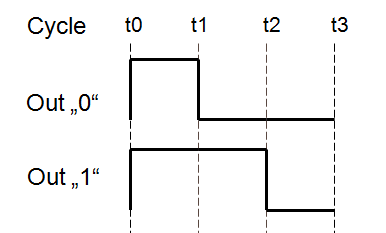

After investigating the timing of the WS2812 protocol in the [previous part](/2014/01/14/light_ws2812-library-v2-0-part-i-understanding-the-ws2812/), the question is now how to use this knowledge for an optimized software implementation of a controller. An obvious approach would be to use an inner loop that uses a switch statement to branch into separate functions to emit either a "0" symbol or a "1" symbol. But as it is often, there is another solution that is both more elegant and more simple.




The image above shows the timing of both the "0" and the "1" code. The cycle starts at t*0*, the rising edge, for both symbols. The output has to be set high regardless of the symbol. At *t1*, the output has to be set to low for a "0" and can be unchanged for a "1". At*t2* the output goes low for the "1". Since it is already low for a "0" we can set the output to low, regardless of the symbol. Finally, at *t3* the complete symbol has been sent and the output can be left unchanged.

So, in the end there is only one point in time were the output is influenced by the symbol type, *t1.* Everything else remains unchanged. This means that special case handling can be limited to a very small part of the code.

This is what I ended up with in AVR assembler code:

```
       ldi   %0,8                         Loop 8 times for one byte
loop:            
       out   %2,%3     // [01]    - t0    Set output Hi       
       ...wait1...
       sbrs  %1,7      // [02/03] -       Skip t1 if bit 7 is set
       out   %2,%4     // [03]    - t1    Set output Low       
       ...wait2...
       lsl   %1        // [04]    -       Shift out next bit
       out   %2,%4     // [05]    - t2    Set output Low       
       ...wait3...
       dec   %0        // [06]    
       brne  loop      // [08]    - t3    Loop
```

This code outputs one byte of data, which has to be loaded into %1 (The C compiler will take care of this). Since the protocol sends data msb first, bit 7 is tested. If it is "1", the *out* instruction at *t1* is skipped. That's it, as simple as that, only 7 instructions needed in the inner loop.

What is left now is to correct the timing. To do that, *nops* have to be inserted at positions *wait1..wait3*. As shown in the previous part, the most critical timing is that of the "0" where

the delay between *t0* and*t1* may not exceed 500 ns. The minimum achievable delay, when no nops are inserted at *wait1*, is two cycles. This equals 500 ns at 4 MHz and less at higher clock speeds. All other timings may exceed the minimum timing required from the data sheet.

This means that even this simple loop is able to control WS2812 LEDs at only 4 MHz! This is quite an achievement, since it was previously considered to be difficult to control WS2812 LEDs even at 8 MHz. Note that the 500 ns is safe on the WS2812B, but may be critical on the WS2812(S). It worked with my devices, though.

To make the final implementation as flexible as possible, I opted to calculate the exact number of nops to insert at compile time from the F_CPU define, which is usually set to the CPU clock speed in the AVR-GCC toolchain. You can find the implementation [here](https://github.com/cpldcpu/light_ws2812/blob/master/light_ws2812_AVR/Light_WS2812/light_ws2812.c#L39). The C-code tries to adjust the timing according to the following rules, which considers at least 150 ns margin for both the WS2812 and the WS2812B timing:

```
 350 ns <  t1-t0 <= 500 ns
 900 ns <= t2-t0
1250 ns <= t3-t0
```

The outer loop is implemented in pure C, since it can be safely assumed not to take more than 5 us. This way maximum flexibility is retained.

[Link to Github repositiory.](https://github.com/cpldcpu/light_ws2812)
