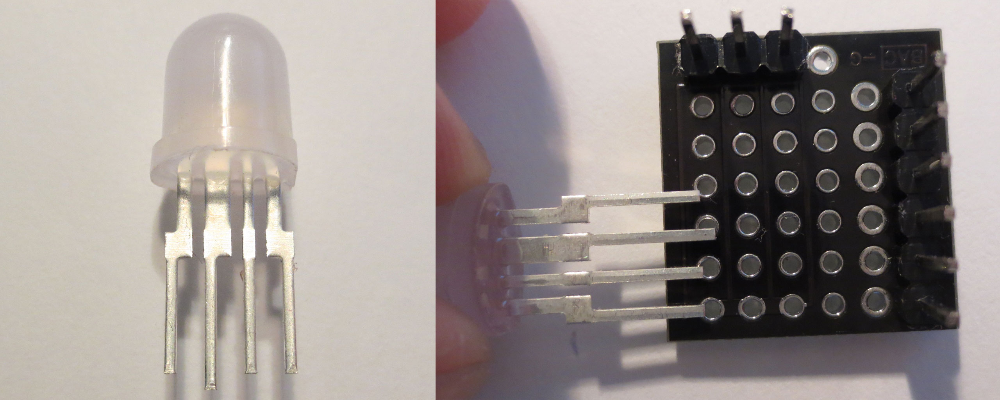
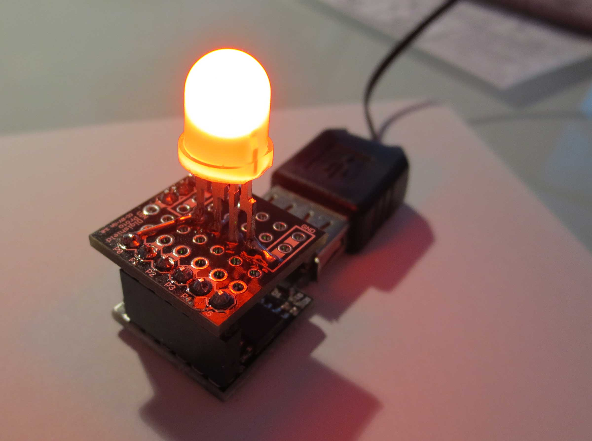
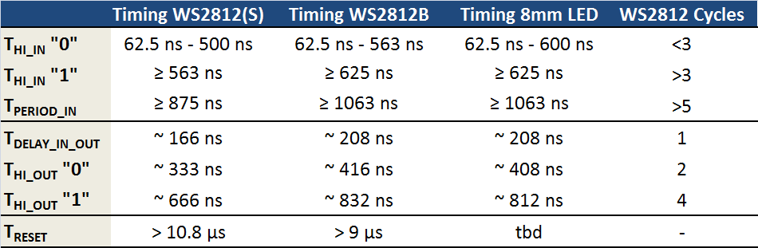

There is a new addition to the popular WS2812 family of RGB LEDs with integrated controller: A 8mm through hole version. Right now they seem to be in pilot production stage. The only place that has them is [Soldering Sunday](http://solderingsunday.com) where they are called [PixelBits](http://solderingsunday.com/shop/components/pixelbits-bakers-dozen/). My understanding is that they will also be available at the usual sources later this year. I got a couple of them to test for compatibility with my [light_ws2812 library](https://github.com/cpldcpu/light_ws2812).
What's pretty cool about these LEDs is that they are diffuse - no more blinding unidirectional light. This might be very useful for indicator lights. Furthermore, you can easily wire them freeform without a pcb. I see a lot of RGB LED cubes coming up...

The LEDs come with four leads: *VCC, GND, Data in, Data out.*  Instead of the thin bendy leads that I am used to from normal RGB LEDs, they come with with thick, rigid, pins which can not easily be bent arbitrarily. This could be a measure to improve heat sinking, but is a bit annoying when working with these LEDs. The data sheet states that the pitch of the pins is 2.54 mm. Strangely enough they do not quite fit into a normal protoboard, it seems that the real pitch is slightly smaller (2.5 mm?).

I mounted one of these LEDs on a Digispark protoshield. In contrast to the normal WS2812, the LED worked very well without an external decoupling capacitor. This may not be true for longer strings, though, although it would be a great feature. I used the Digispark to extract the timing from the LED, [as described earlier](/2014/01/14/light_ws2812-library-v2-0-part-i-understanding-the-ws2812/).

A summary of the timing values compared with the earlier WS2812 LEDS is shown above. As you can see, the timing is virtually identical to the WS2812B timing. This means that the light_ws2812 library is able to support these devices without any modifications.
