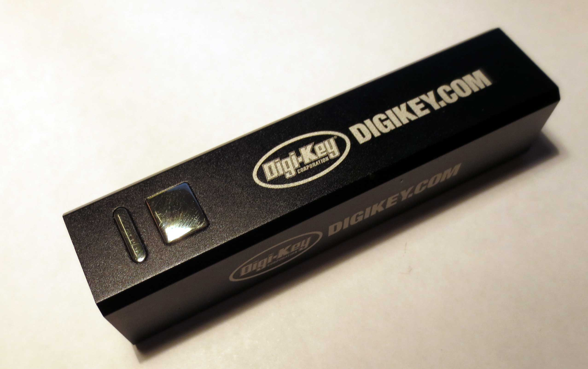
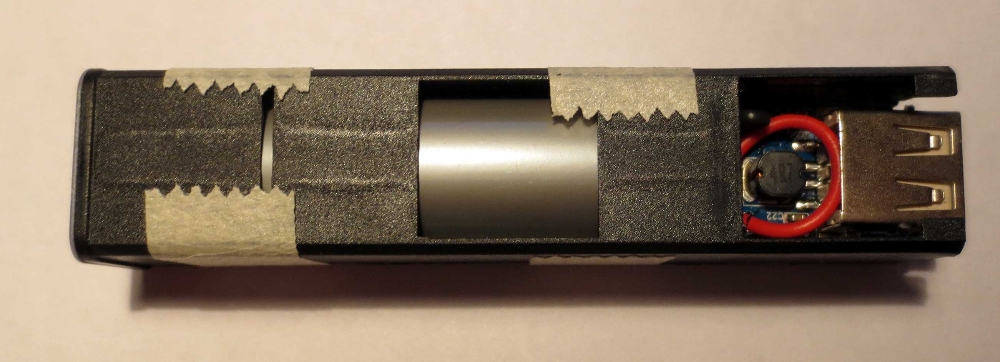
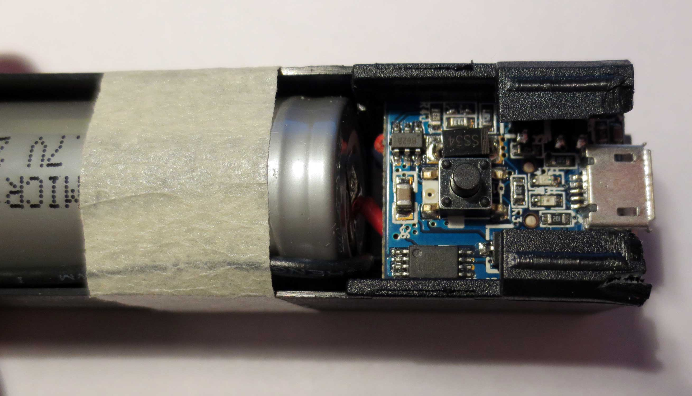
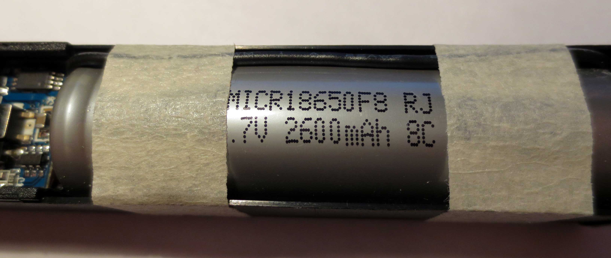
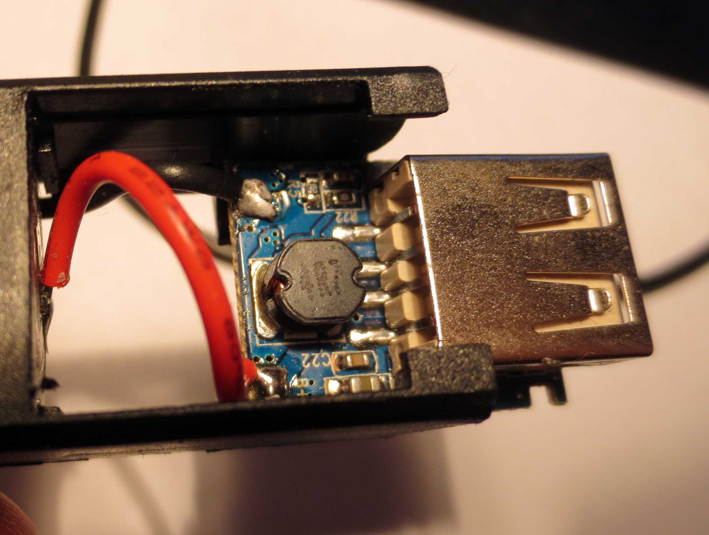
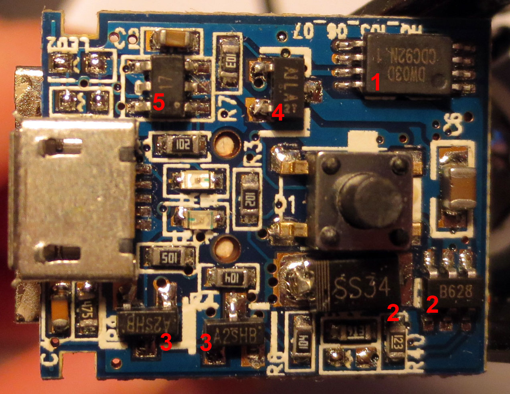

I recently received an external USB battery as a promotional gift (see image below). While I always thought of these as a superfluous gimmick, I realized that these devices could be quite useful as mobile power source for various projects. After all, dealing with lithium ion batteries in your own projects can be dangerous and you need additional circuitry to ensure charging and voltage conversion.

External USB batteries can be charged with a normal micro-b USB charger and are supposed to output stabilized 5V at above 1A. And they come fully integrated at a price point where it is difficult to get even the battery alone. See [Aliexpress](http://www.aliexpress.com/w/wholesale-USB-External-Battery-2600mAh.html?isFreeShip=y&SearchText=USB%2BExternal%2BBattery%2B2600mAh&CatId=0&shipCountry=de&initiative_id=SB_20140403030601&isAtmOnline=n&isRtl=yes&SortType=price_asc&filterCat=200003132,100003571,100003570&groupsort=1) for example and many others. Since there is little reason to trust hardware at this price point, I decided to tear the device down to see whether all the necessary parts are there.

The device has a USB micro-b socket which is used as 5V input for charging, and a normal USB-A socket as 5V output. The output power can be turned off and on by a toggle button. There are LEDs to indicate active power out (blue) and charging (red) states.

The pictures above show the innards of the device. Most space is taken up by an ICR18650 LiIon battery, which are relatively common devices with 2600mAH. In addition, there is a tiny tiny PCB.

The rear side of the PCB is dominated by a 4.7uH inductor, which is part of the boost converter to convert the 3.7V of the battery to the 5V USB output.

The front side of the PCB is extremely tightly packed and contains a surprising number of integrated circuits and discrete semiconductors. I tried to identify all devices, as noted in the image above:

1. **DW03D**- Battery management IC by Shenzhen Fuman Electronics Co.  It seems to manage charging and also comes with a discharge protection and an integrated switch.
2.**B628**- 2A boost converter, which is also manufactured as MT6803 by Aerosemi or XRT1151 by Xysemi. The is used to convert the 3.7V battery voltage to 5V output voltage.**SS34**- 3A Schottky diode needed for the boost converter.
3.**A2SHB**- 2A HM2302A N-Channel enhancement mode Power Mosfests by H&M Semi.
  Possibly used for power routing?
4.**A1LA**- iD9301 300mA LDO at 2.5V fixed voltage by iDESYN.
  No idea what this one is used for. Maybe as power supply for the toggling circuit? This appears unneccessary, though.
5.**17** - ? I could not identify this device, but it is possibly used for the toggling functionality of the tactile switch.

All in all it seems that the required parts are there and are rated properly for the application. This is quite convincing so far. One question that could not be answered by this is whether the circuit behaves correctly under all conditions, for example if the deep discharge protection does actually work. I also doubt that the circuit is optimized for quiescent current - so this is probably not the way to supply ultra-low-power sensor nodes.

It was surprising to me that all of these parts were sourced from China mainland. I had not heard of any of these manufacturers before. Some of these parts are incredibly cheap, which explains the low price point of the device. For example the B628 is sold for less than $0.10/pc, which is extremely low compared to other boost converters.
