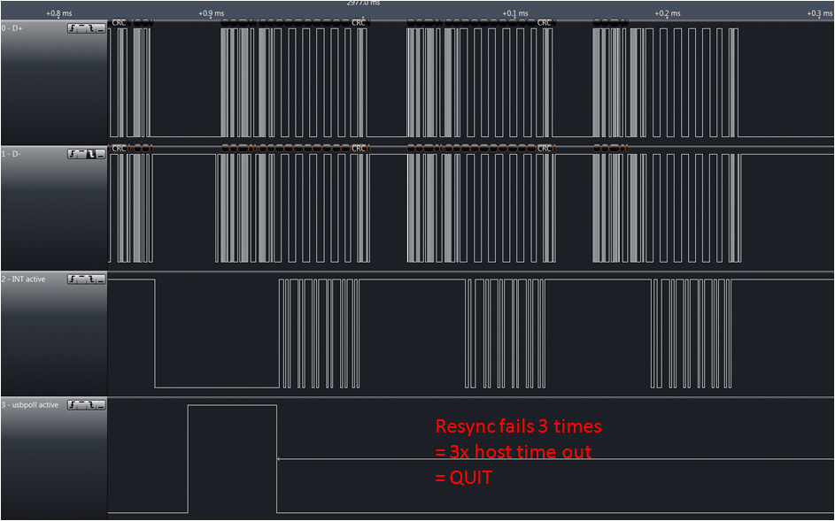

Starting with V2.0, [Micronucleus](https://github.com/micronucleus/) is going to use an interrupt free modification of the software USB implementation [V-USB](http://www.obdev.at/products/vusb/index-de.html). This provides significant benefits for the bootloader, as it is not necessary anymore to patch the interrupt vector of the user program. A surprising side effect was a speed up of the V-USB data transmission, which may also be helpful in other applications. Here, I try to give a rough overview about the meandering work that led to this achievement.
Previous versions of Micronucleus (and also the Trinket bootloader) use an [ingenious mechanism](http://www.embedded-creations.com/projects/attiny85-usb-bootloader-overview/details) devised by Louis of [embedded creations](http://www.embedded-creations.com/) to patch the interrupt vector transparently to the user program. Although this approach works very well, it still adds a lot of complexity to the bootloader, will add a couple of cycles of interrupt delay, and carries the risk of breaking the user program in a few rare cases. Removing this burden allows for a drastic reduction in code size and improved robustness.
V-USB uses a pin change interrupt on D+ to detect incoming USB transmissions. The interrupt routine will receive, decode and acknowledge USB data packets and store them in the RX buffer for parsing by the main program. In case outgoing data is requested from the host, the interrupt routine will respond accordingly if data is found in the TX buffer. The packet parsing and construction of outgoing packets is done in the main program by periodically calling *usbpoll()*.
The idea of a polled or interrupt free V-USB was brought up by [blargg](https://github.com/gblargg) in a [posting on the V-USB forum](http://forums.obdev.at/viewtopic.php?f=8&t=8738). He also devised a pretty clever way to patch this modification into the existing V-USB code. His key insight was, that you can still use the interrupt system of the ATtiny when interrupts are disabled, by manually polling the interrupt flag register. The interrupt flag is set when the interrupt condition is met and will stay until it is manually cleared by the user.
The following code snippet actively waits for the interrupt flag and then calls the normal interrupt handler to process incoming data. The only modification to V-USB is to disable interrupts (**CLI**) and to replace the**RETI**instruction at the end of the interrupt routine in*asmcommon.inc*with a**RET**.
```
 do {
 if (USB_INTR_PENDING & (1<<USB_INTR_PENDING_BIT)) {
 USB_INTR_VECTOR(); // clears INT_PENDING (See se0: in asmcommon.inc)
 break;
 } while(1)
```
Well, that looks pretty easy, and to our amazement it even worked on some computers, sometime. The problem is that*usbpoll()*has to be called at some point, because otherwise the incoming USB transmissions are never parsed and nothing can be done with the data. A single call to*usbpoll()*takes about 45-90 us on a 16.5 MHz ATtiny. Since we do not poll for interrupts during the function call, no incoming data can be received. A first approach to solve this was to define a timeout period and only call*usbpoll()*when no incoming data was detected for a certain amount of time. This improved the functionality to a point where it was possible to upload and run programs with micronucleus. But again, it completely failed on some computers and was pretty unreliable in general. It became clear, that a more sophisticated algorithm was necessary to decide when to block the CPU and when it should be avoided.
I was already about to give up on the interrupt-free approach. But then I noticed that the new 1.1.18beta release of the [Saleae](http://www.saleae.com/) logic analyzer software came with a USB1.1 protocol interpreter. This finally provided a tool to understand what was going on.

To understand the general issue, I first looked at the USB traffic of the standard interrupt-based V-USB. Apart from the USB-Traffic, I also logged two GPIO that I configured to show status information. Channel 2 is high when the interrupt is active, Channel 3 is high when the controller actively sends data. The plot above shows the transmission of a**SETUP**-packet that requests data from the client (the AVR controller with V-USB, called*function*in USB-lingo). As you can see, the interrupt is correctly called at the beginning of the transmission and the transmission is acknowledged with an**ACK**packet by the function. Since the host wants to receive data from the function, it sends an**IN**packet only a few microseconds after the set up packet. As you can see, V-USB only steps out of the interrupt for a very brief time, not enough to process the incoming data and prepare outgoing data. However, the USB 1.1 specification requires the function to respond to the request within 7.5 bit-times or 5 us. Otherwise the host will time out. V-USB handles this situation by sending out a**NACK,**signalling to the host that it is not ready yet.

The problem is of course, that sending the**NACK**consumes all the CPU time, so the situation does not really improve****. As you can see in the figure above, this can go on for quite a while. The host only stops sending**IN**packets right before the end of the frame, to avoid colliding with the 1 ms keep alive pulse. This finally leaves enough time for V-USB to process the data and prepare the TX buffer. This is extremely wasteful, since less than 10% of the USB bus traffic is actively transferring data and almost 90% of the CPU time is spent on "appeasing" the host. In the worst case, only one valid transmission can be processed per frame (1 ms). Since a low-speed USB data packet carries a maximum of 8 bytes, this limits the theoretical throughput to 8000 bytes/s and much less in practice due to additional protocol overhead. Although extremely ugly, it does work for V-USB.
Things get much more complicated with the interrupt-less version. How do we know that it is safe to call*usbpoll()*in this situation? As mentioned above, a partial solution is to process data only when the bus has been idle for 20-30 us.

The figure above shows bus traffic from an interrupt free version, using idle bus detection. Channel 2 is high when the USB transceiver routine is active (the former interrupt handler). Channel 3 is high when*usbpoll()*is active. The log starts at the end of a successfully received packet. After the bus has been idle for around 20 us,*usbpoll()*is called. Unfortunately, the gap only lasted for 42 us and*usbpoll()*was not able to finish before the next packet arrives. This leads to the transceiver trying to sync to the packet. Luckily it exits since it can not detect the sync pattern that is supposed to be at the beginning of the packet. The host times out and resends the packet for a second time. The transceiver successfully manages to resynchronize to the next packet.

So far so good, but things do not always go well. The log above shows a similar situation, however in this case the transceiver routine is not able to resynchronise to the host transmission. The host sends the packet a total of three times and quits with an error after the third time without an**ACK**. Bummer!
It does however point into the right direction: The critical point is to get the re-synchronisation right. If it is possible to achieve this, then it is possible to miss one or two data packets without any harm.
It is relatively easy to detect if a data packet was missed, because in that case the interrupt flag is set after*usbpoll()*was executed. But how to detect if we reached the end of a packet? My first attempt was to wait for the next SE0 condition, which signals the end of a packet. Unfortunately that fails, because some transmissions come in multiple packets (e.g.**OUT**or**SETUP**are followed by**DATA**). In that case the transceiver would wrongfully acknowledge the data part without correctly processing it.
A much better solution was to wait for an idle bus. Again, the timing here is very critical. It turned out that a good compromise was to wait for 10-10.5us, since this is the time it would have taken the function to send an**ACK**response, had it interpreted the last packet correctly.

Above you can see the bus traffic for an interrupt-free V-USB according to the idea above. Instead of waiting for free time on the bus, it simply calls*usbpoll()*after every successfully received packet. If a collision was detected it will wait for an idle bus to resynch. The bus can be stalled by up to 90 us using this trick, since the minimum packet length is 45 us and up to two packets may time out.
A very interesting side effect of this hack is, that the transmission is much faster than with the interrupt-based V-USB, because each data packet only needs to be resent 1-2 times instead of >10 times when the NACKing is used as above.
This is the inner loop of an interrupt-free V-USB implementation:
```
do {
 // Wait for data packet and call tranceiver
 do {
 if (USB_INTR_PENDING & (1<<USB_INTR_PENDING_BIT)) {
 USB_INTR_VECTOR(); // clears INT_PENDING (See se0: in asmcommon.inc)
 break;
 } while(1);
 // Parse data packet and construct response
 usbpoll();
 // Check if a data packet was missed. If yes, wait for idle bus.
 if (USB_INTR_PENDING & (1<<USB_INTR_PENDING_BIT))
 {
 uint8_t ctr;
 // loop takes 5 cycles
 asm volatile(
 " ldi %0,%1 \n\t"
 "loop%=: sbic %2,%3 \n\t"
 " ldi %0,%1 \n\t"
 " subi %0,1 \n\t"
 " brne loop%= \n\t"
 : "=&d" (ctr)
 : "M" ((uint8_t)(10.0f*(F_CPU/1.0e6f)/5.0f+0.5)), "I" (_SFR_IO_ADDR(USBIN)), "M" (USB_CFG_DPLUS_BIT)
 );
 USB_INTR_PENDING = 1<<USB_INTR_PENDING_BIT;
 }
 } while(1);
```
Are we done yet? There are some minor other things that popped up:
- Handling of a bus reset is not efficiently done in *usbpoll()* anymore, since it is only called upon received a packet. Instead the detection of a reset also had to be moved into the main polling loop.
- SETUP and OUT are immediately followed by a DATA packet. V-USB has special code to handle this situation, however this detection sometimes failed when the gap between the packets was too long. This is not a problem with interrupts, because they can be "stacked". In the interrupt-free case additional code had to be inserted before *"handleSetupOrOut"* in *asmcommon.inc*
- Since packets are received and parsed in order, it is not necessary anymore to have a double-buffered RX-buffer. Removing it saves some memory.
You can find the full implementation in the [testing branch of Micronucleus V2](https://github.com/micronucleus/micronucleus/tree/testing-V2-New) right now. But be aware that this is an actively developed version, so things may change. So far, this implementation has been tested by multiple people and was found to be stable. Micronucleus V2 will be released once multiple-device support is done.
**Edit:** Nice, looks like this made it to Hackaday! In light of that I'd like to add that Micronucleus V2 is not yet ready for release. If you just want a nice, small, bootloader for the ATtiny85, I would suggest you try the current release, [Micronucleus V1.11](https://github.com/micronucleus/micronucleus).
