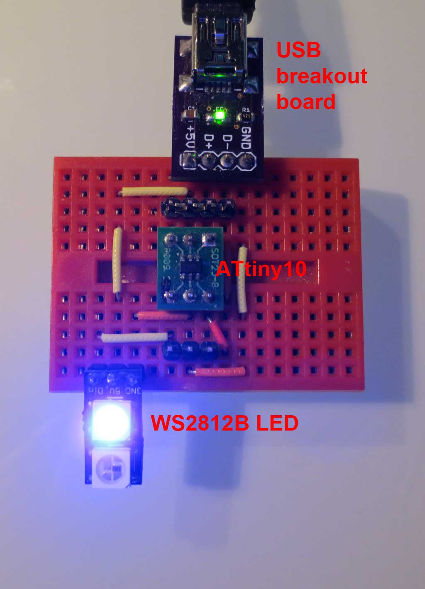
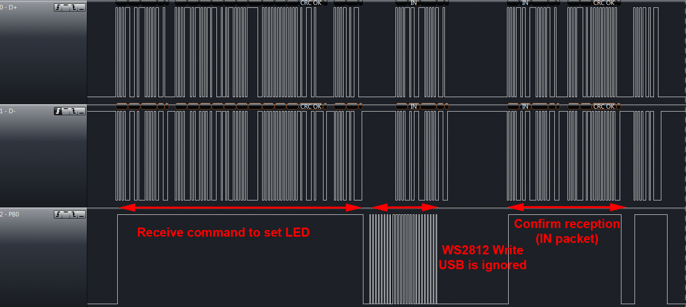
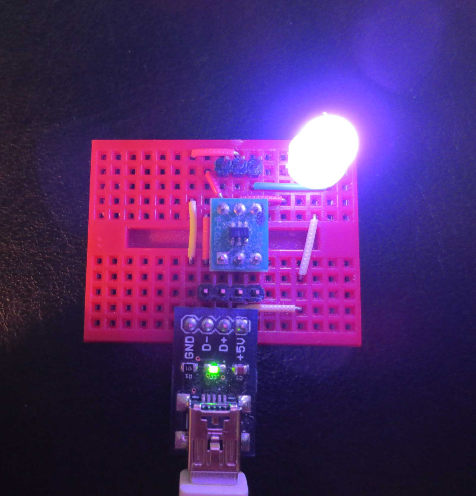

Atmels AVR [ATtiny10](http://www.atmel.com/devices/attiny10.aspx) are surprisingly powerful devices that come in an extremely tiny SOT23 package with only 6 pins. The have 1kb of flash, 32 bytes of SRAM and use the reduced AVR core which only supports 16 instead of 32 register. It seems like Atmels idea of these devices is to use them as [an advanced blinker](http://atmelcorporation.wordpress.com/2013/09/17/avr-attiny10-runs-led-blinker-for-6-months/), and to replace tiny logic circuits. But other people have shown that much more is possible. For example the [noiseplug](https://github.com/dop3j0e/noiseplug) [(video)](http://vimeo.com/47380710), a chiptune player, and a [Simon Says game](http://hackaday.com/2011/09/24/attiny-hacks-attiny10-game-doing-more-with-less/).

I previously used the ATtiny10 in the [TinyTouchbutton](https://github.com/cpldcpu/TinyTouchButton), a touchbutton controlled light with WS2812 LEDs. This time I aimed higher: Is it possible to turn the ATtiny10 into a USB compatible device? My goal was to implement a subset of the [little-wire](http://littlewire.cc/) functionality to control a WS2812 LED by USB. This takes 3 I/O lines, which is exactly the number of free pins on the ATtiny10.

Littlewire supports several functions to control WS2812 LEDs on arbitrary I/O ports. I simplified this to only supporting a single LED on a specific pin, however still retained protocol compatibility. This means that all the little-wire host-programs still work. The finished device can, for example, be used as an RGB indicator LED similar to the [Blink(1).](http://thingm.com/products/blink-1/)

My test setup is shown below. The ATtiny10 is almost the smallest part of the circuit. There are some discrete components on the rear-side of all PCBs, so do not be surprised about missing decoupling capacitors, zener diodes and resistors.



## Implementation

The V-USB USB interface requires more than 1.5kb of flash in its smallest implementation and uses more than 50 bytes of ram, including stack usage. Additional code is required to implement the littlewire interface and to write to the WS2812. The ATtiny10 has 1kb of flash, 32 bytes of SRAM and only 16 instead of 32 registers. So this ended up as a nice exercise in cutting down V-USB to its bare essentials - and further.

A main step towards reducing the memory footprint was to switch to an [interrupt-free implementation of V-USB](/2014/03/02/interrupt-free-v-usb/), as developed for [micronucleus](https://github.com/micronucleus/micronucleus). This allowed to reduce the SRAM footprint by omitting register saving on the stack and avoiding double buffering. In turn, this also allowed reducing the program size. The image below shows a timing diagram of an incoming USB packet, instructing to set the LED color, and the access to the WS2812 LED. The controller "steals" the time to write out to the WS2812 by ignoring the following USB data packet and catching up after the host resends it. This strict in-order processing allows to avoid the need of moving the data around in memory.



### AVR-GCC issues

One major annoyance during this project was AVR-GCC. Even though I used the newest versions of Atmels toolchain (4.8.1), the ATtiny10 support is still quite buggy. The ATtiny 4/5/9/10 come with a "reduced" AVR CPU core. One change is the introduction of different memory access instructions. Instead of 2 word LDS/STS, a 1 word LDS/STS is supported, which allows single cycle access to the SRAM. Unfortunately, AVR-GCC simply does not generate these instructions. Instead, indirect memory access via the Z-Register is used.

What I want:

```
  uint8_t   value0 = rq->wValue.bytes[0];
                      lds    r22,0x54
```

What I get:

```
   uint8_t   value0 = rq->wValue.bytes[0];
344:    e4 e5           ldi    r30, 0x54    ; 84
346:    f0 e0           ldi    r31, 0x00    ; 0
348:    60 81           ld     r22, Z
```

AVR-GCC effectively wastes 4 bytes for every variable access. I submitted a support ticket to Atmel around 3 months ago, but this seems to be a low priority issue to them. A pity they do not value support of their smallest microcontrollers higher, but maybe people are really only using them for very low complexity tasks.

I worked around this issue by using defines (see also [this thread](http://www.mikrocontroller.net/topic/320180)).

```
#define STS(mem,in) \
    asm volatile ("sts %0,%1"  : : "i" (&mem), "r" (in) :  "memory" );
#define LDS(out,mem) \
    asm volatile ("lds %0,%1"  : "=d" (out) : "i" (&mem));
```

Example:

```
uint8_t   value0 = rq->wValue.bytes[0];              // 6 bytes
uint8_t value0;     LDS(value0,rq->wValue.bytes[0]); // 2 bytes
```

Further measures to reduce code size:

- I clocked the controller at 12 MHz using the internal RC oscillator and calibrated from the USB bus timing. The 12 MHz V-USB implementation is much smaller than the recommended 12.8 MHz version, but it does not come with an internal phase locked loop to cope with the more inaccurate RC-oscillator timing. Surprisingly I did not observe any timing errors.
- Since the reduced core AVR only support 16 registers, I had to manually remap numerous registers in V-USB to avoid collisions with GCC.
- I removed all handling of the reset signal on the USB-Bus. This means the device will not properly re-enumerate when a bus reset is issued. But this is not a problem if you plug it in after the PC was turned on.
- V-USB was completely gutted and integrated into the main loop. It only support SETUP requests to a single endpoint now. All additional functions have been removed.  This also reduces stack usage as fewer subroutine calls are required.
- I removed the code to support replies from the SRAM. Data can only be sent from flash. This is possible since only single byte-replies are required to implement the protocol, apart from the fixed USB configuration replies which are stored in the flash.

## Final Stats

- Flash: 988 of 1024 bytes used (96.4%)
- SRAM: 28 (variables)+2 (stack) of 32 bytes used (93.8%)

This is most likely the most complex firmware ever loaded into an ATtiny10!

You can find all the code in the [Github repository.](https://github.com/cpldcpu/u-wire)

## Bonus

Bonus below, it also works with the [new 8mm WS2812 LEDs](/2014/02/18/new-member-of-the-ws2812-family/).


