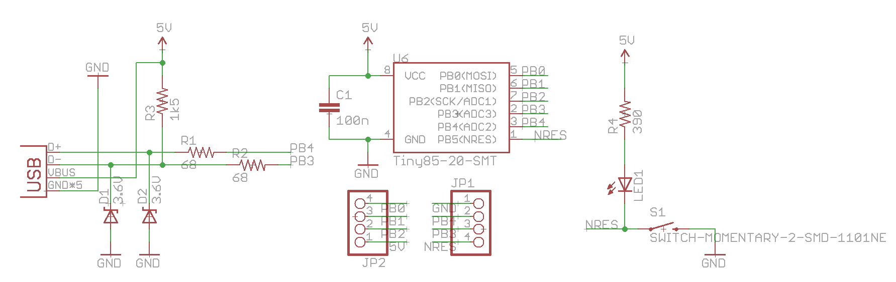

*Possibly the smallestest ATtiny85 based 'duino derivative.*

Recently, Olimex [anncounced the Olimexino 85s](http://olimex.wordpress.com/2014/02/21/new-product-in-stock-worlds-smallest-arduino-ever-16-9-x-12-7-mm/), claimed to be the "[World's smallest Arduino ever](http://olimex.wordpress.com/2014/02/21/new-product-in-stock-worlds-smallest-arduino-ever-16-9-x-12-7-mm/)". Now, that looks like a challenge. I guess it is about time to show off what has been on my desk since some time last year: The**Nanite**, pictured below.


I designed this board for fun after the Digispark and, subsequentally, the Adafruit Trinket were announced. The motivation was to have my own ATtiny85 based development board based on a USB bootloader and optimized for the ubiquitous 170 point mini-breadboards. In contrast to the Digispark it even sports a reset button. However, it lacks an integrated voltage converter as it is supposed to be powered by USB.

As you can see below, the Nanite is very narrow, wasting no space on the breadboard. It is only 0.4" wide in contrast to the 0.5" or 0.6" of the Trinket or Olimexino. In fact the pin configuration is exactly the same as that of a DIP ATtiny85. You can use the board for development and replace it with a DIP ATtiny85 when you are done.


So, how does it compare to the Olimexino 85s? The table below lists the size of both boards. Looks like the Nanite is almost 20% smaller. Yay! So much about worlds smallest. Removing the reset button from the Nanite could reduce the length further. But who wants a board without reset button?

```
Board            Width     Length    Total Area
Olimexino-85s    12.7 mm   16.9 mm   214.6 mm^2
Nanite           10.1 mm   17.8 mm   179.8 mm^2
```

Why is it that small? The picture below shows the main idea behind this: The controller is mounted on the bottom of the board in a 90 degree orientation.


Apart from the size considerations, the Nanite also uses a neat circuit trick to share a single pin with the LED and the reset button. The circuit of the board is shown below, the circuit attached to the reset pin, PB5, is to the right.



If PB5 is configured as reset (this is the standard configuration), the push button will simply act as a reset button and the LED acts as pull up for the reset button. It will of course light up while the button is pushed.

If reset is disabled and PB5 is configured as a normal I/O pin, the state of the button can be polled by simply reading from the port. The LED can be turned on by setting the output to 'low', and is turned off by configuring the output into a high impedance state. It is not advised to set the output 'high', since in that case the pushbutton could short the output to ground.

I use [micronucleus](https://github.com/micronucleus/micronucleus) in a configuration where it only starts when the button is pushed. This means that the user program is started without a delay after the device is powered up.

Since the hardware reset input is now disabled, the functionality of the reset button has to be emulated in software. This is possible by periodically polling the state of the button and activating the watch dog timer if it is pressed. If the watch dog times out, the device resets.

There are a couple of defines that handle the button and have to be included into the main loop of the program. The following code controls the LED, tests for a button press, and uses the watch dog timer to reset the device and enter the bootloader:

```
#define nanite_poll_led(ledon) { \
	NANITE_DDR &=~_BV(NANITE_PIN); \
	_delay_us(5); \
	if (!(NANITE_INP & _BV(NANITE_PIN))) wdt_enable(WDTO_15MS); \
	if (ledon) NANITE_DDR |=_BV(NANITE_PIN); \
}
```

When the watch dog time out is set to 0.5 s or 1 s, a reset is only asserted if the button is pressed for a longer duration. In this mode is it possible to use short button pushes for user interaction without resetting the device.

Apart from the LED output, user interaction and soft-reset button, PB5 can also be used as a simple serial debug output. While there is USB debug functionality in the Digispark, it can often not be used due to resource constraints or when you want to use the USB port for a different functionality. In this case, PB5 can be connected to the RX input of a serial to USB adapter. I use a simple software-UART implementation and a macro to redirect STDOUT to the serial output. This allows very convenient debugging with printf().

This is an example using the macros:

```
int main(void)
{
uint8_t blink=0;

nanite_init();    // Initialize nanite pin
nanite_init_stdout();

while(1) {
    printf("test %i\n",blink);

    nanite_poll();    // poll reset button and update LED

    blink^=1;
    _delay_ms(500);
    }
}
```

The Eagle design files and example code can be found in the [Github repository](https://github.com/cpldcpu/Nanite). Build your own!*Edit:* I added the BOM to the Github repository.

## New

You can now actually buy the Nanite 85 at [Watterott](http://www.watterott.com). Get one [here](http://www.watterott.com/de/Wattuino-Nanite85).
