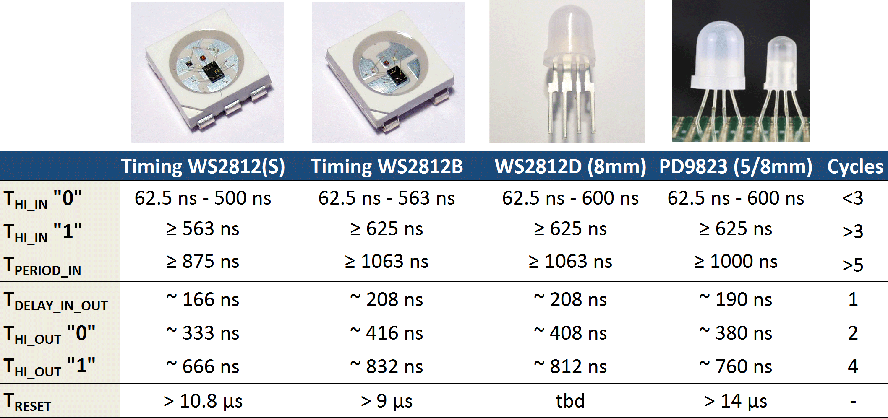

The WS2812 RGB LEDs with integrated controller are fairly successful devices that come in a variety of packages. Recently, similar devices by other manufacturers started to appear.

I managed to get my hands on a few samples of LEDs with PD9823 controller, courtesy of [Soldering Sunday](http://solderingsunday.com), and was able to subject them to more scrutiny. The manufacturer of the IC seems to be "BaiCheng". You can find it in several LEDs with different package types. There is a single page "datasheet", [linked here](p9823-datasheet.png), but little else is known to me.

The given timing values are, again, completely different from any other device. So are these really compatible to the WS2812? Only one way to find out: I used the [same setup to extract the timing](/2014/01/14/light_ws2812-library-v2-0-part-i-understanding-the-ws2812/)as described earlier for the WS2812. You can find the results below.

The internal state machine of the PD9823 seems to be identical to that of the WS2812. The base timing of the PD9823 is 190 ns, which falls exactly between the WS2812S with 166 ns and the WS2812B with 208 ns. One notable difference is a slightly longer minimum reset pulse length. However, this should not be an issue when adhering to the recommended reset timing of 50 us.

In conclusion: Any software library that is able to drive the WS2812(B) is also able to drive the PD9823. No need to change anything. You can use my [light-weight WS2812 lib](https://github.com/cpldcpu/light_ws2812)or any other alternative.
