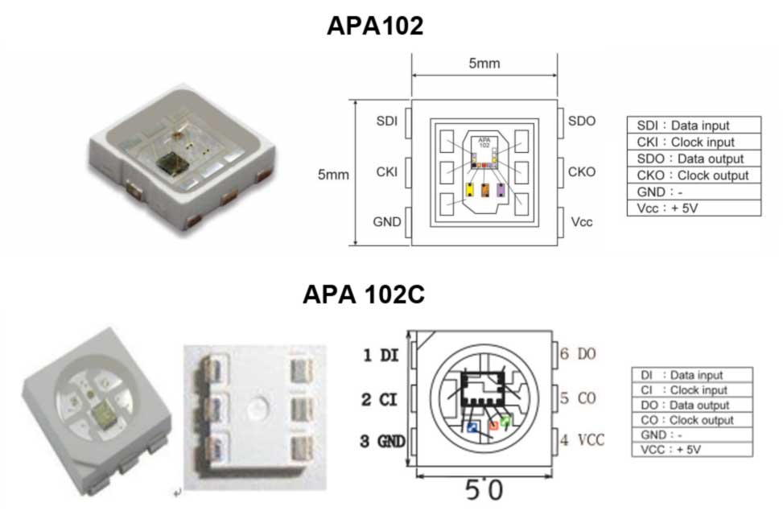
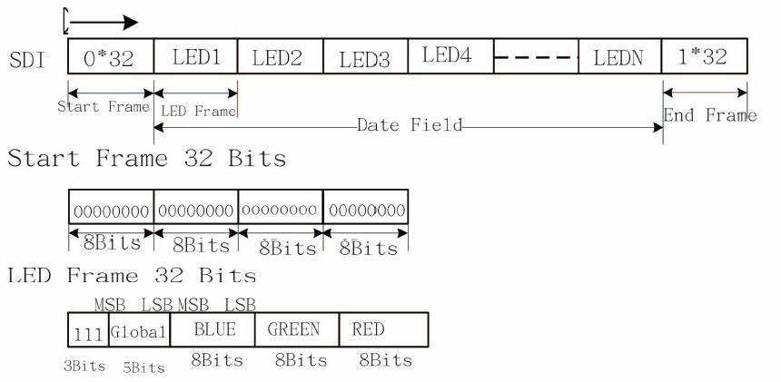
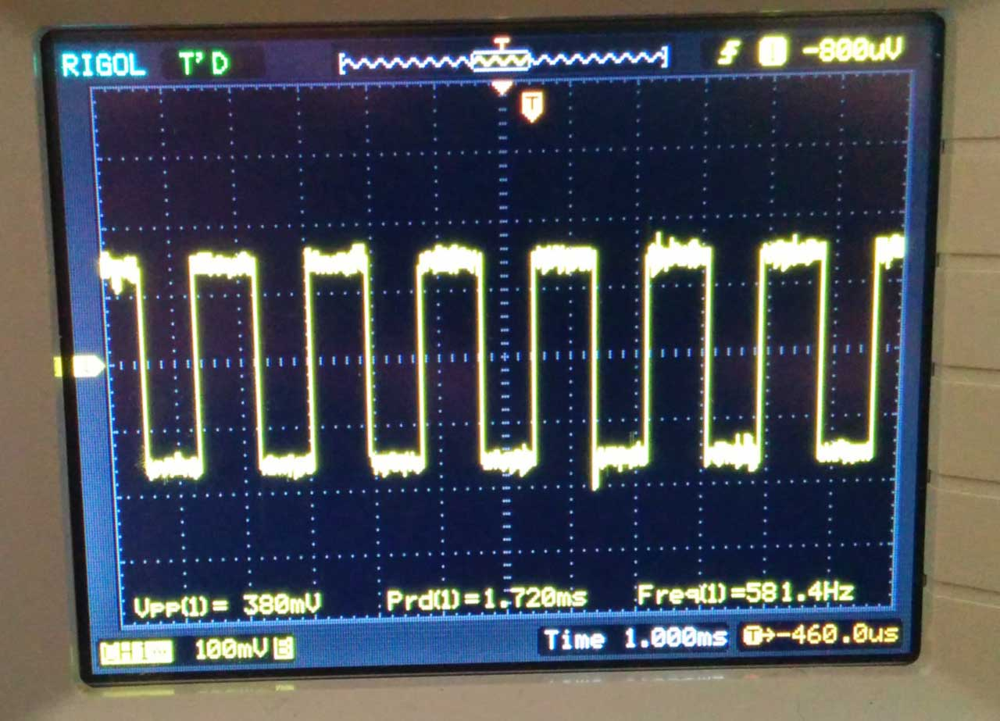
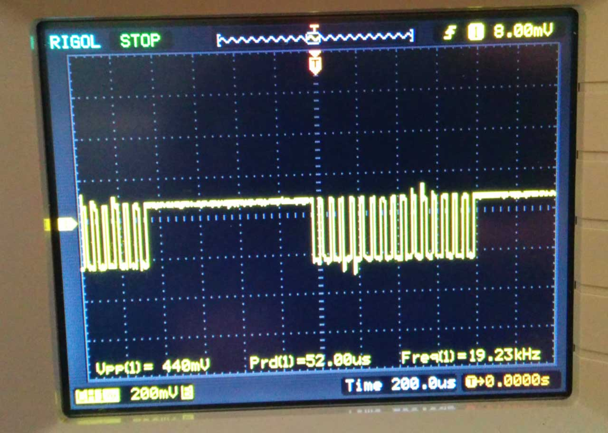

After [clones](/2014/06/16/timing-of-ws2812-clones-pd9823/) and [variations](/2014/02/18/new-member-of-the-ws2812-family/) of the venerable [WS2812](/2014/01/14/light_ws2812-library-v2-0-part-i-understanding-the-ws2812/), there finally seems to be a new RGB-LED with integrated controller that actually improves on several characteristics: The APA102, also known as "Superled". There are two versions on the market, the APA102 and the APA102C, as shown below.

The APA102C comes in a package very similar to the WS2812, while the APA102 comes in a package with an increased metallization area to improve heat conduction. The APA102 is more expensive, possibly owed to the more complicated package. So far, I was only able to investigate the low-cost version, the APA102C.

The controller IC was designed by a Taiwanese company, [APA Electronic co. LTD.](http://www.neon-world.com/). Unfortunately they do not have a lof of detailed information on their website. But they were nice enough to send me the original datasheet upon request. I mirrored the datasheets here: [APA-102](https://cpldcpu.wordpress.com/wp-content/uploads/2014/08/apa-102-super-led-specifications-2013-en.pdf) and [APA-102C.](https://cpldcpu.wordpress.com/wp-content/uploads/2014/08/apa-102c-super-led-specifications-2014-en.pdf)

I contrast to the very timing-sensitive one-wire protocol of the WS2812, the APA102 uses a standard two wire SPI protocol - one clock line and one data line. Each LED has two inputs and two outputs which can be daisy chained. At the first sight this may seem wasteful, but it has the advantage of being supported by standard microcontroller periphery and it is insensitive to timing variations. Due to the critical timing requirement it is not possible to control the WS2812 from SOCs with multitasking operating systems, such as the Raspberry Pi. This should not be an issue with the APA102. Furthermore, the data can be transferred at an almost arbitrary clock rate. I was able to control the LEDs with 4 MHz SPI clock without any hitch. It appears that the maximum speed is mainly limited by the parasitics of the wiring. The data format is shown below.

Each update consists of a start frame of 32 zeroes, 32 bits for every LED and an end frame of 32 ones.  I am not sure what the "End Frame" is good for, since its encoding is indistinguishable from a LED set to maximum brightness and will simply be forwarded to the next LED. In my experiments, omitting the end frame did not have any impact.

One interesting addition is the "global" field for each LED, which allows to control the brightness of the LED in 32 steps from 0 to 31. When trying different parameters, I was quite surprised to observe that the LEDs did not show any visible pulse-width-modulation (PWM) flicker at all when the global brightness was set to 31. This is quite different from the WS2812, which shows visible PWM flicker when moving the LEDs.

Interestingly, the APA102 started to flicker once I set the global brightness to 30 or below. To understand what was going on, I hooked up my scope to the power rails. When the LEDs are turning on, they draw significantly higher current which leads to a drop in voltage across the power rails. I previously used a similar method to investigate the inner workings of [candle flicker LEDs.](/2013/12/08/hacking-a-candleflicker-led/)

The picture above shows the current modulation for RGB=255,255,255 and  the global brightness  set to 16 (50%). The pulse width modulation is clearly visible in the voltage signal at a frequency of 580 Hz, very similar to the 430 Hz of the WS2812.

Next, I set the RGB value to 128,128,128 and kept the global brightness at 50%. The result is shown above. Two PWM modulation schemes are superimposed in this configuration. The global brightness is still modulated at ~582 Hz, while RGB value is modulated at an approximately 32 times higher frequency, 19.2 kHz. This frequency is significantly above the [flicker fusion threshold](http://en.wikipedia.org/wiki/Flicker_fusion_threshold), even when moving the LED around, leading to an apparent constant brightness.

The very high PWM frequency is a pretty nice feature of these LEDs. In combination with the higher update speed due to the SPI interface, they should be much better suited for persistance-of-vision applications than the WS2812.

In summary, the APA102 show significant promise compared to the de-facto standard WS2812:

- They can be controlled with a standard SPI interface. No critical timing required and much faster than the one wire protocol.
- They have an extremely high PWM frequency, allowing flicker-free POV applications.
- They are available in a special package with better heat sinking.

What could be improved:

- I don't find the global brightness setting terribly useful, considering that using it leads to visible  flicker and it basically adds dead weight to the data transfer.
- They are more expensive than the WS2812.

*Edit: I published more information about [the](/2014/11/30/understanding-the-apa102-superled/)*[*inner workings of the APA102*](/2014/11/30/understanding-the-apa102-superled/)*. Furthermore, a first release the of [light weight APA102 lib](https://github.com/cpldcpu/light_ws2812/tree/master/light_apa102_AVR) is available.*
