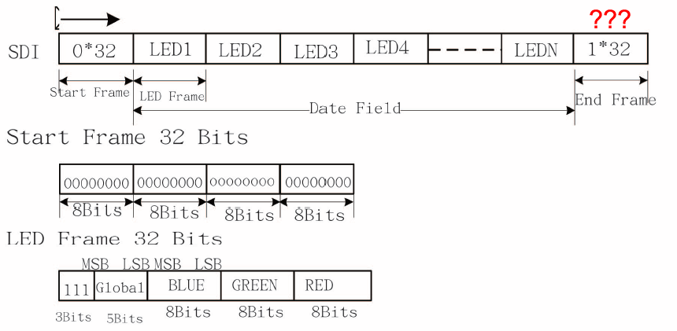
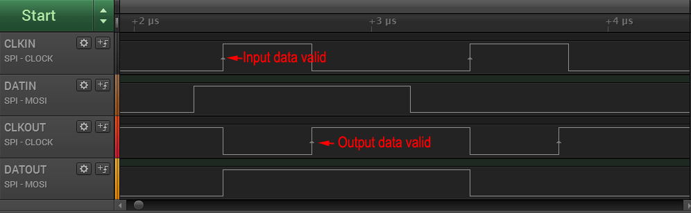
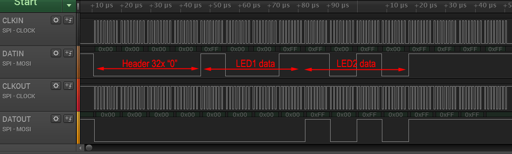

A couple of weeks ago I reported about a new type of RGB-LED with integrated controller, the [APA102](/2014/08/27/apa102/). One of the interesting new features of this device is a two-wire SPI interface instead of the proprietary [one-wire protocol of the more common WS2812](/2014/01/14/light_ws2812-library-v2-0-part-i-understanding-the-ws2812/). Many microcontrollers have hardware SPI functions, which allow easy control of these LEDs, as opposed to timing critical bit banging. But it turned out this was not the end of the story. As pointed out by Bernd in a [comment](/2014/08/27/apa102/comment-page-1/#comment-345), there is some discrepancy between the datasheet and the actual behavior of the devices when it comes to the "end frame". Reason enough to subject the APA102 to more scrutiny.

The diagram below summarizes the APA102 protocol as found in the data sheet.

To investigate the functionality of the AP102, I connected an ATtiny85 to the clock and data input lines and used a logic analyzer to probe both the input and output lines. The microcontroller was programmed to output various bit patterns as described below.

I focused my investigation on four areas:

1. Behavior of the "Start Frame"
2. Function of the "111" bits in the "LED Frame"
3. How data is forwarded to the next device
4. Impact of the "End Frame"

## The Start Frame

I varied the number of zero bits in the start frame from below to above 32. It turns out that a minimum of 32 zeroes are required to initiate an update. Increasing the number of zeroes does not have any impact. The LED frame is identified by the first one bit following the start frame.

The LED output color is updated immediately after the first valid LED frame. This is quite interesting, since it means that almost arbitrary update rates of the APA102 are possible. However, this may lead to a "staggered" update for longer strings, where the first LEDs in a string are updated earlier than the later ones. The best way to work around this is to use a sufficiently high SPI clock rate.

## The LED Frame

As noted above, the most significant bit of the LED frame has to be "1", since it is used to identify the start of the frame. It appears that the next two bits serve no function and can have arbitrary values. To stay compliant with the data sheet, it makes sense to set them to "1", though.

## Data forwarding

The APA102 receives a valid SPI signal and outputs a valid SPI signal to the next devices. By definition, the data line is valid only during the rise edge of the clock signal. This resulted in an interesting problem for the APA102 designers. Simply feeding the input signal to the output would not leave enough time to evaluate and possibly alter the incoming data and could create all kinds of race conditions.

To work around this issue, the APA102 delays the data on the output by half a cycle. As shown in the figure above, this is accomplished by inverting the incoming clock signal at the output. The data output is forwarded during the rising edge of the incoming clock, but only becomes valid for the next device at the rising edge of the outgoing clock.

This design is quite ingenuous as it does not require any internal clock source. It does, however, have implications for the protocol: Since the data for each subsequent LED is delayed by half a clock cycle, but the clock is not, additional clock cycles have to be fed to the string even after all data has been sent. This is the sole reason for the existence of the "End frame", as discussed below.

The diagram above shows how entire LED frames are forwarded from one device to the next one. Once a device detects a start frame (more than 31 zero bits), it will interpret the next "1" bit as start of its own LED frame. 32 bits are clocked into the PWM registers, while zeroes are pushed to the output. After the entire LED frame as been read, any subsequent data is simply forwarded until another start frame is detected.

## The End Frame

As we have learned above, the only function of the "End frame" is to supply more clock pulses to the string until the data has permeated to the last LED. The number of clock pulses required is exactly half the total number of LEDs in the string. The recommended end frame length of 32 is only sufficient for strings up to 64 LEDs. This was first pointed out by Bernd in a [comment](/2014/08/27/apa102/comment-page-1/#comment-345). It should not matter, whether the end frame consists of ones or zeroes. Just don't mix them.

Furthermore, omitting the end frame will not mean that data from the update is discarded. Instead it will be loaded in to the PWM registers at the start of the next update.

## Summary

In summary, each update of an APA102 based LED string should consist of the following:

1. A start frame of 32 zero bits (<0x00> <0x00> <0x00> <0x00>)
2. A 32 bit LED frame for each LED in the string (<0xE0+brightness> <blue> <green> <red>)
3. An end frame consisting of at least (n/2) bits of 1, where n is the number of LEDs in the string.

Unlike the WS2812 protocol, no waiting period is required before the next update. As discussed [before](/2014/08/27/apa102/), I strongly suggest to only use the full brightness setting (31) to reduce flicker.

I have no recommendation for a maximum or minimum SPI clock speed. There is no specification for this in the datasheet. So far, it seems that the LED is able to handle any clock setting that is thrown at it. I had no issues with 4 MHz and others have successfully tested 10 MHz and above.

## Light weight APA102 library

I uploaded an initial release of the [light_apa102 library](https://github.com/cpldcpu/light_ws2812/tree/master/light_apa102_AVR) based on above findings, a companion to the [light_ws2812 lib](/2014/01/19/light_ws2812-library-v2-0/). You can find the [code on github](https://github.com/cpldcpu/light_ws2812/tree/master/light_apa102_AVR).
