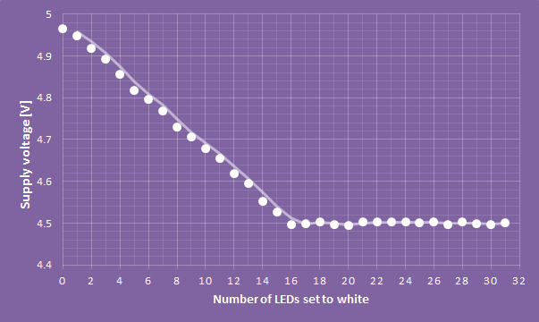
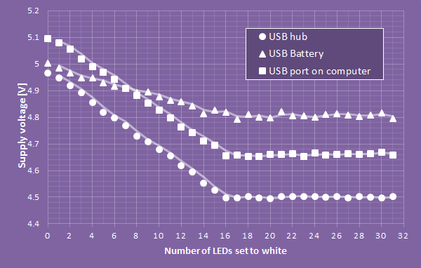

Recently, I encountered an interesting problem: How do you measure the length of a WS2812 programmable RGB-LED string electronically? That is, just using signals that are already there. This can be useful if you want a LED controller to adapt its pattern according to the string that is connected to it, or simply for diagnostic reasons.

WS2812 strings are usually controlled by using one serial output signal only. The LEDs are daisy chained and you simply push out data for all LEDs without any feedback. If there are fewer LEDs on the string, the data for the last LEDs is ignored.

An intuitive approach to counting the number of LEDs is to feed the output of the last LED of the string back into the microcontroller. According to the WS2812 protocol, the output of LED number n is low until data for n+1 LEDs has been pushed to the string. To count the number of LEDs, data is fed to the string until a rising transition is detected on the output. A relatively easy way to implement this is by using a pin change interrupt on the AVR, or a similar feature on other microcontrollers.

While this works nicely, it has the disadvantage of requiring another wire. Can we do it without introducing any additional connections?

I accidentally stumbled upon another way: When the WS2812 LEDS are set to the brightest level of white (255,255,255) they draw around 60 mA of current. This leads to a measurable voltage drop on the power rails. So we can get a good idea of the number of LEDs connected to a power source by setting it to a known pattern and measuring the resulting voltage drop.

Many microcontrollers actually allow using their internal ADC to measure the supply voltage. If the MCU is connected to the same power supply as the LED string, it can determine the current draw of the WS2812 LEDs without any additional hardware.

I tried this on an ATtiny841. The code below uses the internal ADC to measure the band gap voltage (1.1 V) using VCC as reference. From this, it is possible to calculate the actual supply voltage. It is necessary to average a number of measurements due to noise introduced into the power rail by the WS2812 pulse width modulation.

```c
/*Measures the supply voltage internally using the ADC.

Returns the ADC-value of the 1.1 band gap input measured
with VCC as reference voltage. This value can be converted
to the VCC voltage by using this equation:

VCC=1024*1.1/ADC;

cpldcpu@gmail.com - Nov 23, 2013
*/

uint16_t MeasureVCC(void)
{
  uint16_t sum=0;
  uint8_t i;

  PRR &=~_BV(PRADC); // ADC power on
  ADCSRA =_BV(ADEN)|_BV(ADPS2)|_BV(ADPS1)|_BV(ADPS0);
  ADMUXB=0; // Reference is Vcc
  ADMUXA=0x0d; // Measure internal 1.1v reference
  for (i=0; i<32; i++) {
    ADCSRA |=_BV(ADSC); // Start conversion
    while (!(ADCSRA&_BV(ADIF))); //~100 us
    ADCSRA |=_BV(ADIF); // Clear ADIF
    sum+=ADC;
  }

  return sum;
}
```

I used a loop to turn on one led after another, measure the power supply voltage after each step and print the number of LEDs and ADC output:

```c
uint8_t i,k;

for(i=0; i<stringlen;i++) {
  for (k=0; k<stringlen; k++) {
    if (k<i) {
      LEDs[k]=cwhite;
    } else {
      LEDs[k]=cblack;
    }
  }

  ws2812_setleds(LEDs,32);

  uint16_t in;
  in=MeasureVCC();
  printf("%i\t%i\n",i,in);
}
```

The image below shows the output for a WS2812 string after converting the ADC output to a voltage. Both the LED string and the microcontroller were connected to a USB port as power supply.



It is easily noticeable that there are only 16 LEDs in the string as no further drop of the supply voltage occurs after this point. Interestingly, this information can also be used to calculate the effective internal impedance of the power supply. In this example it is 0.5 Ohm, assuming that every LED draws 60 mA. The main contributor to the series resistance is probably a poly fuse that is used to protect the USB port power rails.



The image above compares the behavior of several USB power sources. The USB battery has the lowest internal resistance, as indicated by the flat slope. In this case it becomes more difficult to resolve the contribution of individual LEDs and it is only possible to get an estimate of the string lengths.

In conclusion, even though it is a bit hacky, measuring the supply voltage allows to get a good estimate of the length of a WS2812 string without any additional connections.
