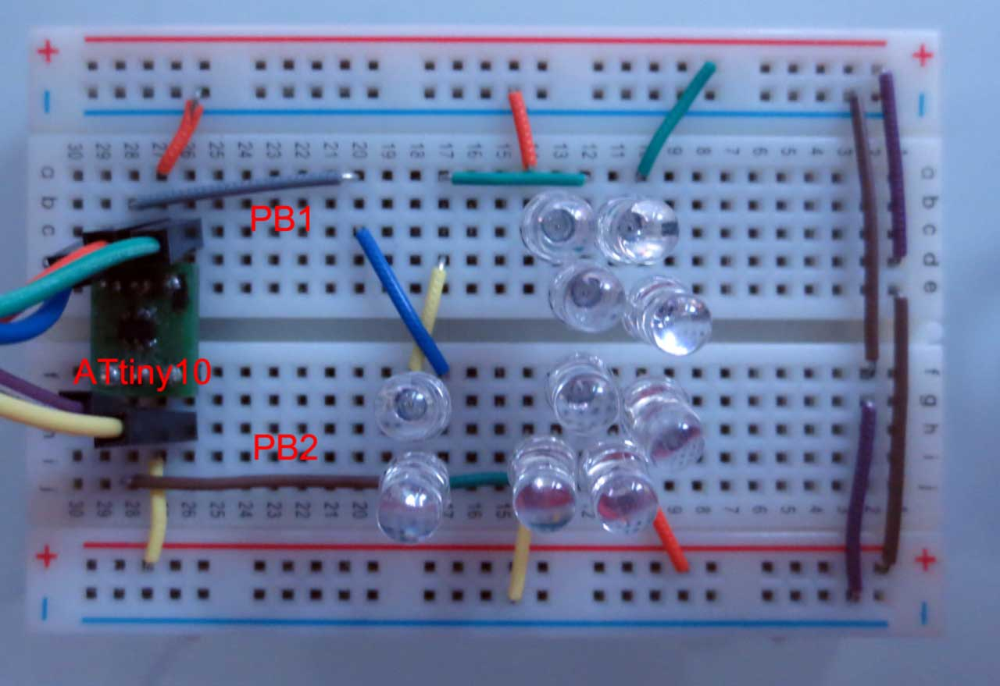

I recently bought a very low cost electronic dice kit on an impulse. Assembling it was good retro-fun for a while. The circuit design is was purely 70ies style: A CD4017, a NE555 and a couple of transistors. Of course, this got me thinking: How would it be done today in a most efficient way? Of course this means using a microcontroller, and, of course this means using as few resources as possible. Will an ATiny10 with 3 I/Os pins do?

The dice pattern consists of 7 LEDs. However, one will quickly notice that 6 of these LEDs only light up in pairs, so that only 3 pairs LEDs plus the middle one need to be controlled. This requires four I/Os - still too much!

One obvious approach to reducing the number of I/Os is to use [charlieplexing](http://en.wikipedia.org/wiki/Charlieplexing). There are plenty of [charlieplexed electronic dice on the web](https://www.google.com/search?q=charlieplexing+dice). Charliplexing allows to control **n^2-n** LEDs with **n** I/O lines. Therefore only three I/O lines are needed with charliplexing. Almost there, but still a bit too much for the ATtiny10, since an additional I/O is needed to initiate the "die roll".

Charlieplexing uses the tri-state property of microcontroller I/O pins. Only two I/Os are active at a time - one set to high and one set to low - while all other pins are in a high resistivity state. Only LEDs which are connected directly to the two active pins in the correct polarity will light up. LEDs on an indirect path, for example when two LEDs in series connect the active pins, will remain dark due to the nonlinear current-voltage properties of diodes.

Now, one has to wonder what happens when not two, but only one I/O is active? Nothing in the Charlieplexing scheme. But we can make use of it!

The circuit above shows how to connect LEDs in a different scheme. In addition to the antiparallel pair between the two I/O pins, as customary with charlieplexing, LEDs are also connected to VCC and GND. The sum of forward voltages of the four LEDs in series (LED1-4 and LED5-8) is higher than 5V, so that they will not light up when PB0 and PB2 are in high impedance (Z) state.

When one PB0 or PB2 is H or L and the other pin is Z, sufficient voltage is present for a pair of LEDs to light up. However, when PB0 is H and PB2 is L, or vice versa, LED9 or LED10 are connected in parallel to a pair of LEDs. This will cause the majority of the current to flow through the single LED so that only LED9 or LED10 light up.

The table above shows a list of possible encodings. Two pins can drive six strings of LEDs! That is more than needed for a single die. Mission accomplished.

There is a caveat: The brightness of the single LED string is different from the two-led strings. This may require correction during multiplexing. However, in reality the difference in brightness is barely visible due to the logarithmic brightness perception of the human eye.

A quick test (LEDs not arranged in dice pattern) showed that the new multiplexing scheme works nicely. Note that the circuit relies on current limiting by the internal resistance of the AVR I/O ports. This does work, but is something that should be avoided in "real" designs...

A general analysis shows that the new scheme ("Charlieplex Plus") can drive two LEDs per pin in addition to Charlieplexing. Therefore the number of LEDs for n pins is**2n+n^2-n = n^2+n**. The table above shows the number of LEDs than can be driven with a given number of I/Os with different multiplexing schemes.

Should you use this for your next design? Probably not, because there are even more drawbacks and limitations than Charliplexing already has. But it is a nice hack!

So, in summary, the answer is: Two. Two I/O pins are needed to drive the 7 LEDs of an electronic die. Off to designing a PCB...
