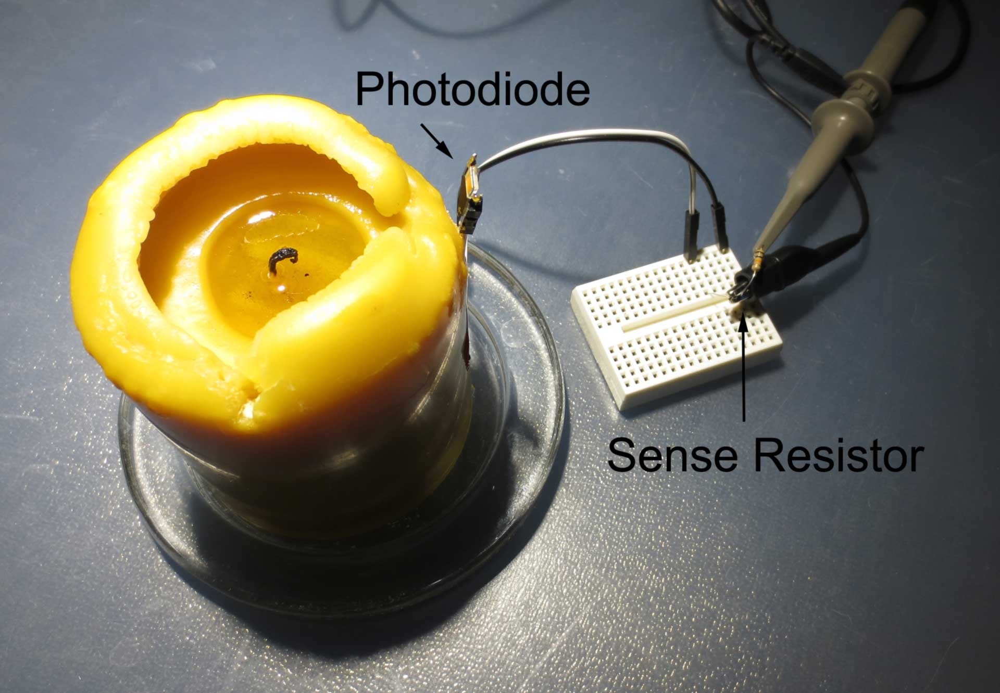
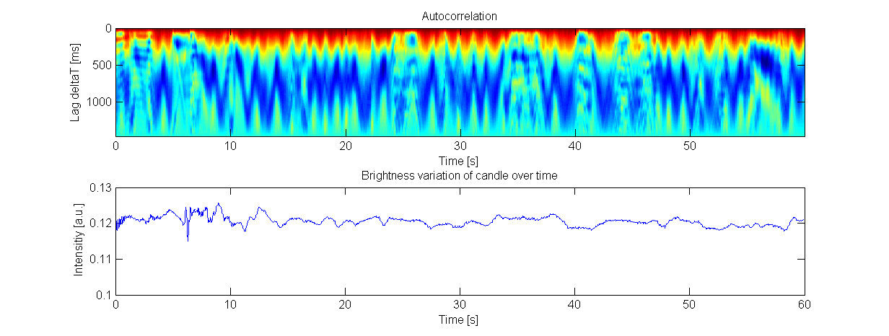
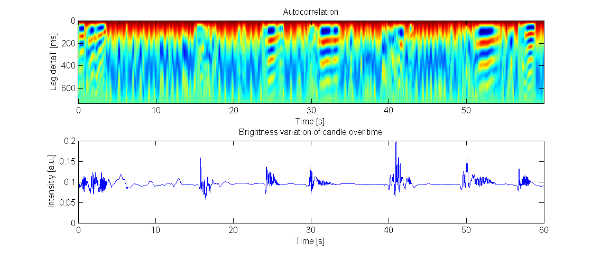
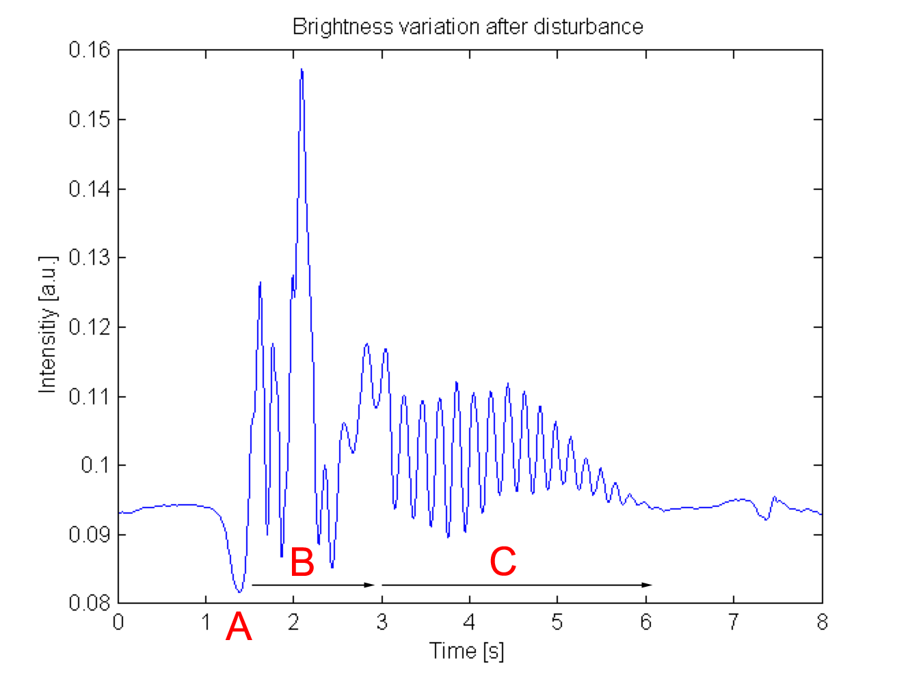

Two years ago, I spent some time [analyzing the algorithm used in a candle flicker LED](/2013/12/08/hacking-a-candleflicker-led/) as  commonly found in cheap artificial candles. I reverse engineered the  algorithm from the flickering pattern and recreated the algorithm in software. Turns out this is of interest for many people who are searching for artificial candle algorithms - there is a surge of traffic every year around December. However, I just reverse engineered one of the controller ICs - this does not mean that this is a good approximation of a real candle.

But how to get there? First, we need to understand how a real candle behaves. [In a recent comment](/2013/12/08/hacking-a-candleflicker-led/comment-page-1/#comment-635), Gary made the excellent suggestion to record a real candle on video and analyze the data. I noticed something similar could be done in a very quick-and-dirty way, by connecting a photodiode to a digital storage oscilloscope.

My five-minute experimental set up is shown above. I used a large area (~7 mm^2) photodiode and connected it to a 10 kOhm sense resistor. The distance between photodiode and flame was around 4-5 cm. The candle generated enough photocurrent to cause a voltage of ~100 mV across the sense resistor. This can be fed directly into an oscilloscope without additional amplifier. I used the deep sampling mode of a DS1052E oscilloscope and decimated the sampled data by a factor of 100 to get better sampling resolution. This allowed me to capture around one minute of light intensity data at an effective sampling rate of 175 Hz.

The figure above shows a measurement of the undisturbed candle in motionless air. The lower plot displays the variation of intensity over time. The heat map above shows the [autocorrellation](https://en.wikipedia.org/wiki/Autocorrelation) of  1500 ms slices along the same time axis.

Interestingly, even without any outside interference, there is a steady change in brightness. This is almost invisible to the eye, as it is a change of around only 5% on a scale of seconds. The autocorrelation shows that there is no long-range order in this pattern (red is the maximum in the heat map and shows only up for zero lag). Further statistical analysis shows that the distribution is symmetric and normal.

The physical origin of this effect is not clear to me. However the pattern could possibly be simulated with a constrained random walk ([here are some examples](http://cnr.lwlss.net/ConstrainedRandomWalk/)). Although, this slow variation is hardly visible due to its low magnitude, and exact reproduction may not be crucial to emulate the appearance of a real candle.

Things get much more interesting, if the candle is disturbed by gusts of air. The figure above shows an experiment where I disturbed the candle by carefully, but completely unscientifically, administering a pulse of air by blowing at the candle.

Each pulse leads to a quickly varying change in brightness ("flicker") above the base level - the candle actually gets brighter. Interestingly, the flicker has periodic characteristics ("oscillations"), as evident from the autocorrelation plot. The frequency of these oscillations seems to be around 5 Hz, drifting up, and seems to be a fundamental parameter of the flame since it appears to be relatively constant in all observations.

The trace above shows the details of a single, representative, event. There are three distinct features, marked with A, B and C.

- A) *Initial drop in brightness:* This seems to be associated with the arrival of the air pulse. Possibly the candle is depleted of flammable gasses here?
- B) *Chaotic oscillations:* This could be due to turbulence of the in rushing air, which exerts varying force on the candle.
- C) *Harmonic oscillations:* This seems to be an intrinsic process of the candle that was initiated by the external pulse. At this point, there is probably no additional external force acting on the flame. The oscillations are damped and die off after around 3 seconds.

This behavior is quite complex and even a purely empirical model is not easy to derive. Is there a chaotic oscillator that can be easily parametrized to behave in a similar way? Alternatively, one could simply ignore the chaotic oscillation in region B). Then the flickering could be simulated using a damped harmonic oscillator. It is quite possible that the visual difference is negligible.

Alternatively, a much more pragmatic solution would be to use snippets of recorded temporal brightness variations and rearrange them randomly.

To test this approach, I generated animated gifs of the recorded data.


  
  
  


*Left:* undisturbed candle *Center:* disturbed candle *Right:* Candleflicker LED

As expected, the brightness variation of the "undisturbed" candle is hardly visible. The "disturbed" candle shows a flickering pattern that appears reminiscent of a real candle. The candle-flicker LED, in contrast, shows only a very crude approximation of a real candle.

Edit: You can find the raw data traces and some scripts used for analysis on [my Github account](https://github.com/cpldcpu/RealCandle).
