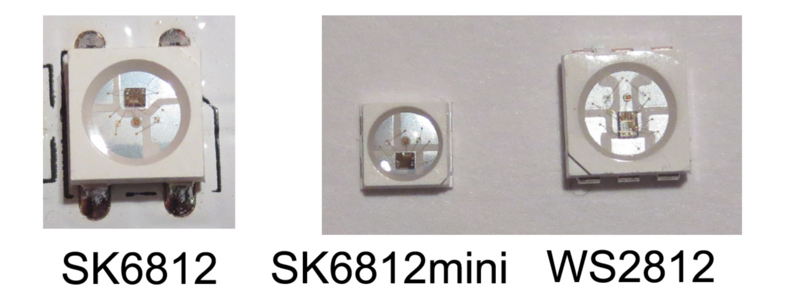
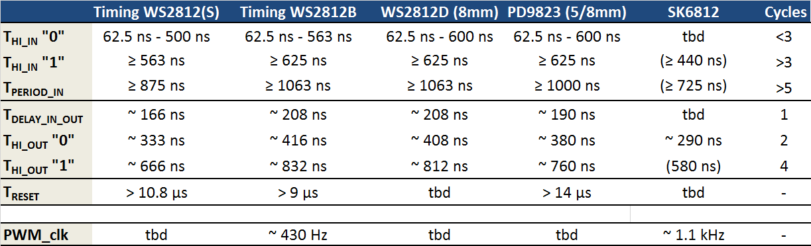
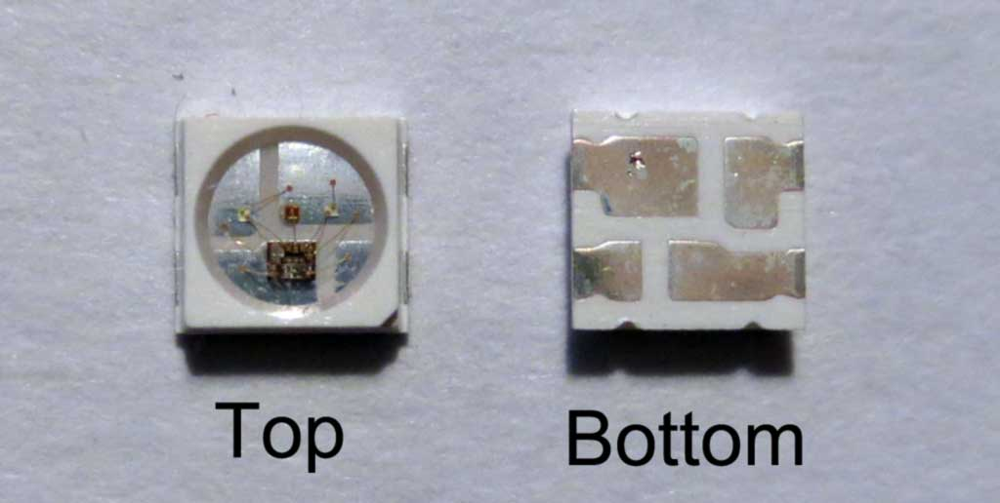
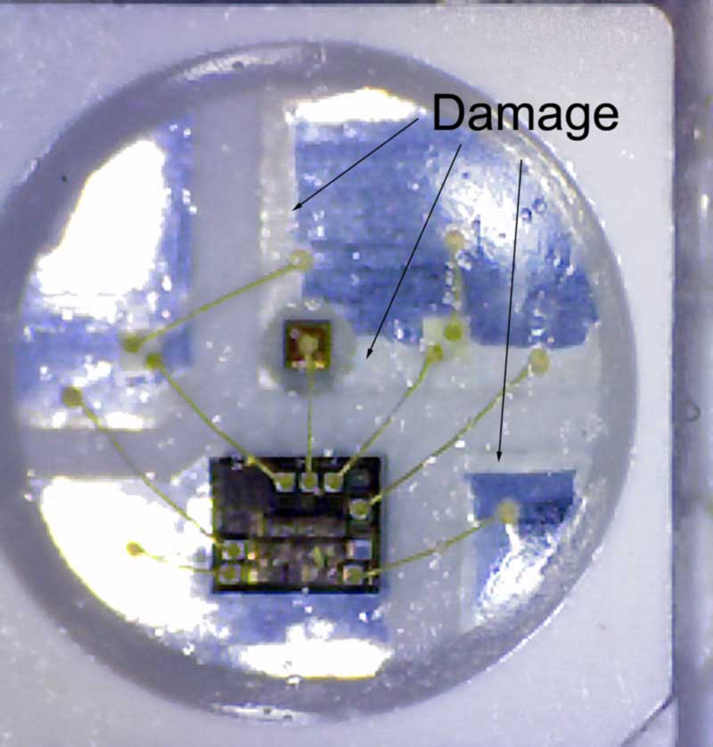

During the last months, a new WS2812 alternative appeared on the market: The SK6812. I finally managed to get my hands on some of them to take a closer look. In most aspects these devices are basically clones of the WS2812. What is interesting however, is that the manufacturer came up with a couple of new variations of the stock 5050 RGB LED.

As with many components from mainland china, it seems very difficult to identify the actual manufacturer of these devices, as vendors tend to rebrand data sheets. It appears that at least one of the original manufacturers is [Opsco Optoelectronics](http://www.opscoled.com/). However, it is likely that there is more than one manufacturer is using the SK6812 brand, which does possibly only refer to the controller chip itself. The "SK" prefix, on the other hand, is normally used by [Shenzhen Sikewei Electronics](http://www.sikewei.com/), which seems to specialize on speech ICs and similar low-cost applications. Are they connected? No idea...

The image above compares the "grandfather", the WS2812S, with two new devices based on the SK6812 controller. The SK6812 is a direct clone of the WS2812B, while the SK6812mini comes in a smaller package with a 3.5x3.5mm^2 footprint. This is quite useful, since it allows more dense matrix displays than with the normal 5.0x5.0mm^2 packages.

Another, less obvious, difference is in the size of the controller IC and LED dies. The SK6812 is actually a bit smaller than the WS2812: Based on a rough measurement, the WS2812 is approximately 0.8x1.05=0.84 mm^2 while the SK6812 measures 0.6x0.8=0.5 mm^2. This suggests that the SK6812 is indeed a complete redesign. The smaller chip size should, in principle, also lead to lower cost. Although this depends on the manufacturing technology as well. In the same vein, the SK6812 also uses slighly smaller LED dies. This is most likely another measure to reduce cost.

So, how do these devices behave electrically? I subjected the SK6812 to similar tests as I performed previously on the [WS2812](https://cpldcpu.wordpress.com/2014/01/14/light_ws2812-library-v2-0-part-i-understanding-the-ws2812/) and its[variants](/2014/02/18/new-member-of-the-ws2812-family/)and [clones](https://cpldcpu.wordpress.com/2014/06/16/timing-of-ws2812-clones-pd9823/). The results are summarized in the table above. The timing of the SK6812 is slightly faster than that of the WS2812 ("High" timing is 440 ns vs. 625 ns). However, I don't expect any issues with the timing of existing WS2812 libraries, such as the [light_ws2812 library](https://github.com/cpldcpu/light_ws2812). An interesting difference is that the PWM frequency of the SK6812 is more than twice as high as that of the WS2812 (1.1 kHz vs. 430 Hz). This should lead to less visual flicker, although the frequency is still not high enough for persistence of vision displays.

The SK6812 uses an identical package to the WS2182B. What is notable about the SK6812mini is that it does not only use a smaller package, but also a different packaging technology. Here, the metal frame, that is used to mount the dies in the package, also serve directly as solderable contact, as shown in the image above. In principle this should allow better heat removal from the LEDs and the controller chip.

However, heat conduction isn't a one-way process: The SK6812mini seems to be quite sensitive to heat. If it is overheated during (hand-)soldering, white stuff seems to encroach on the lead frame, which ultimately leads to broken contacts. In the device shown below, the red LED in the center stopped working.

Apart from the standard version, the SK6812 also comes in a RGBW version with 4 channels. This adds a white channel to the normal RGB version, which can be used for better color reproduction. This version needs 4 data values per LED. Other than that it seems to be functionally identical to the normal 3 channel controller. I extended the [light_ws2812 library](https://github.com/cpldcpu/light_ws2812) to allow controlling RGBW LEDS. Please have a look at the repository for details.

In summary, the SK6812 and its descendants are an interesting variation on the WS2812, most notably the SK6821mini due to its small footprint  and the RGBW version. The improvements are mostly evolutionary, however. I wonder what the next big thing in integrated LED controllers will be?
