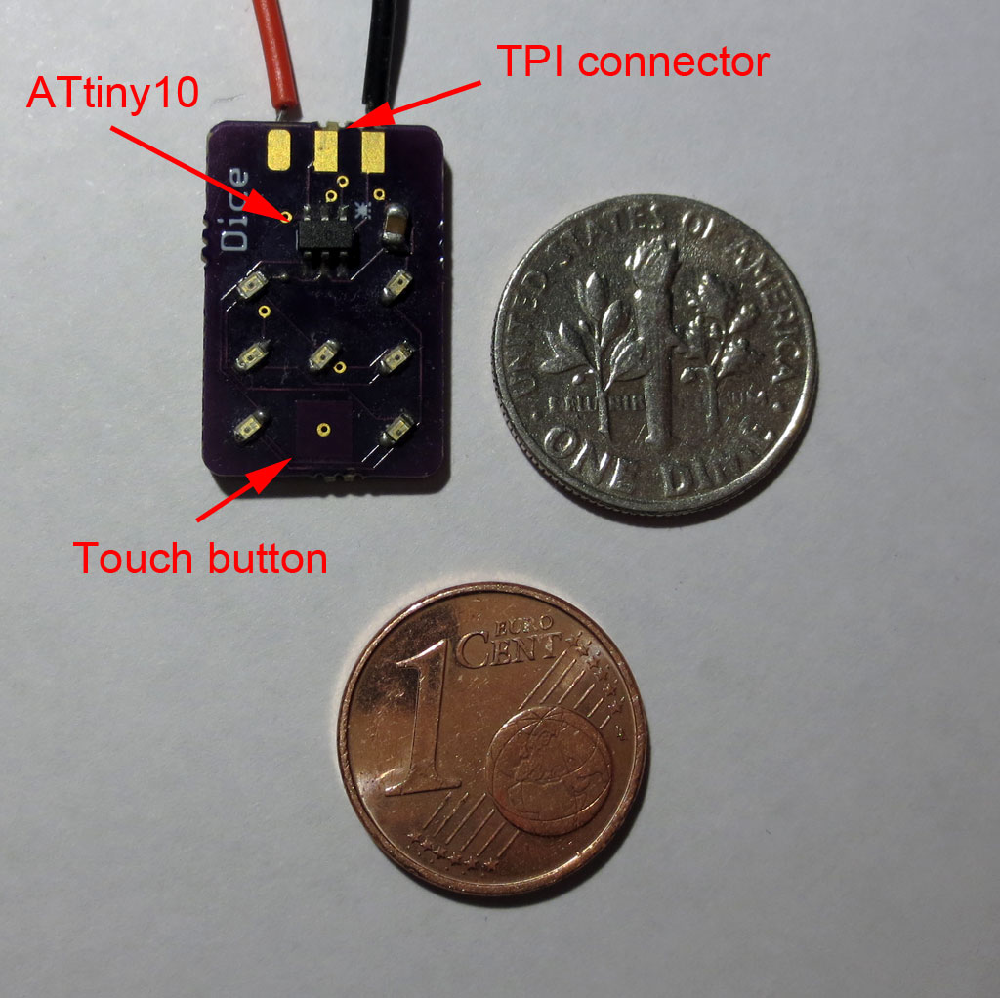

Yay,  another mini-project with the ATtiny10!

A while ago I devised a scheme to [drive an electronic dice with only two IO lines](https://cpldcpu.wordpress.com/2015/05/24/plexingplus/). I finally found the time and motivation to build up a small design using this as an entry for the hackaday 1k compo. Please find project details on the[hackaday.io page](https://hackaday.io/project/18595-dice10) or the [github repository](https://github.com/cpldcpu/Dice10).

