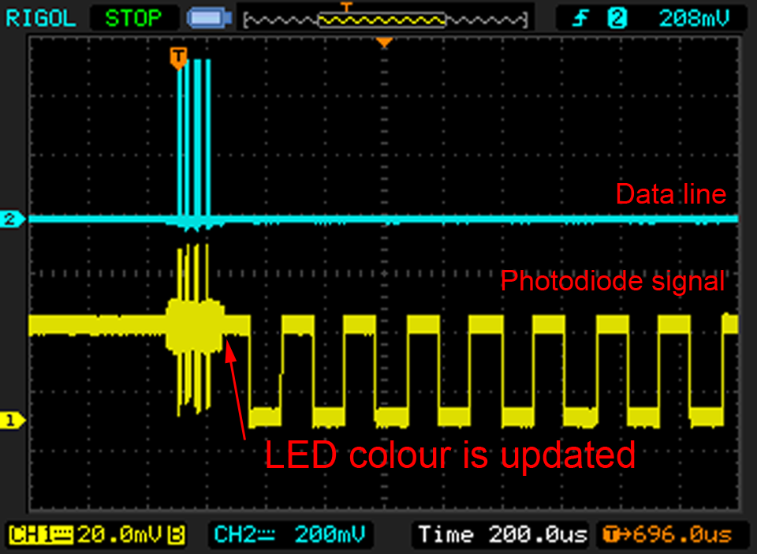

Two years ago I took a deeper look into the [APA102](http://cpldcpu.com/2014/08/27/apa102/). Although it was more expensive than the common WS2812, and harder to come by, it had some intriguing properties. The main benefits are a timing-insensitive  SPI interface, allowing easy interfacing to standard periphery, and a much higher PWM frequency of >19kHz, making the APA102 almost flicker free.

So much about that. Considering how things with LEDs from China go, it should not take too long for clones to appear? Indeed! Recently, [several](https://cpldcpu.com/2014/08/27/apa102/#comment-943) [comments](https://cpldcpu.com/2014/08/27/apa102/#comment-944) [showed](https://cpldcpu.com/2014/11/30/understanding-the-apa102-superled/#comment-915) [up](https://cpldcpu.com/2014/11/30/understanding-the-apa102-superled/#comment-865) on my blog, reporting about issues with APA102 LEDs they bought. It quickly turned out that these were SK9822, APA102 clones from the same company that already brought the [SK6812](http://cpldcpu.com/2016/03/09/the-sk6812-another-intelligent-rgb-led/) to us, a WS2812 clone.

One of these people was Mike. He developed the [Weblight](https://github.com/sowbug/weblight), a [WebUSB controlled](https://wicg.github.io/webusb/) RGB LED. The prototype (shown below, red pcb) worked well, but when he commissioned a small production run (black pcb), the LED started to show odd update behavior. Mike was nice enough to share a couple of boards with me for further investigation.

At a first glance, it is obvious that both LEDs use different ICs. The die used in the SK9822 is much smaller than the APA102. As a rough estimate, the APA102 seems to be 1 mm^2, while the SK9822 is ~0.65 mm^2. The smaller die likely results in a lower cost. So it is not surprising that vendors are trying to replace APA102 with SK9822...

But why are people complaining about the SK9822 being incompatible? According to the datasheet ([linked here](https://cpldcpu.wordpress.com/wp-content/uploads/2016/12/sk9822-led-datasheet.pdf)), the data format is supposed to be exactly the same. In fact, it looks like the sections in the datasheet are copied directly from the APA102 datasheet. However, even the original APA102 datasheet wasn't too accurate when it came to the data format. For more details, please check out my post on [investigating the APA102](http://cpldcpu.com/2014/11/30/understanding-the-apa102-superled/).

Probing the SK9822 quickly revealed that something was off when using it in the same way as a APA102. As shown above, the data format itself seems to be identical, and data forwarding from one LED to the next seems to work in the same way as with the APA102. However, every colour combination written to the SK9822, only was shown during the next update cycle. Some more probing isolated the issue: The SK9822 updates the PWM registers in the first cycle after the next start frame (0x00000000), while the APA102 updates the PWM register immediately after receiving the data. Since the next start frame is sent at the beginning of the next update, this means that the color update is delayed.

I can only speculate about the reason for this deviation. Possibly the SK9822 was implemented using the APA102 datasheet as a reference, and this was a misinterpretation on the, admittedly, not very accurate description of the protocol. Actually, the way the update is implemented in the SK9822 makes more sense than in the APA102, because it allows to update all LEDs at once instead of the staggered update of the APA102.

# Unified protocol

The only way to get the SK9822 to work properly is to send an additional "reset frame" of 32 zero bits at the end of the bitstream to trigger the PWM register update. Luckily there is a very easy way to implement this in a way where it is compatible to the APA102: The endframe of the APA102 can be either ones or zeroes (see [here](https://cpldcpu.com/2014/11/30/understanding-the-apa102-superled/)). Simply emitting another 32 zeroes at the end will not have any impact on the APA102, given that also the endframe is changed to zeros.

A protocol that is compatible to both the SK9822 and the APA102 consists of the following:

1. A start frame of 32 zero bits (<0x00> <0x00> <0x00> <0x00> )
2. A 32 bit LED frame for each LED in the string (<0xE0+brightness> <blue> <green> <red>)
3. A SK9822 reset frame of 32 zero bits (<0x00> <0x00> <0x00> <0x00> ).
4. An end frame consisting of at least (n/2) bits of **0**, where n is the number of LEDs in the string.

# SK9822 LED driver characteristics

To probe the SK9822 LED driver, I mounted a photodiode in front of one LED and connected it to an oscilloscope. This allowed me to directly monitor the modulation scheme of the LEDs. The exemplary image below shows both the dataline and the photodiode signal during an update from RGB=0xFF0000 to RGB=0x800000. The PWM frequency can be directly measured in the scope trace. It is 4.7kHz for the SK9822 - about four times lower than the 19.2kHz, but not even close to the 430 Hz flicker hell of the WS2812.

Something interesting happened, when I tried to change the global brightness setting. In the trace below I started with maximum brightness and reduced it to 50% by either using the global brightness register or the PWM register. As can be seen below, reducing the brightness to 50% reduces the light output from the LED, but no pulse width modulation is visible. It appears that the SK9822 uses a controlled current source to set the global brightness. This is in contrast to the APA102, which superimposed a lower frequency PWM pattern if the global brightness was not set to its maximum (see [here](http://cpldcpu.com/2014/11/30/understanding-the-apa102-superled/)).

This is confirmed by the trace below. Here, I activated the PWM by setting RGB=0x800000 and ramping through the global brightness setting. The global brightness setting does indeed control the driver current setting.

The implementation of a programmable current source in the SK9822 is actually a very welcome improvement. In contrast to the original, the APA102, the LEDs do not start to flicker if the global brightness is reduced. This is a very nice feature if the SK9822 is used in a display. In addition, lowering the current setting allows to reduce peak current consumption, which can be quite an issue if you have plenty of LEDs PWMed at 3x20mA.

# Summary

At a first glance, the SK9822 looks like an identical clone of the APA102, but taking a closer look reveals plenty of differences, see table below.**APA102****SK9822****Update**Staggered
Simultaneous**Update trigger**RGB data transmission
Reset frame (0x00000000)**PWM Frequency**~19 kHz
~4.7 kHz**Global brightness control**PWM at ~440 Hz
Programmable current source**Chip size**
~1 mm^2
~0.65 mm^2

In conclusion, the SK9822 is not an exact clone of the APA102. It adds some interesting features. For example the programmable current source to control global brightness and a non-staggered update. But there are also some drawbacks like the protocol incompatibility and the lower PWM frequency. The incompatibility in the protocol can be worked around by using the unified protocol proposed above.

I updated my light_APA102 library to be compatible to the SK9822. You can find it [here](https://github.com/cpldcpu/light_ws2812/tree/master/light_apa102_AVR).
