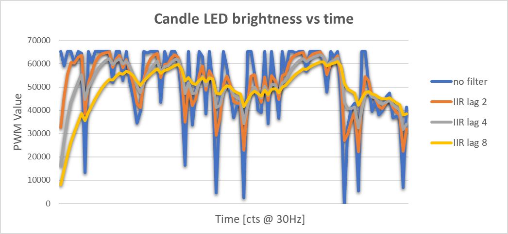
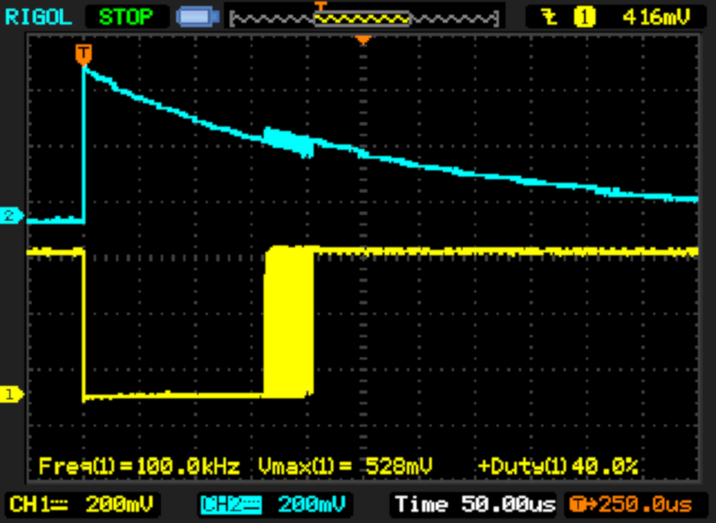
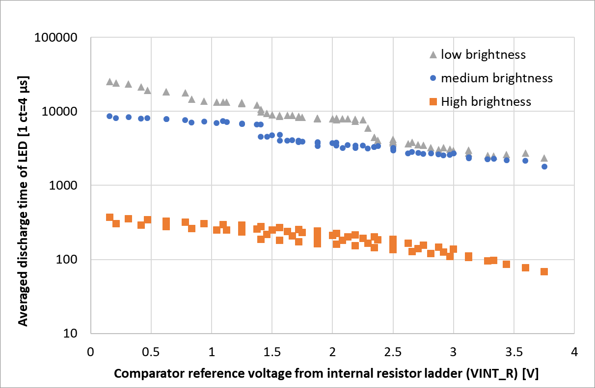
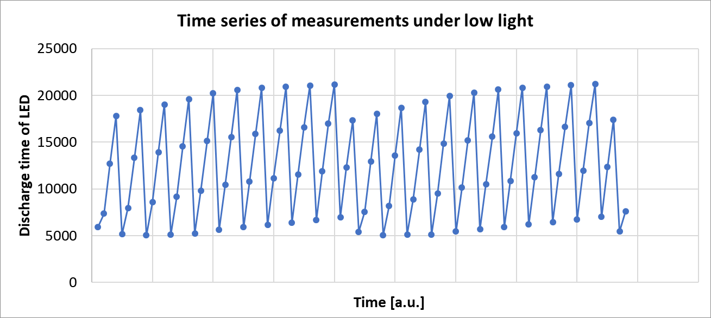

After having reviewed [sub $0.10 microcontrollers recently](/2019/08/12/the-terrible-3-cent-mcu/), it's time for some projects using the Padauk PFS154 and PMS150C. Considering my [previous investigation](/2013/12/08/hacking-a-candleflicker-led/) of [electronic](/2014/03/01/follow-up-on-candle-flicker-leds/) and [non-electronic](/2016/01/05/reverse-engineering-a-real-candle/) candles, it appears only natural to chose this as a target for the lowest cost microcontrollers.

To keep things simple, I reduced the hardware to a LED that is directly connected to the PA0 and PA4 GPIO wins. The sourcing capability of the Padauk GPIO is pretty limiting, ranging from 4 mA at 3V to 12 mA at 5 V. This means there is no danger of damaging a LED directly connected to the pins without a resistor. The limited driving capability is probably the result of the designers not wanting to spend too much IC space on I/O driving transistors.



The software is based on an emulation of a flicker-LED IC. I use one of the PWMs in the PFS154 and PMS150C to control the brightness of the LED. The PWM value is updated 30 times per second using an algorithm that generates a distribution of random numbers that is biased toward maximum brightness. For a detailed description, [see my earlier article](/2013/12/08/hacking-a-candleflicker-led/).

I introduced an IIR low pass filter to improve the visual appearance a bit.

```
lowpass = lowpass - (lowpass>>1) + (newval<<7);
```

Without low pass filter, the changes in brightness appear too abrupt. I found using an IIR filter with a coefficient of 0.5 to yield the best result ("lag 2"). A lower cut off frequency did not reproduce the "flicker" well enough. You can see traces of the brightness variation with different IIR filter settings below.



The C-code for PFS154 can be found [here](https://github.com/cpldcpu/SimPad/tree/master/Toolchain/examples/candleflicker). The implementation for PMS150C in assembler can be found[here](https://gist.github.com/cpldcpu/aa103568cd30d851d814072fabe5d0a4).


*Three LED candles with PFS154 (left), PMS150C (middle) and flicker LED (right)*

I installed both versions in housings of cheap electronic candles. In the video above you can see both version in action, comparing it to a candle based on a candleflicker LED.

Is there any benefit of the microcontroller version compared to the dedicated candle-flicker LED? Not yet, but there is still plenty of codespace left to add additional functionality.

## Trying to use the LED as a light sensor

When I initially published this article, there very quickly was a suggestion to use the LED also a light sensor to automatically turn on the LED candle in darkness. Indeed, this would be a very nice additional function. Actually I already planned to add this from the beginning. This is why I connected both terminals of the LED to GPIO. However, despite spending a significant amount of time on this, I never managed to get it to work to my satisfaction.   I initally omitted this episode, because reporting on failures is obviously less fun. I will take Barrys suggestion as a cue to summarize my findings.

It's well known that LEDs can also act as a photodiode ([here is a nice thesis on this](https://digi.lib.ttu.ee/i/file.php?DLID=9345&t=1)). When they are reverse biased, impinging light will generate a photocurrent that can be measured on the terminals. The main challenge is that this current is very low, typically in the range of nanoamperes under normal indoor lighting conditions. Most MCUs do not provide any periphery to measure currents, especially not as low as this. There are various tricks and tweaks to work around this, which adds to the fascination of using an LED as a light sensor. Unfortunately, the net is littered with instructables that do not explain methodology and often use dubious approaches.

One method that works somewhat reliably is to use the internal LED capacitance as current integrator in a single slope [integrating ADC](https://en.wikipedia.org/wiki/Integrating_ADC). Practically this is implemented by first charging the LED in reverse bias to a fixed voltage (for example VDD), letting the output float and then monitor how long it takes until the charge disappears. From **dQ=C*dV**and**dQ=Iphoto*dt**follows that**Iphoto=C*dV/dt**. The photocurrent that is generated in the LED is therefore inversely proportional to the time it takes for the voltage to decrease to a fixed threshold.

I successfully used this approach before on various ATtinys. Since the Padauk PFS154 has an internal analog comparator I expected the same approach to work as well. I configured the comparator to use the internal resistor divider as a voltage reference and PA4 as input. For testing purposes, I routed the comparator output to PA0, so it can be monitored externally.

```
mov a,#(GPCC_COMP_MINUS_VINT_R | GPCC_COMP_PLUS_PA4 | GPCC_COMP_INVERSE | GPCC_COMP_ENABLE)
mov _gpcc,a
```



The oscilloscope image above shows the voltage across the LED (ch2) and the comparator output (ch1). It can be nicely seen that, after initial charging, the voltage across the LED dissipates and the comparator switches at a the reference level (~2.5V in this case). Unfortunately this already shows some of the issues: There is significant crosstalk from the comparator output to the LED pin, and there is also a lot of noise. The comparator does not switch at an exact voltage but introduces significant timing jitter. It should be noted, that the oscilloscope probe itself adds a lot of parasitic capacitance and leakage. Therefore it is not possible to monitor exact operational conditions. I removed scope probes and deactived the external comparator output for further investigation.  I used the internal 16 bit timer to measure the discharge time.

Toying around with the setup showed that it nicely reacted to light. Higher illumination levels reduced discharge time in proportion. Using this to control a LED candle comes with some requirements though: Since ambient light is sensed, it needs to be quite sensitive. Furtheremore, the measurement should be reproducible to ensure that the candle always turns on at a similar ambient illumination level.



Trying to stabilize the results, I generated the dataset shown above. I swept the internal reference voltage for three levels of illumination. "High" corresponds to a flashlight directly shining into the LED, low and medium are normal ambient brightness levels. Each datapoint is the average of 16 measurement points to reduce noise.

As can be seen, the discharge time follows the illumination level across several decades. Higher reference voltage means that the threshold is reached earlier, therefore discharge time reduces. Also this trend is nicely reproduced. Things get really fishy for the low and medium brightness. At high Vref, it is not possible to discriminate between low and medium and there are weird steps in the traces. All of this made operation for low light detection very questionable.



To investigate these nonidealities I turned my attiontion to the noise. It quickly became apparent that the noise is actually correlated and therefore leads to systematic errors. You can see an exemplary time series above. (Source code [here](https://gist.github.com/cpldcpu/31ae66a5dd37f9bb19e45d7a4d9a026e).)

I tried many things to understand and reduce this issue.: Using the internal band gap voltage reference instead of the resistor divider had no benefical impact, suggesting that the voltage reference is not the origin of the issue. Changing the power supply to a battery did not have any significant effect. Therefore I can rule out influence from the mains. Trying different external connections did not help either. The noise is correlated to measurement timing and could be reduced by changing intervals, wait times, integration times. I did not find any way to systematically remove it, though.

The most likely conclusion is that this noise is caused by very strong internal coupling to the floating input node of the comparator. Again, this could be the result of cost cutting measures. There are many ways to reduce cross talk in circuit design and manufacturing technolgy, but all of these consume silicon space, increase manufacturing cost and take effort to implements.

To be fair, Padauk clearly states in their line card that the MTP RapiDragon series, of which the PFS154 is part of, is not suitable for "high EFT requirement applications" (EFT=Electrical Fast Transients). This already suggest bad noise immunity.

For practial purposes, it appears that the Padauk MCUs are best suited for purely digital applications. When trying to use the analog periphery it seems to be advised to limit it to low impedance or buffered analog signals.
