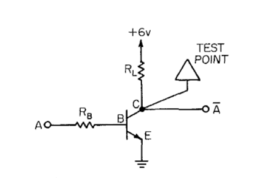
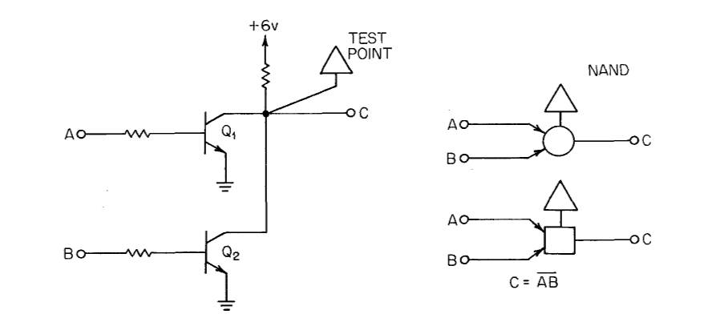
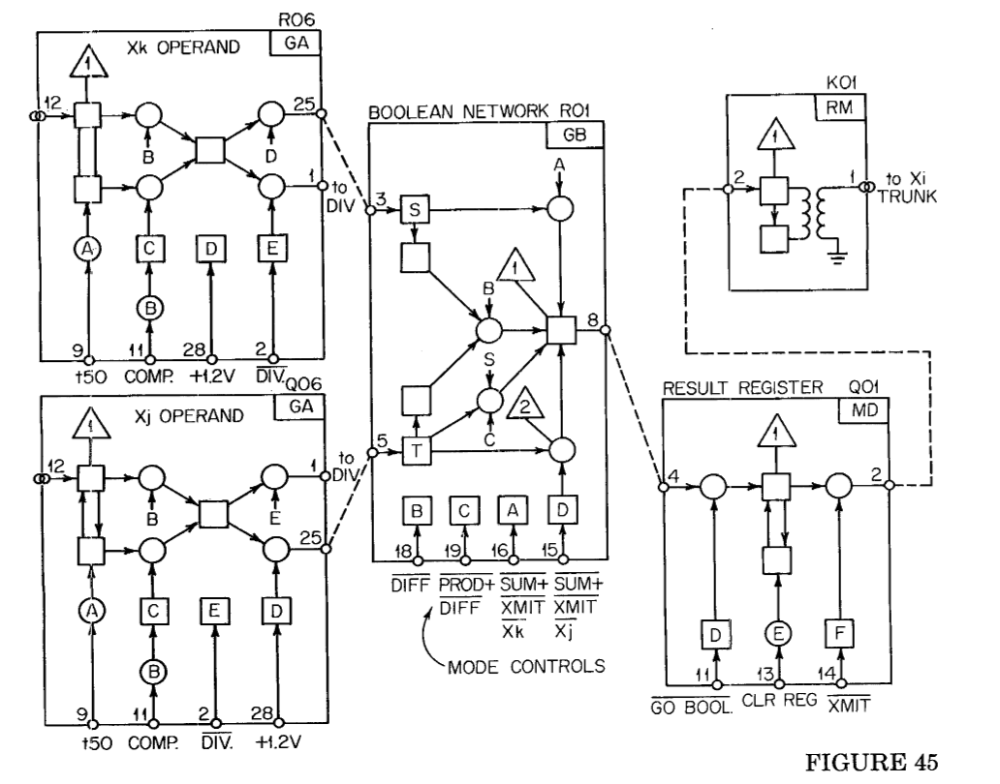
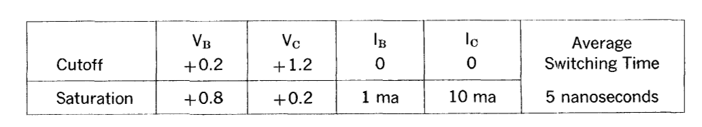
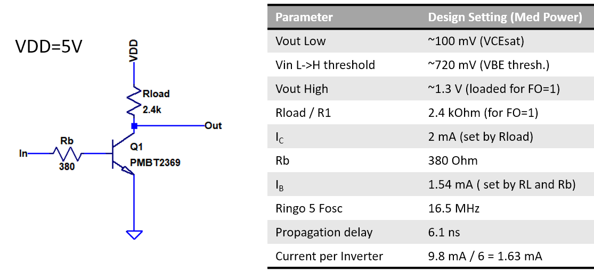
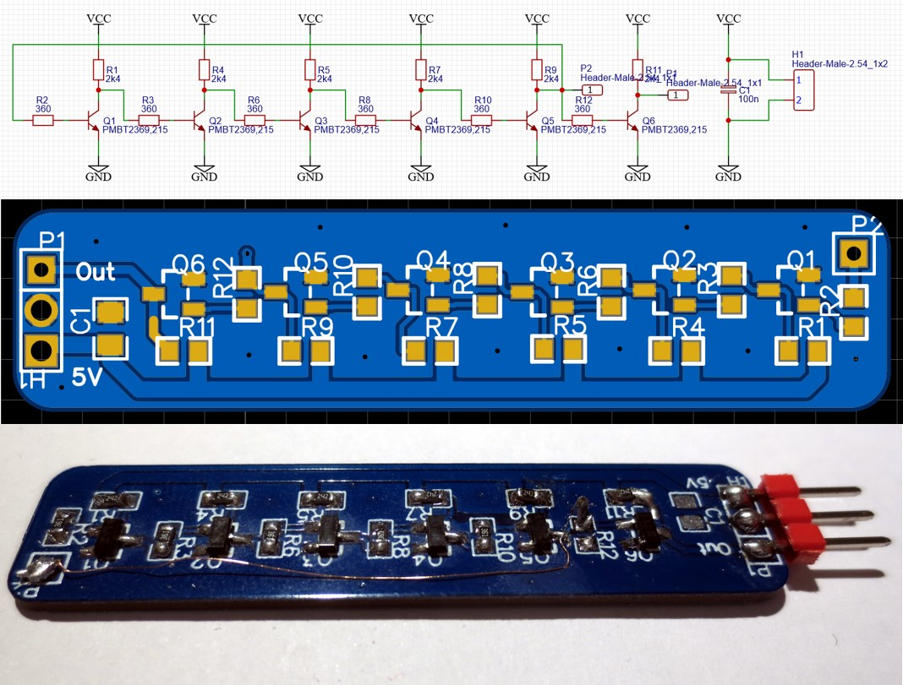
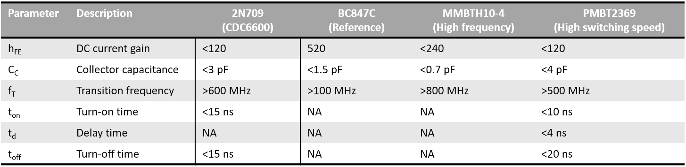
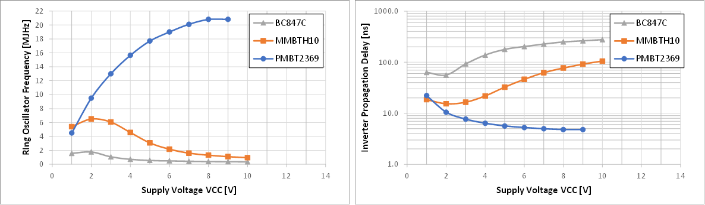

Anybody who has ever taken an advanced computer architecture class has heard of the [CDC6600](https://en.wikipedia.org/wiki/CDC_6600), which was the world's fastest computer from 1964 to 1969. It was the machine that put [Seymour Cray](https://en.wikipedia.org/wiki/Seymour_Cray) on the map as a supercomputer architect. The design of the machine is well documented in [a book by James Thornton](https://archive.computerhistory.org/resources/text/CDC/cdc.6600.thornton.design_of_a_computer_the_control_data_6600.1970.102630394.pdf), the lead designer, and is therefore publically accessible. Among several architectural concepts that later found use in RISC, the CDC6600 is known for introducing the [Scoreboard](https://en.wikipedia.org/wiki/Scoreboarding). Which is, along with [Tomasulo's algorithm](https://en.wikipedia.org/wiki/Tomasulo_algorithm), one of the earliest concepts for out-of-order processing.

Besides the architectural progress, the CDC6600 was impressive for its clock speed of 10 MHz. This may not sound much, but consider that this was a physically very large machine entirely built from discrete resistors and transistors in the early 1960s. Not a single integrated circuit was involved. For comparison, the PDP-8, released in 1965 and also based on discrete logic, had a clock speed of 1.5 MHz. The first IBM PC, released 20 years later, was clocked at less than half the speed of the CDC6600 despite being based on integrated circuits. The high clockrate is even more impressive when comparing it to more recent (hobbyist) attempts to design CPUs with discrete components such as the [MT15](http://www.6502.org/users/dieter/mt15/mt15.htm), the [Megaprocessor](http://www.megaprocessor.com/) or the [Monster6502](https://monster6502.com/). Although these are comparatively small designs based on modern components, none of them get to even a tenth of the CDC6600 clock speed.

## How did they do it?

The logic circuitry of the CDC6600 is based on resistor-transistor-logic (RTL).  The Thornton book calls it DCTL (Directly Coupled Transistor Logic), but due to  the presence of the base resistor it is obviosuly the same as RTL. Thornton himself refers to RTL in a[later publication](https://ieeexplore.ieee.org/document/4639400).

The image above shows the basic logic element of the CDC6600, an inverter

The outputs of two or or more inverters can be connected to form a wired AND, as shown on the left. Two inversions plus an AND implement a NOR2 function in positive boolean logic.

Thornton uses an unusual notation for logic circuits as shown above on the right. Each arrow corresponds to an inverter (base resistor plus transistor), each square or circle correspond to a collector resistor. The circles and squares indicate whether the current node is to be interpreted in positive (circle) or inverted (square) logic. The circuit is exactly the same for both. This "mental gyration" takes a while to get used to, but helps to cope with the issue that every connection is inverting.

Every module in the CDC6600 is constructed from a multitude of basic inverters  with a single transitor each. This does also include latches and registers, which are fully static. There are no stacked transistors, no floating nodes, no diode logic, no pulse latches or other specialties. As an example, one slice of a boolean unit from the book is shown above.

This approach is quite genius in its simplicity and should be the base of every clean architecture: Optimize one basic thing very well, replicate it, and use it as a hierarchical building block. This is in stark contrast to other contemporay designs like the [PDP8](http://pdp8online.org/), which tried to use [every circuit trick there is](https://hackaday.io/project/8449-hackaday-ttlers/log/130460-bizarre-dtl-logic-levels-the-discrete-component-pdp-8) to reduce the number of (expensive) transistors.

So, why is it fast? The table above lists the operating point of one inverter. Voltage levels are adjusted by picking the right values for base and collector resistors. The switching level is probably around 0.7V, so the hi and low levels are adjusted for symmetry around this point. Besides from this, there is really nothing special in the circuit. However, the switching time is still 5 ns, compared to 50 ns of the MT-15. Clearly, as the book states: *[the logic] "...is heavily dependent on the transistor characteristics for its operation".*

## The transistor is key

While there is not too much specific information about the CDC6600 transistors in Thorntons book, there is an [interesting article](https://www.computerhistory.org/siliconengine/silicon-transistor-exceeds-germanium-speed/) about the development of a special silicon transistor for the CDC6600 in 1961 on the computer history museum website. The transistor in question is the 2N709 and was developed by [Jean Hoerni](https://en.wikipedia.org/wiki/Jean_Hoerni) at [Fairchild](https://en.wikipedia.org/wiki/Fairchild_Semiconductor). Fairchild was the company that put "Silicon" into "Silicon Valley" and was a fairly recent startup in 1961. Jean Hoernis claim to fame is the invention of the[planar process](https://en.wikipedia.org/wiki/Planar_process), which is was the key enabler for integrated circuits.

The key to the high speed transistor he developed was to introduce a tiny amount of gold doping into the base area of the transistor (See [patent](https://patents.google.com/patent/US3184347) and also [patent notebook](https://archive.computerhistory.org/resources/access/text/2013/03/102722910-05-01-acc.pdf)). Gold is usually a highly undesirable contaminant in semiconductors because it leads to rapid minority carrier recombination. In this case, this is done on purpose is to avoid build up of charge in the transistor while it is in saturation. This so called saturation charge is what makes turning off bipolar transistors slow, because the charge needs to diffuse out of the base, which is a slow process. There are numerous circuit tricks to reduce buildup of saturation charge, the most famous being the [baker clamp](https://en.wikipedia.org/wiki/Baker_clamp). However, by using a transistor that does intrinsically not build up a high saturation charge, all of these complexities can be omitted at an even better performance.

Curiously there do not seem to be many fast bipolar switching transistors around anymore. The 2N709 is, of course, long out of production. Some old reference tables list the AF66, BSX19, BSY18 and the 2N2369 as replacements. All of these are out of production as well, however the 2N2369 lives on as an SMD version in form of the [PMBT2369 (Nexperia)](https://www.nexperia.com/products/automotive-qualified-products-aec-q100-q101/automotive-bipolar-transistors/general-purpose-bipolar-transistors/switching-transistors-single-double/PMBT2369.html)or [MMBT2369 (Onsemi)](https://www.onsemi.com/pub/Collateral/MMBT2369LT1-D.PDF). Nexperia seems to be the only company that lists switching times for bipolar transistors in their product selector. Their [product selector](https://www.nexperia.com/products/bipolar-transistors/general-purpose-bipolar-transistors/switching-transistors-single-double/#/p=1,s=0,f=c3f7f2:20;240,c=,rpp=,fs=0,sc=,so=,es=) lists one additional fast switching transistor, the BSV52. However, the characteristics are very similar to the PMBT2369.

## Putting things to practice

Can the CDC6600 logic style be replicated with modern components? It's best to start a new design with a simulation. You can find the design of an RTL inverter based around the PMBT2369 above. It uses Nexperias transistor model. I tested the propagation delay of the inverter by simulating a [ring oscillator](https://en.wikipedia.org/wiki/Ring_oscillator) consisting of five inverters in LTSpice. As you can see, a propagation delay of 6.1 ns was observed despite a relatively moderate collector current setting of 2mA, a fifth of that used in the CDC6600.

I built up the same circuit on a PCB to test the ring oscillators in real world conditions. I tested a total number of three different transistor types: The BC847C, the MMBTH10-4 and the PMBT2369.

The BC847C was used as a reference. Using the lower gain A or B versions would have increased switching speed by reducing the miller effect. But the improvement would most likely not have changed the outcome. The MMBTH10-4 is a common high-frequency transistor with ft=800 MHz and a low collector capacitance. At a first glance it looks like it should beat the PMBT2369 in switching speed, but keep in mind that "high-frequency" only refers to small signal excitation around an operating point. To optimize for this, it is necessary to reduce capacitances and base transit time, not saturation charge. Finally, the PMBT2369 is a device optimized for high switching speeds which employs techniques to eliminate buildup of saturation charge. (I don't know if it also uses gold diffusion or a more modern approach based on ion implantation.) The 2N709 used in the CDC6600 has slightly lower collector capacitance than the PMBT2369 and may be even faster. It is debatable whether the higher parasitics of the ancient 2N709 TO-can package compared to a modern SMD package would have compensated some of this benefit.

The diagrams above show the variation of oscillator frequency with supply voltage and the gate propagation delay calculated from the frequency.

The high frequency transistor is the fastest device at the lowest end of operating voltages. This is probably owed to low terminal capacitances. Increasing the supply increases oscillator frequency for all devices. However, the MMBTH10 and BC847C exhibit a maximum at around 2 V. For higher supply voltages, the frequency starts to decrease again. This is most likely owed to an increase of base current and hence increase of saturation charge, which makes turning the transistor off slow. The PMTB2369 based ring oscillator shows a continuous increase in frequency, suggesting that the saturation charge does not dominate switching frequencies.

The measured frequency at 5V is 17.7 MHz, which is surprisingly close to the simulated 16.5 MHz from the spice simulation. Kudos to Nexperia for providing proper large signal spice models!

## Summary

What do we learn from this? Choosing the right transistor is key to building 1960s style high speed discrete RTL circuits. Forget all the "clever" tricks like baker clamp, feedthrough capacitor or bleeding resistor. They just add to component count without addressing the root cause.

Unfortunately, true bipolar high-speed switching transistors seem to be a dying breed, with the MMBT/PMBT2369 being (almost) the last of its kind.

Let me know if you find similar devices. I also started looking into "digital" or "pre-biased" switching transistors, but it seems they are not close to the PMBT2369. It is also possible that more modern high-frequency transistors also show a better switching time than MMBTH10 due to thinner base region.

## Addendum

It appears that Fairchild did indeed replace the 2n709 with the 2n2369, as you can see in their [1985 discrete databook](https://archive.org/details/bitsavers_fairchilddldDiscreteDataBook_35122751/page/n25/mode/2up). So the PMBT2369 is the rightful SMD-packaged heir to the original 2n709 used in the CDC6600. The [PMBT2369 seems to be faster than the MMBT2369](https://hackaday.io/project/170697-discrete-bipolar-logic-rtlltl/log/175352-fast-switching-transistors-pmbt2369-vs-mmbt2369). Apparently there is only one choice...

## Addendum 2

Some [more finetuning of the PMBT2369 circuit](https://hackaday.io/project/170697-evaluating-transistors-for-bipolar-logic-rtl) shows that a minimum propagation delay of 3.5 ns is achieved at approximately 10 mA supply current per gate. This is exactly coincident with the CDC6600 operating conditions and is a cue to the enourmous power requirements of fast RTL technology: 30 mW per gate on average!
