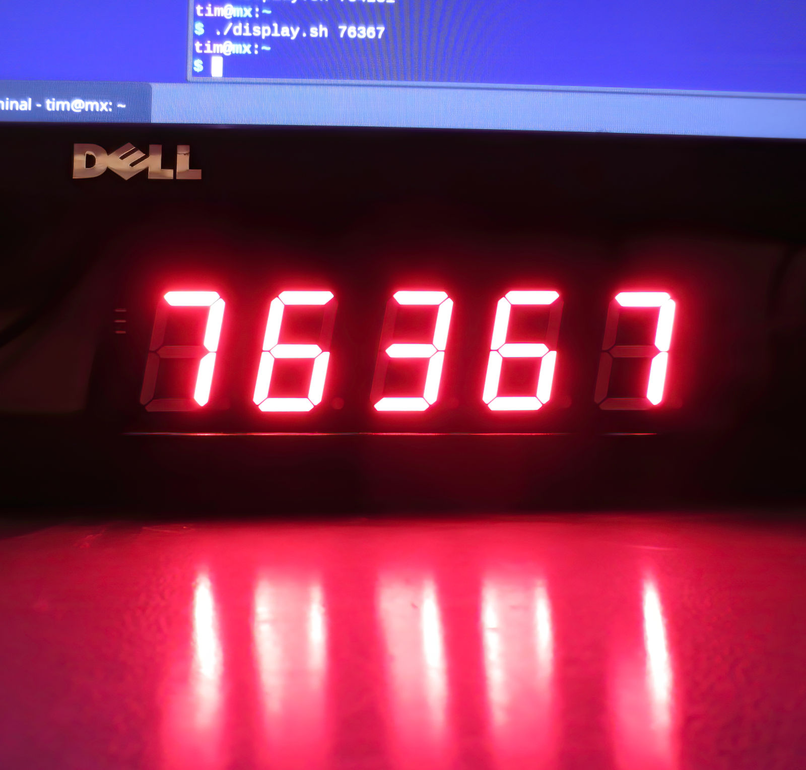

Time for another project with a [super-low-cost microcontroller](/2019/08/12/the-terrible-3-cent-mcu/). But what to design? Ever since seeing a [project](https://hackaday.com/2019/04/26/making-a-three-cent-microcontroller-useful/) where a $0.03 MCU controls $40 worth of intelligent RGB LEDs, I have been wondering whether this is the right place to use these devices. At this price point, doesn't it seem to make more sense to dedicate one MCU to one LED each and use it to implement a fancy node-controller? It has always appealed to me to design my own protocol. However, just copying a WS2812 RGB LED or similar seemed to be a bit pointless...

After seing [this](https://hackaday.com/2019/01/12/addressable-7-segment-displays-may-make-multiplexing-a-thing-of-the-past/) (and also [this](https://electronoobs.io/tutorial/37#) and[this](https://www.rgbdigit.com/rgbdigit/)) chainable and adressable 7-Segment display it was clear what to do: Why would you use three WS2811 ICs to control a single 7-segment display when a single microcontroller could do it better at a lower cost?

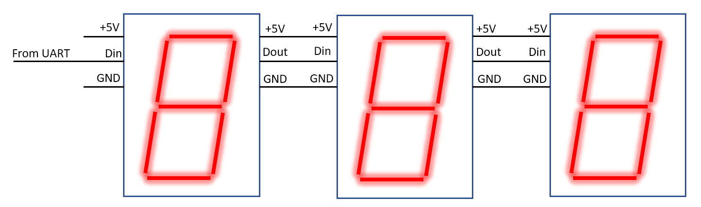

The figure above shows the general concept: Each segement has a serial data input and a serial data output which allows controlling the content of the display. The data from the input of each segment is forwarded to the next, so that it is possible to connect the next digit directly to the output of the previous. Power supply will be routed through all devices.

An important question is which protocol to use: To simplify control, I set myself the target allow control by a standard UART in 8N1 configuration. This is in contrast to e.g. the WS2812, which is controlled in a nonstandard protocol with challenging timing.

## The Hardware

I elected to use a PADAUK PFS154-S16 as microcontroller for each segment. This device has flash memory and sufficient I/O to control a 7 segment display without multiplexing. The cost is only $0.07, so it is cheaper than, for example, using multiple WS2811 instead. The data input pin is connected to PA0, which allows using a pin change interrupt to detect incoming transmissions. Data out is PA6, while PB0-PB7 are used to control the display.  The schematic is shown below.

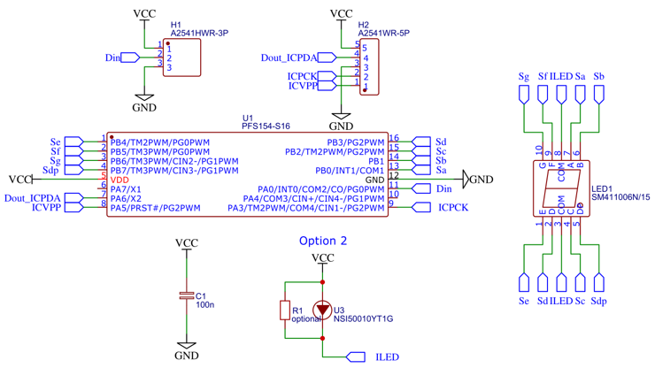

To avoid having to add a resistor for each segment, I decided to only use a single current limiting device and run the display in multiplex mode, so that only a single segment is turned on at a time. Originally I planned to use a NSI50010, which is a two terminal current source. Unfortunately it turned out that the voltage drop accross the 7 segment display was too large to allow sufficient voltage for the current source. Therefore I replaced it with a resistor and forfeited on the multiplexing.

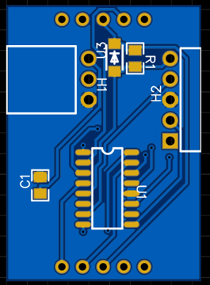

The PCB design is shown above. The 7 segment display is attached to the rear side. Angled connecters are used to connect the individual segments of the display. Originally I planned to use the right connector for programming, however it turned out to be much easier to use a SOIC8 clamp to directly connect to the microcontroller.

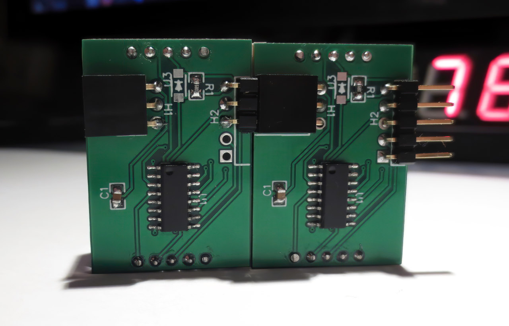Rear side

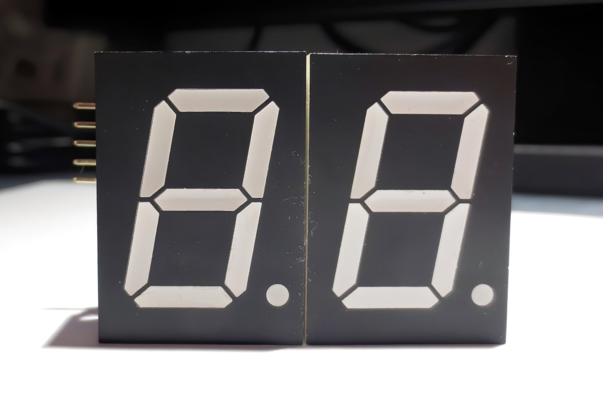Front side

Two assembled displays are shown above. As you can see they neatly align.

## The Firmware

The firmware was developed with [SDCC](http://sdcc.sourceforge.net/). I used the [Easy PDK programmer](https://free-pdk.github.io/) to program the microcontroller.

### The Protocol

Indeed, the most interesting part about this project is to design the communication protocol. Too keep things simple, I defined the following requirements:

1. The chain should be controllable with a standard UART interface. For example a USB to RS232 adapter.
2. The interface consists of a single input pin and output pin. Only digital levels are allowed.
3. Only unidirectional communication is allowed. There is no return channel from the chain to the controller.
4. All elements of the chain receive updated information in the same transaction. Addressing of individual units is not a necessity.
5. The display content shall be updated simultanously on all segments of the chain.
6. The segments shall be addressed by their ordinal number in the chain.
7. Error detection or correction is not needed.

Items 2-7 are simplifying things a lot and are very similar to the well-known [WS2812](/2014/01/14/light_ws2812-library-v2-0-part-i-understanding-the-ws2812/) protocol. Let's tackle 1 first.

### Data frame

The "1N1" serial protocol used by the WS2812

In a single wire asynchronous protocol, each transmission typically consists of a start condition and a payload of 1...n bits. One way of looking at the [WS2812 protocol](/2014/01/19/light_ws2812-library-v2-0/) is illustrated by the image above: The transmission start with a low-high transition as the start bit followed by a single data bit and one stop bit. This would correspond to a "1N1" protocol in positive logic when using the standard UART notation. **Ts**denotes the duration of one bit, which is the inverse of the baud rate. For the WS2812 Ts is approximately 450 ns, which corresponds to 2.2 Mbaud. The main reason you cannot directly connect a WS2812 to a standard UART output is that the signal is inverted.

It's clear that a 1N1 protocol wastes a lot of bandwidth on overhead. Only a third of the transmission is used for actual data.

Standard 8N1 asynchronous serial protocol

Serial transmissions typically rely on an 8N1 protocol as is shown above. Here, 8 data bits are followed the start bit, so that 80% of the transmission is actually used for data.

The challenge is that timing accuracy requirements are getting more strict the more bits are following the start bit. Assuming we are sampling in the center of a bit, the maximum clock deviation needs to be less than 50% of one bit timing. One can show that this is met when the maximum relative clock deviation is less than delta<1/(2*(n+0.5)), where n is the number of bits. (Slightly more complex derivation [here](https://www.allaboutcircuits.com/technical-articles/the-uart-baud-rate-clock-how-accurate-does-it-need-to-be/)).

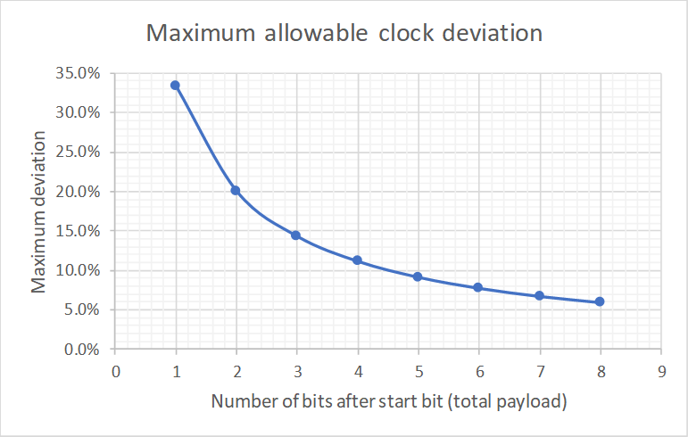

The relationship between number of bits per frame and maximum allowable clock deviation is shown above. One has to consider that the tolerance is shared between transmitter and receiver. For example, for the 1N1 protocol, the transmitter may skew by -17% and the receiver by +17%.

It is clear why the WS2812 is based on an 1N1 protocol: +-17% is needed to account for manufacturing process and operation temperature variations when the clock is not trimmed.

A total error of less than 5% is allowable for an 8 bit data frame. This corresponds to +-2.5% tolerance of the clock on each device.

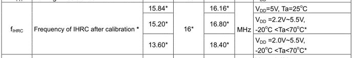

Since it is possible to trim the clock on the PFS154 microcontroller, much better tolerance than on the WS2812 can be achived. The datasheet suggests +-1% if the device is operated at 5V and 25 degreesC, but +-5% accross all voltage and temperature corners.  If VDD is kept between 4-6V, the tolerance should be significantly below +-5% (see figure 4.5 in datasheet).

In the end I noted that only 5 bits of payload are needed for each 7 segment display. So I elected to go for an 8N1 protocol, but use only 5 bits. This allows up to 4% clock deviation.

### State Machine

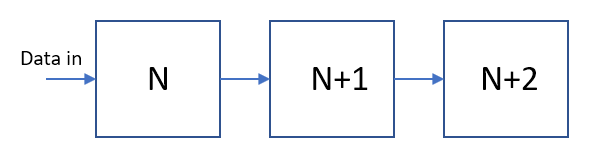

Now that we have decided how a data frame looks like, let's tackle how an entire transmission works. The requirements is that all devices can be addressed in order. To simplify things, no specific adressing mechanisms is implemented, but instead the order of data in the transmission corresponds to the order in the chain.

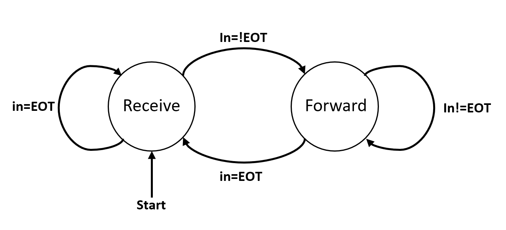

This can be easily implemented by the state machine shown above, which probably looks much more complated than it is.

After reset, each device is in a first state called "Receive". When the device is in reiceve mode, it will accept transmissions, but does not send anything on its output. The first received dataframe will be interpreted as display update information and is stored internally. After completing reception of a valid dataframe, the device will switch into state "Forward".

In forward state, all received data frames are directly forwarded to the output with a delay of 0.5 Ts. After reception of a valid dataframe, the device will check if an EOT code was received. If yes, the device will revert to the "Receive" state and expect the beginning of a new transmission. The EOT symbol was defined as 0x00.

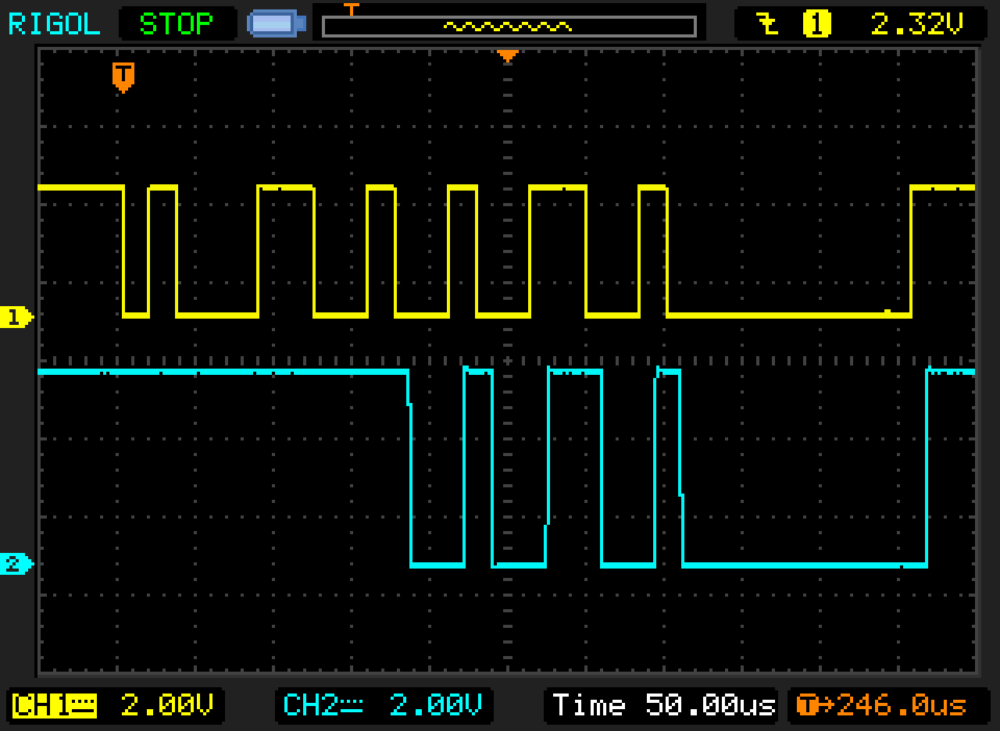

The picture above shows a scope trace of the input to the chain (CH1, yellow, 3.3V levels) and the signal after the first device (CH2, 5V levels).

One last thing to clarify: When should the display be updated? To allow for simultaneous update of the entire chain, the display content is updated after reception of the EOT symbol.

The image above shows a chain of 5 displays in action. The input was controlled via a USB to RS232 interface directly by a shell script.

## Conclusions

All in all this was a fun little project to exercise the PADAUK MCUs a bit more. I may use this as a test bed for more complex protocols at a later time.

You can find the current state of the firmware [here](https://github.com/cpldcpu/SimPad/tree/master/Toolchain/examples/chainable_display). Hardware files can be found [here](https://hackaday.io/project/170762-intelligent-7-segment-display-based-on-padauk-mcu).
