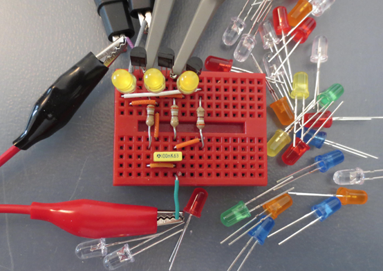
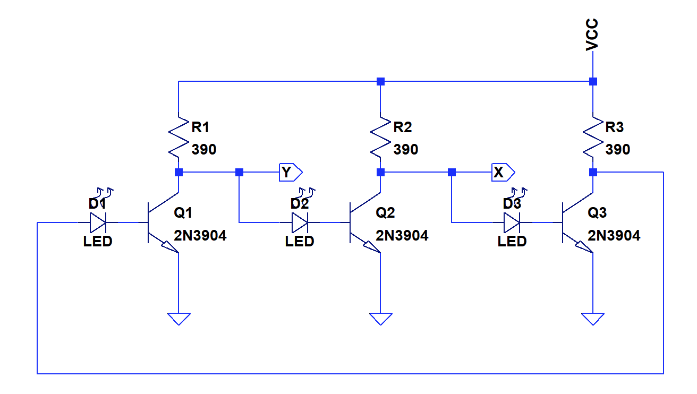
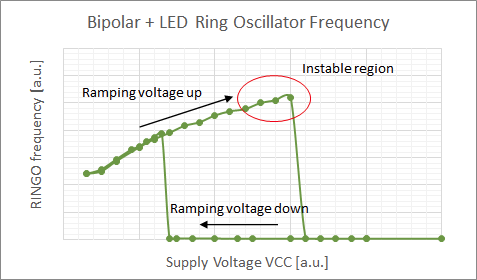
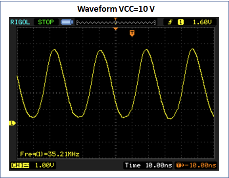
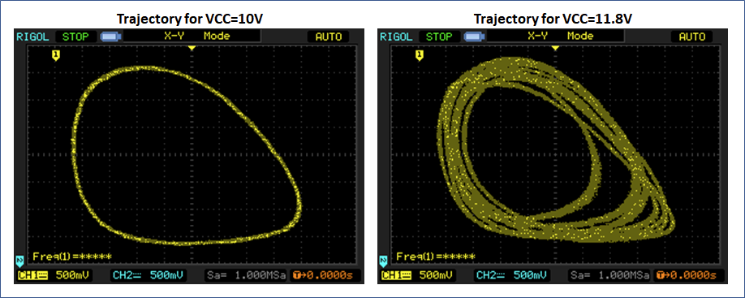
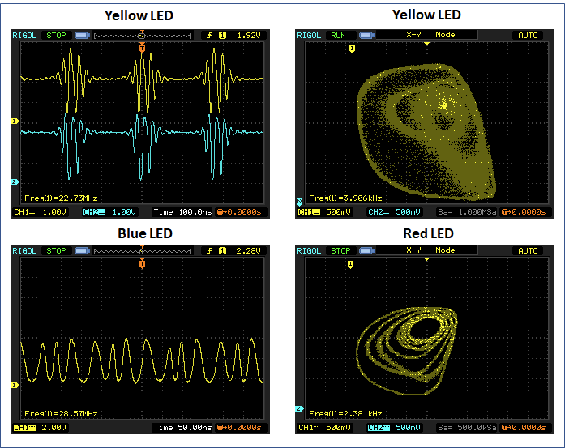
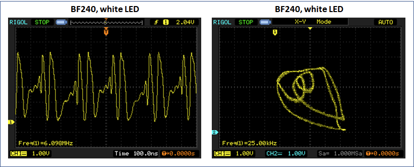

Sometimes you find things you have not even been looking for...

A chaotic oscillator is an electronic circuit that can exhibit "[chaotic](https://en.wikipedia.org/wiki/Chaos_theory)", nonperiodic behavior. A commonly cited example is [Chua's circuit](https://en.wikipedia.org/wiki/Chua%27s_circuit), but there are [many others](http://www.scholarpedia.org/article/Transistor-based_chaotic_oscillator). I always regarded these as carefully designed, rather academic, examples. So I was a bit surprised to observe apparently chaotic behavior in a completely unrelated experiment.

A while ago a took an interest in recreating an ancient logic style based on discrete transistors, resistor-transistor-logic (RTL), with todays components. I [discussed some of my findings](/2020/02/14/what-made-the-cdc6600-fast/) earlier and continued to work on [transistor selection and circuit optimization](https://hackaday.io/project/170697-evaluating-transistors-for-bipolar-logic-rtl) afterwards in [collaboration with Yann](https://hackaday.io/project/8449-hackaday-ttlers/log/177581-my-own-try-at-a-ringo9-with-2n2369a) from Hackaday TTLers. The tool of choice to evaluate the switching speed of different logic gate designs is to build[ring-oscillators](https://en.wikipedia.org/wiki/Ring_oscillator) from chains of inverters.

One random variation I tried, was to use LEDs in series with the base of the transistor. In combination with PMBT3904 transistors, this surprisingly yielded an oscillator that switched between frequencies that were several orders of magnitude apart when varying the supply voltage. A closer look revealed a region with unpredictable behavior close to the switching voltage. You can find the chronological investigation, including my (limited) understanding of the principles, [in this log entry](https://hackaday.io/project/170697-evaluating-transistors-for-bipolar-logic-rtl/log/179154-using-a-led-as-base-resistor-chaotic-ring-oscillator).

One question of interest was how easy it is to recreate these results. Was it just a random fluke? It turns out, it is extremely simple.

## Recreating Chaos

I reduced the number of inverters to three and built up the circuit on a tiny breadboard to be easily able to test different components. You can find the schematic below, a picture of one breadboarded version is shown above. (Note: There is an additional yellow decoupling capacitor on the breadbord that is only used to stabilize the supply, but has no function in the circuit.)

The load resistors stayed at 390 Ohm for all experiments. Generally, I anticipate that a relatively high base current is required. Therefore it would be advised to keep the load resistors to below 1 kOhm. I used 2N3904 transistors as a starting point, as these are the through-hole equivalents of the PMBT3904. There are two test points marked as X and Y. Keep in mind that attaching scope probes here will alter the behavior of the circuit due to capacitive loading. The most pragamatic strategy is to keep them attached at all times.

I investigated all variants by starting from a low supply voltage and slowly ramping up. The oscillator does typically starts oscillating at a high frequency between 5 and 60 MHz, depending on LED capacitance and transistor type.

If a certain voltage is reached, the frequency will suddenly drop (low-frequency mode) to a frequency below 0.5 MHz. Returning to the high frequency mode requires reducing to a very low supply voltage first.

The high frequency waveform typically looks like a slightly distorted sine - this is still saturated switching. However, when getting closer to the switching point, a region of instability is obvserved, as marked by the red circle above. In some cases this region of instability was just a few 100 mV wide, in other cases 2-3 V. The waveform suddenly starts to change phase and amplitude in this region.

A better way to look at this phenomenon is to use the X-Y mode of the oscilloscope, connected to the input and output of one inverter, to plot a phase portrait. The picture above shows an example of a stable signal to the left. Just slightly increasing supply voltage renders the signal instable. The example on the right shows a repeating trajectory (a limit cycle) that looks very reminiscent of other chaotic oscillators. Just slightly alterting the supply voltage, sometimes a chenge of 10 mV is sufficient, will change the trajectory into a chaotic state.

It turns out that almost all combinations of transistors and LEDs exhibited an instable region with apparently chaotic behavior.

One major variable is the choice of the LED. Two obvious factors are the capacitance and the forward voltage of the LED. Furthermore, there are most likely also variations in the transient behavior between different LED types. All of these factors depend on die size, material system of the LED (e.g. [InGaN](https://en.wikipedia.org/wiki/Indium_gallium_nitride), [InGaAlP](https://en.wikipedia.org/wiki/Aluminium_gallium_indium_phosphide)) and the specific epitaxial profile (junction grading, charge carrier lifetime, series resistance). This type of information is almost never disclosed in LED datasheets.

Empirically I found that the highest oscillation frequency could be obtained with one sample of 3 mm red LEDs. The widest voltage window of chaotic behavior was observed with white LEDs. A generally very curious effect was that red, orange, yellow-green and yellow LEDs (InGaAlP) often exhibited random burst of oscillation as shown in the panel below, while InGaAN LEDs (white, blue) showed more continuous oscillation. A wide variation of different structures of stable and unstable trajectories were observed depending on LED, without being able to pinpoint specific trends.

Also the choice of transistor had a significant impact. A general requirement seems to be a relatively high recovery time - one device that did not exhibit chaotic oscillations was the PMBT2369. Common small signal transistors like the 2N3904, BC847C, S9014 all showed very similar behavior. One outlier was the BF240 high frequency transistor with very odd spiking oscilliations, as shown below.

## Conclusions

In summary, it can be concluded that ring oscillators of the shown topology can show apparently chaotic behavior with a number of different component combinations. The simplicity of this circuit is quite appealing as it requires only three different components (NPN transistor, LED, resistor), that can be found in any spare-parts bin.

For me, this was an interesting detour into an area of analog circuits that I previously did not spend much too attention to.

Could there be practical applications for this?
