What would it take to build an addressable LED like the WS2812 (aka Neopixel) using only discrete transistors? Time for a small "1960 style logic meets modern application" technology fusion project.

## The Objective

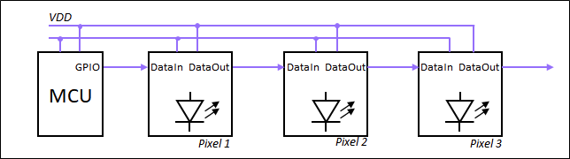

What exactly do we want to build? The diagram above shows how a system with our design would be set up. We have a micontroller with a single data output line. Each "Pixel" module has a data input and a data output than can be used to connect many devices together by "daisy chaining".

This is basically how the WS2812 works. To simplify things a bit, I had to make some concessions compared to the original WS2812:

- Each Pixel controls only a single LED that can be either turned on or off instead using pulse width modulation to allow greyscale (This can be implemented on the controller)
- Since only one bit of information is needed to turn the LED on or off, each LED will only accept a single bit of data.
- The LED will be immediately updated upon receipt of data, instead of latching only during "reset".
- We don't implement signal retiming of the dataoutput. The data input will be buffered and directly forwarded to the ouput. This will lead to degradation of the signal timing after a while, but it is sufficient to control a few LEDs in cascade.

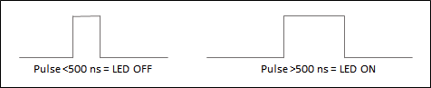

The protocol is shown above. "LED Off" is encoded as a short pulse, "LED On" as a long pulse. After the first LED has accepted the data from the first pulse, any subsequent pulses will be forwarded to the next device and so on. This allows programming a chain of TransistorPixels with a train of pulses. If 20us has passed without any pulse, all devices will reset and are ready to accept new data.

### Top Level Architecture

There are many ways to implement the desired functionality. A straightforward but complex way would be to used a clocked logic design. But, of course this is also a challenge in minimalism. Since we are using discrete transistors, we can utilize all kinds of analog circuit tricks. I chose to go with using clockless logic with asynchronous timing elements. The choices in this design may seem obvious in hindsight, but quite some thought went into this.

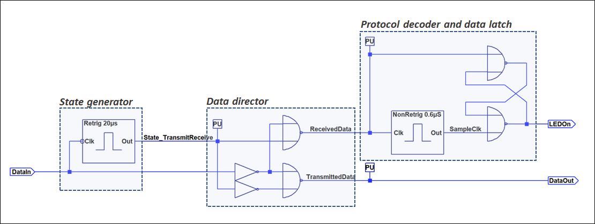

The schematic above shows the top level architecture of the TransistorPixel. There are three main blocks:

1. **State Generator**: This blocks decides whether the data on the input belongs to this Pixel or whether it is to be forwarded to the next one. This is signalled by a state signal on the output. The input is the Data Input.
2.**Data Director**: This block is a basic multiplexer that, depending on the state signal, decides whether the data on the input is directed to the protocol decoder or the data output
3.**Protocol Decoder and Data latch**: This block receives inputs signals that belong to this Pixel and will turn the LED on or off depending on encoded state. There is just a single input.

The basic logic style for the circuit is [Resistor-Transistor-Logic (RTL)](https://hackaday.io/project/170697-evaluating-transistors-for-bipolar-logic-rtl). This was the very first transistor based logic style and was, for example, used in the [CDC6600 super computer](https://cpldcpu.wordpress.com/2020/02/14/what-made-the-cdc6600-fast/). A benefit of this logic style is that it is very simple and therefore well suitable for small discrete logic designs. There are some drawbacks though, that led to numerous other logic style being developed in later years.

The entire design was first implemented and simulated in LTSpice. You can download the design files from the [Hackaday.io project page.](https://hackaday.io/project/177881-the-transistorpixel)

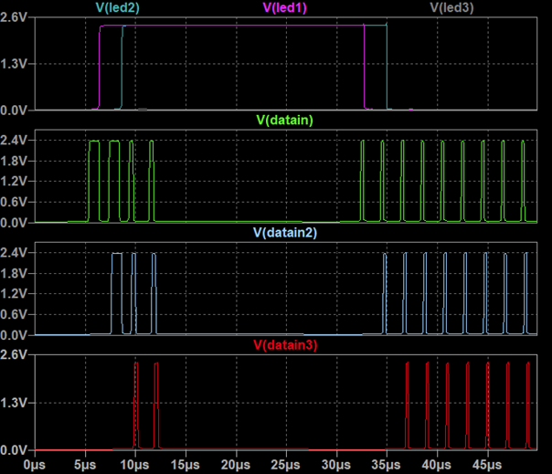

Simulation results from the top level testbench are shown above. You can see the input and output signals of three Pixels and the state of the associated LEDs. Observe how each part of the chain will removed one pulse from the pulse train, use this to turn the LED on or off, and forward the other pulses to the next device. The gap of 20us between the two trains of pulses is sufficient to reset the receiver so the cycle can start anew.

Below is a photo of the final design implementation. Each block is clearly delineated on the PCB.

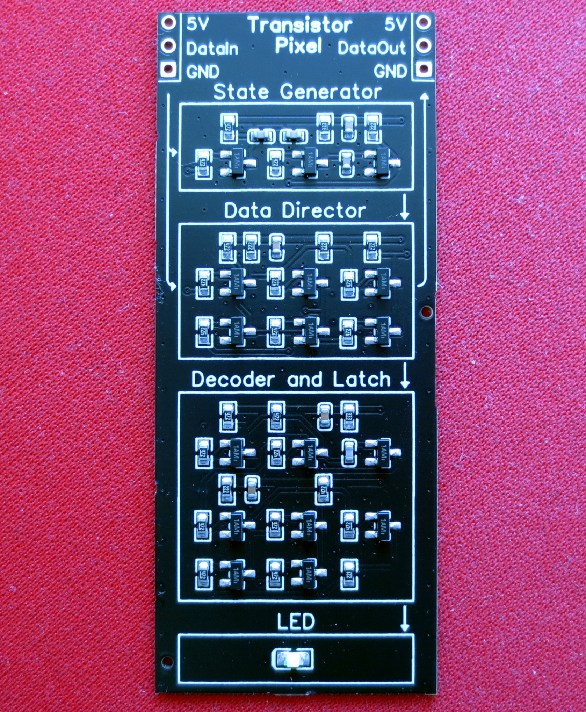

Lets review how the individual blocks are implemented.

### The Data Director

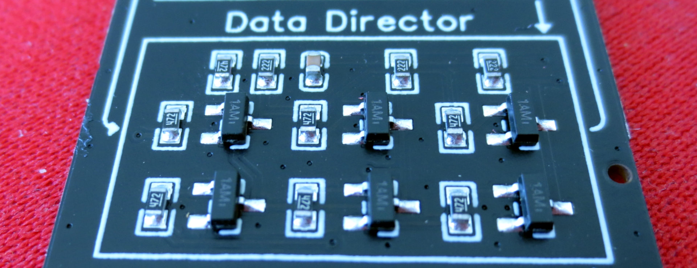

The data director is a simple multiplexer that consists of two inverters and two NOR gates. The gate symbols along with their respective circuit implementation are shown below. Since two of each are needed, a total of 6 transistors and 10 resistors are used. The beige component is a capacitor that was added for decoupling. I used releatively high base (4.7 kOhm) and collector resistances of (2.2 and 4.7 kOhm) to keep current consumption moderate. The collector resistance has to be adjusted according to the fan-out.

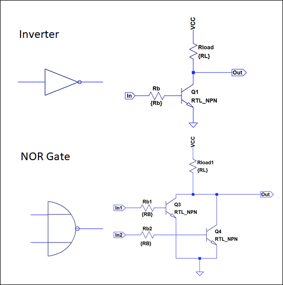

One important aspect is the choice of transistors. Since this is not a super-fast design I chose the PMBT3904, which is a low cost switching transistor. I also tried a chinese clone (The CJ MMBT3904), but encountered issues due to  high base charge storage time.

While the design of the data director is straightforward, I encountered some issues with pulse deformation during data forwarding. Since RTL logic operates transistors in the saturating regime, the output delay for a low-high transistion on the input of a gate is much slower than for a high-low transition. This can cause an increase or decrease of pulse length and detoriates the signal during data forwarding. I solved this by ensuring that the signal is fed through two identical inverters in series during data forwarding. This ensures symmatrical timing on rising and falling edge and reduces pulse deformation sufficiently.

### The State Generator

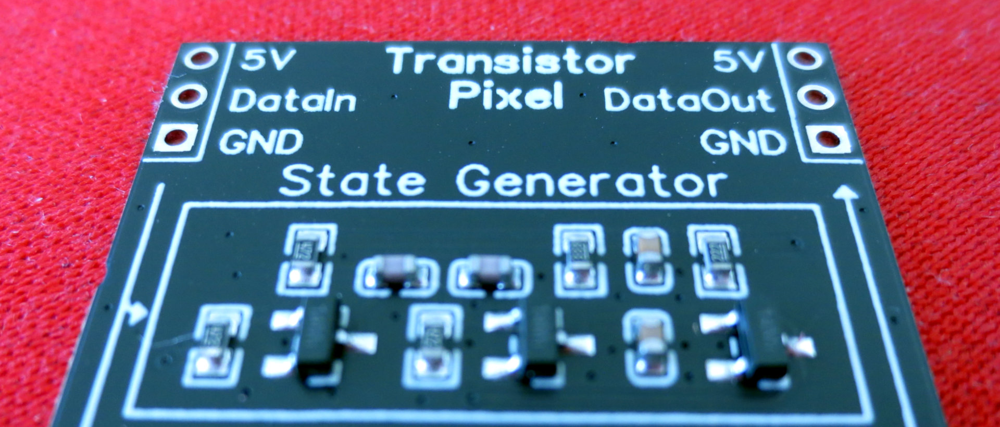

The purpose of the state generator is to change the device to the*forwarding*state after the first pulse has arrived and switch it back to the*receiving* state when no signal arrived f0r 20us.

This requirements is met with a retriggerable monoflop that triggers on a falling edge.

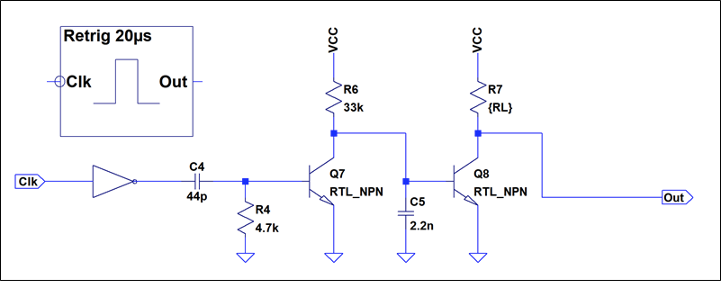

The cicuit of the monoflop is shown above. The inverter transforms the falling edge into a rising edge. The rising edge is filtered with C4 and R4 that form a high pass and trigger Q7. If Q7 is turned on, it will discharge C5, which will turn Q8 off and the output of the monoflip is pulled high. C5 is slowely recharged through R6 and will turn on Q8 again after around 20us.

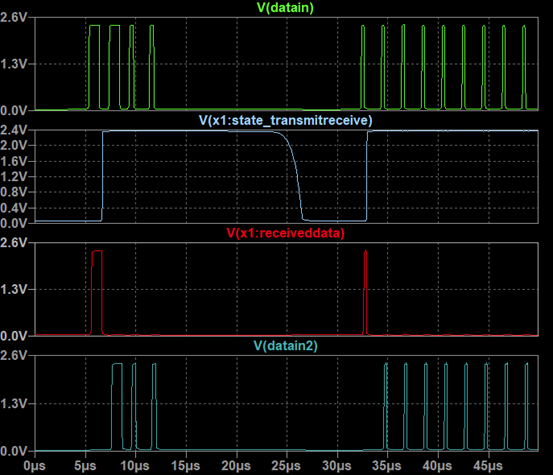

You can see the output of the state generator above. When the output is high, all input signal will be directed to the output ("datain2"), when it is low, the input will be directed to the receiver.

### Decoder and Latch

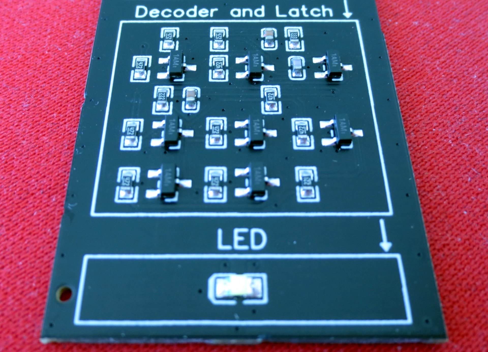

The decoder and latch unit consists of a non-retriggerable monoflop and a latch that is formed from to NOR-gates. The monoflop triggers on the rising edge of the input signal and will generate an output pulse with a length of approximately 0.6 us that is fed into the latch. The length of this output pulse is independent of the length of the input pulse. The other input of the latch will directly receive the data signal from the input.  When both inputs of the latch are low, the latch will remember the last state of the inputs. Therefore it can discriminate which signal went low first: the reference timing signal from the monoflop or the pulse from the data input. This does effectively allow to discirminate between a pulse that is longer or shorted than the reference. The output of the latch is fed into an additional inverter that serves as a driver for the LED.

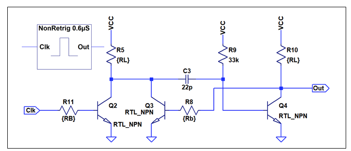

The circuit of the non-retriggerable monoflop is shown above. A positive edge on the input of Q2 will pull the collector of Q2 and Q3 down and hence also the base of Q4 through the capacitor. This will pull the output high and turn Q3 on. As long as Q3 is on, further pulses on the base of Q3 are ignored. The monoflop will only turn off once C3 has been recharged via R9. Some more info [here](https://www.nutsvolts.com/magazine/article/bipolar_transistor_cookbook_part_6). Once interesting aspect of this circuit is that the base of Q4 will be pulled to a negative potential due to capacitive coupling. Hence the stored saturation charge from Q4 is removed much quicker and the output can switch to high with very little delay.

### Real-Life Performance

After verification of the design in LTSpice, I created a PCB and used an assembly service to manufacture the PCBs and pick and place the parts. The interesting part is of course, how the actual circuit performs.

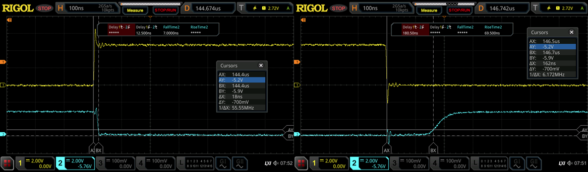

A first step was to investigate the timing behavior of the logic gates. The screenshots above show the timing of one of the input inverters base on PMBT3904. The yellow trace corresponds to the input (driven from a MCU GPIO) and the lower channel corresponds to the output. We can see that the propagation time for a L->H transition is 18 ns and for a H->L transition is 162 ns. This is quite some difference to the model I used in LTspice. The main reason for this is that the model used a very pessimistic value for the storage time. After adjusting the storage time parameter ("TR") to 380 ns, I was able to replicate the behavior of the inverter also in LTspice. The story is a bit different when using chinese clone transistors (CJ MMBT3904). They had a much longer storage time and hence a H->L delay of 283 ns which caused marginal timing. However, it turns out that the circuit does still somewhat work even with the CJ transistors.

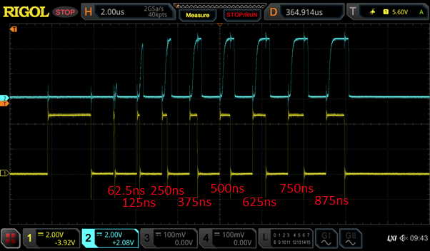

Shown above is the input-output relationship when a signal is forwarded through a "Pixel". The output pulse looks much less steep, thanks due to the slow response of the used RTL gates. However, pulses above 250 ns are still faithfully reproduced, which is sufficient to guaruantee proper operation.

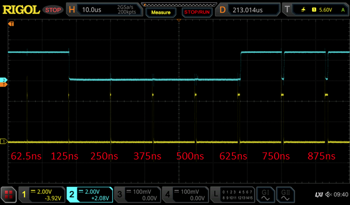

This screenshot shows the behavior of the LED out in relation to input pulses of different length. The upper trace corresponds to the state of the LED (ON/OFF). We can see that a very short pulse of 62.5 ns will not turn off the LED and is ignored. Staring from 125 ns the LED is properly turned off and pulses of 625 ns and above will turn the LED on - as expected.

## Summary

Not much to say - this was a fun little design that allowed to explore ancient logic styles in a maneagable and purposeful way (ok, at least somewhat...). The interesting challenge is to reduce the number of transistors used. Can you do better? Remember that it has to work in a real circuit, so using idealistic assumptions about the behavior of the transistors may not be sufficient.
