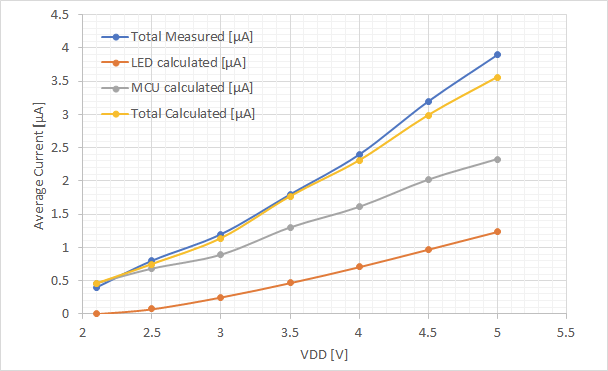
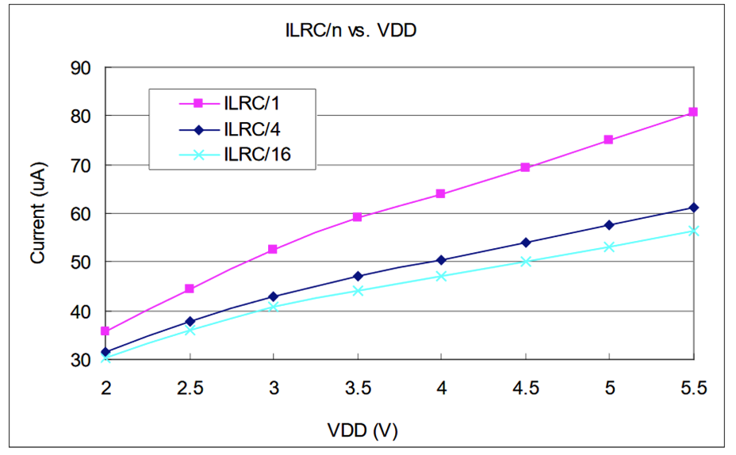
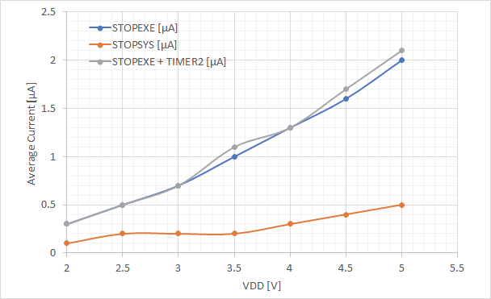

Flashing a LED is certainly among the first set of problems any burgeoning electronics specialist is tackling, may it be by using an ancient NE555 or, more recently, a microcontroller to control the LED. As it turns out, we can turn any trivial problem into a harder one by changing its constraints.

So, what about the challenge of flashing a LED from the charge of a single battery as long as possible? Of course, also this is not a novel problem. Two interesting approaches that I came across in the past: 1) Burkhard Kainkas *[Ewiger Blinker](http://www.b-kainka.de/bastel59.htm)* ("Eternal Blinky") and 2) Ted Yapos [TritiLED](https://hackaday.io/project/11864-tritiled).

B. Kainkas project is a LED flasher circuit made from discrete transistors that consumes about 50uA and is able to run for years from a single AA cell. Ted Yapo raised the bar a bit further and investigated in intricate detail how to make a LED shine for years at very low intensity from a CR2032 coin cell. His project logs are worth a read for certain. One very interesting detail is that he concluded that using a lower power microcontroller to control the LED is actually the most efficient option. This may be a bit counterintuitive, but appears more obvious when looking at his attempts of building a [discrete version](https://hackaday.io/project/11864-tritiled/log/114986-dude-wheres-my-mcu).

Many microcontrollers offer highly optimized low power sleep-modes that can be used to wait between the flashes. The microcontroller will only be active when the LED needs to be flashed. At that point it does not really matter how much the active power consumption of the microcontroller is, because the LED will need several mA to emit light at a sufficient level.

Enter the infamous "3 cent" Padauk microcontroller family that I used for several projects before. To my surprise, these devices offer very competitive low power sleeping modes that seems to be on par with several "low power" 8 bit microcontrollers that cost ten times as much. I investigated how to implement an ultra low power LED flasher on the PFS154.

## Implementation

The first step in reducing the power consumption of the MCU is to use the low speed oscillator as a clock source. In the PFS154 this is called the "ILRC" and provides a clock of around 52 kHz depending on supply voltage. One oddity I found is that it was necessary to activate both the high-speed and low-speed oscillator as a first step and only disable the high speed oscillator in a second step. Directly switching to the ILRC halted the MCU. The code example below is based on the [free-pdk includes](https://github.com/free-pdk/pdk-includes).

```c
/*Activate low frequency oscillator as main clock.*/
CLKMD =  CLKMD_ILRC | CLKMD_ENABLE_ILRC | CLKMD_ENABLE_IHRC;
CLKMD =  CLKMD_ILRC | CLKMD_ENABLE_ILRC ;
    // Note: it is important to turn off IHRC only after clock
    // settings have been updated. Otherwise the CPU stalls.
```



Running the PFS154 at such a low clock will already reduce the power consumption to far below 100 uA. Not all of this is dynamic power consumption that scales with the clock rate, so the only way to go further is to activate one of the sleep modes.

### Sleep modes

The PFS154 supports two sleep modes: "STOPSYS" and "STOPEXE".

**STOPSYS**completely halts the core and all oscillators. The only way to wake up from  this state is by a pin change.**STOPEXE**halts the core, but the low frequency oscillator remains active and can be used to clock the timers. The core can be woken up by pin change or timer event. It appears that, although not clearly states in the datasheet, both the 8 bit timers and the 16 bit timer can generate wake-up events. Note that the watchdog timer is also halted during STOPEXE. This is on contrast to the behavior on other microcontrollers.



 As a first step I used my multimeter to verify the current consumption vs supply voltage during the sleep modes as shown above. I was basically able to reproduce the curves from the datasheet, which confirms that the datasheet is correct and that my handheld multimeter is actually able to accurately measure currents as low as a few 100 nA! Not something I had expected, to be honest.

During this I found one peculiar behavor of the PFS154. The pin change wakeup is always enabled by default after reset. It appears that very low changes on the pins can generate a wakeup. If they are left floating, it is sufficient to touch a pin to wake up the core. Interestingly this even applied to pins that were not routed outside of the package put still existed as pads on the die. By touching the surface of the IC it was possible to generate a wake up event! Unless you are interested in building a hacky touch sensor it is therefore adviced to disable all pins as a wakeup source.

### Implementation of timer wakeup

Since I want to build a LED flasher, I used Timer2 to generate a wakeup event at a frequency of around 1.6Hz. You can see the full code for STOPEXE configuration and timer initialization below.

```c
/* Configure STOPEXE mode and set up Timer 2 as wake up source */

  PADIER = 0; // disable pins as wakeup source
  PBDIER = 0; // Also port B needs to be disabled even if it is
      // not connected to the outside of the package.
      // Touching the package can introduce glitches and wake
      // up the device

  INTEN = 0;  // Make sure all interrupts are disabled
  INTRQ = 0;

  MISC = MISC_FAST_WAKEUP_ENABLE;
      // Enable faster wakeup (45 clocks instead of 3000)
      // This is important to not waste energy, as 40uA bias
      // is already added during wakeup time

  TM2C  = TM2C_CLK_ILRC | TM2C_MODE_PWM;
      // Oscilator source for timer 2 is LRC (53 kHZ)
  TM2CT = 0;
  TM2S  = TM2S_PRESCALE_DIV16 | TM2S_SCALE_DIV8;
      // Divide clock by 16*7=112 -> 53 kHz / 122 = 414 Hz
  TM2B  = 1;
      // PWM threshold set to 1.
      // The PWM event will trigger the wakeup.
      // Wakeup occurs with 414 Hz / 256 = 1.66 Hz
```

One important optimization was to turn on the "fast wakeup mode". The normal wakeup mode takes around 3000 clocks cycles during which around 40uA of current are consumed. I found that the 8 bit timers can also be used as PWM generators during STOPEXE mode. However it is not possible to prevent them from waking up the CPU, so they cannot be used autonomously.

### LED flashing code

The only part that remains is the code to actually flash the LED. This is rather simple as shown below.

```c
/*Initialize LED I/O and flash the LED*/

  PA    = 1<<4; // LED is on PA4, set all other output to zero.
  PAPH   = 0;   // Disable all pull up resistors
  PAC    = 0;   // Disable all outputs
    // Note: There is no series resistor for the LED
    // The LED current is limited LOW IO driving setting
    // See Setction 4.14 (p24) in PFS154 manual
    // The output is disabled when the LED is off
    // to avoid leakage

  for (;;) {
    PAC |=1<<4;
    // Enable LED output (It's set to High)
    __nop();
    __nop();
    __nop();
    PAC &=~(1<<4);
    // Disable LED output after 4 cycles => 4/53 kHz = 75.5 uS
    __stopexe();
  }
```

The processor core will wakeup after every event generated by timer2, turn on the LED for 75.5uS, and put the core to sleep again. The LED is directly connected to an output pin without series resistor while the pin is configured to low I/O driving strength to limit the maximum current. This is somewhat risky, but allows operating the LED down to the lowest possible voltage - around 2.1V for the green LED I am using.

## Current Consumption Performance

Well, the code works nicely and flashes the LED at 1.6 Hz at voltages down to slightly above 2V. You can find the [complete source here](https://gist.github.com/cpldcpu/603bf71c9c6afcffa46dd7c459e27efc).


To evaluate that everything works correctly, I set up a simple power model that considers sleep mode current, active current and the current used by the LED. The LED current was determined by measuring the on current of the LED connected to the microcontroller at different supply voltages and multiplying it by the duty cycle. The same approach was taken for the active current of the MCU. You can see the output of the model above and comparison with a measurements. I had to use a series resistor of a few kilohm and a parallel capacitor to ensure that the current ripple was smoothed enough to allow for a steady reading on the multimeters.

As you can see, there is good agreement between model and measurements. Due to the extremely low duty cycle of the LED, the main power consumption is still the MCU and the timer. This contribution is highly dependent on supply voltage, so that the most energy efficicent operation is achieved at the lowest voltage.

The total current consumption at 3V is only about 1 uA! This is less than the self-discharge current of many batteries. A single CR2023 cell with a capacity of around 200 mAh could theoretically power this flasher for 200000 hours, or 22 years! I was able to operate the circuit (as shown in the title image) for more than 10 minutes based on the charge of a 330uF capacitor charged to 5V.

## Summary

Despite their low cost, the Padauk MCUs can be used for extremely low power operation. There are certainly ways to improve the flasher circuit more, for example by using an inductive boost converter to allow constant current operation of the LED at even lower voltages.
