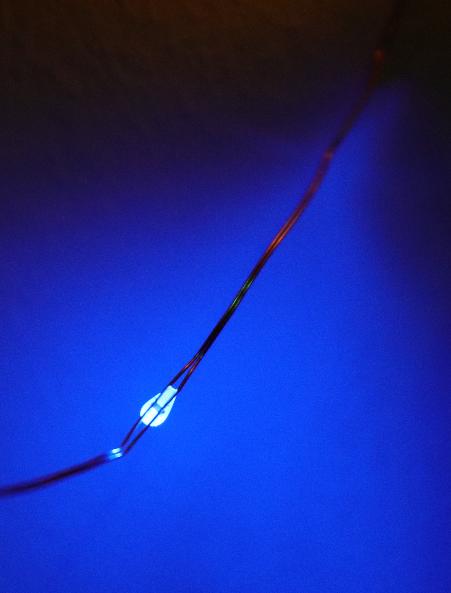

After being amazed about [finding a really clever implementation of powerline controlled LEDs](https://cpldcpu.wordpress.com/2022/01/23/controlling-rgb-leds-with-only-the-powerlines-anatomy-of-a-christmas-light-string/) in a low cost RGB "copper string light", I bought a few other products in hope to find more LEDs with integrated ICs. At less than $4.00 including shipping, this was by far the cheapest LED string I bought. This one did not have any ICs inside, but I was still surprised about finding rather unusual phosphor converted LED technology in it.



 The delivery contained an LED string with attached USB controller and a remote control including battery, as seen in the lower part of the vendor image. The upper part seems to be an artistic impression that shows colors that can not be displayed by the string.

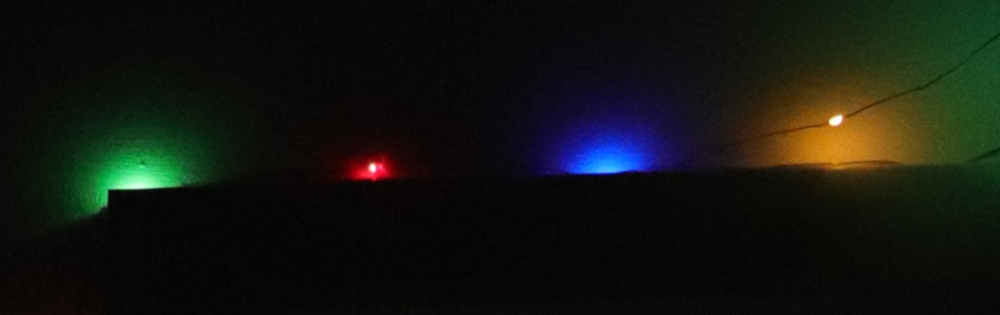

Each of the LEDs in the string has one of four fixed colours: Green, Red, Blue, Warm White/Yellow. The remote control allow changing the brightness or activate one of several animated effects. Based on initial observation, the LED brightness can be controlled in two groups: Yellow/Red and Blue/Green.

This can be easily achieved by connecting two groups of LEDs in antiparallel manner so that either polarity of the string will turn one group of LEDs on. Unlikely in the previous string, this does not require the integration of an integrated circuit into each LED.


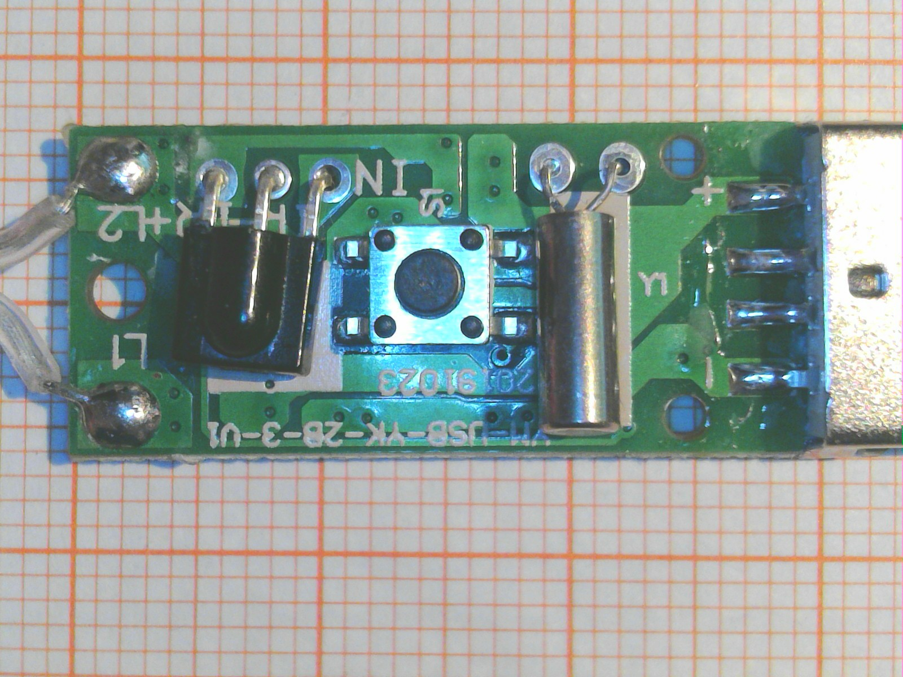
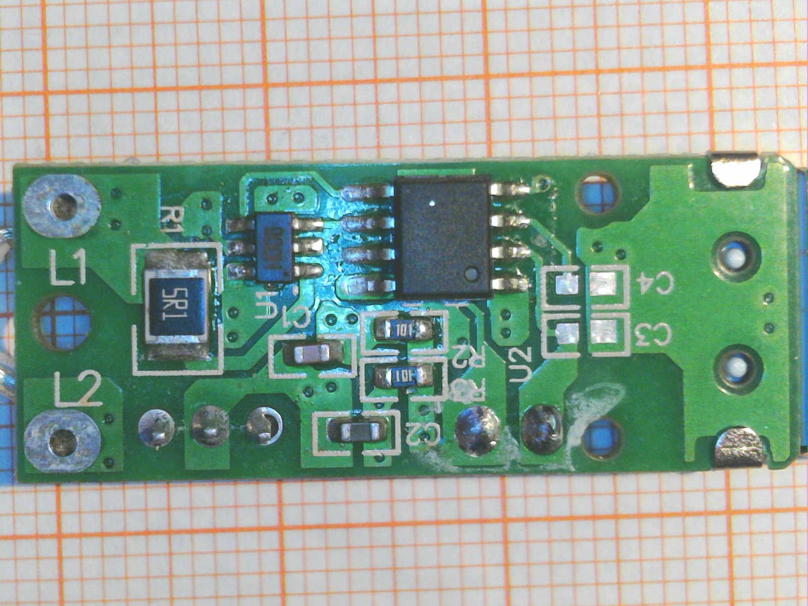


The controller looks even more sparse than that of the previous light string. Besides an 8 pin microcontroller with PIC-pinout and the essential set of 32.768 kHz crystal and remote control receive there is only one additional IC on board. U1 is marked "H006" and appears to be a full bridge controller that allows to connect the LED string to power in either direction. I have not been able to identify this chip, but it seems to be quite useful. Two pins of the MCU are connected to it.

## So that's it? Didn't we miss something?

There is a tiny detail: How do we connect LEDs with different colors in parallel? The emission color of a LED [correlates to it's forward voltage drop](http://dangerousprototypes.com/docs/Basic_Light_Emitting_Diode_guide). Red LEDs have a forward voltage of less than 2 V, while green and blue LEDs typically have 3V and more. If LEDs with different colors are connected in parallel, only the ones with the lowest forward voltage light up.

This is not the case here, so what is going on? Let's take a look at the LEDs.


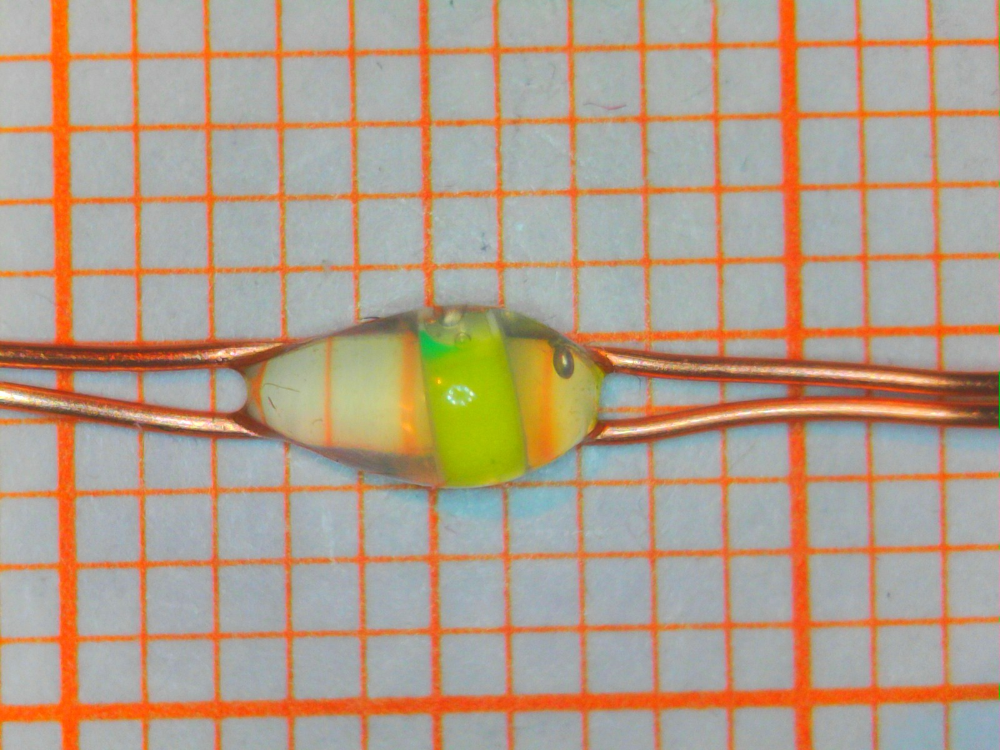
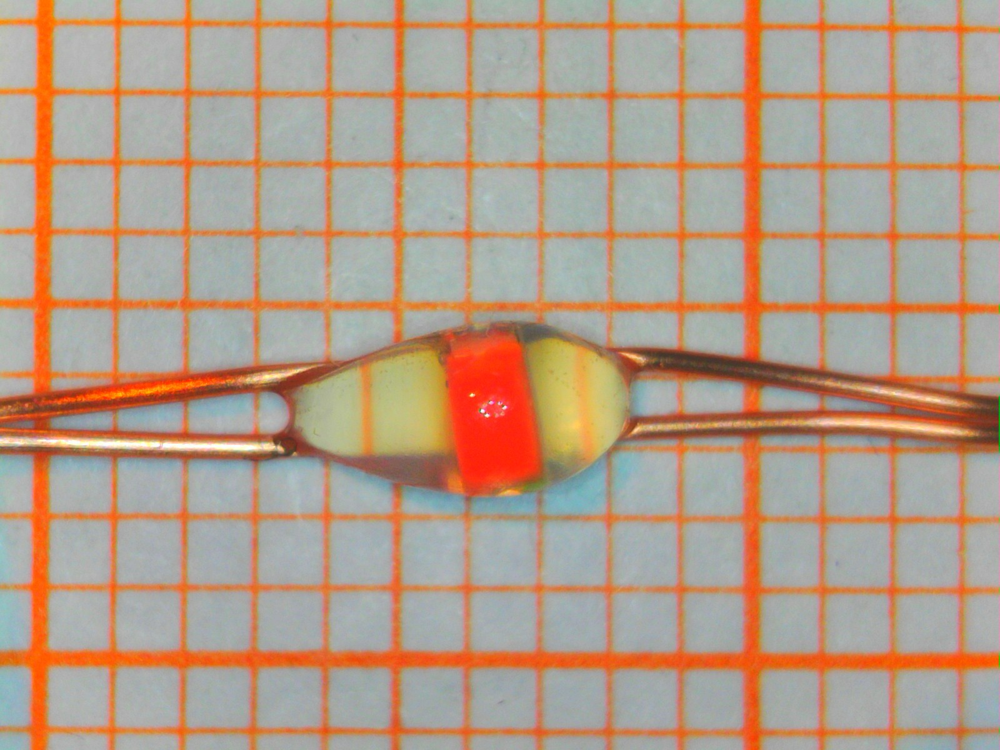
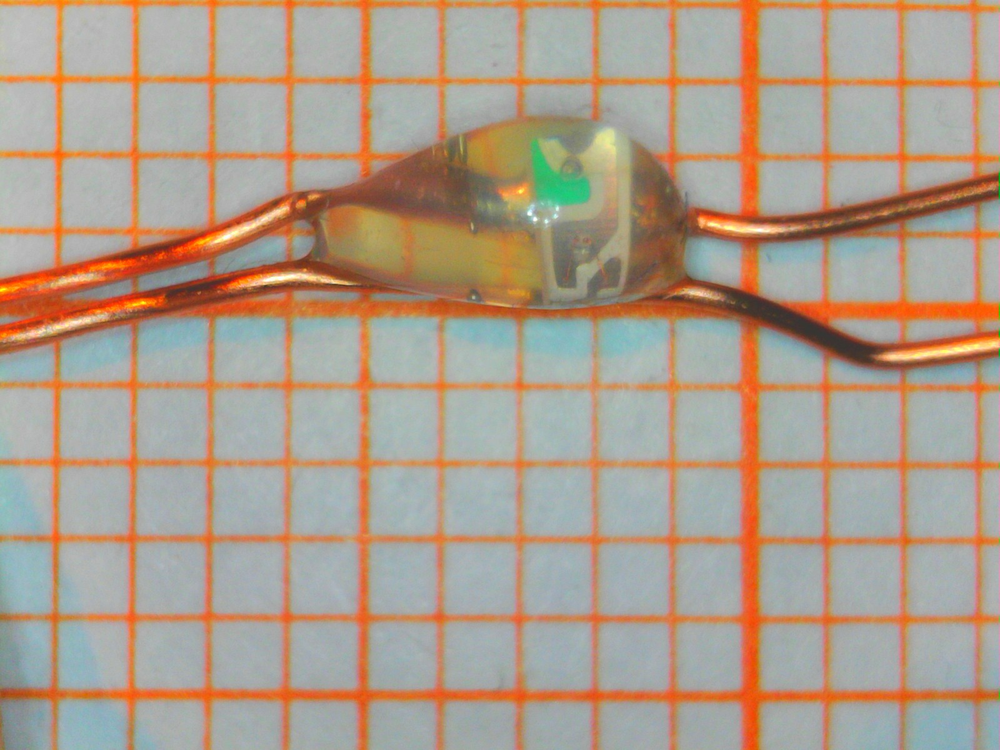
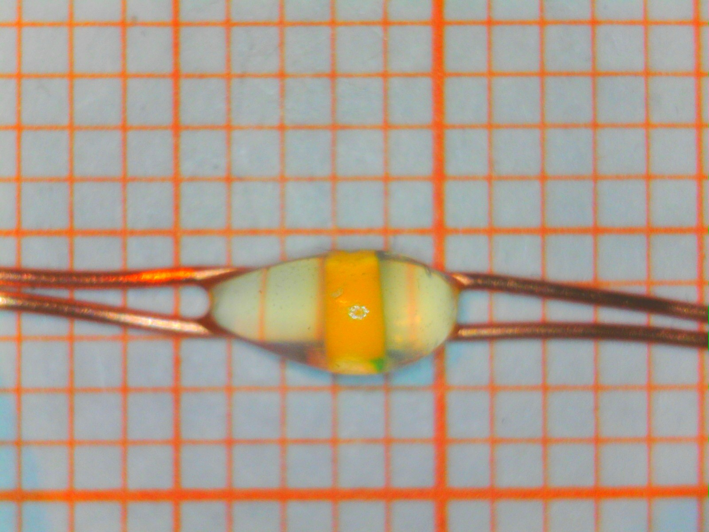
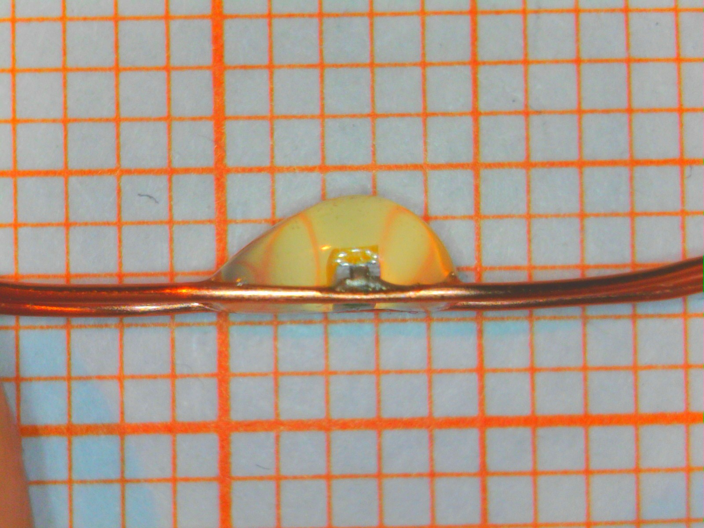
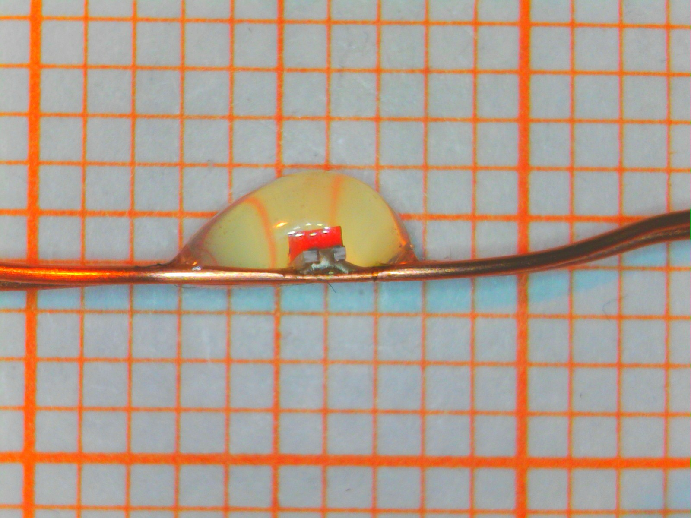
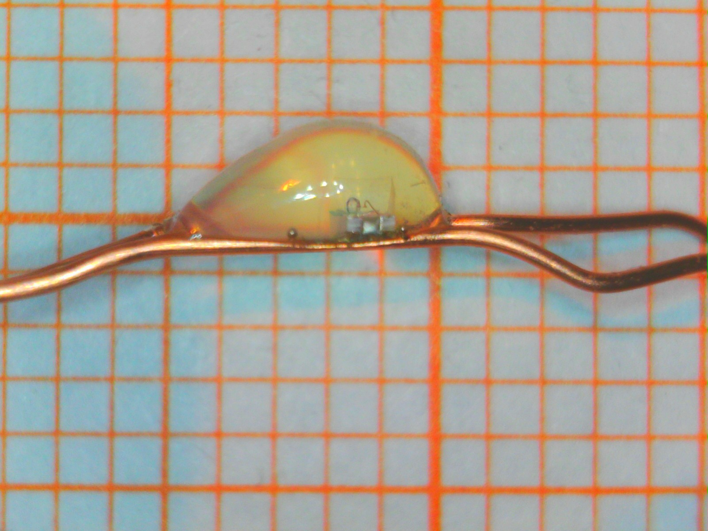
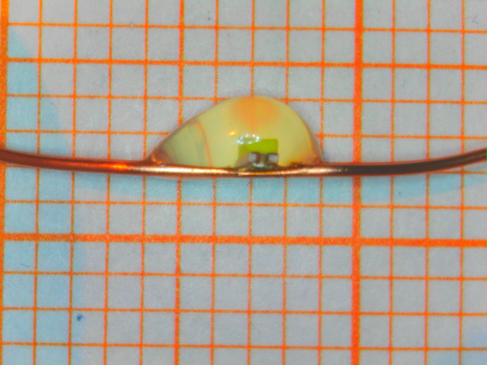


Above are microscope images of all the four LED colors in the string. It appears that standard LEDs in 0603 form factor have been directy connected to the copper wired without any additional integrated circuit or even forward resistor.

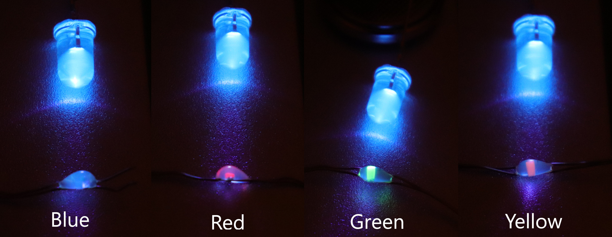

Let's try a little experiment and illuminate the LEDs with a UV-A LED. You can see the results in the image above. The bottom row shows the resulting emissision from unpowered LEDs of the string. We can clearly see that the Red, Green and Yellow LEDs contain a [phosphor](https://en.wikipedia.org/wiki/Phosphor#White_LEDs) that is excited by the UV-A and emits visible light even when no current is applied to the LED.

The blue glow in the UV-A LED and the "blob" around the LEDs in the string is caused by [flourescence](https://en.wikipedia.org/wiki/Fluorescence) in the Epoxy compound. There is a nice article about this effect [here](https://hal.archives-ouvertes.fr/hal-00019787/document), where emission at 460 nm was observed for excitation at 396 nm in cured Epoxy.

This is pretty cool. All LEDs in the string are based on a blue-light emitting LED chip, but colors other than blue use a phosphor that converts blue light to a different wavelength. Since all LED chips are identical, they also have identical forward voltage and can be connected in parallel. Employing phosphor-converted LEDs avoids the necessity of additional ICs or resistors to adjust for the forward voltage mismatch in the string. (It's still not good engineering practice, because bad things may happen when there is a temperature differential across the string, but I guess it's fine for this application.)

White LEDs with phosphor are everywhere, but other colors are somewhat difficult to come by. It's really amazing to see them popping up in a lowest cost LED string. Personally, I think that the light emitted from the phosphor converted LEDs has a more pleaseant quality than that of directly emitting LEDs, since it is more diffuse and less monochrome. I have not been able to identify a source of 0603 green/red/yellow phosphor converted LEDs, but I hope they become available eventually.

Again, quite a clever solution in a low end product.
