The RGB curtain predictably turns into a mess of wires when not used according to instructions.

As should be obvious from this blog, I am somewhat drawn to clever and minimalistic implementations of consumer electronics. Sometimes quite a bit of  ingeniosity is going into making something "cheap". The festive season is a boon to that, as we are bestowed with the latest innovation in animated RGB Christmas lights. I was obviously intrigued, when I learned from [a comment on GitHub](https://github.com/Aircoookie/WLED/issues/1312#issuecomment-1007035316) about a new type of RGB light chain that was controlled using only the power lines. I managed to score a similar product to analyze it.

The product I found is shown below. It is a remote controlled RGB curtain. There are many similar products out there. What is special about this one, is that there are groups of LEDs with individual color control, allowing not only to set the color globally but also supporting animated color effects. The control groups are randomly distributed across the curtain.

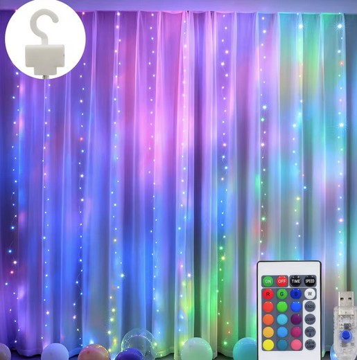Remote controlled RGB curtain (vendor image)

The same type of LEDs also seems to be used in different products, like "rope-light" for outside usage. A common indication for this LED type seems to be the type of remote control being used, that has both color and animation options (see above).

There seems to be an [earlier version of similar LEDs](https://www.youtube.com/watch?v=iuZZxOvY9Ls) (thanks to Harald for the link) that allows changing global color setting in a similar scheme but without the addressability.

## Physical analysis



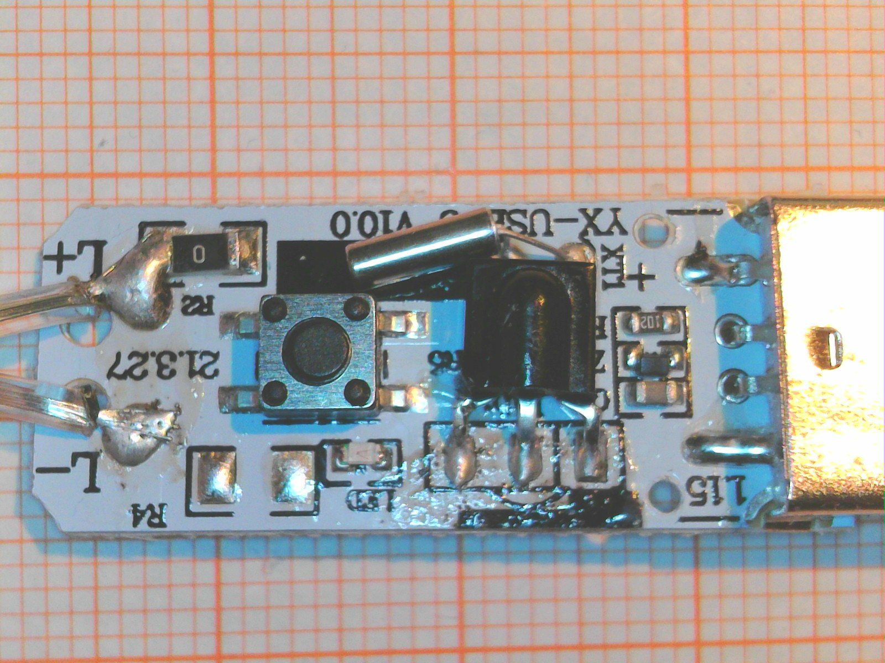


Let's first take a quick look at the controller. The entire device is USB powered. There is a single 8 pin microcontroller with a 32.768kHz quarz. Possibly to enable reliable timing (there is a timer option on the remote controler) and low power operation when the curtain is turned off. The pinout of the MCU seems to follow the PIC12F50x scheme which is also used by many similar devices (e.g. Padauk, Holtek, MDT). The marking "MF2523E" is unfamiliar though and it was not possible to identify the controller. Luckily this is not necessary to analyze the operation. There are two power mosfets which are obviously used to control the LED string. Only two lines connect to the entire string, named L- (GND) and L+.

All 100 (up to 300 in larger versions) LEDs are connected to the same two lines.  These types of strings are known as "copper string lights" and you can see [how they are made here](https://youtu.be/wCKlCUBsaT4) (Thanks to Harald from uC.net for the link!). It's obvious that it is easier to change the LED than the string manufacturing process, so any improvement that does not require additional wires (or even a daisy chain connection like WS2812) is much easier to introduce.


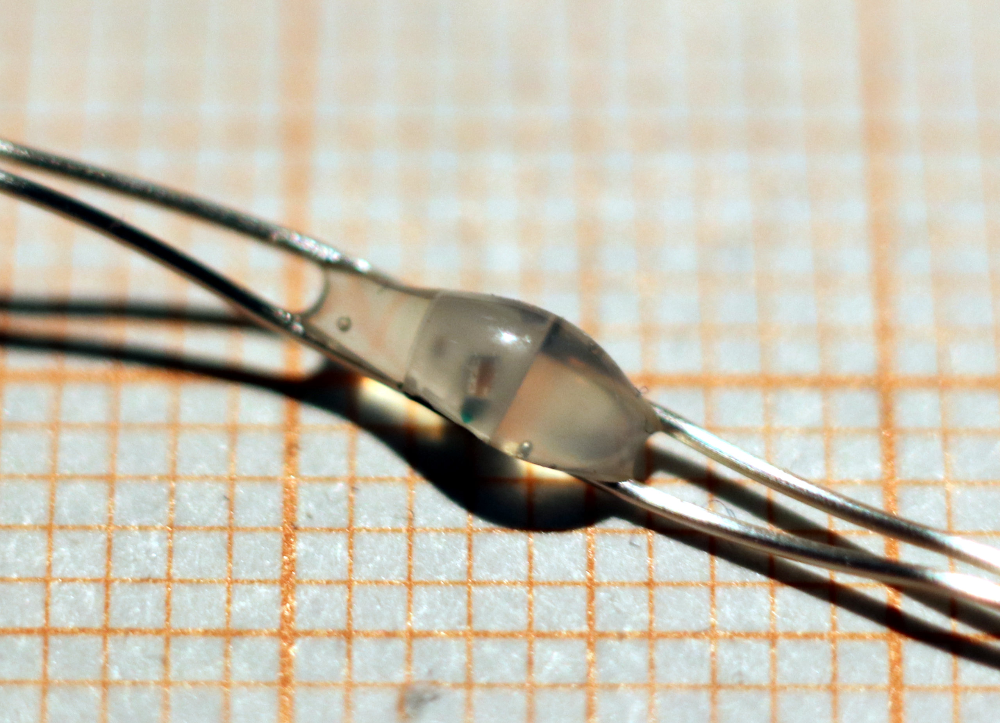
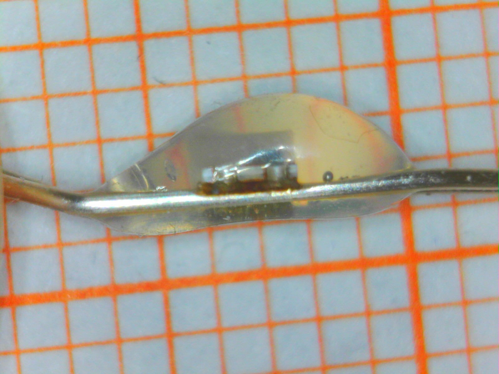
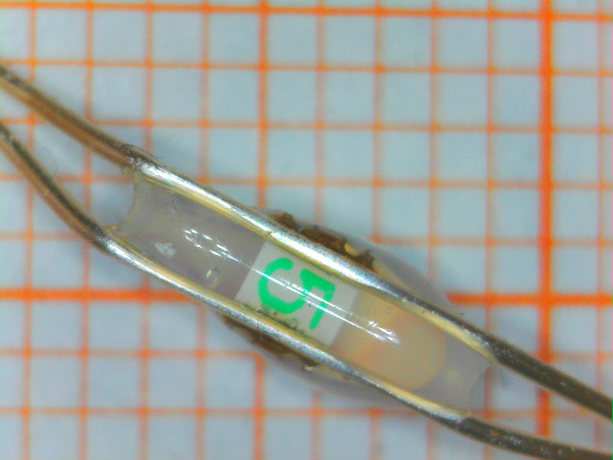


 Close up images of a single LED are shown above. We can clearly see that there is a small integrated circuit in every lightsource, and three very tiny LED chips.


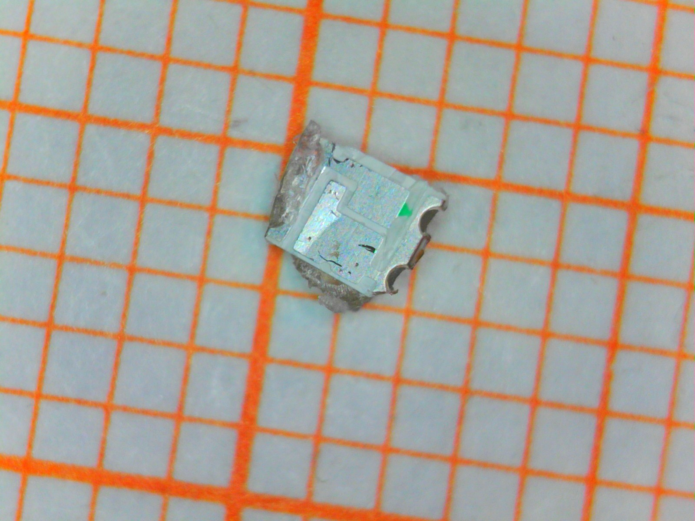
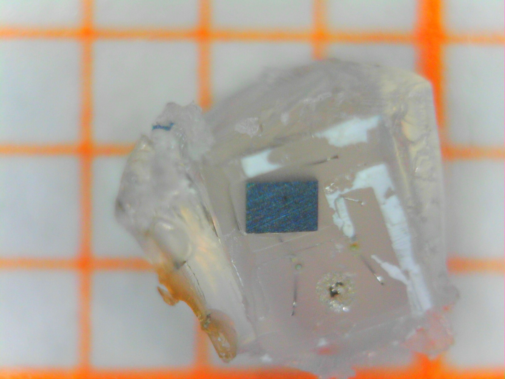


Trying to break the LED apart to get a better look at the IC surface was not successful, as the package always delaminated between carrer (The tiny pcb on the left) and chips (still embedded in the epoxy diffusor on the right). What can be deduced however, is that the IC is approximatly 0.4 x 0.6 = 0.24 mm^2 in area. That is actually around the size of a more complex WS2812 controller IC.

## LED Characterization

Hooking up the LEDs directly to a power supply caused them to turn on white. Curiously there does not seem to be any kind of constant current source in the LEDs. The current changes direclty in proportion to the applied voltage, as shown below. The internal resistance is around 35 Ohms.



This does obviously simplify the  IC a lot, since it basically only has to provide a switch instead of a current source like in the WS2812. It also appears that this allows to regulate the overall current consumption of the LED chain from the string controller  by changing the string voltage and control settings. The overall current consumption of the curtain is between 300-450 mA, right up to the allowable maximum of power draw of USB2.0. Maybe this seemingly "low quality" solution is a bit more clever than it looks at the first glance. There is a danger of droop of course, if too much voltage is lost over the length of the string.

## How Is It Controlled?

Luckily, with only two wires involved, analyzing the protocol is not that complex. I simply hooked up one channel of my oscilloscope to the end of the LED string and recorded what happened when I changed the color settings using the remote control.

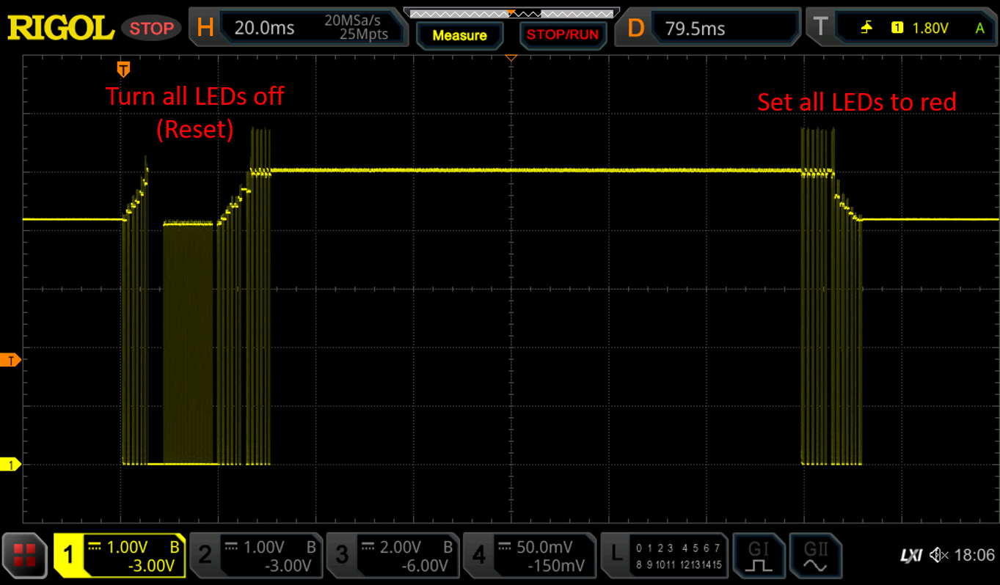

The scope image above shows the entire control signal sequence when setting all LEDs to "red". Some initial observations:

1. The string is controlled by pulling the entire string voltage to ground for short durations of time ("pulses"). This is very simple to implement, but requires the LED controller to retain information without external power for a short time.
2. We can directly read from the string voltage whether LEDs are turned on or off.
3. The first half of the sequence obviously turns all LEDs off (indeed, the string flickers when changing color settings), while the second half of the sequence turns all LEDs on with the desired color setting.

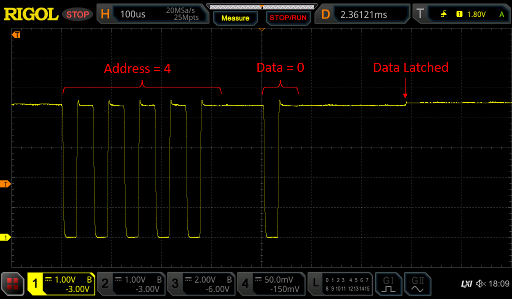

Some more experimentation revealed that the communication is based on messages consisting of an address field and a data field. The data transmission is initiated with a single pulse. The count of following pulses indicates the value that is being transmitted using simple linear encoding (Which seems to be similar to what [ChayD observed](https://github.com/Aircoookie/WLED/issues/1312#issuecomment-1012578561) in his string, so possibly the devices are indeeed the same). No binary encoding is used.

Address and data field are separated by a short pause. A longer pause indicates that the message is complete and changes to the LED settings are latched after a certain time has passed.



My findings are summarized in the diagram above. The signal timing seems to be derived from minimum cycle timing of the 32.768kHz Crystal connected to the microcontroller, as one clock cycle equals ~31 us. Possibly the pulse timing can be shortened a bit, but then one also has to consider that the LED string is basically a huge antenna...

| Address Field | Function |
|---------------|----------|
| 0 | Unused / No Function |
| 1 ... 6 | Address one of six LED subgroups (zones), writes datafield value into RGB Latch |
| 7 | Address all LEDs at once (broadcast), adds datafield value to RGB latch content |


| RGB Latch Value | RGB encoding |
|-----------------|--------------|
| 0 (000) | Turn LEDs off (Black) |
| 1 (001) | Red |
| 2 (010) | Green |
| 3 (011) | Yellow (Red+Green) |
| 4 (100) | Blue |
| 5 (101) | Magenta (Red+Blue) |
| 6 (110) | Cyan (Green+Blue) |
| 7 (111) | White |

The address field can take values between 1 and 7. A total of six different zones can be addressed with addresses 1 to 6.  The data that can be transmitted to the LED is fairly limited. It is only possible to turn the red, green and blue channels on or off, realizing 7 primary color combinations and "off". Any kind of intermediate color gradient has to be generated by quickly changing between color settings.

To aid this, there is a special function when the address is set to 7. In this mode, all zones are addressed at the same time. But instead of writing the content of the data field to the RGB latch, it is added to it. This allows, for example, changing between neighbouring colors in all zones at once, reducing communication overhead.

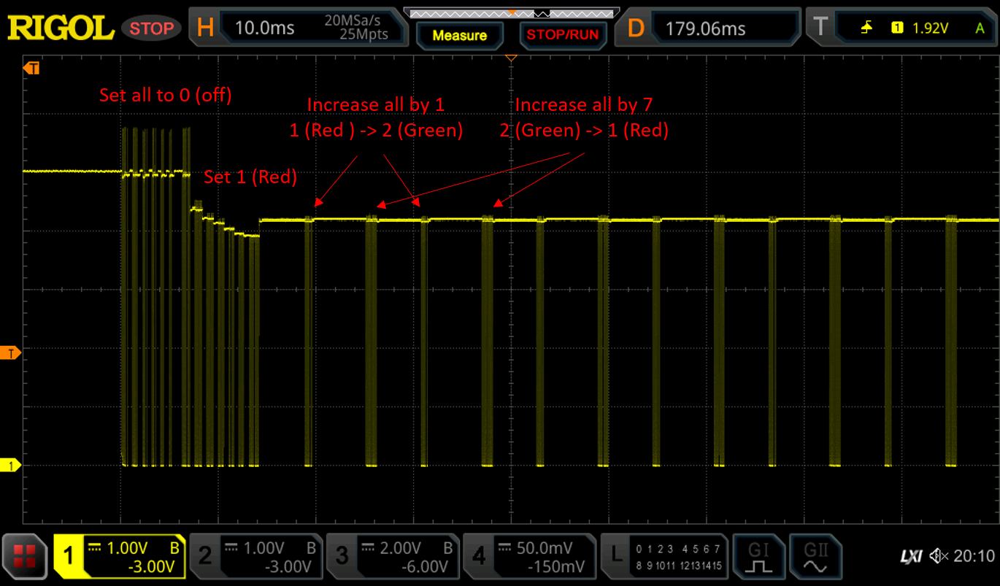

This feature is extensively used. The trace above sets the string colour to "yellow". Instead of just encoding it as RGB value "011", the string is rapibly changed between green and red, by issuing command "7,1" and "7,7" alternatingly. The reason for this is possibly to reduce brightness and total current consumption. Similar approaches can be used for fading between colors and dimming.

Obviously the options for this are limited by protocol speed. A single command can take up to 1.6ms, meaning that complex control schemes including PWM will quickly reduce the maximum attainable refresh rate, leading to visible flicker and "rainbowing".

It appears that all the light effects in the controller are specifically built around these limitation, e.g. by only fading a single zone at a time and using the broadcast command if all zones need to be changed.

## Software Implementation

Implementing the control scheme in software is fairly simple. Below you can find code to send out a message on an AVR. The code can be easily ported to anything else. A more efficient implementation would most likely use the UART or SPI to send out codes.

The string is directly connected to a GPIO. Keep in mind that this is at the same time the power supply for the LEDs, so it only works with very short strings. For longer strings an additional power switch, possibly in push-pull configuration (e.g. MOSFET), is required.

```c
#include <avr/io.h>
#include <util/delay.h>

// Send pulse: 31 us low (off), 31 us high (on)
// Assumes that LED string is directly connected to PB0
void sendpulse(void) {
	DDRB |= _BV(PB0);
	PORTB &= ~_BV(PB0);
	_delay_us(31);
	PORTB |= _BV(PB0);
	_delay_us(31);	
}

// Send complete command frame
void sendcmd(uint8_t address, uint8_t cmd) {
	
	sendpulse(); // start pulse
	for (uint8_t i=0; i<address; i++) {
		sendpulse(); }
	
	_delay_us(90);
		
	sendpulse(); // start pulse
	for (uint8_t i=0; i<cmd; i++) {
		sendpulse(); }
	_delay_us(440);
}
```

It seems to be perfectly possible to control the string without elaborate reset sequence. Nevertheless, you can find details about the reset sequence and a software implementation below. The purpose of the reset sequence seems to be to really make sure that all LEDs are turned off. This requires sending everything twice and a sequence of longer duration pulses with nonobvious purpose.

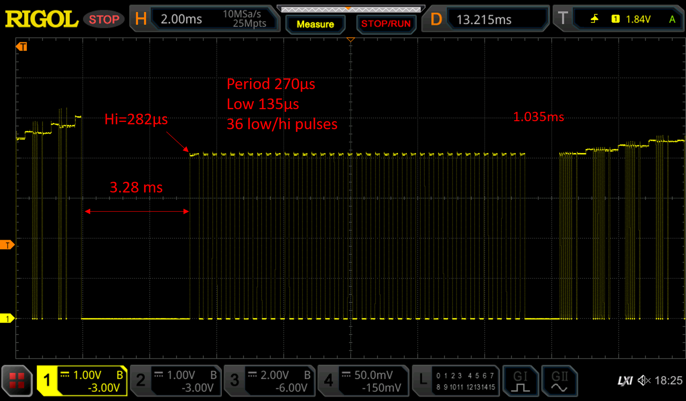

```c
// Emulation of reset sequence
void resetstring(void) {
	PORTB &= ~_BV(PB0);  // Long power off sequence
	_delay_ms(3.28);
	PORTB |= _BV(PB0);
	_delay_us(280);
		
	for (uint8_t i=0; i<36; i++) {  // On-off sequence, purpose unknown
		PORTB &= ~_BV(PB0);
		_delay_us(135);
		PORTB |= _BV(PB0);
		_delay_us(135);			
	}
		
	_delay_us(540);
	// turn everything off twice.
        // Some LEDs indeed seem to react only to second cycle.
        // Not sure whether there is a systematic reason
		
	for (uint8_t i=7; i>0; i--) {
		sendcmd(i,0);
	}

	for (uint8_t i=7; i>0; i--) {
		sendcmd(i,0);
	}
}
```

## Pulse Timing And Optical Measurements

**Update:** To understand the receiver mechanism a bit more and deduce limits for pulse timing I spent some effort on additional measurements. I used a photodiode to measure the optical output of the LEDs.

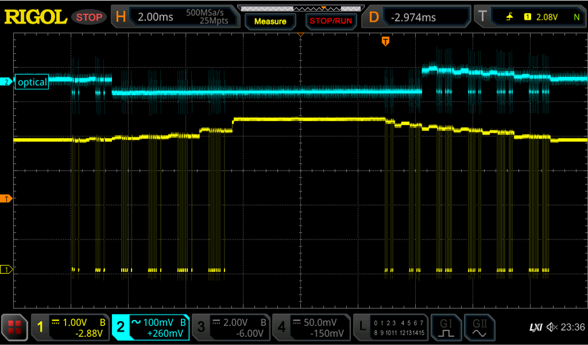

An exemplary measurement is shown above. Here I am measuring the light output of one LED while I first turn off all groups and then turn them on again (right side). The upper trace shows the intensity of optical output. We can see that the LED is being turned off and on. Not surprisingly, it is also off during "low" pulses since no external power is available. Since the pulses are relatively short this is not visible to the eye.

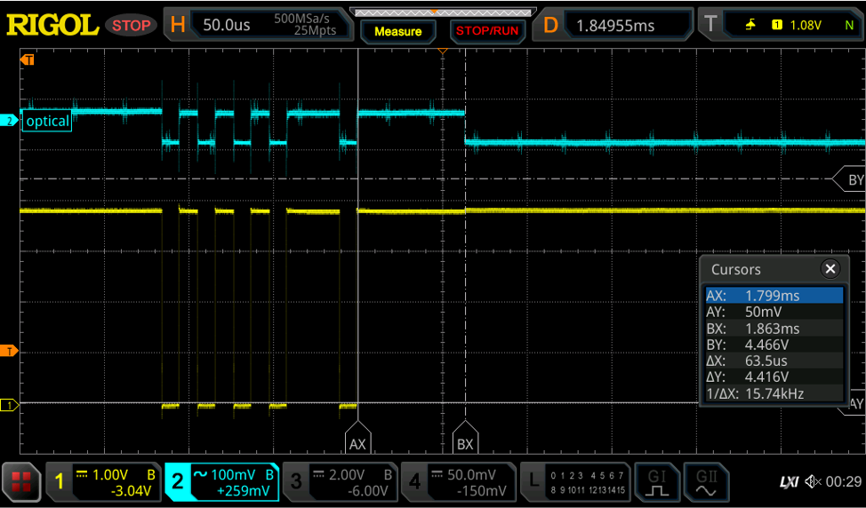

Taking a closer look at the exact timing of the update reveals that around 65us pass after the last pulse in the data field until the LED setting is updated. This is an internally generated delay in the LED that is used to detect the end of the data and address field.

To my surprise, I noticed that this delay value is actually dependent on the pulse timing. The timeout delay time is exactly twice as long as the previous "high" period, the time between the last two "low" pulses.



This is shown schematically in the parametrised timing diagram above.

An internal timer measures the duration of the "high" period and replicates it after the next low pulse. Since no clock signal is visible in the supply voltage, we can certainly assume that this is implemented with an analog timer. Most likely a capacitor based integrator that is charged and discharged at different rates. I believe two alternating timers are needed to implement the full functionality. One of them measures the "on"-time, while the other one generates the timeout. Note that the timer is only active when power is available. Counting the pulses is most likely done using an edge detector in static CMOS logic with very low standby power that can be fed from a  small on-chip capacitor.

The variable timeout is actually a very clever feature since it allows adjusting the timing over a very wide range. I was able to control the LEDs using pulsewidths as low as 7 us, a significant speed up over the 31 us used in the original controller. This design also makes the IC insensitive to process variation, as everything can be implemented using ratiometric component sizing. No trimming is required.

See below for an updated driver function  with variable pulse time setting.

```c
#define basetime_us 10
#define frameidle_us basetime_us*5  // cover worst case when data is zero
									
void sendcmd(uint8_t address, uint8_t cmd) {
	
	for (uint8_t i=0; i<address+1; i++) {
		sendpulse();
	}
	
	_delay_us((basetime_us*3)/2);
		
	for (uint8_t i=0; i<cmd+1; i++) {
		sendpulse();
	}
	_delay_us(frameidle_us);
}

// Send pulse
void sendpulse(void) {
		PORTB &= ~_BV(PB0);
		_delay_us(basetime_us);
		PORTB |= _BV(PB0);
		_delay_us(basetime_us);	
}
```

## Conclusions

All in all, this is a really clever way to achieve a fairly broad range of control without introducing any additional data signals and while absolutely minimizing the circuit overhead per light source. Of course, this is far from what a WS2812 and clones allow.

Extrapolating from the past means that we should see of more these LEDs at decreasing cost, and who knows what kind of upgrades the next Christmas season will bring.

There seem to be quite a few ways to take this scheme further. For example by finding a more efficient encoding of data or storing further states in the LEDs to enable more finely grained control of fading/dimming. May be an interesting topic to tinker with...


