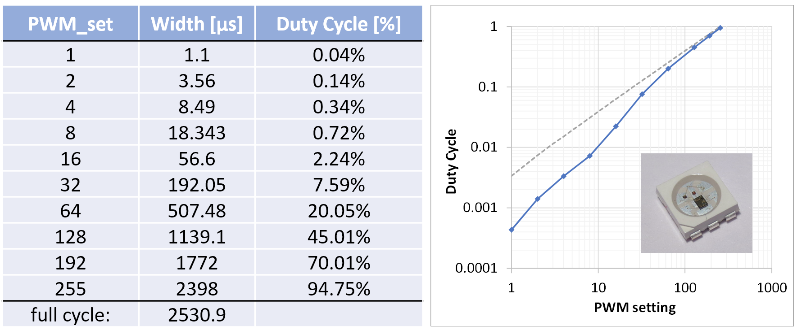
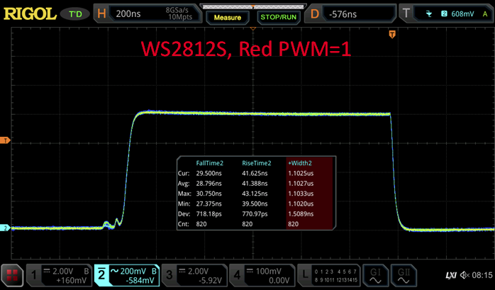
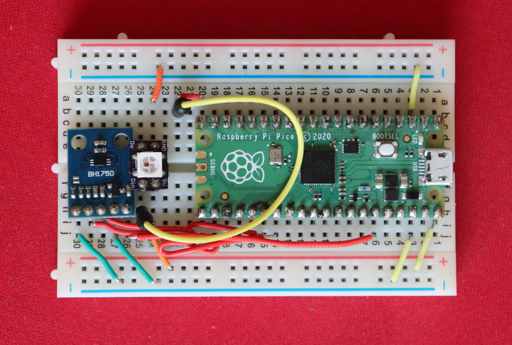
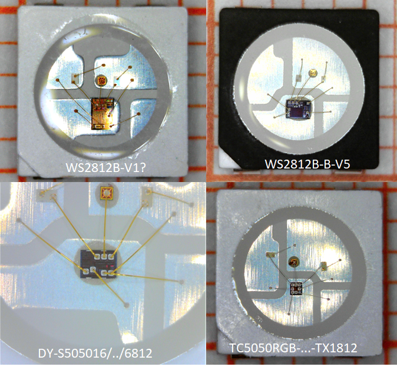
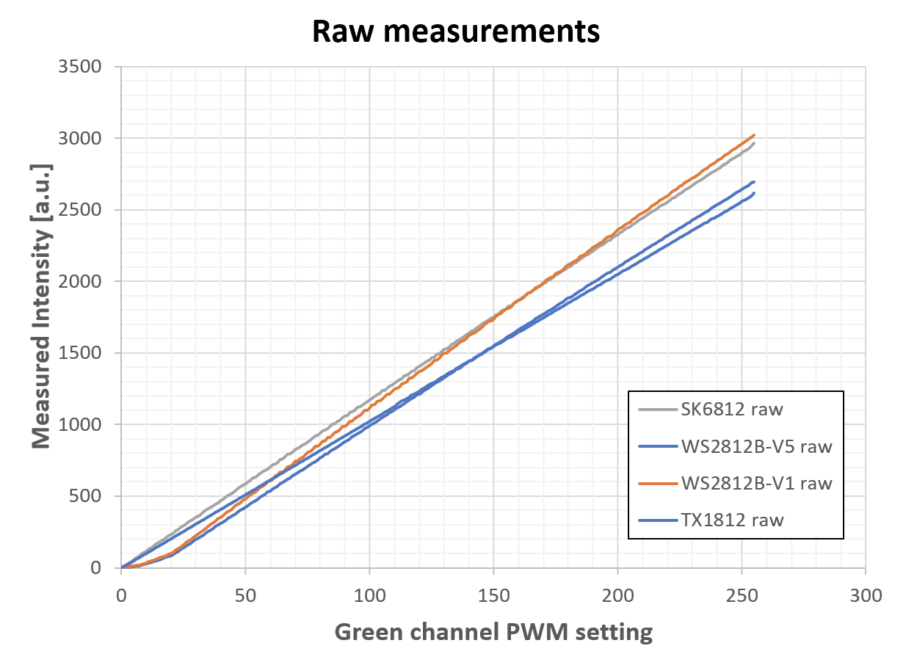
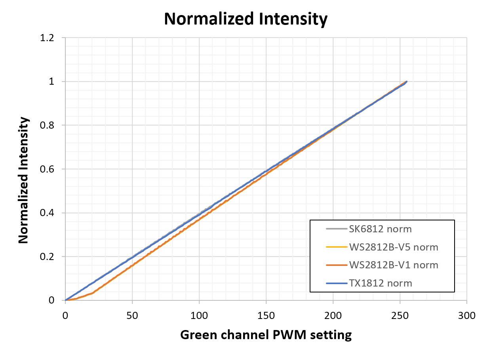
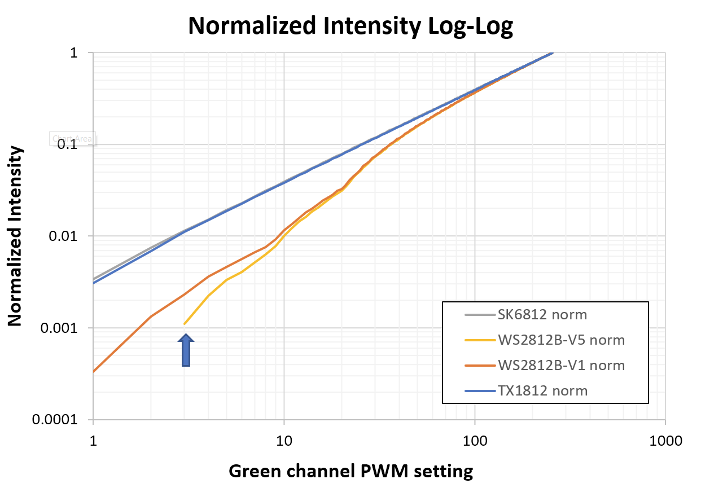
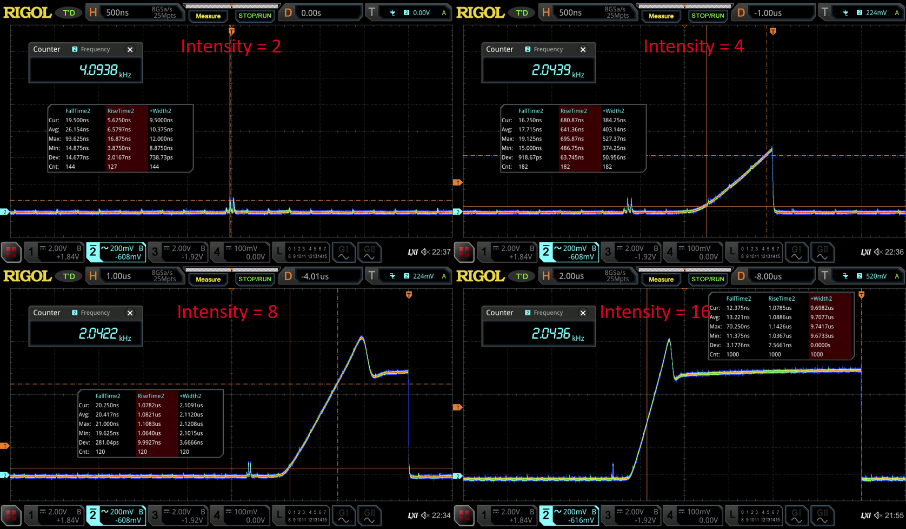

A while ago, I used [transient current analysis to understand the behavior of the WS2812](https://cpldcpu.wordpress.com/2020/12/19/power-analysis-probing-ws2812-rgb-leds/) a bit better (and to play around with my new oscilloscope). One intersting finding was that the translation of the 8 bit input value for the PWM register is mapped in a nonlinear way to the output duty cycle. This behavior is not documented in the data sheet or anywhere else. Reason enough to revisit this topic.

Measured PWM duty cycle vs. set value for WS2812S

The table and plot above show PWM pulse length of a WS2812S in dependence of the programmed 8 bit PWM set value, as measured previously by transient current analysis. Normally we would expect that the PWM set value is linearily transferred into a duty cycle. A setting of 1 should correspond to a duty cycle of 1/256=0.39%, a value of 64 to 64/256=25%. As seen in the table, the duty cycle is always lower than the expected value. This is especially true for small values. This is also evident from the log-log plot on the right - the dashed lines would be expected for a linear mapping.



For reference, the pulse waveform for a PWM setting of 1 in a WS2812S is shown above. The rise and fall time of the current source is much faster than the pulse length of the PWM signal.

Based on these obvervations one can conclude that the resolution of the PWM engine in the WS2812 is actually 11 bit, and the 8 bit input value is mapped to the PWM value in a nonlinear fashion. This behavior is part of the digital logic of the PWM engine and must therefore have been introduced intentionally into the design.

## New approach based on light sensor

To allow for the collection of more datapoints and also compare different devices it is necessary to automate the measurement. I decided to measure the actual intensity of the LED light output instead of indirectly analysing the PWM engine.

I used a Rohm BHL1750 digital ambient light sensor (ALS) for this. Sensors of this type work by averaging the measured ambient light over a certain period. This ensures that all high frequency components, such as arising from pulse width modulation, are removed and a true mean value is reported. I used the "high resolution 2" setting, which measures for 120 ms and does therefore integrated over hundrets of PWM cycles.



My measurement set up is shown above. The ambient light sensor can be seen on the left side. Right next to it is the device under test (DUT). A reflector based on white  paper was used to ensure that light from the LED reaches the ambient light sensor in a controlled way. To prevent daylight from disturbing the measurement, a light-blocking enclosure was used (a ceramic salad bowl).

Everything is controlled by a Micropython program on a Raspberry Pi Pico. The code is shown below.

```python
import time, array
import rp2
from machine import Pin, I2C

# Control WS2812 using the PIO
# see https://github.com/raspberrypi/pico-micropython-examples/blob/master/pio/pio_ws2812.py

@rp2.asm_pio(sideset_init=rp2.PIO.OUT_LOW, out_shiftdir=rp2.PIO.SHIFT_LEFT, autopull=True, pull_thresh=24)
def ws2812():
    T1 = 2
    T2 = 5
    T3 = 3
    wrap_target()
    label("bitloop")
    out(x, 1)               .side(0)    [T3 - 1]
    jmp(not_x, "do_zero")   .side(1)    [T1 - 1]
    jmp("bitloop")          .side(1)    [T2 - 1]
    label("do_zero")
    nop()                   .side(0)    [T2 - 1]
    wrap()

# Create the StateMachine with the ws2812 program, output on Pin(15).
sm = rp2.StateMachine(0, ws2812, freq=8_000_000, sideset_base=Pin(15))

# Start the StateMachine, it will wait for data on its FIFO.
sm.active(1)

# Initialize I2C for light sensor
i2c = I2C(0, sda=Pin(20), scl=Pin(21))
BH1750address = 35

leddata = array.array("I",[0xffffff])
ledoff  = array.array("I",[0x0])

i2c.readfrom_mem(BH1750address,0x11,2) # high resolution mode 2
time.sleep(0.2)

for i in range(0,256,1):
    leddata[0]=(i<<16) # sweep green channel (order is GRB)
    sm.put(leddata,8) # output leddata to PIO FIFO

    time.sleep(0.3) # wait until two measurements completed (2*120ms)

    rawread=i2c.readfrom_mem(BH1750address,0x11,2)
    brightness=(rawread[0]<<8) + (rawread[1])

    print(f"{i}\t{brightness}")

sm.put(ledoff,8)
```

I have to admit, that I would have scoffed at the idea of using Python on a microcontroller only a few years ago. But Micropython has come a long way, and the combination with the extremely powerful PIO peripheral on the RP2040 allows implementing even very timing critical tasks, such as the WS2812 protocol.

## Selecting LED candidates for testing



I picked four different LEDs to investigate; two versions of the WS2812B and two clones for reference. Microscopy images are shown above. All of them are based on 5x5mm^2 packages.

1. Worldsemi WS2812B-V1: one of the first versions of the WS2812B, purchased in 2013
2. Worldsemi WS2812B-B-V5: version 5 of the WS2812B. This is the most recent version listed on [Worldsemi](http://www.world-semi.com/)s homepage and has various improvements in quality and robustness over V1. The functionality is supposedly identical, though. The second B stands for "black" and is referring to the black frame.
3. TONYU DY-S505016/RGBC/6812: Third party packaged device based on a recent version of the SK6812 controller IC that is often used by [Opsco Optoelectronics](https://www.opscoled.com/).  This is a well-known clone of the WS2812 IC, I reviewed an earlier version [here](https://cpldcpu.wordpress.com/2016/03/09/the-sk6812-another-intelligent-rgb-led/).
4. TCWIN TC5050RGB-3CJH-TX1812CXA: Third party device based on a new controller IC apparently named TX1812, which replicates the WS2812 functionality. This is an astonishingly small IC (as you can see in the photo above) and therefore most likely cheaper than the original.

Generally, it appears that the design houses who provide the controller ICs are somewhat independent from the component assembly companies, who combine the  IC with LED chips in a package and ship the product. Therefore the same ICs may appear in product of  a number of different LED companies.

## Measurement results

For each of the four devices, I swept the green LED channel through PWM settings from 0 to 255 and measured resulting light intensity on the ambient light sensor. I only used the green channel, since the ambient light sensor is most sensitive in that wavelength region. White light may have led to excessive self heating of the LED which causes additional nonlinear effects, especially on the red channel.



Raw measurement results are shown above. The y-axis corresponds to the output value of the ALS, the x-axis is the set PWM value. We can see that all device have similar levels of maximum brightness, which reduces the influence of potential nonlinearities in the ambient light sensor.



The measurements sweeps were normalized to a maximum of 1 to be able to directly compare them. A clear deviation of both WS2812 devices becomes visibles: While the SK6812 and the TX1812 map the PWM set value to a brightness value in a strictly linear fashion, the WS2812 shows lower intensities at smaller PWM values.



This is even more obvious in a log-log plot: The WS2812 shows a systematic deviation from a linear intensity mapping. Due to the nonlinear behavior, the dynamic range of intensity is extended to three decades.

This figure also reveals a difference between WS2812-V1 and V5: The V5 will only turn on for PWM values of 3 and above (see arrow), which is caused by the slow-turn-on PWM engine introduced in the V5. Details can be seen in the oscilloscope screenshots below. Instead of instantly turning on the LED, the current is slowly ramped up after a delay. Due to this behavior, the LED does not turn on at all for PWM=1-2, and does only reach maximum current for PWM>7.



This behavior is in contrast to earlier versions of the WS2812, where the LED current is instantly turned on (see image on top of article), and was most likely introduced to improve electromagnic interference issues (EMI). Unfortunately the loss of lower PWM setting was introduced as an undesireable side effect.

## Summary and Conclusions

The new optical measurements confirm that the WS2812 does**NOT** map the PWM settings linearily to intensity, and corroberate the observations from transient current analysis where I analyzed the duty cycle of the PWM waveform.

This is most likely an intentionally introduced design feature in the digital control logic, that maps the 8 bit input value to a 11 bit output values that is fed to the PWM. The exponent of the mapping function is relatively low, therefore this feature cannont replace a true [gamma correction](https://en.wikipedia.org/wiki/Gamma_correction) step with an exponent of e.g. 2.2 or 2.9.

What are the ramifications of this? The benefit of having a lower slope for low brightness values is to increase dimming resolution. The feature extends the dynamic range of the WS2812 to 1:2048, while the clones only support 1:256.

On the other hand, the introduced nonlinearity may lead to errors in color point rendition since the color perception is defined by the relative intensity of R,G,B.

Does the Ws2812 have integrated gamma correction? No, but it has a feature to extend the dynamic range a little. It would be great to have this functionality properly explained in the datasheet.
