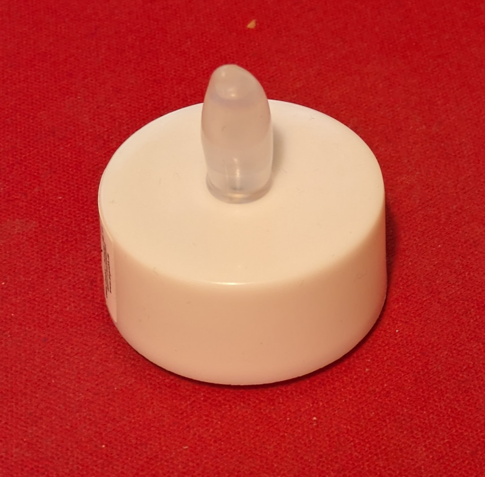
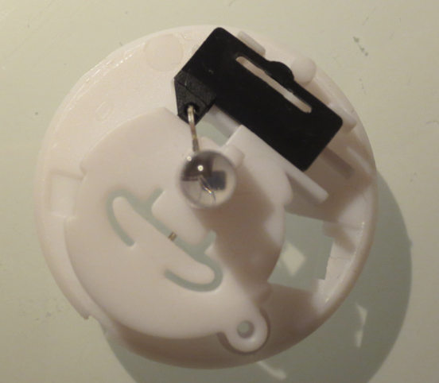
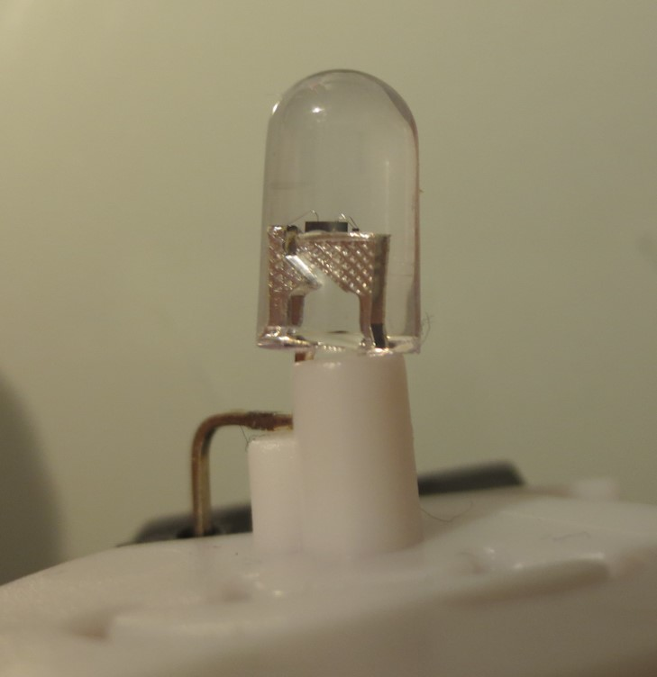
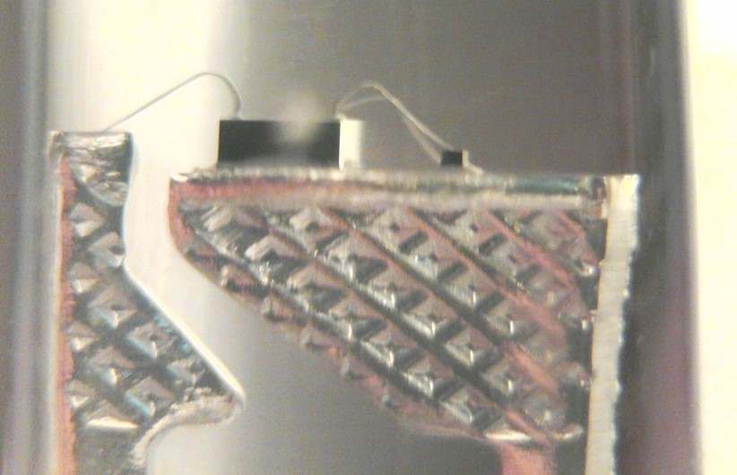
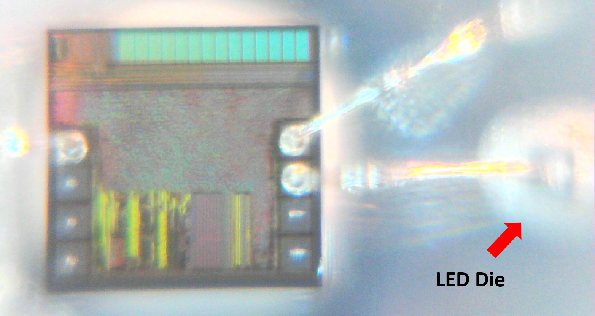
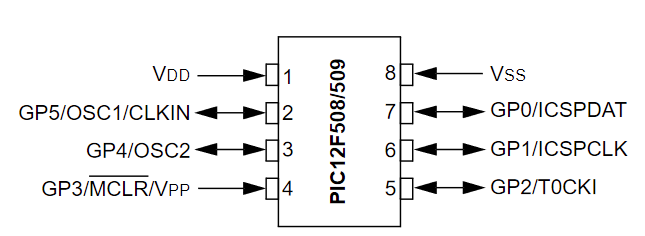
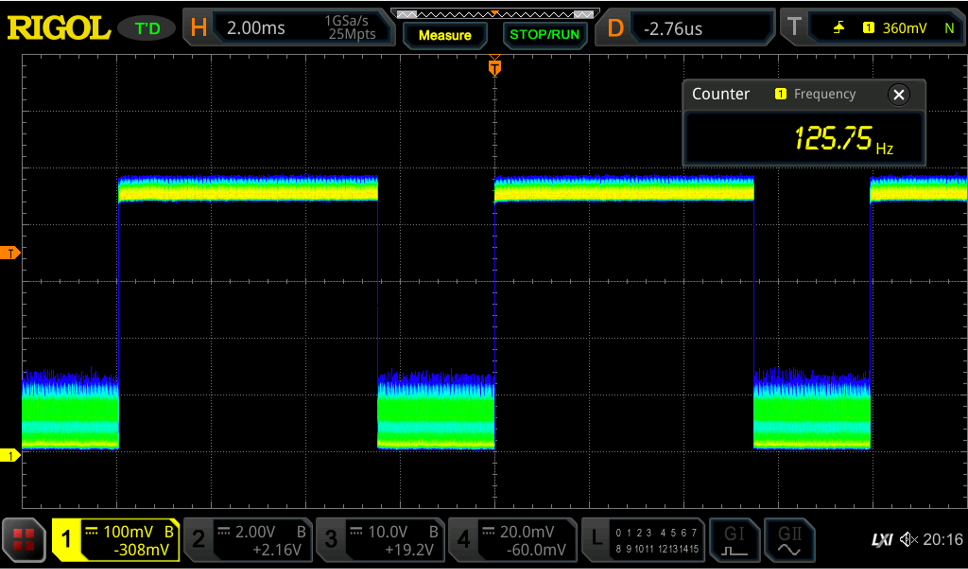
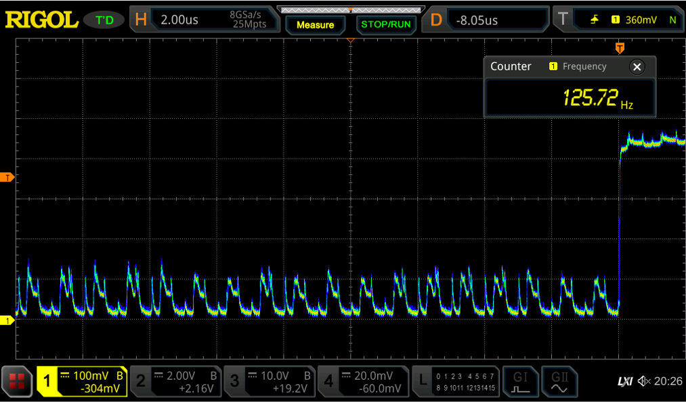
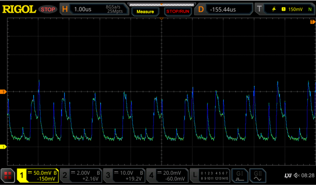

Years ago I spent some time [analyzing Candle-Flicker LEDs](/2013/12/08/hacking-a-candleflicker-led/) that contain an integrated circuit to mimic the flickering nature of real candles. Artificial candles have evolved quite a bit since then, now including magnetically actuated “flames”, an even better candle-emulation. However, at the low end, there are still simple candles with candle-flicker LEDs to emulate tea-lights.

I was recently [tipped off](https://www.mikrocontroller.net/topic/482929) to an upgraded variant that includes a timer that turns off the candle after it was active for 6h and turns it on again 18h later. E.g. when you turn it on at 7 pm on one day, it would stay active till 1 am and deactive itself until 7 pm on the next day. Seems quite useful, actually. The question is, how is it implemented? I bought a couple of these tea lights and took a closer look.

Nothing special on the outside. This is a typical LED tea light with CR2023 battery and a switch.





On the inside there is not much – a single 5mm LED and a black plastic part for the switch. Amazingly, the switch does now only move one of the LED legs so that it touches the battery. No additional metal parts required beyond the LED. As prevously, there is an IC integrated together with a small LED die in the LED package.

Looking top down through the lens with a microscope we can see the dies from the top. What is curious about the IC is that it rather large, has plenty of unused pads (3 out of 8 used) and seems to have relatively small structures. There are rectangular regular areas that look like memory, there is a large area in the center with small random looking structure, looking like synthesized logic and some part that look like hand-crafted analog. Could this be a microcontroller?

Interestingly, also the positions of the used pads look quite familiar.

The pad-positions correspond exactly to that of the PIC12F508/9, VDD/VSS are bonded for the power supply and GP0 connects to the LED. This pinout has been adopted by the ubiqitous [low-cost 8bit OTP controller](/2019/08/12/the-terrible-3-cent-mcu/)s that can be found in every cheap piece of chinese electronics nowadays.

Quite curious, so it appears that instead of designing another ASIC with candle flicker functionality and accurate 24h timer they simply used an OTP microcontroller and molded that into the LED. I am fairly certain that this is not an original microchip controller, but it likely is one of many PIC derivatives that cost around a cent per die.

## Electrical characterization





For some quick electrical characterization is connected the LED in series with a 220 Ohm resistor to measure the current transients. This allows for some insight into the internal operation. We can see that the LED is driven in PWM mode with a frequency of around 125Hz. (left picture)

When synchronizing to the rising edge of the PWM signal we can see the current transients caused by the logic on the IC. Whenever a logic gate switches it will cause a small increase in current. We can see that similar patterns repeat at an interval of 1 µs. This suggests that the main clock of the MCU is 1 MHz. Each cycle looks slightly different, which is indicative of a program with varying instruction being executed.

## Sleep mode

To gain more insights, I measured that LED after it was on for more than 6h and had entered sleep mode. Naturally, the PWM signal from the LED disappeared, but the current transients from the MCU remained the same, suggesting that it still operates at 1 MHz.

Integrating over the waveform allows to calculate the average current consumption. The average voltage was 53mV and thus the average current is 53mV/220Ohn=240µA.

## Can we improve on this?

This is a rather high current consumption. Employing a MCU with sleep mode would allow to bring this down significiantly. For example the [PFS154 allows](/2021/02/07/ultra-low-power-led-flasher/) for around 1µA idle current, the [ATtiny402 even](https://www.microchip.com/en-us/product/attiny402) a bit less.

Given a current consumption of 240µA, a CR2032 with a capacity of 220mAh would last around 220/0.240 = 915h or 38 days.

However, during the 6h it is active a current of several mA will be drawn from the battery. Assuming an average current of 2 mA, the battery woudl theoretically last 220mAh/3mA=73h. In reality, this high current draw [will reduce its capacity significantly](https://www.dmcinfo.com/Portals/0/Blog%20Files/High%20pulse%20drain%20impact%20on%20CR2032%20coin%20cell%20battery%20capacity.pdf). Assuming 150mAh usable capacity of a low cost battery, we end up with around 50h of active operating time.

Now lets assume we can reduce the idle current consumption from 240µA to 2µA (18h of off time per day), while the active current consumption stays the same (mA for 6h):

a\) Daily battery draw of current MCU: 6h\*2mA + 18h\*240µA = 16.3mAh  
b) Optimzed MCU: 6h\*2mA + 18h\*2µA = 12mAh

Implementing a proper power down mode would therefore allows extending the operating life from 9.2 days to 12.5 days – quite a significant improvement. The main lever is the active consumption, though.

## Summary

In the year 2023, it appears that investing development costs in a candle-flicker ASIC is no longer the most economical option. Instead, ultra-inexpensive 8-bit OTP microcontrollers seem to be taking over low-cost electronics everywhere.

Is it possible to improve on this candle-LED implementation? It seems so, but this may be for another project.
