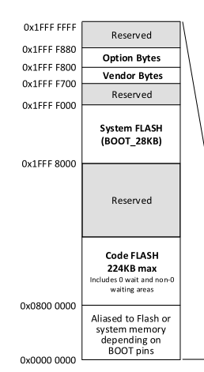
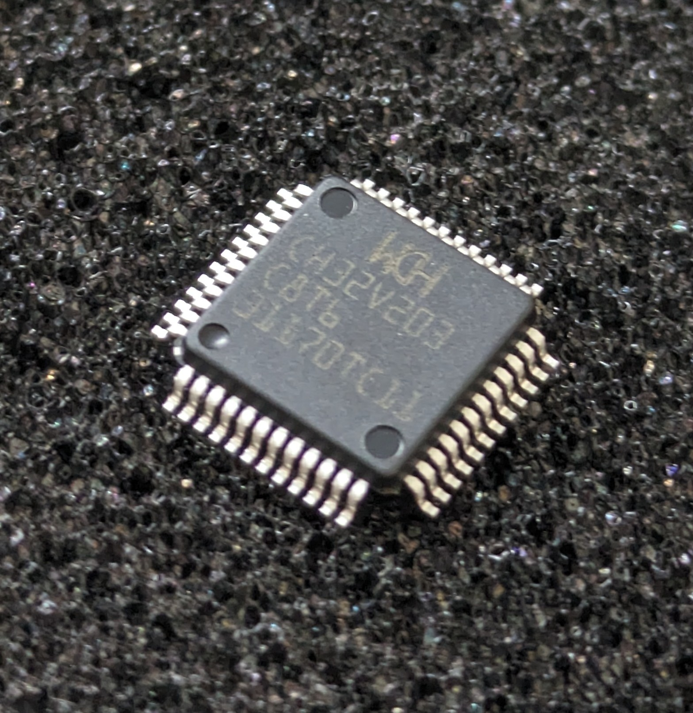
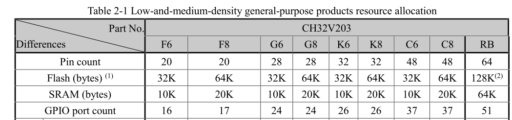
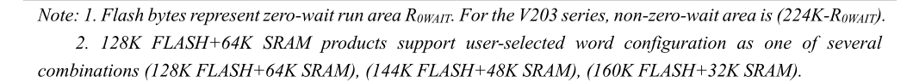
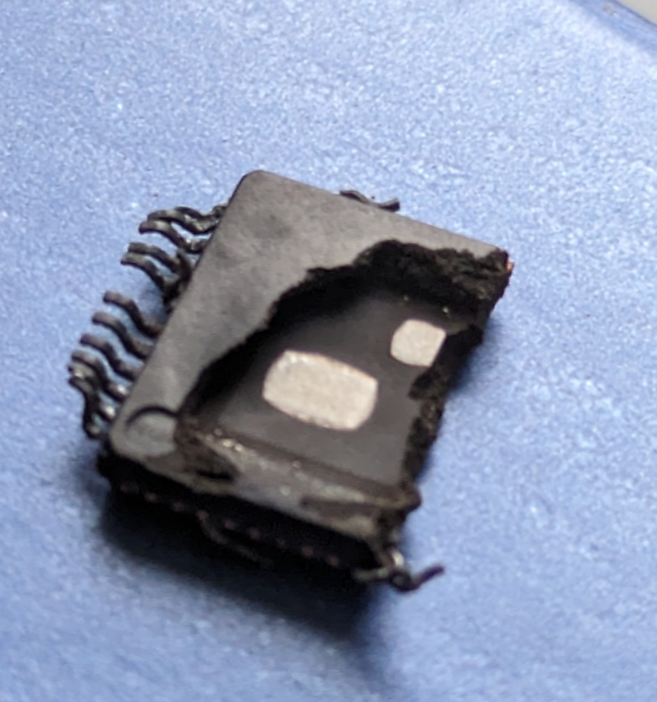
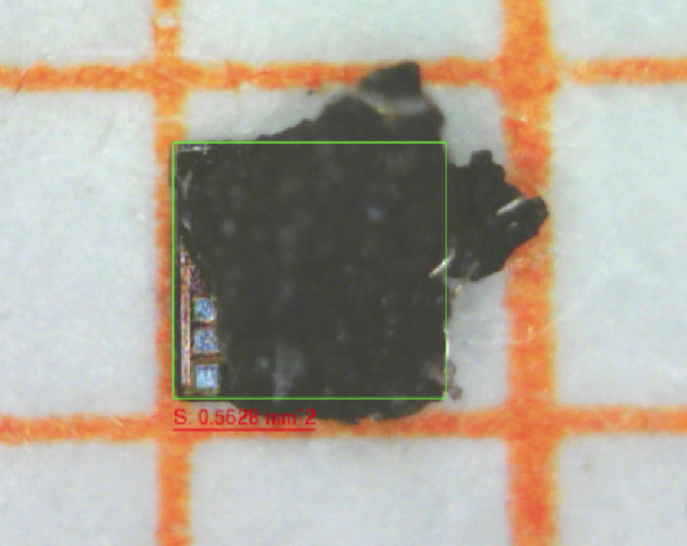
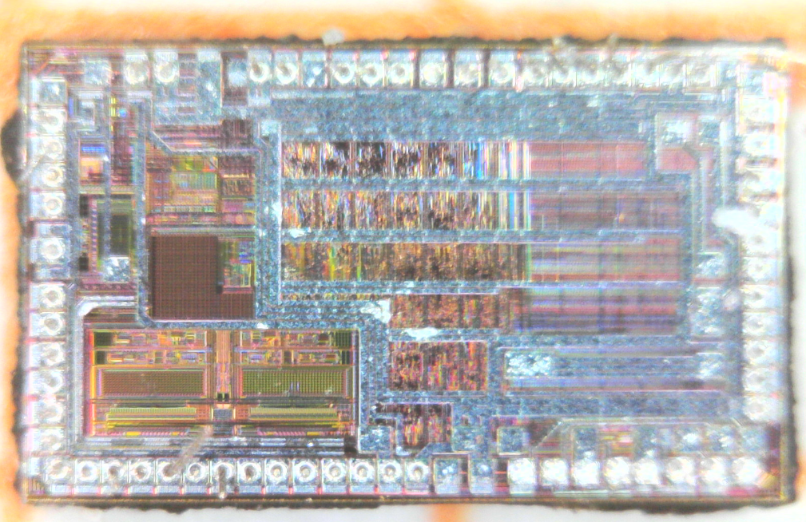
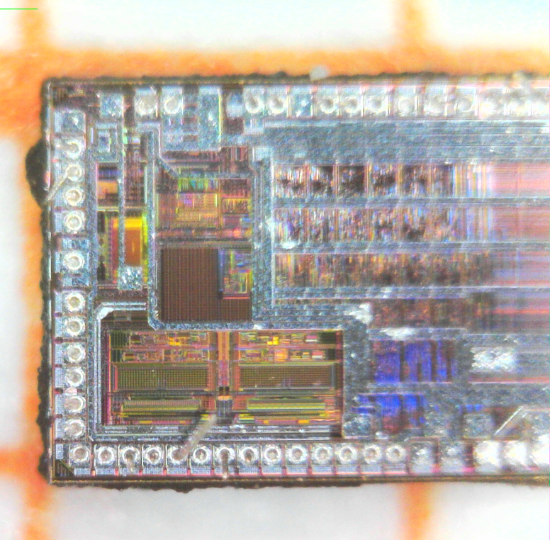
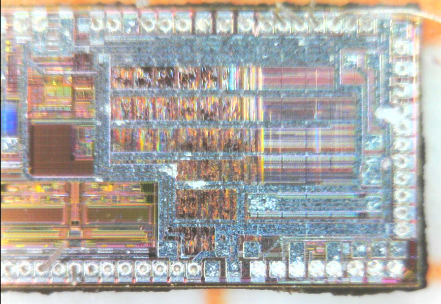
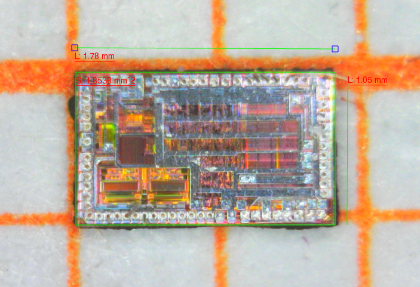

The CH32V203 is a 32bit RISC-V microcontroller. In the produt portfolio of WCH it is the next step up from the CH32V003, sporting a much higher clock rate of 144 MHz and a more powerful RISC-V core with RV32IMAC instruction set architecture. The CH32V203 is also extremely affordable, starting at around 0.40 USD (>100 bracket), depending on configuration.

An interesting remark on [twitter](https://twitter.com/bc12edd8ae23b21/status/1785087637306610059?t=ZJlTBE-r9VbZi8o374qEpw&s=19) piqued my interest: Supposedly the listed flash memory size only refers to a fraction that can be accessed with zero waitstate, while the total flash size is even 224kb. The datasheet indeed has a footnote claiming the same. In addition, the RB variant offers the option to reconfigure between RAM and flash, which is rather odd, considering that writing to flash is usually much slower than to RAM.


  
  



  


  


Then the 224kb number is mentioned in the memory map. Besides the code flash, there is also a 28Kb boot section and additional configurable space. 224 kbyte +28 kbyte+4=256kbyte, which suggests that the total available flash is 256 kbyte and is remapped to different locations of the memory.

All of these are red flags for an architecture where a separate NOR flash die is used to store the code and the main CPU core has a small SRAM that is used as a cache. This configuration was pioneered by Gigadevice and is also famously used by the ESP32 and RP2040 more recently, although that latter two use an external NOR flash device.

Flash memory is quite different from normal CMOS devices as it requires a special gate stack, isolation and much higher voltages. Therefore, integrating flash memory into a CMOS logic die usually requires extra process steps. The added complexity increases when going to smaller technologies nodes. Separating both dies offers the option of using a high density logic process (for example 45 nm) and pairing it with a low-cost off-the-shell NOR flash die.

## Decapsulation and Die Images

To confirm my suspicions I decapsulated a CH32V203C8T6 sample, shown above. I heated the package to drive out the resin and then carefully broke the, now brittle, package apart. Already after removing the lead frame, we can cleary see that it contains two dies.


  


The small die is around 0.5mm² in area. I wasn't able to completely removed the remaining filler, but we can see that it is an IC with a smaller number of pads, fitting to a serial flash die.


  


The microcontroller die came out really well. Unfortunately, the photos below are severely limited by my low-cost USB microscope. I hope Zeptobars or others will come up with nicer images at some point.


  
  
  
  


The die size of ~1.8 mm² is surprisingly small. In fact it is even smaller than the die of the CH32V003 with a die size of ~2.0 mm² according to [Zeptobars](https://zeptobars.com/en/read/wch-ch32v003-risc-v-riscv-microcontroller-10-cent) die shot. Apart from the fact that the flash was moved off-chip, most likely also a much smaller CMOS technology node was used for the CH32V203 than for the V003.

## Summary

It was quite surprising to find a two-die configuration in such a low-cost device. But obviously, it explains the oddities in the device specification, and it also explains why 144 MHz core clock is possible in this device without wait-states.

What are the repercussions?

Amazingly, it seems that, instead of only 32kb of flash, as listed for the smallest device, a total of 224kb can be used for code and data storage. The datasheet mentions a special "flash enhanced read mode" that can apparently be used to execute code from the extended flash space. It's not entirely clear what the impact on speed is, though, but that's certainly an area for exploration.

I also expect this MCU to be highly overclockable, similar to the RP2040.
