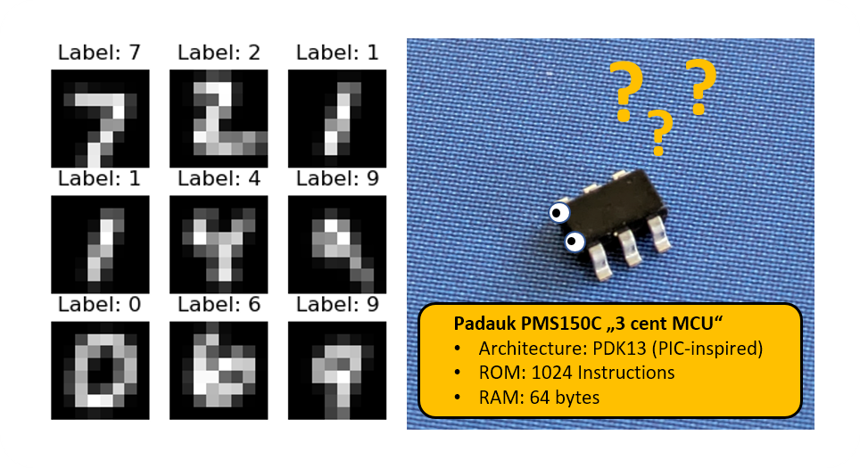
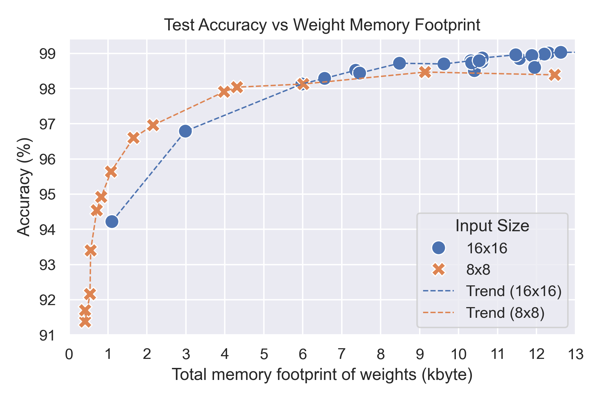
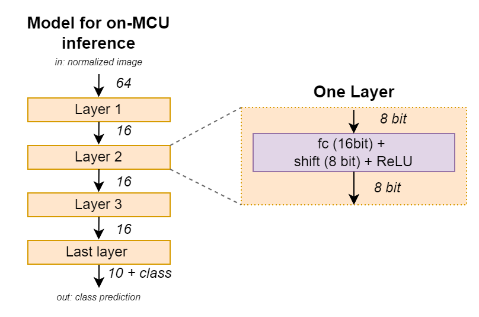
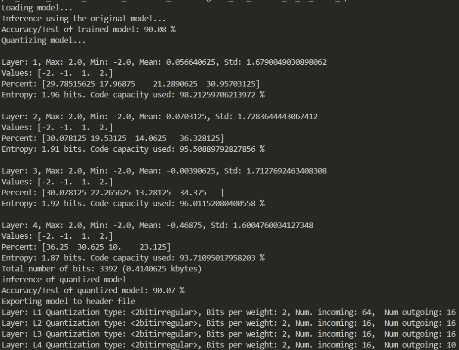
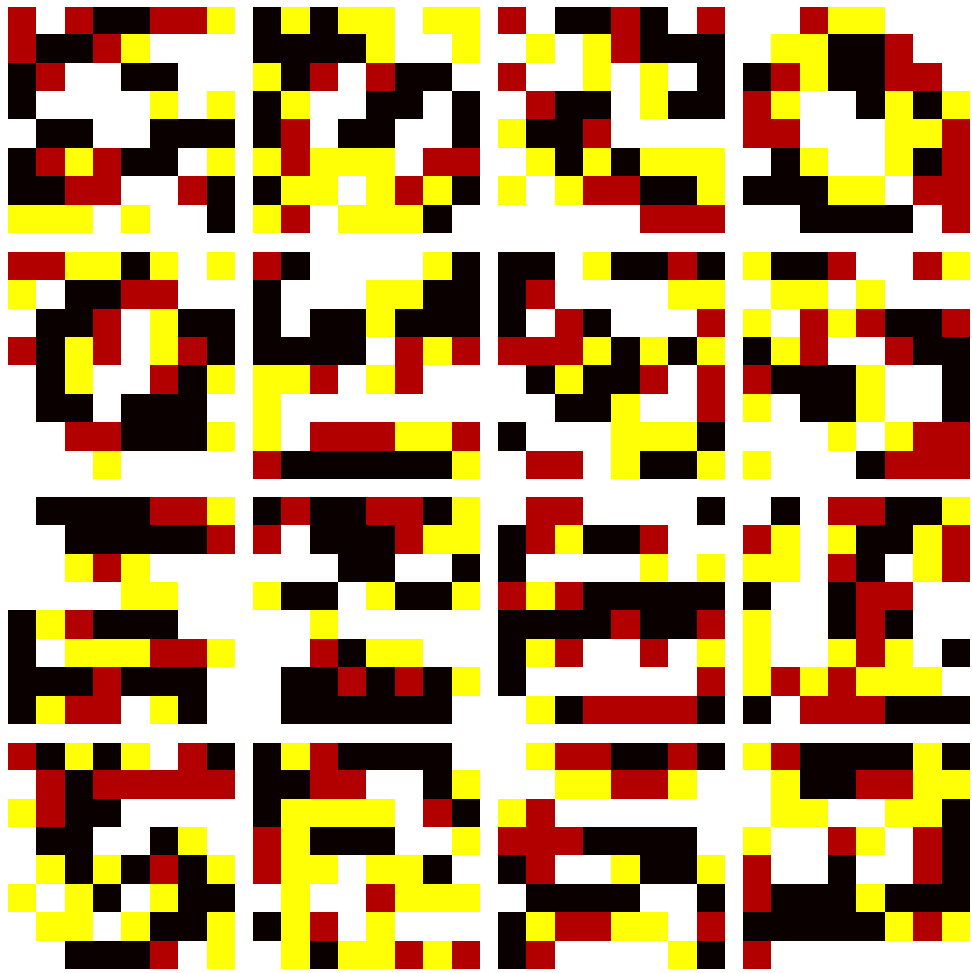
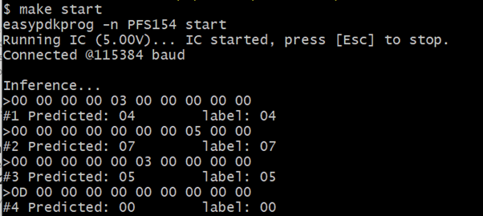
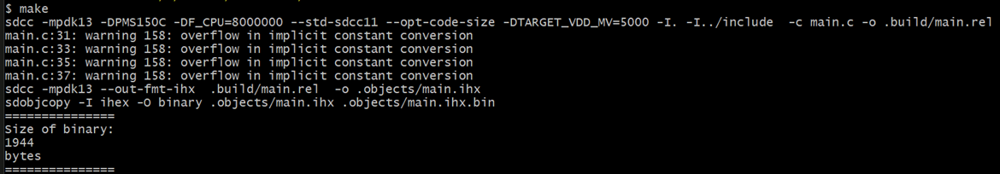

Bouyed by the surprisingly good performance of neural networks with quantization aware training [on the CH32V003](/2024/04/24/implementing-neural-networks-on-the-10-cent-risc-v-mcu-without-multiplier/), I wondered how far this can be pushed. How much can we compress a neural network while still achieving good test accuracy on the MNIST dataset? When it comes to absolutely low-end microcontrollers, there is hardly a more compelling target than the [Padauk 8-bit microcontrollers](/2019/08/12/the-terrible-3-cent-mcu/). These are microcontrollers optimized for the simplest and lowest cost applications there are. The smallest device of the portfolio, the PMS150C, sports 1024 13-bit word one-time-programmable memory and 64 bytes of ram, more than an order of magnitude smaller than the CH32V003. In addition, it has a proprieteray accumulator based 8-bit architecture, as opposed to a much more powerful RISC-V instruction set.



Is it possible to implement an MNIST inference engine, which can classify handwritten numbers, also on a PMS150C?

On the CH32V003 I used MNIST samples that were downscaled from 28x28 to 16x16, so that every sample take 256 bytes of storage. This is quite acceptable if there is 16kb of flash available, but with only 1 kword of rom, this is too much. Therefore I started with downscaling the dataset to 8x8 pixels.



The image above shows a few samples from the dataset at both resolutions. At 16x16 it is still easy to discriminate different numbers. At 8x8 it is still possible to guess most numbers, but a lot of information is lost.

Suprisingly, it is still possible to train a machine learning model to recognize even these very low resolution numbers with impressive accuracy. It's important to remember that the test dataset contains 10000 images that the model does not see during training. The only way for a very small model to recognize these images accurate is to identify common patterns, the model capacity is too limited to "remember" complete digits. I trained a number of different network combinations to understand the trade-off between network memory footprint and achievable accuracy.

## Parameter Exploration

  

The plot above shows the result of my hyperparameter exploration experiments, comparing models with different configurations of weights and quantization levels from 1 to 4 bit for input images of 8x8 and 16x16. The smallest models had to be trained without data augmentation, as they would not converge otherwise.

Again, there is a clear relationship between test accuracy and the memory footprint of the network. Increasing the memory footprint improves accuracy up to a certain point. For 16x16, around 99% accuracy can be achieved at the upper end, while around 98.5% is achieved for 8x8 test samples. This is still quite impressive, considering the significant loss of information for 8x8.

For small models, 8x8 achieves better accuracy than 16x16. The reason for this is that the size of the first layer dominates in small models, and this size is reduced by a factor of 4 for 8x8 inputs.

Surprisingly, it is possible to achieve over 90% test accuracy even on models as small as half a kilobyte. This means that it would fit into the code memory of the microcontroller! Now that the general feasibility has been established, I needed to tweak things further to accommodate the limitations of the MCU.

## Training the Target Model

Since the RAM is limited to 64 bytes, the model structure had to use a minimum number of latent parameters during inference. I found that it was possible to use layers as narrow as 16. This reduces the buffer size during inference to only 32 bytes, 16 bytes each for one input buffer and one output buffer, leaving 32 bytes for other variables. The 8x8 input pattern is directly read from the ROM.

Furthermore, I used 2-bit weights with irregular spacing of (-2, -1, 1, 2) to allow for a simplified implementation of the inference code. I also skipped layer normalization and instead used a constant shift to rescale activations. These changes slightly reduced accuracy. The resulting model structure is shown below.



All things considered, I ended up with a model with 90.07% accuracy and a total of 3392 bits (0.414 kilobytes) in 1696 weights, as shown in the log below. The panel on the right displays the first layer weights of the trained model, which directly mask features in the test images. In contrast to the higher accuracy models, each channel seems to combine many features at once, and no discernible patterns can be seen.

<div class="flex items-start gap-4">
  <figure class="flex-shrink-0">
    
    <figcaption class="text-sm text-center mt-2">Model training results and statistics</figcaption>
  </figure>
  <figure class="flex-shrink-0">
    
    <figcaption class="text-sm text-center mt-2">First layer weight visualization</figcaption>
  </figure>
</div>

## Implementation on the Microntroller

In the first iteration, I used a slightly larger variant of the Padauk Microcontrollers, the PFS154. This device has twice the ROM and RAM and can be reflashed, which tremendously simplifies software development. The C versions of the inference code, including the debug output, worked almost out of the box. Below, you can see the predictions and labels, including the last layer output.

  

Squeezing everything down to fit into the smaller PMS150C was a different matter. One major issue when programming these devices in C is that every function call consumes RAM for the return stack and function parameters. This is unavoidable because the architecture has only a single register (the accumulator), so all other operations must occur in RAM.

To solve this, I flattened the inference code and implemented the inner loop in assembly to optimize variable usage. The inner loop for memory-to-memory inference of one layer is shown below. The two-bit weight is multiplied with a four-bit activation in the accumulator and then added to a 16-bit register. The multiplication requires only four instructions (t0sn, sl,t0sn,neg), thanks to the powerful bit manipulation instructions of the architecture. The sign-extending addition (add, addc, sl, subc) also consists of four instructions, demonstrating the limitations of 8-bit architectures.


```c
void fc_innerloop_mem(uint8_t loops) {

    sum = 0;
    do  {
       weightChunk = *weightidx++;
__asm   
    idxm  a, _activations_idx
    inc _activations_idx+0

    t0sn _weightChunk, #6
    sl     a            ;    if (weightChunk & 0x40) in = in+in;
    t0sn _weightChunk, #7
    neg    a           ;     if (weightChunk & 0x80) in =-in;                    

    add    _sum+0,a
    addc   _sum+1
    sl     a 
    subc   _sum+1  

  ... 3x more ...

__endasm;
    } while (--loops);

    int8_t sum8 = ((uint16_t)sum)>>3; // Normalization
    sum8 = sum8 < 0 ? 0 : sum8; // ReLU*output++ = sum8;
}
```


In the end, I managed to fit the entire inference code into 1 kilowords of memory and reduced sram usage to 59 bytes, as seen below. (Note that the output from SDCC is assuming 2 bytes per instruction word, while it is only 13 bits).

  

Success! Unfortunately, there was no rom space left for the soft UART to output debug information. However, based on the verificaiton on PFS154, I trust that the code works, and since I don't have any specific application in mind, I left it at that stage.

## Summary

It is indeed possible to implement MNIST inference with good accuracy using one of the cheapest and simplest microcontrollers on the market. A lot of memory footprint and processing overhead is usually spent on implementing flexible inference engines, that can accomodate a wide range of operators and model structures. Cutting this overhead away and reducing the functionality to its core allows for astonishing simplification at this very low end.

This hack demonstrates that there truly is no fundamental lower limit to applying machine learning and edge inference. However, the feasibility of implementing useful applications at this level is somewhat doubtful.

You can find the [project repository here.](https://github.com/cpldcpu/BitNetPDK)
