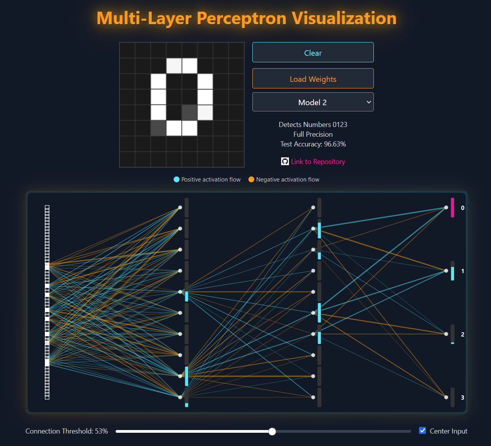

Going along with implementing [a very size optimized neural network on a 3 cent microcontroller](/2024/05/02/machine-learning-mnist-inference-on-the-3-cent-microcontroller/) I created an interactive simulation of a similar network.

You can draw figures on a 8x8 pixel grid and view how the activations propagate through the multi-layer perception network to classify the image into 4 or 10 different numbers. You can find the [visualizer online here](/neural-network-visualizer/).

Amazingly, the accuracy is still quite acceptable, even though this network (2 hidden layers with 10 neurons) is even simpler than the one implemented in the 3 cent MCU (3 hidden layers with 16 neurons). One change that led to significant improvements was to use layernorm, which normalizes mean and stddev, instead of RMSnorm, which only normalizes the stddeviation.

Source for React app and training code can be found [here](https://github.com/cpldcpu/neural-network-visualizer). This program was almost exclusively created by prompting with 3.5-Sonnet in the Claude interface and GH Copilot.
