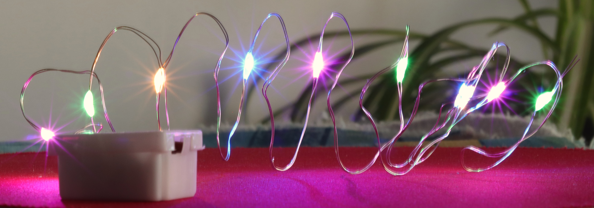
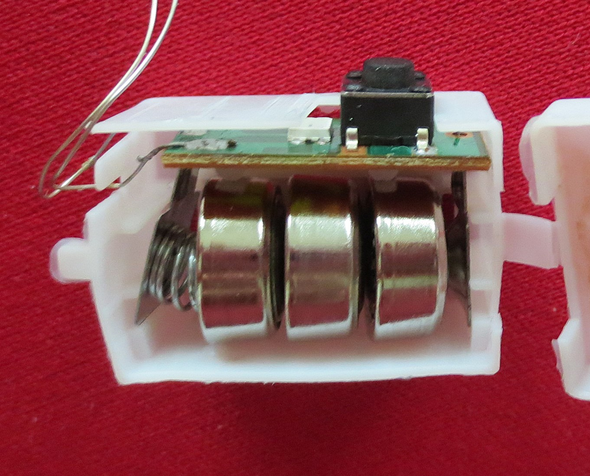
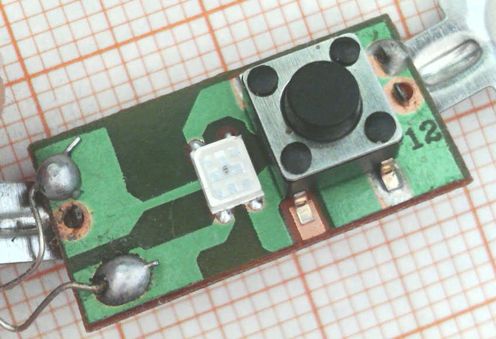
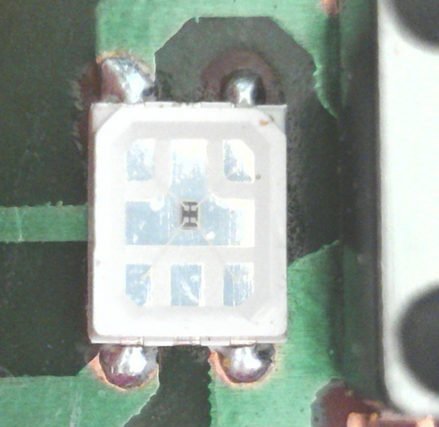
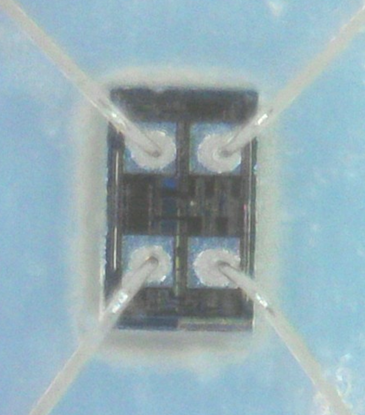
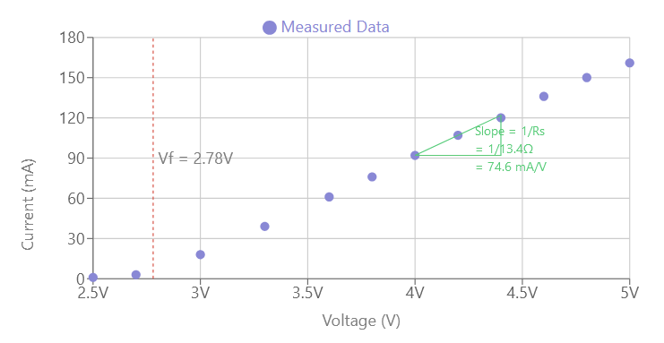
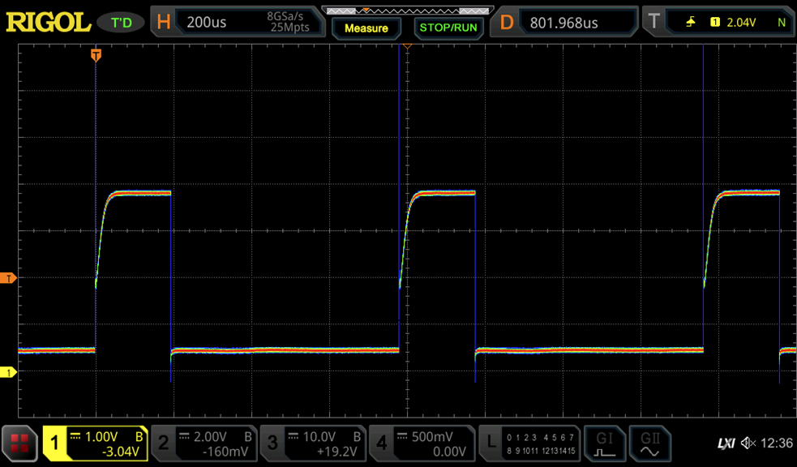
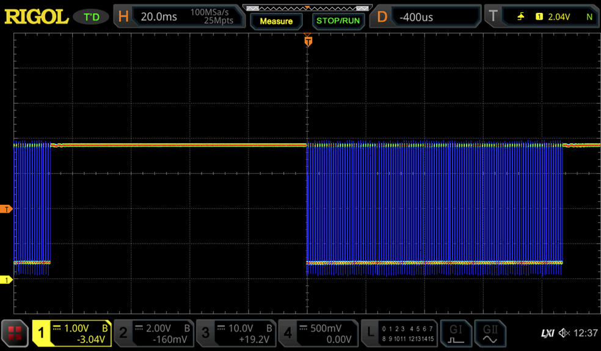

LED-based festive decorations are a fascinating subject for exploration of ingenuity in low-cost electronics. New products appear every year and often [very surprising technology approaches](/2022/01/23/controlling-rgb-leds-with-only-the-powerlines-anatomy-of-a-christmas-light-string/) are used to achieve some differentiation while adding minimal cost.

This year, there wasn't any fancy new controller, but I was surprised how much the cost of simple light strings was reduced. The LED string above includes a small box with batteries and came in a set of ten for less than \$2 shipped, so \<\$0.20 each. While I may have benefitted from promotional pricing, it is also clear that quite some work went into making the product cheap.

The string is constructed in the same way as [one I had analyzed earlier](/2022/01/29/analyzing-another-multicolor-string-light-with-unusual-leds/): it uses phosphor-converted blue LEDs that are soldered to two insulated wires and covered with an epoxy blob. In contrast to the earlier device, they seem to have switched from copper wire to cheaper steel wires.

The interesting part is in the control box. It comes with three button cells, a small PCB, and a tactile button that turns the string on and cycles through different modes of flashing and and constant light.


  
  


Curiously, there is nothing on the PCB except the button and a device that looks like an LED. Also, note how some "redundant" joints have simply been left unsoldered.

Closer inspection reveals that the "LED" is actually a very small integrated circuit packaged in an LED package. The four pins are connected to the push button, the cathode of the LED string, and the power supply pins. I didn't measure the die size exactly, but I estimate that it is smaller than 0.3×0.2 mm² = ~0.1 mm².


  
  


What is the purpose of packaging an IC in an LED package? Most likely, the company that made the light string is also packaging their own LEDs, and they saved costs by also packaging the IC themselves-in a package type they had available.

I characterized the current-voltage behavior of IC supply pins with the LED string connected. The LED string started to emit light at around 2.7V, which is consistent with the forward voltage of blue LEDs. The current increased proportionally to the voltage, which suggests that there is no current limit or constant current sink in the IC - it's simply a switch with some series resistance.


  
  


*Left: LED string in "constantly on" mode. Right: Flashing*

Using an oscilloscope, I found that the string is modulated with an on-off ratio of 3:1 at a frequency if ~1.2 kHz. The image above shows the voltage at the cathode, the anode is connected to the positive supply. This is most likely to limit the current.

All in all, it is rather surprising to see an ASIC being used when it barely does more than flashing the LED string. It would have been nice to see a constant current source to stabilize the light levels over the lifetime of the battery and maybe more interesting light effects. But I guess that would have increased the cost of the ASIC too much and then using an [ultra-low cost microcontroller may have been cheaper](/2024/01/14/revisiting-candle-flicker-leds-now-with-integrated-timer/). This almost calls for a transplant of a MCU into this device...
