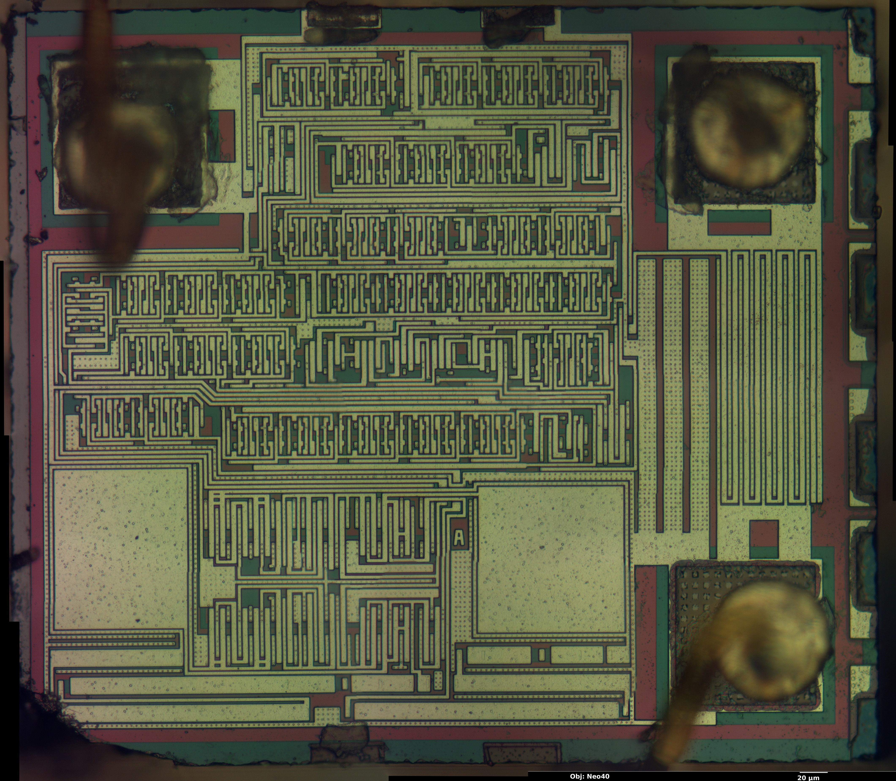
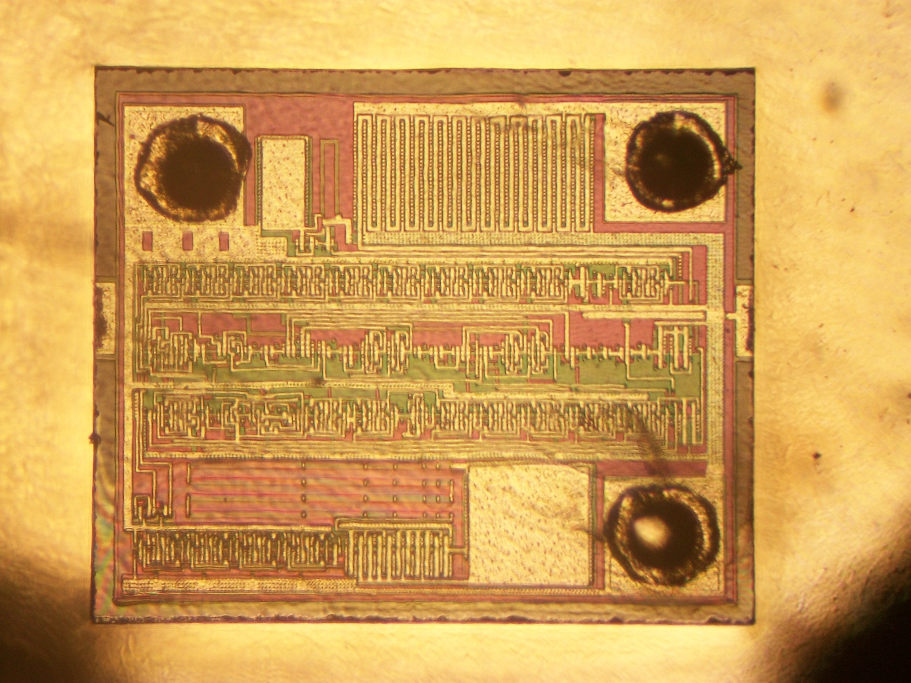

I [previously reported](/2013/12/08/hacking-a-candleflicker-led/) on reverse engineering a candle flicker LED. My approach was to extract the "flicker" pattern from the input current variation and to deduce the algorithm from statistical analysis.
## Reverse engineering the controller chip
Of course there is another, more involved, approach. And that is to reverse engineer the circuit directly from the die. Andrew Zonenberg from [Siliconpr0n](http://siliconpr0n.org) decapsulated and imaged the controller chip from one of my LEDs. You can find his report [here](http://siliconpr0n.org/archive/doku.php?id=azonenberg:unknown:candleflicker_led).
He managed to obtain very high-resolution optical microscopy images of the top-level metal. It turns out that the controller chip is manufactured in a relatively coarse CMOS process with one metal layer and 1-2 um resolution. This is 1980ies technology. But of course, that is all that is needed for a circuit as simple as a flicker-LED.

An initial survey reveals that there are two RC-oscillators. The two large rectangles in the lower part are the capacitors. The driving circuit is between the caps and the resistors are the stretched structures below the caps. One of these is probably a general clock generator, while the second one could be a part of a hardware random number generator. It is also obvious that there is no counter or shift register longer than 5-bit. This does indeed seem to confirm that no LFSR is used for the random number generator. This was already suggested by the statistical analysis.
Reverse engineering the exact circuit is a more involved effort, which yet needs to be done. Are you up to the challenge?
## Another Candle Flicker-LED
It turns out there is more than one flicker-LED-controller-chip. [Natecaine](http://natecaine.wordpress.com/) [commented](http://hackaday.com/2013/12/16/reverse-engineering-a-candle-flicker-led/comment-page-1/#comment-1138473) on the [original story on Hack-a-Day](http://hackaday.com/2013/12/16/reverse-engineering-a-candle-flicker-led/) and followed up with a micrograph of the controller chip of one of his LEDs. This is a much simpler controller, as shown below. Nothing is known about the flicker-pattern so far. This controller only uses a single RC-oscillator (bottom) and several counter or shift-registers and is probably LFSR based.

## Home-brewing a Candle Flicker LED using the tiniest MCU
In other news, [picatout](http://picatout-jd.blogspot.ca/)took the code I reverse engineered from the original LED and used it to create his own Candle-flicker-LEDs by embedding a [PIC10F200 into a normal LED [french]](http://picatout-jd.blogspot.ca/2013/12/led-scintillante.html). That's a pretty cool hack in my opinion. Of course it would also work with an ATtiny 4/5/9/10.
