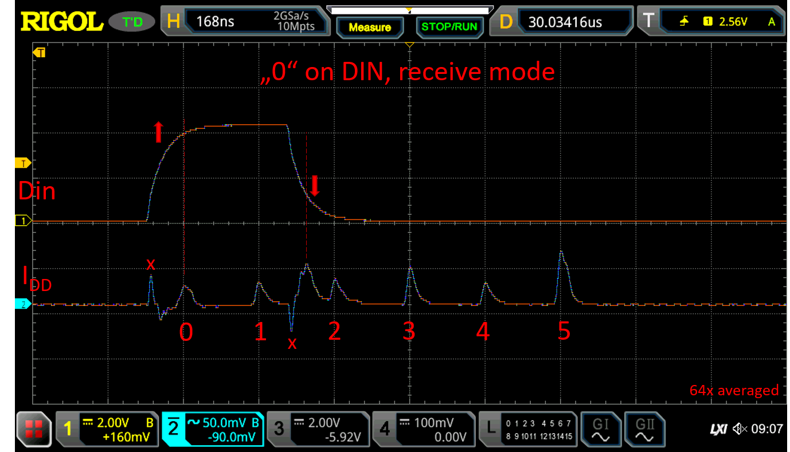

[Power analysis](https://en.wikipedia.org/wiki/Power_analysis) is a technique to probe the inner workings of an integrated circuit by measuring changes in the supply current. Whenever a logic gate switches, it will cause a tiny current spike that can be measured externally. By inspecting the temporal variation, especially in reaction to an external signal, it is often possible to deduce information about the construction of the IC.

[A few years ago](/2014/01/14/light_ws2812-library-v2-0-part-i-understanding-the-ws2812/) I used a logic analyzer to investigate the protocol of the, then new, WS2812 RGB LED. So, why not revisit this topic to test my newly acquired deep sampling oscilloscope?

You can see my setup in the photo above and the schematic diagram below. The WS2812S sits on the right breadboard. I used exactly the same device that I investigated previously. I used an ATMega168 to generate stimulus signals. The series resistor smooths the signal on Din (ch1) to reduce noise injection to the DUT from the MCU. Finally, the current consumption is measured with a 47 Ohm shunt resistor on the positive supply (ch2). The entire setup is surely far from ideal - bread board parasitics are no joke - but it worked well enough.

In addition to the WS2812S from 2014, I also looked at newer devices of the family, the WS2812C and WS2812D (5mm radial package).

The WS2812 consists of two primary functional units:  The communication interface and the PWM engine with LED driver. Both of these units are clocked completely independently and only communicate when a "reset" is issued to latch new data to the LED. I will look at both of these units separately in my analysis.

## The Communication Interface

The WS2812 receives and transmits data in a format where a logical "0" is encoded in a short pulse and a logical "1" in a long pulse. One way of looking at this protocol is by interpreting it as a "1N1" asynchronous serial protocol with one start bit and one data bit.

Decoding this protocol requires detecting the rising edge for the start condition and then sampling the "1" or "0" after 1.5 bit times. Depending on the state of the WS2812 (receiving or forwarding) it will regenerate the timing of the signal and reproduce it on the output.

This model of the WS2812 line encoding also makes clear that the only relevant timing parameter is the time between the rising edge of the data line ("Sync") and the sampling time. Unlike the data sheet states, it does not matter if the symbol are spaced further apart than 1.25 us, as long as the reset time is not exceeded, and it also does not matter if the timing for a "1" is increased. One important parameter not mentioned in the datasheet is the minimum spacing of the signals, which is the timing of a zero times 5/2.


<figure class="grid-w50">

<figcaption>Transmission of a zero</figcaption>
</figure>
<figure class="grid-w50">

<figcaption>Transmission of a one</figcaption>
</figure>


The scope images above show the input and output of the WS2812 during the transmission of a one and a zero. I intentionally extended the timing of the "1" to avoid obscuring power signatures with I/O transients. It can be seen that the output signal is delayed and the timing is changed to conform to a 1:2 ratio between "0" and "1".

I deduced that the behavior can by explained by a clocked state machine with 6 states in [my previous analysis](/2014/01/14/light_ws2812-library-v2-0-part-i-understanding-the-ws2812/). This is schematically shown above. Cycle 0 is invoked when the start condition is met (rising edge), cycle 3 is where the input is sampled. Since no jitter of input vs. output is observed, the state machine must be driven by a clock generator that is synchronized to the start condition.

Now, let's get to this power analysis thing. The scope picture above shows a power trace (ch2, Idd) acquired when triggering to a "0" on the data input. Here, some lower-tier signal processing magic is applied by averaging 64 measurements: Since all other current fluctations on the power supply (PWM oscillator, noise from power supply) are not correlated to the signal on data in, they are averaged out and disappear. The current changes that are a direct result of applying the input signal will add up and remain, resulting in a very clean signal, despite the presence of significant additional noise.

What do we see? First, there are two narrow spikes marked with **x** that seem to result from capacitive crosstalk from the data input to the supply. These are not caused by the WS2812 controller itself. We can see a spike caused by the switching of the input buffer, denoted with dashed lines. It appears that the input buffer has some hysteresis and/or delay to filter input noise, since it only reacts fairly late into the rising/falling edge.

Finally there are 6 evenly spaced signals denoted 0-5. These correspond exactly to the timing expected from my state machine model above and seem to confirm the earlier assumptions to be correct! Amazingly, even the timing (168ns) corresponds exactly to the timing extracted earlier (166ns). The spike at cycle 3 is slightly larger suggesting that more gates switch here. This could correspond to sampling and latching of the input signal. Likewise cycle 5 is much higher, which is where the input data may be stored into the shift register. It may be possible to clarify this with power and input signal glitching. Maybe later...

The clock generator for the state machine seems to be able to start and stop within nanoseconds. Most likely a delay/pulse generator of some sort is used here.

The power signature for receiving a "1" is quite similar to that of the "0". We can see that the spike related to the input buffer is shifted.

Finally, when a "0" is received and forwarded, we can see huge spikes in cycles 1 and 3, where the output driver is active. These also coincides with the earlier model.

So, in summary, the power analysis of the communication interface seems to confirm that it is indeed implemented exactly in the way suspected in my earlier analysis. The WS2812D and WS2812C behave identically, but with slightly different timing.

## The PWM Engine and LED Driver

Not let's turn out attention to the LED driver. The measurement above shows the result of sending a color setting different from (0,0,0) toaA WS2812D. I set the persistence to 0.5s so that many measurements are overlaid. We can see that the PWM starts to operate after a delay of approximately 125us. The PWM waveform is not synchronized to the data in any way, which means that the PWM is completely independent from the communication unit.

By triggering to the current signal instead of the data input, we can synchronize to the PWM itself. As shown above, the WS2812S has a PWM frame rate of 395.6 Hz. The voltage step across the 47 Ohm sensing resistor corresponds to 17 mA, which is close enough to the 20 mA nominal LED driving current (This may be influenced by the voltage drop across the sensing resistor).

Now, focussing on the region between the LED pulses, increasing voltage resolution and averaging many measuremts, we can get a clean signal from the PWM clock, which seems to have a ~50% duty cycle, as evident from the alternating shape of the pulses. A likely candidate for such an oscillator circuit would be a relaxation oscillator. What is surprising to me is that the current consumption increases by up to 150 uA when going towards the tripping point. This could be leakage from a schmitt trigger.

The clock in the WS2812S is 404.8 kHz, which is almost exactly 1024 times the  PWM frame rate. This is quite interesting as it suggests that the PWM actually has a resolution of 10 bits.

Similar results were obtained for the WS2812C and WS2812D. The PWM frequency was upgraded to 2 kHz in these newer devices. Accordingly, the PWM clock is now at 2.08 MHz.

Setting a single LED channel to the minimum value of 1 yields a PWM pulse time of 1.1 uS. This is actually only half of a clock cycle of the PWM clock, suggesting that the clock phase is being used to extend the PWM resolution to 11 bit. Rise and fall times are 41ns and 29 ns respectively.

Things get quite interesting for the newer chip revisions used in the WS2812C and WS2812D

For intensity settings of 1-2 we get no LED output, instead only a double peak is visible, which seems to mark the beginning of the PWM cycle. Starting from setting 3 we see the beginning of a current ramp while a steady state is reached at intensity setting 8. The transition from the slope to the steady state is marked by a strange spike.

This looks quite confusing. It appears that Worldsemi upgraded the LED driver from the WS2812S to the WS2812C/D to slow current transients. This would  help with power supply noise, something that surely is an issue with long chains of RGB-LEDs.

The rise time is now in the range of 0.6-1 us, depending on how you look at it. The fall time is 14 ns on the WS2812D and 7ns on the WS2812C, which is much steeper than on the WS2812S. The current ramp generator introduces a delay to the turn on, which means that the lowest intensity settings basically don't turn the LED on. The delay time and strange shape of the PWM signal would also introduce an offset error to the PWM value. All in all this looks a bit like a half-baked improvement.

#### Gamma Correction?

As discussed above, the actual PWM resolution of the WS2812 seems to be 11 bit, while the intensity setting is only 8 bit. The question is how the 8 bit intensity setting is mapped to the 11 bit PWM. A natural approach would be to perform [gamma correction](https://en.wikipedia.org/wiki/Gamma_correction) to map linear intensity setting to perceived brightness.

The plot above shows measured PWM duty cycles for different intensity settings across the 8 bit range of one channel in a log-log plot. With this kind of normalization, any gamma correction would appear as a straight line. The dotted lines show the linear relationship (gamma=1), which I expected, and a relationship for gamma=2.2, which is often used for computer monitors. The WS2812S seems to fall somewhere in between, rather close to the linear line. The WS2812D deviates for low counts due to the ramp offset issue.

It's not quite clear why this type of gamma correction was introduced and which exact relationship it follows. It would be helpful if this was explained in the datasheet, as it will have a significant ramafications for colour mixing behavior.

## Conclusions

In summary, I used power analysis to investigate different versions of the WS2812. This method was very useful to understand the inner workings of the WS2812. There were some more and less surprising findings:

- The communication protocol of the WS2812 is indeed implemented with an self-clocked state machine, as I already suspected from my first investigation.
- The PWM resolution of the WS2812 is actually 11 bit and there is some kind of gamma correction in place which was never mentioned in the datasheet (or anywhere else). This needs to be understood better to enable proper colour mixing.
- There was a slight upgrade of the driver IC from the orignal WS2812S, increasing the PWM framerate to 2 kHz and introducing a slow current ramp, possibly to improve EMC/EMI behavior. The specific way this feature is implemented in is a bit questionable.

To be fair, although I recently purchased the WS2182C/D, they possibility do not represent the latest version of the driver-IC, the [WS2812B-V5](http://www.world-semi.com/Certifications/details-141-4.html). I will try to get my hands on some.
