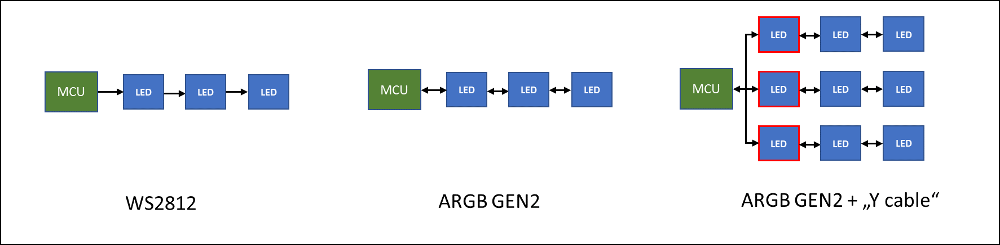

The WS2812 has been around for a decade and remains highly popular, alongside its numerous clones. The protocol and fundamental features of the device have only undergone minimal changes during that time.

However, during the last few years a new technology dubbed “Gen2 ARGB” emerged for use in RGB-Illumination for PC, which is backed by the biggest motherboard manufacturers in Taiwan. This extension to the WS2812 protocol allows connecting multiple strings in parallel to the same controller in addition to diagnostic read out of the LED string.

Not too much is known about the protocol and the supporting LED. However, recently some LEDs that support a subset of the Gen2 functionality became available as “SK6112”.

I finally got around summarizing the information I compiled during the last two years. You can find the full documentation on Github linked [here](https://github.com/cpldcpu/Gen2-Addressable-RGB/blob/main/docs/Gen2_ARGB_protocol_analysis.md).


  

