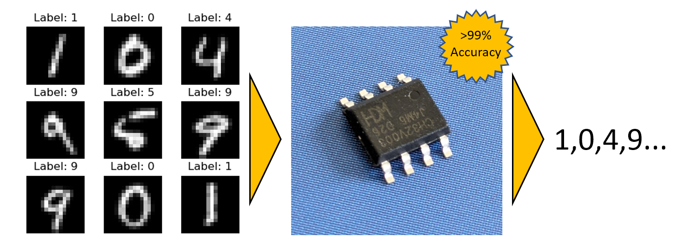
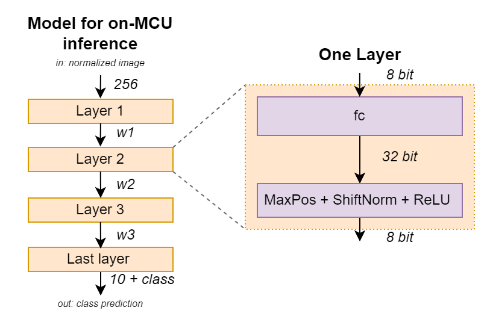
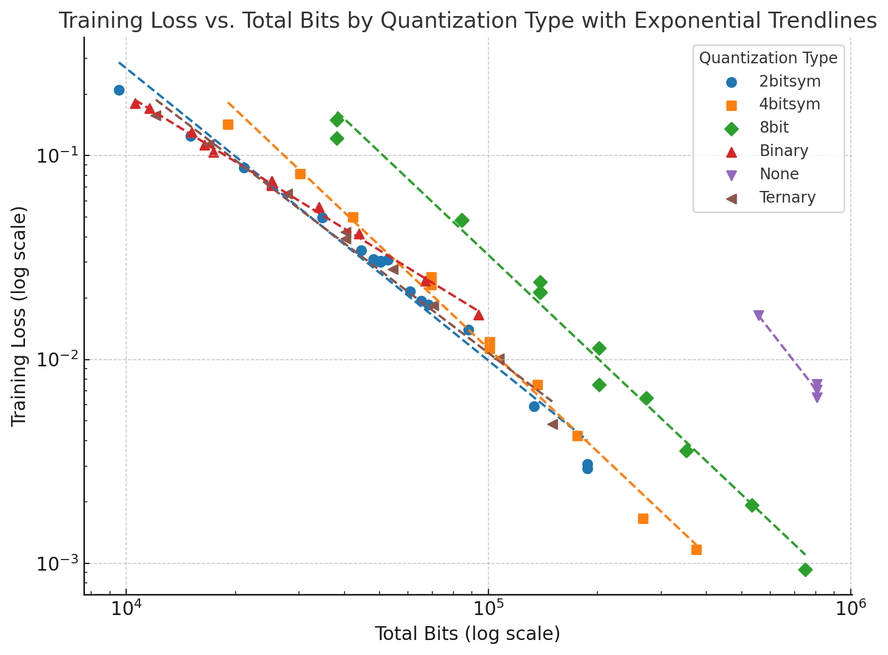
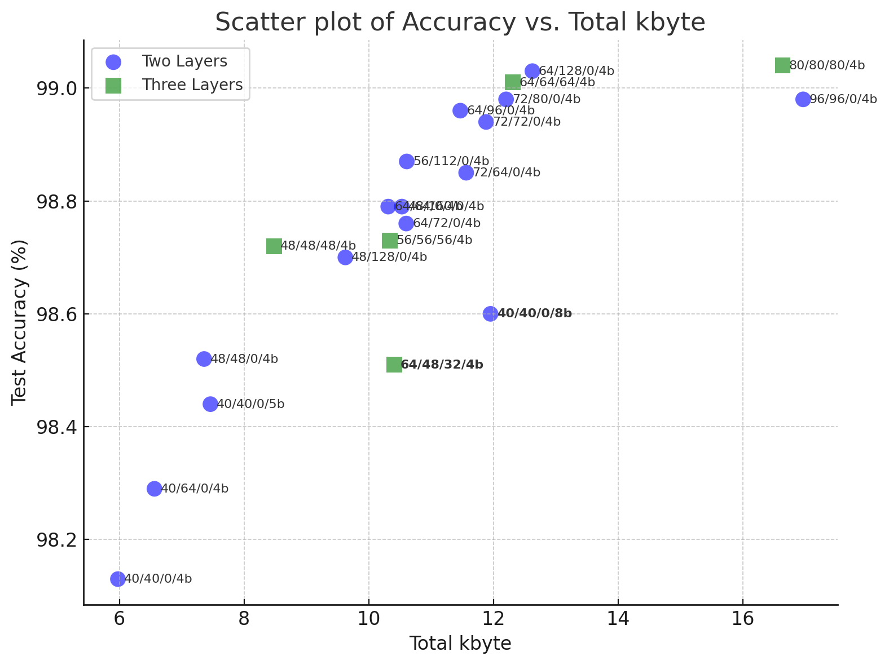
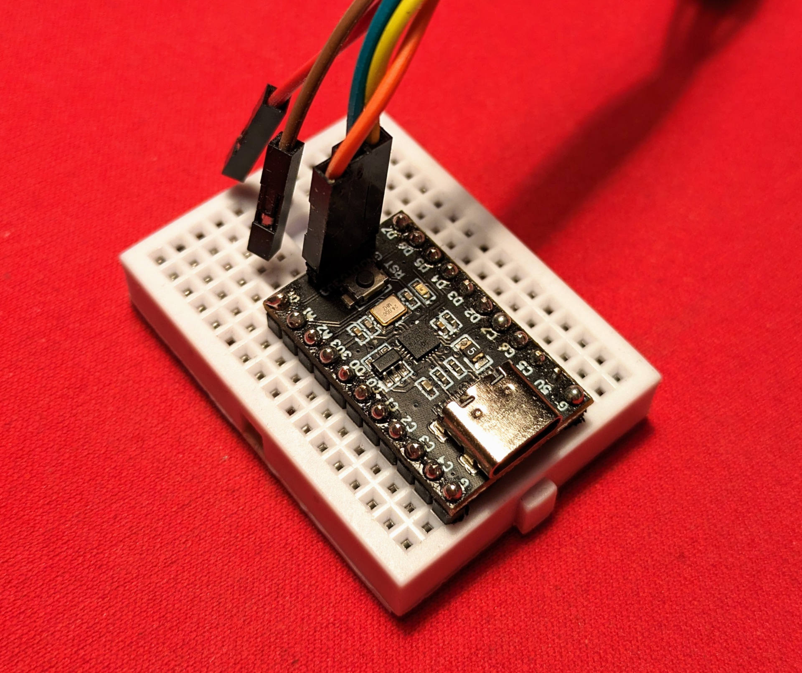
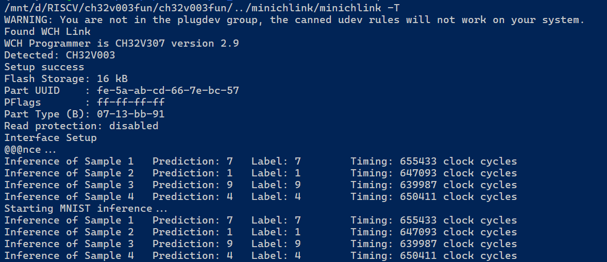

I have been meaning for a while to establish a setup to implement neural network based algorithms on smaller microcontrollers. After [reviewing existing solutions](https://hackaday.io/project/193478-generative-ai-on-a-microcontroller/log/225316-tiny-inference-engines-for-mcu-deployment), I felt there is no solution that I really felt comfortable with. One obvious issue is that often flexibility is traded for overhead. As always, for a really optimized solution you have to roll your own. So I did. You can find the project [here](https://github.com/cpldcpu/BitNetMCU) and a detailed writeup [here](https://github.com/cpldcpu/BitNetMCU/blob/main/docs/documentation.md).


  


It is always easier to work with a clear challenge: I picked the CH32V003 as my target platform. This is the smallest RISC-V microcontroller on the market right now, addressing a \$0.10 price point. It sports 2kb of SRAM and 16kb of flash. It is somewhat unique in implementing the RV32EC instruction set architecture, which does not even support multiplications. In other words, for many purposes this controller is less capable than an Arduino UNO.

As a test subject I chose the well-known MNIST dataset, which consists of images of hand written numbers which need to be classified from 0 to 9. Many inspiring implementation on Arduino exist for MNIST, for example [here](https://blog.arduino.cc/2021/05/19/recognizing-handwritten-mnist-digits-on-an-arduino-uno-using-lognnet/). In this case, the inference time was 7 seconds and 82% accuracy was achieved.

The idea is to train a neural network on a PC and optimize it for inference on teh CH32V003 while meetings these criteria:

1.  Be as fast and as accurate as possible
2.  Low SRAM footprint during inference to fit into 2kb sram
3.  Keep the weights of the neural network as small as possible
4.  No multiplications!

These criteria can be addressed by using a neural network with quantized weights, were each weight is represented with as few bits as possible. The best possible results are achieved when training the network already on quantized weights (Quantization Aware Training) as opposed to quantized a model that was trained with high accuracy weights. There is currently some [hype around using Binary and Ternary weights](https://arxiv.org/abs/2402.17764) for large language models. But indeed, we can also use these approaches to fit a neural network to a small microcontroller.

The benefit of only using a few bits to represent each weight is that the memory footprint is low and we do not need a real multiplication instruction – inference can be reduced to additions only.

## Model structure and optimization

For simplicity reasons, I decided to go for a e network architecture based on fully-connected layers instead of convolutional neural networks. The input images are reduced to a size of 16×16=256 pixels and are then fed into the network as shown below.


  


The implementation of the inference engine is straightforward since only fully connected layers are used. The code snippet below shows the innerloop, which implements multiplication of 4 bit weights by using adds and shifts. The weights use a one-complement encoding without zero, which helps with code efficiency. One bit, ternary, and 2 bit quantization was implemented in a similar way.

```c
    int32_t sum = 0;
    for (uint32_t k = 0; k < n_input; k+=8) {
        uint32_t weightChunk = *weightidx++;

        for (uint32_t j = 0; j < 8; j++) {
            int32_t in=*activations_idx++;
            int32_t tmpsum = (weightChunk & 0x80000000) ? -in : in; 
            sum += tmpsum;                                  // sign*in*1
            if (weightChunk & 0x40000000) sum += tmpsum<<3; // sign*in*8
            if (weightChunk & 0x20000000) sum += tmpsum<<2; // sign*in*4
            if (weightChunk & 0x10000000) sum += tmpsum<<1; // sign*in*2
            weightChunk <<= 4;
        }
    }
    output[i] = sum;
```

In addition the fc layers also normalization and ReLU operators are required. I found that it was possible to replace a more complex RMS normalization with simple shifts in the inference. Not a single full 32×32 multiplication is needed for the inference! Having this simple structure for inference means that we have to focus the effort on the training part.

I studied variations of the network with different numbers of bits and different sizes by varying the numer of hidden activiations. To my surprise I found that the accuracy of the prediction is proportional to the total number of bits used to store the weights. For example, when 2 bits are used for each weight, twice the numbers of weights are needed to achieve the same perforemnce as a 4 bit weight network. The plot below shows training loss vs. total number of bits. We can see that for 1-4 bits, we can basically trade more weights for less bits. This trade-off is less efficient for 8 bits and no quantization (fp32).


  


I further optimized the training by using data augmentation, a cosine schedule and more epochs. It seems that 4 bit weights offered the best trade off.


  


More than 99% accuracy was achieved for 12 kbyte model size. While it is possible to achiever better accuracy with much larger models, it is significantly more accurate than other on-MCU implementations of MNIST.

## Implementation on the Microcontroller


  


The model data is exported to a c-header file for inclusion into the inference code. I used the excellent [ch32v003fun environment](https://github.com/cnlohr/ch32v003fun), which allowed me to reduce overhead to be able to store 12kb of weights plus the inference engine in only 16kb of flash.


  


There was still enough free flash to include 4 sample images. The inference output is shown above. Execution time for one inference is 13.7 ms which would actually allow to model to process moving image input in real time.

Alternatively, I also tested a smaller model with 4512 2-bit parameters and only 1kb of flash memory footprintg. Despite its size, it still achieves a 94.22% test accuracy and it executes in only 1.88ms.

## Conclusions

This was quite a tedious projects, hunting many lost bits and rounding errors. I am quite pleased with the outcome as it shows that it is possible to compress neural networks very significantly with dedicated effort. I learned a lot and am planning to use the data pipeline for more interesting applications.
