<!-- # Glowing 3D Objects from LED Filaments -->



<!--  -->


<div style="display: flex; gap: 0rem; flex-wrap: wrap; justify-content: center; margin: 0.25rem 0;">
  
</div>

*Building wireframe polyhedra made from LED filaments, using graph theory to devise geometry and driving strategies.*

It all began with [a video by Huy Vector](https://www.youtube.com/watch?v=zocqV4TZ4qI)[^1] that someone posted
on cnlohr's Discord server: a brass wire cube with a battery and four white LED filaments. I was immediately
fascinated by the idea of building objects out of LED filaments.

But of course, in my mind, this quickly turned into a logic puzzle: why only four filaments when a cube actually
has twelve edges? What if we built the entire cube out of LED filaments? How could we ensure that all edges light
up properly? What about more interesting shapes?

Turns out this is a deep rabbit hole. In this article, I summarize some of my findings, the tools I built, and
which filament objects I found to be suitable.

## LED Filaments

The LED filaments commonly found in Asian online marketplaces typically measure 38 mm in length with a forward
voltage of 3 V. Each filament consists of 16 blue LED dies mounted on a thin white ceramic substrate. All LED dies
are connected in parallel. Metal contacts at both ends serve as anode and cathode. The entire assembly is
encapsulated in a silicone coating laced with a phosphor, which converts the blue light into a broader spectrum of
colors. Blue filaments use a clear encapsulation without phosphor, allowing us to see the individual LED dies
inside.

<!-- 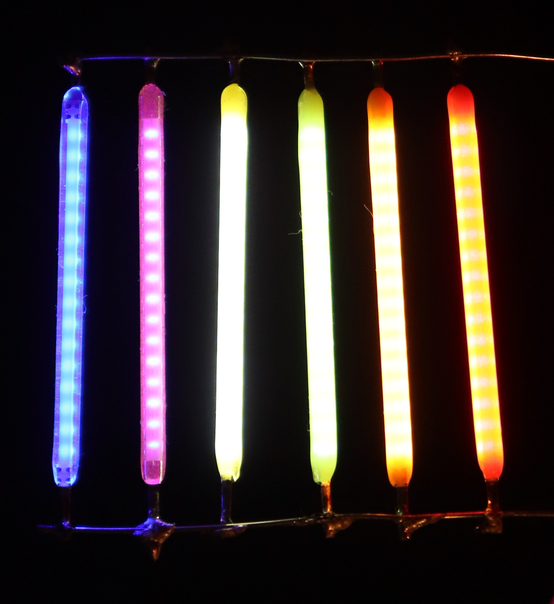
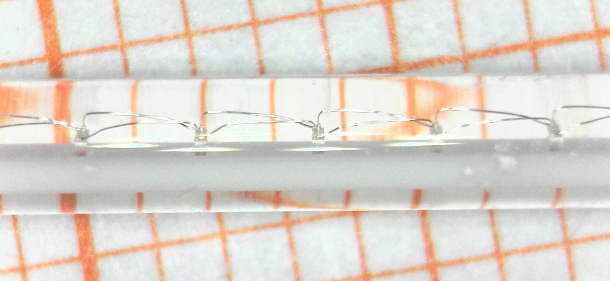 -->


<div style="display: flex; gap: 0rem; flex-wrap: wrap; justify-content: center; margin: 0.25rem 0;">
  
  
</div> 

The filaments are diodes: current can only flow in one direction, from anode to cathode. When a forward voltage of
about 3 V is applied, the filament lights up, with brightness proportional to the current flowing through it
(typically 10–100 mA). When multiple filaments are connected in series, their forward voltages add up. Connecting
them in parallel divides the current among them. I stored a more detailed characterization
[here](https://github.com/cpldcpu/GlowPoly/tree/master/hardware/filaments).

## Building wireframe shapes

With some care (and a lot of patience), the metal ends of the filaments can be soldered together to form complex
2D and 3D shapes. This can be used to build amazing glowing objects. The challenge is that the electrical circuit
is also defined by how the filaments are connected in the object; a mesh that results in a mechanically stable and
visually interesting structure may not necessarily represent a circuit that allows all filaments to light up
properly.

How do we solve this? Let's start with a simple 2D object. The photo below shows a simple square made from four LED
filaments. A constant-current supply is attached to the top and bottom joint, allowing all filaments to light up.
The left and right (blue and red) parts of the circuit form two parallel paths for the current to flow from top to
bottom, while the filaments on each side are in series. The total voltage drop is around 6 V, and each filament
receives about half the total current.

<div style="display: flex; gap: 1rem; flex-wrap: wrap; justify-content: center;">
  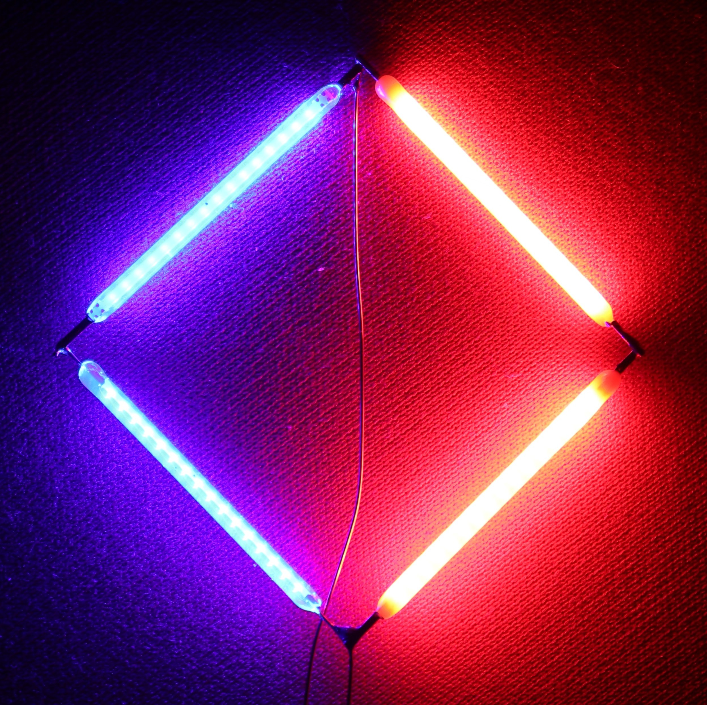

  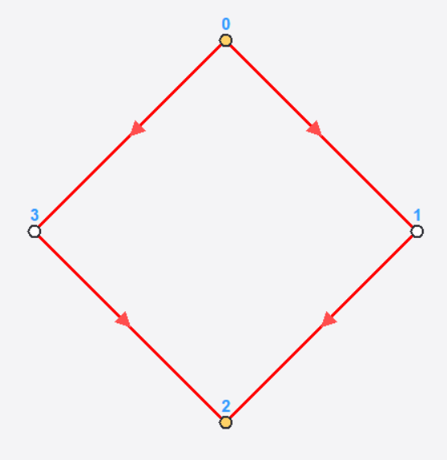
</div>

As shown in the figure on the right, the structure can be represented as a graph: each junction corresponds to a
**vertex**, and each filament corresponds to a connection between two vertices, a directed **edge**. Yellow markers
indicate the feeding points where current is injected. This abstraction allows us to analyze the relationship
between the geometry and its electrical properties using [graph theory](https://en.wikipedia.org/wiki/Graph_theory).

### What do we want to achieve?

Given a wireframe object made from LED filaments, what do we actually want to achieve? Some straightforward objectives:

1) All edges shall light up.
2) We want to minimize the number of feeding points \(P\), the vertices where we connect the power supply.
3) The path length for all circuits between feeding points shall be exactly \(L\) edges. 

The third condition is needed to ensure driving with a constant voltage supply. The voltage drop between feeding
points will then be \(V_{tot} = L \cdot V_f \approx 3V \cdot L\).

The square above meets the first condition with two feeding points and the path length is \(L=2\). Things get quickly more complicated when we move to more complex objects. 

## The Cube

Let's explore a simple 3D object first: the cube. A cube has 8 connection points (vertices, \(V=8\)) and 12 filaments (edges, \(E=12\)). Each vertex connects three edges, making it a *3-regular graph*. There are trivial solutions for \(L=1\) and \(P=8\), where each vertex is connected to a power supply with alternating polarities. The images below show a solution as a 3D graph and a flattened 2D representation ([Schlegel diagram](https://en.wikipedia.org/wiki/Schlegel_diagram)). The number next to each edge indicates the normalized magnitude of current flow.

<div style="display: flex; gap: 1rem; flex-wrap: wrap; justify-content: center;">
  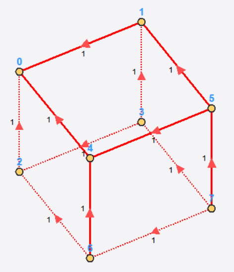
  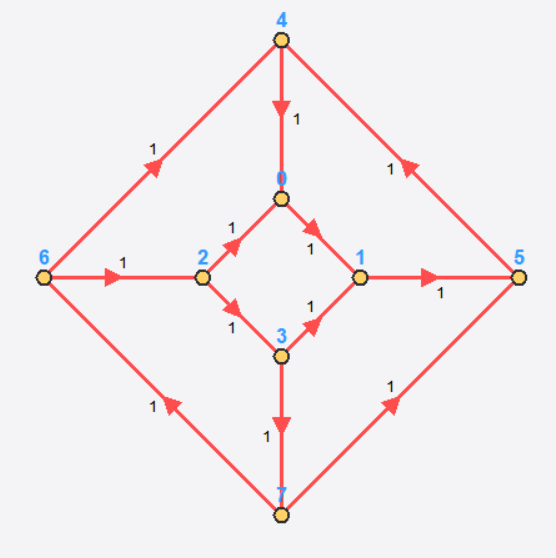
</div>

Unfortunately, there is no solution that allows fewer feeding points while maintaining a constant current through all edges. However, there is a solution for \(L=3\) and \(P=2\), where the feeding points are connected to opposite vertices of the cube. The images below show this solution as a 3D graph and a flattened 2D representation. We can see that, while all edges are lit, the current distribution is uneven: Edges in the middle of the path only carry half of the current due to branching.

<div style="display: flex; gap: 1rem; flex-wrap: wrap; justify-content: center;">
  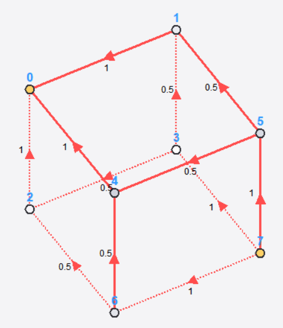
  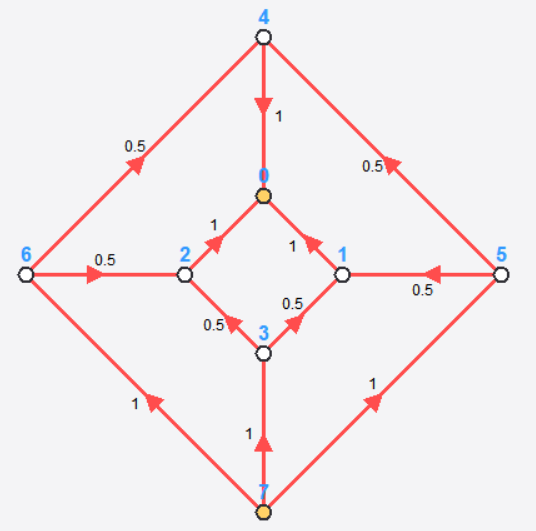
</div>

Below you can see a photo of the actual cube with \(L=3\) and two feeding points (\(P=2\)). While the current varies
by a factor of two between edges, the impact on the appearance is surprisingly small and is rather exaggerated in
the photograph. The reason is that we tend to judge the filaments in isolation rather than against a constant
brightness background. The eye's response to luminance
[is less than linear](https://en.wikipedia.org/wiki/Weber%E2%80%93Fechner_law), and it is mostly sensitive to
[relative brightness differences](https://en.wikipedia.org/wiki/Contrast_(vision)) of objects next to each other, so
the filament-to-filament variation is less noticeable relative to a constant background.

<div style="display: flex; gap: 1rem; flex-wrap: wrap; justify-content: center;">
  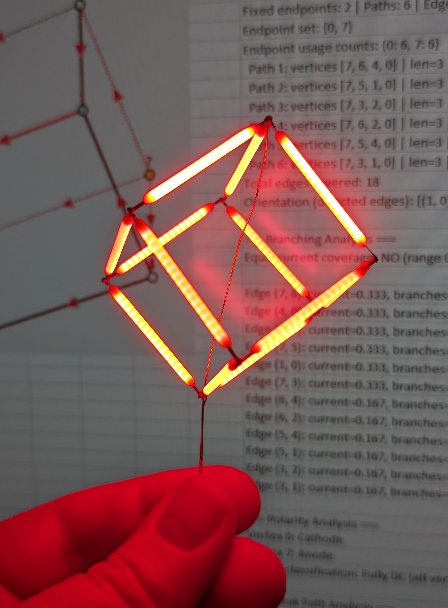
</div>

## The Octahedron

The octahedron is another simple polyhedron with \(V=6\), \(E=12\). In contrast to the cube, each vertex connects
four edges, making it a 4-regular graph.

<h3> DC Driving with 2 Feeding Points</h3>

No solution exists for a simple DC driving scheme where bias is applied to only two vertices (anode and cathode). As shown below in the first two images, only 8 out of 12 edges can be made to light up when driven this way. 

<div style="display: flex; gap: 1rem; flex-wrap: wrap; justify-content: center;">
  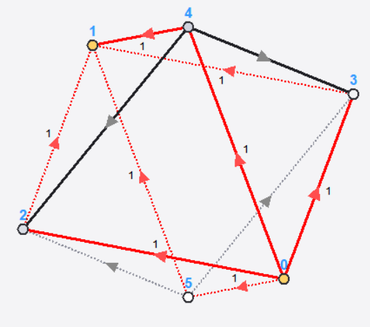
  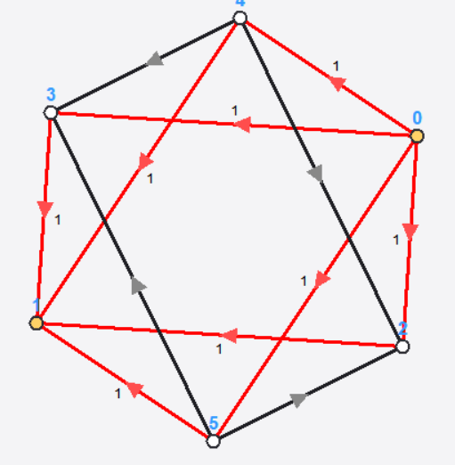
  
</div>

<h3> Multiplexed DC Driving with 4 feeding points </h3>

However, as shown in the rightmost image, if we allow four feeding points and drive them alternately, all edges can
be made to light up. The table below shows which circuits are activated by applying a voltage to the vertices.
Since vertices 0/1 feed four current paths in parallel, we need either twice the current (relative to 2/3) or twice
the on-time.

```
=== Driving Scheme ===
Path 1: 0 -> 2 -> 1 | 0=A 1=C
Path 2: 0 -> 3 -> 1 | 0=A 1=C
Path 3: 0 -> 4 -> 1 | 0=A 1=C
Path 4: 0 -> 5 -> 1 | 0=A 1=C
Path 5: 2 -> 4 -> 3 | 2=A 3=C
Path 6: 2 -> 5 -> 3 | 2=A 3=C
```

<h3> Bipolar Driving with 2 feeding points </h3>

Interestingly, there is another solution that allows driving all edges with only two feeding points: Bipolar driving, where we apply an alternating voltage.

<div style="display: flex; gap: 1rem; flex-wrap: wrap; justify-content: center;">
  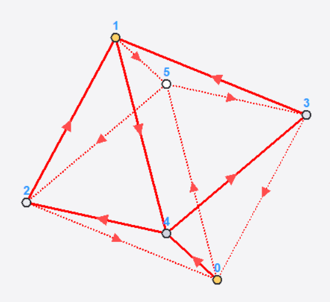
  
</div>

The images above show how this approach works. The path length is \(L=3\), and the two feeding points are connected to opposite vertices of the octahedron. The table below shows the paths that are activated during each cycle of the alternating current driving scheme.

```
=== Driving Scheme ===
Path 1a: 0 -> 5 -> 3 -> 1 | 0=A 1=C
Path 1b: 0 -> 5 -> 2 -> 1 | 0=A 1=C
Path 2a: 0 -> 4 -> 2 -> 1 | 0=A 1=C
Path 2b: 0 -> 4 -> 3 -> 1 | 0=A 1=C
Path 3a: 1 -> 5 -> 2 -> 0 | 1=A 0=C
Path 3b: 1 -> 5 -> 3 -> 0 | 1=A 0=C
Path 4a: 1 -> 4 -> 2 -> 0 | 1=A 0=C
Path 4b: 1 -> 4 -> 3 -> 0 | 1=A 0=C
```

The four edges in the middle of the path (5->3,5->2,4->2,4->3) are part of both the forward and backward biased directions - the filaments leading to them act as a full-bridge rectifier. Since the current for the middle segments is branched (2x), the middle segments receive half the current. But since they are driven in both directions, the time-averaged current is the same as for the outer segments.

## Driver Board

How do we implement this in hardware? I designed a driver board based on a CH32V003 MCU and multiple H-bridge motor-driver ICs, which can drive up to 12 feed points with configurable anode, cathode, or high-Z states at voltages up to (and beyond) 10 V and cycle through arbitrary driving schemes at a few kHz. [More details here](https://github.com/cpldcpu/GlowPoly/tree/master/hardware).
Below you can see the driver board next to an octahedron illuminated with bipolar driving.

<div style="display: flex; gap: 1rem; flex-wrap: wrap; justify-content: center;">
  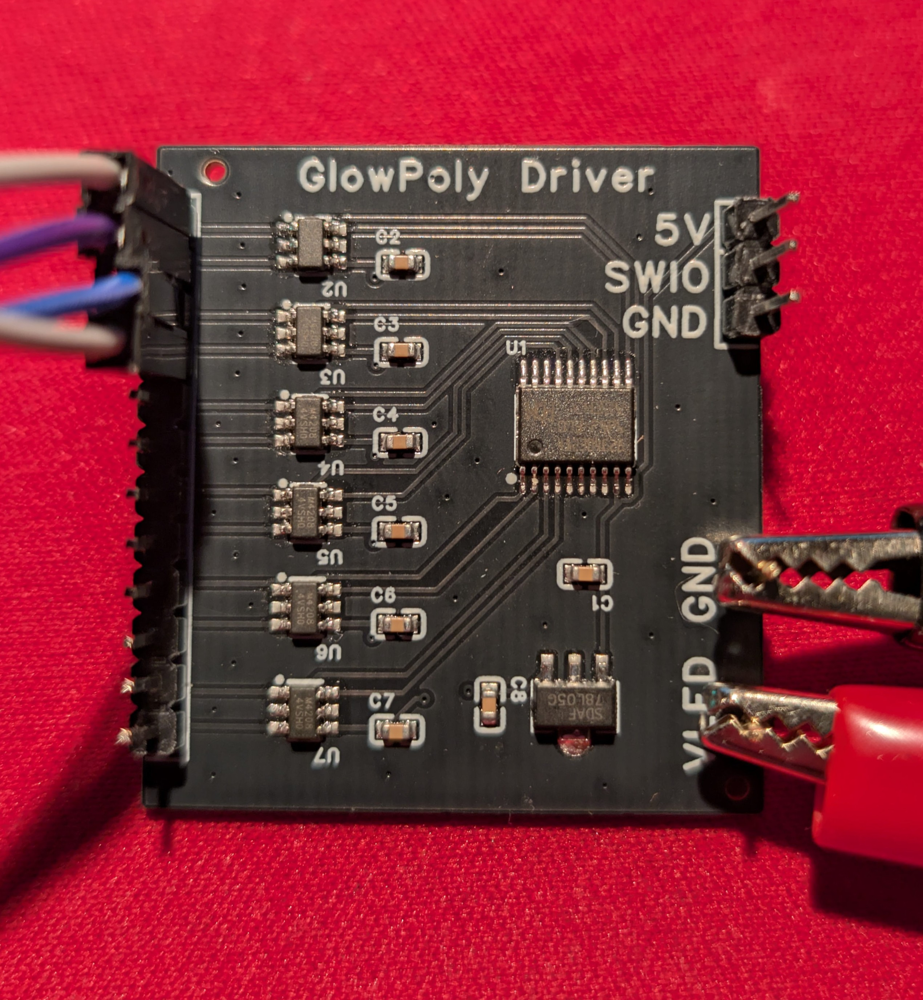
  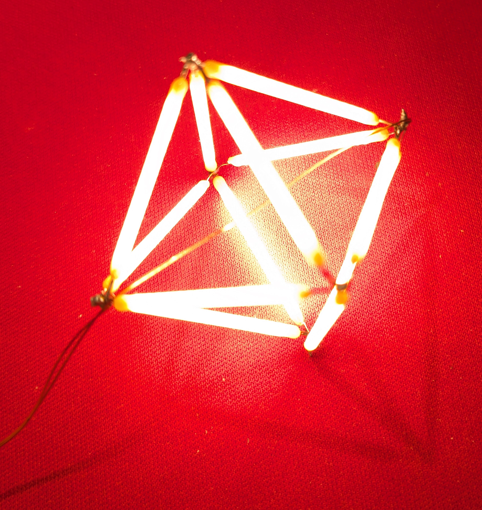
</div>

## Identifying other shapes

The examples above were found through intuition and manual exploration. But what about more complex objects? Which
ones are eligible, and how should we orient their edges to optimize the driving scheme?

A [polyhedron](https://en.wikipedia.org/wiki/Polyhedron) (plural: polyhedra or polyhedrons) is a three-dimensional
solid with flat polygonal faces and straight edges. The simplest examples are the five Platonic solids: tetrahedron,
cube, octahedron, dodecahedron, and icosahedron. Beyond these, there are hundreds of polyhedra that have been
catalogued by mathematicians. The [Polyhedra Viewer by Nat Alison](https://polyhedra.tessera.li/) provides a nice
interactive catalog, and is also a good source of
[3D object files](https://github.com/tesseralis/polyhedra-viewer/tree/canon/src/data/polyhedra).

For our purposes, each polyhedron defines a filament object: vertices become electrical junctions, edges become LED
filaments.
 
### Finding solutions for any shape - randomized search

Initially, I "vibe coded" a visualizer and solver in Python to find solutions for a given object under constraints,
and visualize them. You can [find it here](https://github.com/cpldcpu/GlowPoly/tree/master/PythonTool).

However, I had to learn that a randomized search is not sufficient to find good solutions for larger objects due to an enormous explosion of the search space. Given a polyhedron with \(E\) edges and \(V\) vertices, there are \(2^E\) possible ways to orient the edges (assigning anode/cathode direction to each filament). For each orientation, there are \(3^V\) possible feeding point combinations (each vertex can be anode, cathode, or floating). This quickly becomes infeasible, even a simple cube has \(2^{12} \cdot 3^8 \approx 27\) million possibilities. 

Instead, it is necessary to reduce the search space by limiting the number of options looked at. I found the most feasible approach was to assume certain driving schemes, as identified in the manual search above, and try to identify eligible objects for it.

Based on the exploration of the Octahedron and Cube above, we can observe three different configurations of filaments that allow driving an entire polyhedron with only few feeding points:

1. DC from two feeding points, ignoring brightness variation (as seen in the cube)
2. Multiplexing several DC paths to achieve constant brightness (as seen in the octahedron)
3. Bipolar driving of two feeding points with constant brightness (octahedron)

How do we screen for objects that support these driving schemes?

### Case 1: DC driving from two points, Edge-Geodesic Cover

Just to recap: We want to connect a positive terminal (anode) to one vertex and a negative terminal (cathode) to another vertex, so that all filaments (edges) lie on the current path between these two points. For all filaments to light up, every edge must lie on a shortest path between the two feeding points. We then try to identify such pairs of vertices, so that the shortest paths between them cover all edges. Note that this will result in a solution that allows all filaments to light up, but since there can (and will) be branching paths, the current distribution will be uneven.

This (and it took me quite a while to figure this out) is known in graph theory as the **edge-geodesic cover
problem**. Specifically, we want to screen polyhedral graphs for the existence of an *edge-geodetic set with an edge
geodetic number of 2*. This means that there exist two vertices (s, t) such that every edge in the graph lies on
some shortest path between s and t. A necessary precondition for this to be possible is that the graph is
[bipartite](https://en.wikipedia.org/wiki/Bipartite_graph), which can be easily tested for. Essentially, this
states that the graph can be separated layer-by-layer without any dangling edges (filaments) between the layers.

Only 7 out of the 122 polyhedra I analyzed support this property and allow driving all filaments from only two
connections. They are listed in the table below.

| Name                        | \(V\) | \(E\) | \(deg(V)\) | \(L\) |
|-----------------------------|------:|------:|-----------:|------:|
| cube                        | 8     | 12    | 3          | 3     |
| hexagonal prism             | 12    | 18    | 3          | 4     |
| octagonal prism             | 16    | 24    | 3          | 5     |
| decagonal prism             | 20    | 30    | 3          | 6     |
| truncated octahedron        | 24    | 36    | 3          | 6     |
| truncated cuboctahedron     | 48    | 72    | 3          | 9     |
| truncated icosidodecahedron | 120   | 180   | 3          | 15    |

I built two of those objects: The hexagonal prism and the truncated octahedron. Below you can see photos of both objects in all their glory.

<div style="display: flex; gap: 1rem; flex-wrap: wrap; justify-content: center;">
  
  
  
</div>

However, all objects allow solutions where the filaments can be covered by shortest paths between multiple
combinations of feeding point pairs. This allows for DC solutions with multiplexing. I found that many objects
require 4 taps, while the maximum I found was 8. You can explore further geodesic cover solutions in the
[interactive web viewer](https://cpldcpu.github.io/GlowPoly/).

### Case 2: Eulerian Circuits and Cycle Decomposition

While the previous approach allows finding solutions that can light up all filaments, the brightness is usually
uneven due to branching current paths. To achieve uniform brightness, we need a different strategy. One approach I
found was to seek objects that can be decomposed into circular loops (cycles).

This is related to the famous [Seven Bridges of Königsberg](https://en.wikipedia.org/wiki/Seven_Bridges_of_K%C3%B6nigsberg) problem that Euler solved in 1736 and is usually cited as the birth of graph theory. An Eulerian path visits every edge exactly once, but only exists if the graph has exactly 0 or 2 odd-degree vertices. Most polyhedra fail this condition - the cube, for instance, has degree 3 at all vertices.

Instead of one path covering all edges, we look for a set of cyclic paths that together cover all edges exactly
once. For uniform brightness, these cycles must all have the same length \(L\). The number of feeding point pairs
needed is then \(m = \frac{E}{L}\). A necessary condition is that all vertices have even degree (typically 4), and
the cycle length should equal the polyhedron's graph diameter to prevent short circuits.

These conditions can be easily tested for. Only 5 polyhedra support cycle decomposition with uniform brightness:

| Name                      | \(V\)   | \(E\)   | \(deg(V)\) | \(L\)  | Taps
|---------------------------|----|----|---------|----------|------|
| square                    | 4  | 4  | 2       | 4        | 2    |
| octahedron                | 6  | 12 | 4       | 4        | 4    |
| cuboctahedron             | 12 | 24 | 4       | 6        | 4    |
| triangular-orthobicupola  | 12 | 24 | 4       | 6        | 5    |
| icosidodecahedron         | 30 | 60 | 4       | 10       | 6    |


Below you can see the cuboctahedron based on the cycle decomposition approach. 

<div style="display: flex; gap: 1rem; flex-wrap: wrap; justify-content: center;">
  
</div>

In addition, there are also some antiprisms that allow decomposition into cycles of equal length. However, in these
the subcycles overlap, which leads to uneven brightness. Still, they are interesting shapes to build. The
hexagonal antiprism decomposes into 3 cycles of length 8, which are color coded in the object below.

<div style="display: flex; gap: 1rem; flex-wrap: wrap; justify-content: center;">
  
</div>

### Case 3: Bipolar Driving

As described above, it was possible to drive all edges of the octahedron at constant brightness with only two
feeding points using bipolar (AC) driving. Can we generalize this to other shapes? I implemented a specific search
algorithm to identify objects that support this driving scheme. The constraints are:

- At least 4 parallel paths between the two feeding points
- The "equator" vertices (middle layer) must have even degree
- No "diagonal" edges that would create shortcuts between layers

These constraints turn out to be quite restrictive. Only three polyhedra (plus one star-like variant) support
bidirectional driving:

| Name                       | \(V\) | \(E\) | \(deg(V)\) | Path Len | Taps |
|----------------------------|-------|-------|------------|----------|------|
| octahedron                 | 6     | 12    | 4          | 3        | 2    |
| hexagonal bipyramid        | 8     | 18    | 4          | 4        | 2    |
| elongated square bipyramid | 10    | 20    | 4          | 5        | 2    |
| star octahedron            | 14    | 24    | 2, 4       | 4        | 2    |

The *elongated square bipyramid* is basically an extended octahedron. In principle it would be possible to extend it further to create even longer objects.

<div style="display: flex; gap: 1rem; flex-wrap: wrap; justify-content: center;">
  
</div>

The *star octahedron* is not really a polyhedron. It's based on an octahedron where 4 edges are extended outwards to create a star shape. You can see it in all its glory below - my favorite star-like object!

<div style="display: flex; gap: 1rem; flex-wrap: wrap; justify-content: center;">
  
</div>

## Summary

This concludes my exploration of *glowing polyhedrons* - a seemingly simple idea that consumed way more brain cycles than I had anticipated. I hope someone finds a better way to implement a general solver; my current approaches still appear unsatisfactory.

Should you feel inspired to build your own glowing polyhedrons, you can find all my exploration results, including filament characterization, driver board design, and the solver code in the [GlowPoly repository](https://github.com/cpldcpu/GlowPoly).

I also created an interactive web viewer that allows you to explore all solutions I found for the 122 polyhedra in the database. [You can find it here](https://cpldcpu.github.io/GlowPoly/).

<div style="display: flex; gap: 1rem; flex-wrap: wrap; justify-content: center;">
    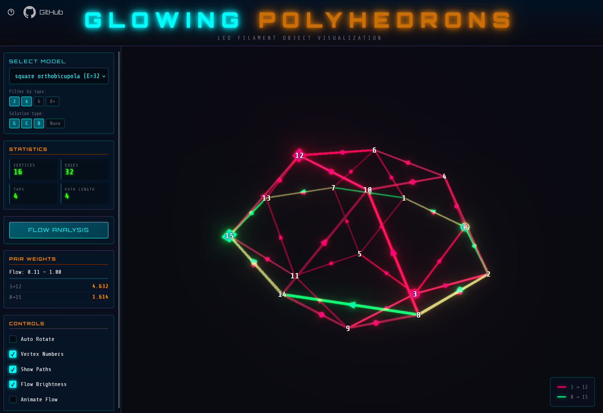 
</div>

[^1]: Check out [Huy Vector's channel](https://www.youtube.com/@huyvector); he's building amazing electronic sculptures. I also learned that soldering ASMR is a thing now.
