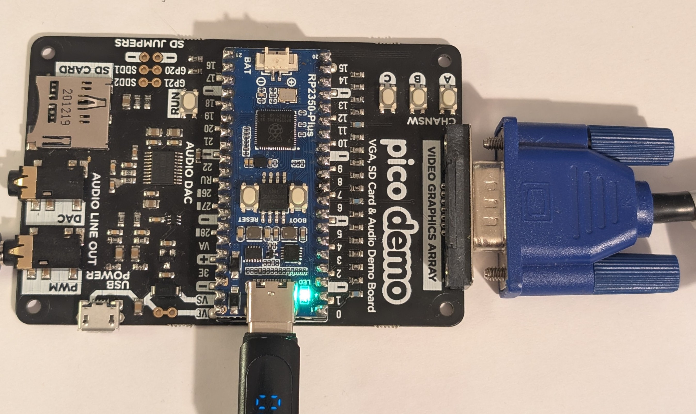
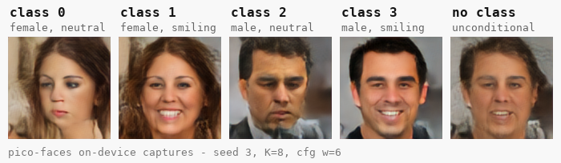
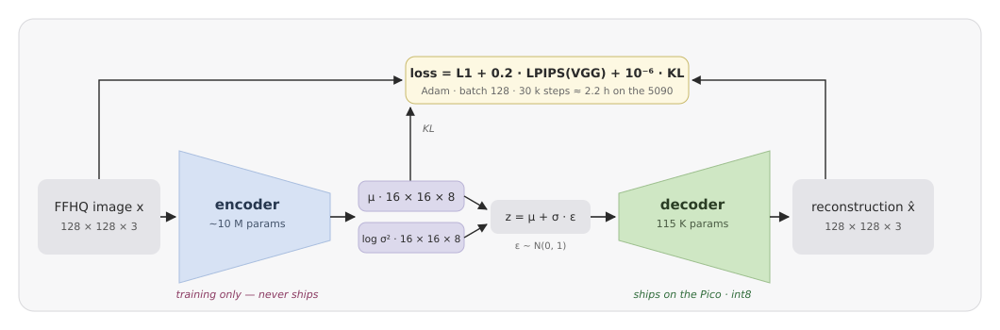
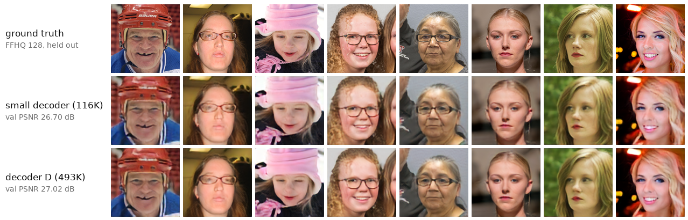
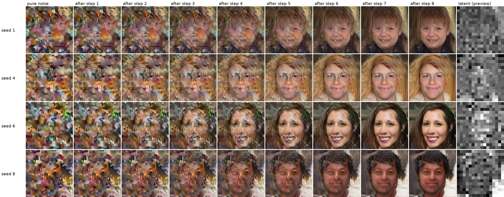
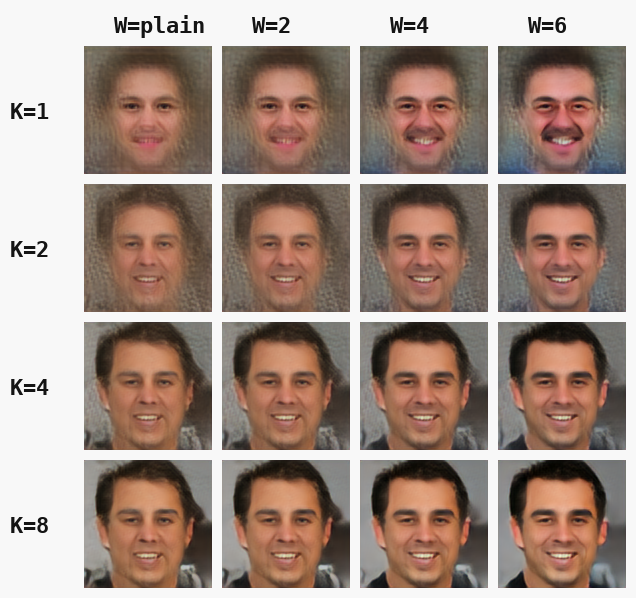
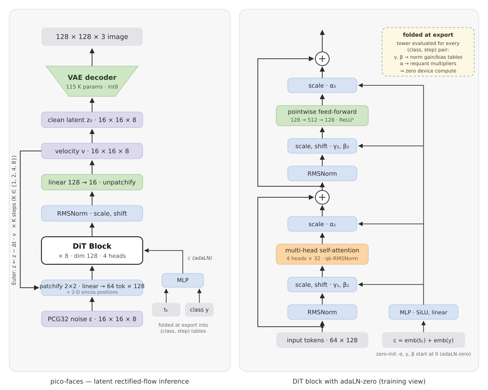
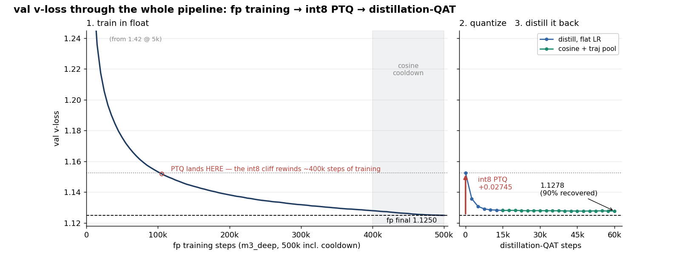
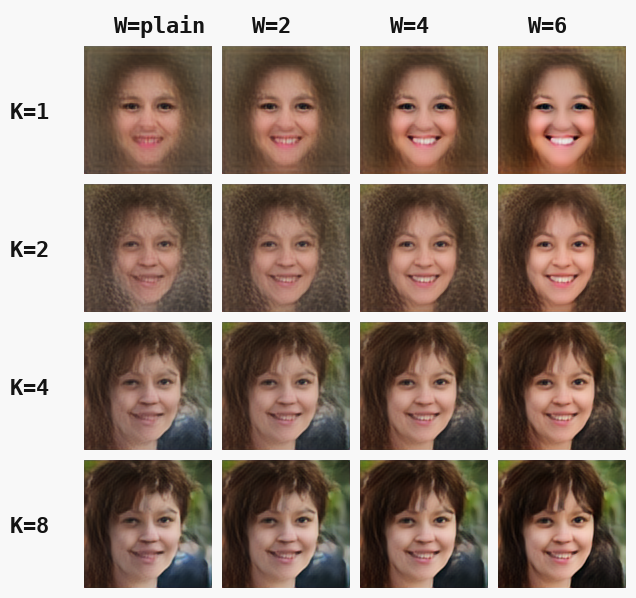



A long time ago, buoyed by the excitement of emerging AI, I set myself the challenge of implementing a [Generative AI image model on a microcontroller](/projects/generative-ai-on-a-microcontroller/). I got pretty far and prototyped a basic diffusion model and conditional VAE, but I never got around to implementing it on an actual microcontroller. 

I finally revisited the project and, success, implemented a **Generative AI image model on a $1 RP2350 microcontroller**, as used in the Raspberry Pi Pico 2. The model and inference code are less than 4 MB and run on the dual-core Cortex-M33 in 520 KB of RAM.

[Checkout the repo here](https://github.com/cpldcpu/pico-faces).

## What does it do?

The hardware is an RP2350 microcontroller on a Waveshare RP2350-Plus board, plugged into a Pimoroni VGA board. The VGA board basically adds a resistor-based DAC and a VGA connector that allows connecting to a VGA monitor. The monitor is not required, as the generated image can also be read out via the USB connection. HDMI support would be equally possible, but I did not have a board at hand.

   

Below you can see a video of the device generating and displaying an image on a monitor. The model generates 128×128 RGB images of human faces in 10–20 s each and displays them on a VGA monitor or streams them over USB. 
<!-- 
 -->
  <video controls autoplay muted loop>
    <source src="pico_faces_monitor.mp4" type="video/mp4">
  </video>
<!-- 
 -->
 The model implements a latent flow diffusion transformer (DiT), similar to what is used in diffusion models like Flux. There are two variants at 2.9 and 1.7 million parameters, roughly 4000x fewer than Flux. It supports conditional generation in 5 classes: four combinations of gender × smile plus an unconditional class. The model was trained on the [FFHQ dataset](https://github.com/nvlabs/ffhq-dataset).

It is more than astonishing that a model this small is able to generate complex images at all. Many MNIST toy diffusion projects use far more parameters and are barely able to generate anything coherent. The image below shows the 5 classes that the model can generate for a fixed seed.

   

## How does it work?

Even though Claude Code with Fable 5 did a lot of the grunt work of implementing the code, the development of this took the better part of two weeks of ablations and nightly training runs on an RTX 5090. What was quite astonishing to me is that most of the optimizations that helped large models were also necessary to make this micro-model work.

### Latent Diffusion

First of all, this model is not actually generating images in pixel space. Instead, it generates a compressed latent representation of the image. This approach was pioneered by Stable Diffusion (Rombach et al.)[^1] and is now basically the standard approach for diffusion models. For this model, the 128×128×3 pixel space is compressed by a factor of 24 to a 16×16×8 representation using a [variational auto-encoder](https://en.wikipedia.org/wiki/Variational_autoencoder).

The VAE was trained separately on the FFHQ dataset as shown below. In an unusual setup, the encoder is much larger than the decoder. The rationale for this was to allow the large encoder to learn a latent representation that optimizes decoding with a small, on-device, decoder. Only the decoder is required for inference on the microcontroller. LPIPS[^2] was used as a visual perceptual loss function.
<figure>
  
  <figcaption>VAE training: a large encoder teaches a tiny decoder.</figcaption>
</figure>
Two VAEs were trained, one with 115k parameters and one with 494k parameters, for the fast and the quality model respectively. Reconstruction examples are shown below. The 494k parameter decoder is only marginally better (e.g. teeth), showing that the latent dimension is the limiting factor.
<figure>
   
  <figcaption>VAE reconstruction examples</figcaption>
</figure>

### Flow-based Diffusion Model

Diffusion models are often packaged in unnecessarily complex mathematical language (DDPM, DDIM…), even though they are relatively simple. I used a flow-matching[^3][^4] objective to train the diffusion transformer. I cannot recommend Heitz et al.[^5] and this video[^6] enough, which use a rather intuitive approach to arrive at the same mathematical formulation. 

What does it do? We train a model that takes a partially noisy image \(x_t\), a linear interpolation between pure noise \(x_0\) and a clean image \(x_1\) at time \(t \in [0,1]\),

$$x_t = t \cdot x_1 + (1 - t) \cdot x_0$$

and predicts the direction (velocity) towards the clean image:

$$v = x_1 - x_0$$

At inference, instead of jumping directly to the target image \(x_1\), the sampler only takes a fractional (small) step along \(v\) and iterates a couple of times, which allows finer details to emerge. I also tried reflowing (self-distilling) the model to allow generation in even fewer steps, but ultimately decided against it as the generation time for 8 steps was still acceptable.

<figure>
   
  <figcaption>Emergence of images from noise during 8 diffusion steps</figcaption>
</figure>

### Classifier Free Guidance 

One very significant improvement was the introduction of classifier free guidance[^7] (CFG). The idea is rather simple: The model output (velocity) is evaluated once conditioned with the target class and once with an unconditioned (null) class:

$$v = v_{\text{null}} + w \cdot (v_{\text{cond}} - v_{\text{null}})$$

Essentially, directions towards the target class are isolated and amplified. This doubles the processing time, but the results have been quite impressive as shown in the image below.

<figure>
   
  <figcaption>Number of steps k vs. guidance weight w</figcaption>
</figure>

### Diffusion Transformer

Initially I tried a classical convnet-based U-Net as I expected this to perform better on a tiny device, but it turned out a transformer model was the cleaner and better-performing choice. The latent encoding of the image is 'patchified' into 8×8=64 tokens of dimension 128 by applying an embedding matrix to each 2×2×8 patch of latents. A sinusoidal positional embedding is applied to each patch (learned embedding did not perform well).

One notable modification was to introduce a ReLU² activation function[^8] in the dense blocks. This increases activation sparsity, which the inference engine exploits to reduce inference time by ~15%. 

Architectural details are shown below. The fast model has 8 layers, the quality model is deeper. 

<figure>
   
  <figcaption>Model architecture, block architecture, AdaLN</figcaption>
</figure>

### AdaLN-Zero

The model uses AdaLN-Zero to apply time step and class conditions[^9], which is a strikingly simple approach that applies a learned bias and scale to the normalization functions. Since only relatively few combinations of timesteps (8) and classes (5) are needed, it is possible to discard the trained AdaLN MLP and simply store the biases in a lookup table. Unfortunately, I learned too late about adaLN-single[^10], which would allow reducing the table size even further.

### Quantization

The model was trained in floating point and post-training quantization was applied to store the weights in int8. I had quite a few scaling issues. Especially the larger model suffered from notable quantization damage. Some of it could be healed by quantization-aware self-distillation after quantization. There is a lot of room for improvement here by training the model in a more quantization-friendly way, and controlling the activation distribution better.

<figure>
   
  <figcaption>Training schedule of the large model, using QAT self-distillation to fix quantization damage.</figcaption>
</figure>

### Final model size

| section | `m3_long_cfg` (2,567,828 B) | `m3_decD_deep_full` (4,016,632 B) |
|---|---:|---:|
| DiT block weights (int8) | 1,656,832 | 2,482,416 |
| Conditioning step tables: 5 cond × 8 steps × depth | 737,280 | 983,040 |
| VAE decoder (int8) | 117,603 | 498,411 |
| positional embedding (int8) | 16,384 | 16,384 |
| final-norm gain/bias tables | 20,480 | 20,480 |
| schedule, LUTs, scales, misc | ~19,000 | ~16,000 |

The large model still fits into 4 MB of flash including the inference engine.

### Inference engine

The DiT is well suited for weight streaming from flash, since all 64 tokens can be processed in parallel per layer. Weights are streamed from flash using DMA into a ping-pong buffer while the previous layer is still being processed. Since every weight in a layer is re-used 64 times, the inference is typically not limited by streaming weight throughput. 

Cortex-M33 intrinsics are used where possible (e.g. SMLAD for parallel multiplication). Both cores are used at 300 MHz (overclocked from the stock 150 MHz). Iterative optimizations reduced processing time by around 15x from the first implementation to ~5 s per image. The larger model and CFG brought it up to ~20 s again. Still amazingly fast for a diffusion model on a microcontroller!

### Output

The diffusion model is controlled via a virtual COM port on the USB port using a simple custom protocol.

In addition, images are shown on a VGA monitor after generation. Floyd-Steinberg dithering is used to reduce banding on the 12-bit VGA output. During generation a low-resolution preview of the latents is shown; it is rendered purely via DMA with a small memory footprint, so it barely affects inference.

<figure>
   
  <figcaption>Number of steps k vs. guidance weight w for seed 5</figcaption>
</figure>

## Conclusions

This was quite an exhilarating project with many nightly training runs heating my office. I am quite pleased with the outcome. There are still plenty opportunities to optimize it further: adaLN-single, full quantization aware training, optimizing the model architecture. 

Test it on your on RP2350, [the repo is here](https://github.com/cpldcpu/pico-faces).

[^1]: R. Rombach, A. Blattmann, D. Lorenz, P. Esser, B. Ommer, *High-Resolution Image Synthesis with Latent Diffusion Models*, CVPR 2022. arXiv:2112.10752.
[^2]: R. Zhang, P. Isola, A. A. Efros, E. Shechtman, O. Wang, *The Unreasonable Effectiveness of Deep Features as a Perceptual Metric*, CVPR 2018. arXiv:1801.03924.
[^3]: Y. Lipman, R. T. Q. Chen, H. Ben-Hamu, M. Nickel, M. Le, *Flow Matching for Generative Modeling*, ICLR 2023. arXiv:2210.02747.
[^4]: X. Liu, C. Gong, Q. Liu, *Flow Straight and Fast: Learning to Generate and Transfer Data with Rectified Flow*, ICLR 2023. arXiv:2209.03003.
[^5]: E. Heitz, L. Belcour, T. Chambon, *Iterative α-(de)Blending: a Minimalist Deterministic Diffusion Model*, SIGGRAPH 2023. arXiv:2305.03486.
[^6]: [Flow Matching YouTube Video](https://www.youtube.com/watch?v=7cMzfkWFWhI) (video).
[^7]: J. Ho, T. Salimans, *Classifier-Free Diffusion Guidance*, NeurIPS 2021 Workshop on Deep Generative Models. arXiv:2207.12598.
[^8]: D. R. So, W. Mańke, H. Liu, Z. Dai, N. Shazeer, Q. V. Le, *Primer: Searching for Efficient Transformers for Language Modeling*, NeurIPS 2021. arXiv:2109.08668.
[^9]: W. Peebles, S. Xie, *Scalable Diffusion Models with Transformers*, ICCV 2023. arXiv:2212.09748.
[^10]: J. Chen et al., *PixArt-α: Fast Training of Diffusion Transformer for Photorealistic Text-to-Image Synthesis*, ICLR 2024. arXiv:2310.00426.
