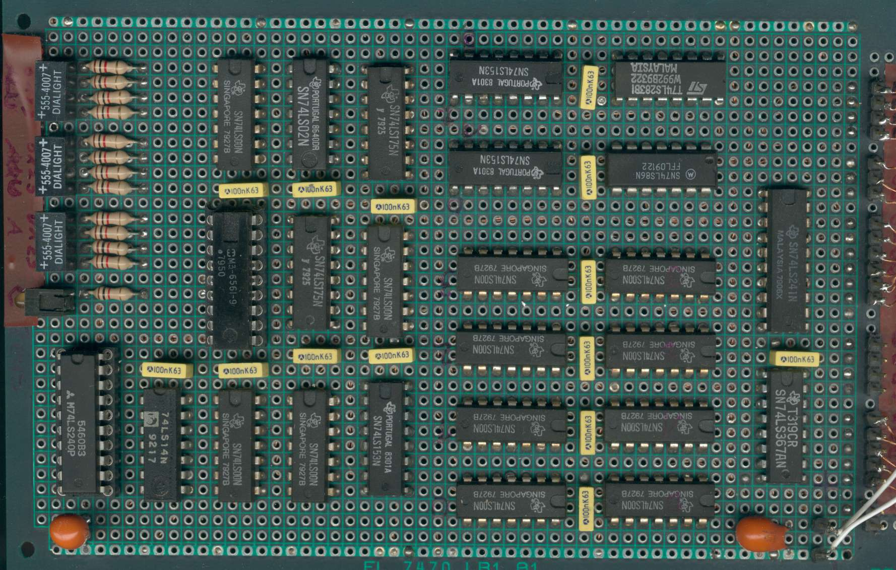
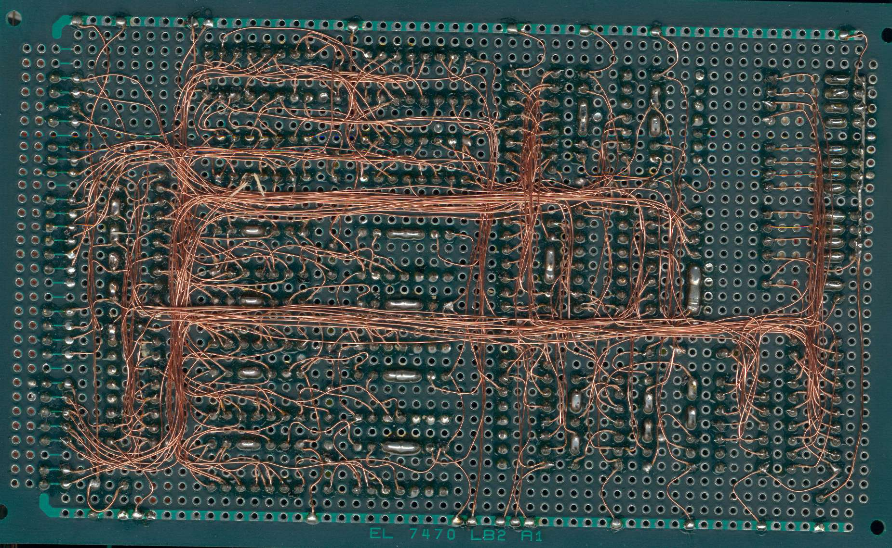
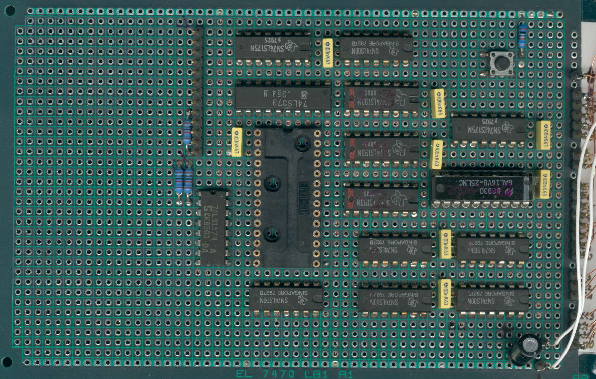
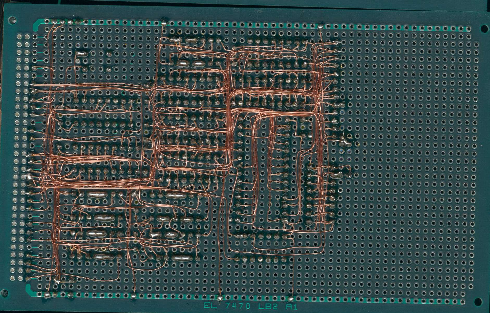
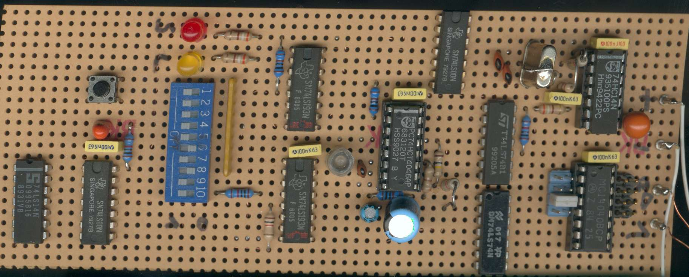

+++
title = "4 Bit TTL CPU"
summary = "A TTL CPU I built a long time ago when I bought a huge stock of NOS TTL chips on ebay"
date = "2020-05-26T00:00:00"
draft = false
hackaday_url = "https://hackaday.io/project/171966-4-bit-ttl-cpu"
featured = "featured.jpg"
showHero = true
heroStyle = "background"
layoutBackgroundBlur = false
+++
*A TTL CPU I built a long time ago when I bought a huge stock of NOS TTL chips on ebay*

## Details

# 4 Bit TTL CPU

A few years ago I purchased a large quantity of old LS-TTL chips in an internet
auction. Wanting to put them to use, I started to design a CPU around them.

I decided to go with a 4 bit datapath to reduce the circuit size. The CPU
uses seperated program and data memory, a harvard architecture. The width of the
program memory is 8 bit. A side effect is, that there is no way to write to the
program memory. This forbids self modifying code and renders constructs like subroutines
very difficult. The data memory consists of 32 4-bit "registers". All 
operations are performed on a single accumulator. Actually, the general idea behind
the architecture can be very well compared to the Microchip PIC. See below for an instruction reference.

The CPU circuit was designed on paper and built on three veroboards. It is difficult
to believe, but the circuit worked on the first power up. A few photos of this
mess are displayed at the bottom of this page.

## Registers

```text
RegistersPC       11:0     Program counterAccu      3:0     Accumulatorr00-r15   3:0     16 Work registersr16-r23   3:0     8 I/O registersr24-r31   3:0     ScratchpadFlags:C         Carry/BorrowZ         Zero Flag
```

## Instruction list

```text
r=registeri=immediate valuea=addressAc=Accumulatorr16  = [r0..r15]r32  = [r0..r32]imm4 = [0 .. 15]add12= [0 .. 4095]Mnemonic    Machine code         Length  Cycles  Flags OperationADC r16     0011 rrrr            1       1       ZC    Ac=Ac+r16+CADC #imm4   0111 iiii            1       1       ZC    Ac=Ac+imm4+COR  r16     0001 rrrr            1       1       Z-    Ac=Ac OR r16AND r16     0000 rrrr            1       1       Z-    Ac=Ac AND r16XOR r16     0010 rrrr            1       1       Z-    Ac=Ac XOR r16XOR #imm4   0110 iiii            1       1       Z-    Ac=Ac XOR imm4LDI #imm4   0100 iiii            1       1       Z-    Ac=imm4STA r32     110r rrrr            1       1       --    r32=AcLDA r32     111r rrrr            1       1       Z-    Ax=r32SEC         0101 1000            1       1       -C    C=1CLC         0101 0000            1       1       -C    C=0ROL         0101 1100            1       1       ZC    Ac=(Ac<<1)+Cold, Cnew=Accu Bit 3LSL         0101 0100            1       1       ZC    Ac=Ac<<1,        Cnew=Accu Bit 3NOP         0110 0000            1       1       --    does nothing. (in fact it executes Ac=Ac XOR 00)JCS $add12  1000 aaaa aaaa aaaa  2       2       --    Jump if C=1JCC $add12  1001 aaaa aaaa aaaa  2       2       --    Jump if C=0JMP $add12  1010 aaaa aaaa aaaa  2       2       --    Jump alwaysJNZ $add12  1011 aaaa aaaa aaaa  2       2       --    Jump if Z=0
```

## Images

  



  **ALU-Board** component and solder side. This boards holds the ALU, registerfile, accumulator, flags
and some bus muxes. The ALU consists of a 4 bit boolean function unit (8x LS00 to the right), a
4 bit adder (LS283), 4 bit XOR (LS86) and the result multiplexer/shifter (2x LS153). The registerfile
is a simple single port 256x4 sram (Harris 6561). The two LS175 hold the accumulator and the flags. The
black components to the left contain various status LEDs.

   



  **Program/Control** component and solder side. Holds the program ROM, the program counter logic and
various instruction decoding. The program counter logic consists of the PC (3x LS193), branch logic (LS 175 and more ?)
and a branch adress register (LS373,LS175). The GAL and 4x LS00 are used as instruction decoder.
The GAL replaces around 8-10 ICs of random logic, so it is really put to good use.

   

  **PLL board**, component side. This board generates the required two phase clock signal. In addition
it allows single step clocking for debug purposes. The clock frequency can be adjusted between fractions and multiples of a MHz, using the DIP switches and the jumpers. The two phase clock 
and lots of extra trouble could probably have been avoided by spending additional thought on
the design.

  (c) 2002 Tim - Last change: 16 October 2002

> Exported from Hackaday.io [4 Bit TTL CPU](https://hackaday.io/project/171966-4-bit-ttl-cpu)
