+++
title = "555ENabled Microprocessor"
summary = "A Microprocesser designed in a digital logic family based on the NE555"
date = "2021-12-05T00:00:00"
draft = false
hackaday_url = "https://hackaday.io/project/182915-555enabled-microprocessor"
featured = "featured.png"
showHero = true
heroStyle = "background"
layoutBackgroundBlur = false
+++
*A Microprocesser designed in a digital logic family based on the NE555*

## Details

I found an interesting remark in the 555 timer contest description*:*

*"Should have used a 555." It's mostly applied where a microcontroller and some code are used where a simple 555 circuit would have sufficed.... **Maybe you turn the comment right back around and design a microcontroller based on 555s**."*

This sounds like a challenge! Let's see how far I get. Definitly should not use an NE555 (or 500 of them) for this.

*Update: Success!*

<!-- [**Click here to view project logs in order**](https://hackaday.io/project/182915/logs)

NE555 logic is now proven to be functional in hardware. [Check out the companion project.](https://hackaday.io/project/183038-ne555-dice-inversion) -->

## Project Logs
### 1) First Assessment
<small>2021-12-05 10:07</small>

Ok, I may have played around with the NE555 years ago and also owned some kind of circuit book for it.  But I always only copied circuits from somewhere else. So, time to study its details a bit more. It's not my [first obscure](https://hackaday.io/project/176107-led-coupled-logic-lcl) [logic style](https://hackaday.io/project/169948-lcpu-a-cpu-in-led-transistor-logic-ltl), so we ought to find something, right?

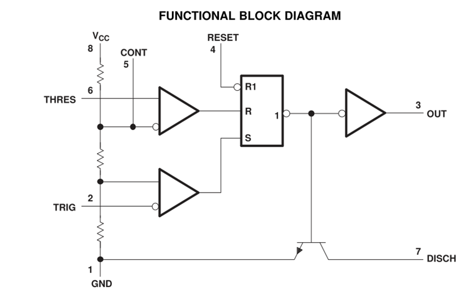

The block diagram of the N555 from the TI datasheet is shown above. What do we get on a functional level? Two comparators with fixed thresholds, an RS flipflop with reset input and an output driver. The threshold input should be good to act as switch for an analog summing input network and the RS flipflop could become part of a latch. This does not look too bad. CONT and DISCH are probably not too useful for logic circuits, but we will see.

The functionality is described as this in the datasheet:

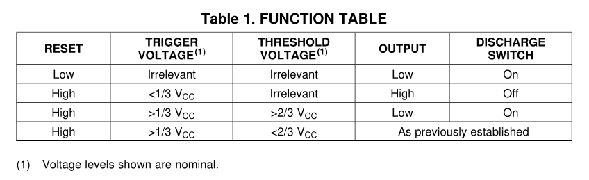

I don't get why the RESET voltage threshold is not listed. Luckily it is defined later in the datasheet:

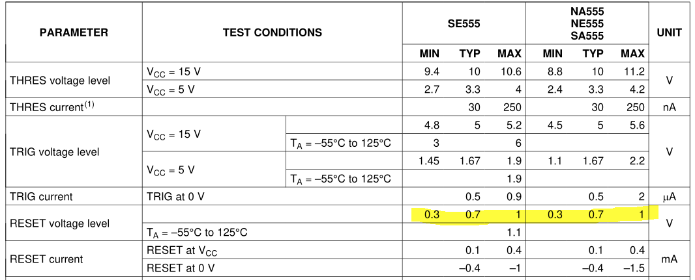

A minimum of 0.3V appears quite low. This means that no diodes or anything causing a large voltage drop may be between the reset input and ground. Something to keep in mind for later.

Ok, all in all this does not look too bad. We can probably construct both registers and combinatoric logic out of the NE555 and some additional components. In the mean time I also found some NE555 lying around. So let's get to some experiments.

### 2) Some Experiments: Building an Inverter and NAND gate
<small>2021-12-05 11:23</small>

It appears my NE555 are from a few kits I ordered on Aliexpress a while ago. They have some kind of distorted TI logo on them, so I am pretty sure they are not genuine devices, but they should work nevertheless. Time to pull out the breadboard. The resistor capacitor network you can see on the right side is to set the level of my function generator correctly to 0/5V.

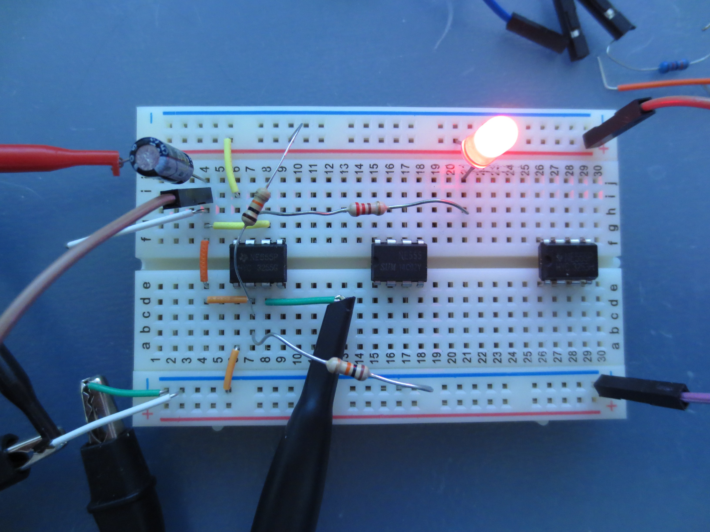

#### 

#### 

#### Inverter operation

Connecting "TRIG" and "THRS" together allows forming a schmitt-trigger inverter that could serve as a basis for further logic.

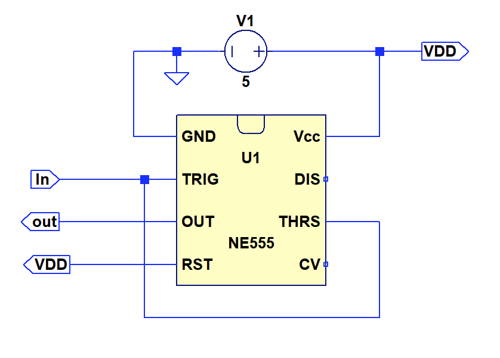

Generally this seems to work very well. See below for a scope image with a triangle at the input, which is converted to a square on the output (channel 1). The threshold levels seem to fit very well too (1/3 VCC and 2/3 VCC, 5V in this case)

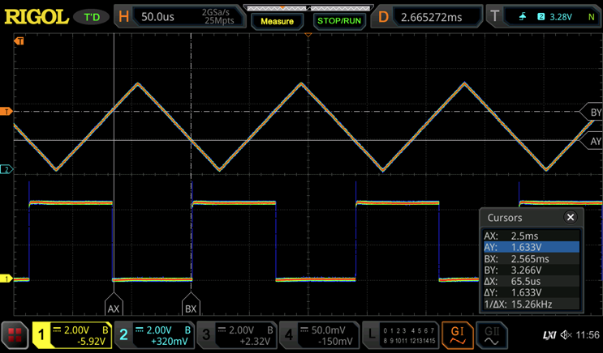

How fast is it? Not very fast, I was only able to achive operation up to 150 kHz with a square input.

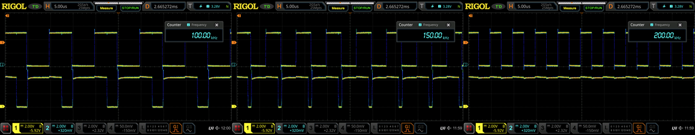

The delay for a low to high transitition seems to be particularily high. I measured between 2.75us and 3.5us for the three NE555 that I had.

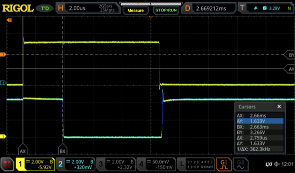

On the other hand, the H->L transition is much faster at 280ns.

#### 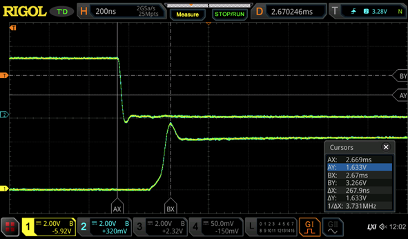

#### Introducing a diode resistor network at the input

Now that we have an operational inverter, we should be able to convert it into a NAND gate by adding a diode-resistor network at the input, as done in [diode transistor logic (DTL)](https://en.wikipedia.org/wiki/Diode%E2%80%93transistor_logic).

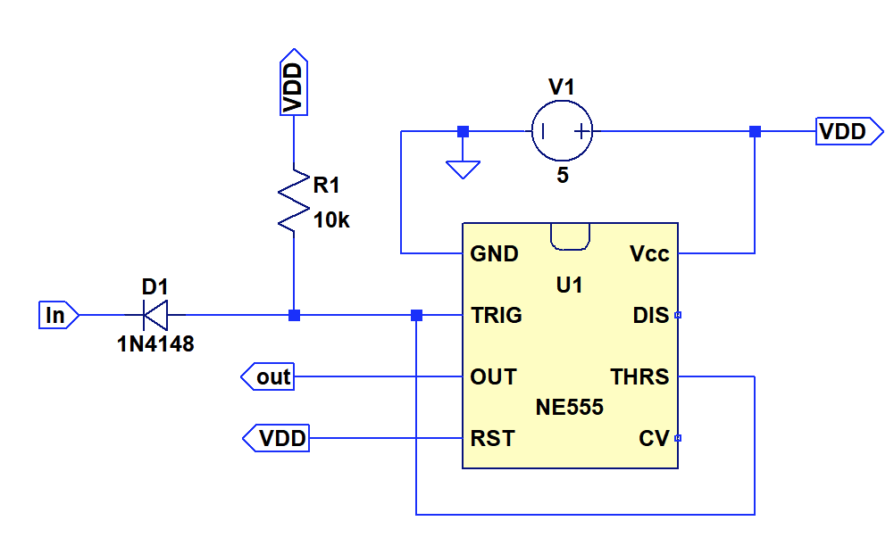

Multiple diodes can be used to add further inputs. The choice of the pull up resistor was rather arbitrary as that was what I found in my parts box, probably a smaller resistor would be a bit better.

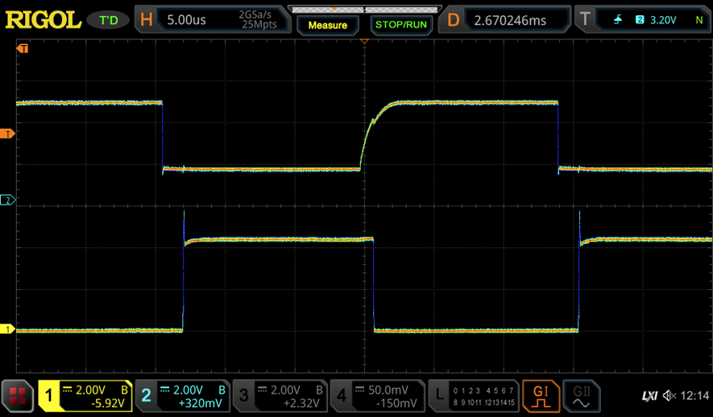

The new contraption works nicely, as seen in the scope picture above. Channel 2 (on top) shows the voltage levels directly at the input of the NE555 (TRIG/THRES). We can see, that the L->H transition at the input is now much slower, since the 10kohm resistor alone as to pull up the node. The H->L transition is fairly quick as the diode has a low impedance.

The inverter still works nicely. Curiously the timing was changed quite significantly to the stand-alone schmitt trigger. The delay fro the L->H transistion on the input is now only 1us, while the delay for the H->L transition is 1.65uS. The difference is a bit puzzling and understanding it requires digging into the NE555 circuit. But for now it should be fine, NE555-Logic will never be a speed demon anyways.

#### Conclusions

In conclusion, it appears possible to build inverters and also gates with diode-resistor networks at the inputs. This allows forming NAND2 and NAND3 gates. In addition, we could use the open collector output (DISCH) of the NE555 to form NOR2, NOR3 and AND-OR-INVERTER gates from multiple NE555. 

Pretty nice, looks like we got our first toolbox for combinatoric gates together.

### 3) Spice Simulation of Combinatoric Gates
<small>2021-12-05 13:27</small>

Testing more detailed gates will be easier in spice. First step is to replicate the inverter. Testcircuit shown below.

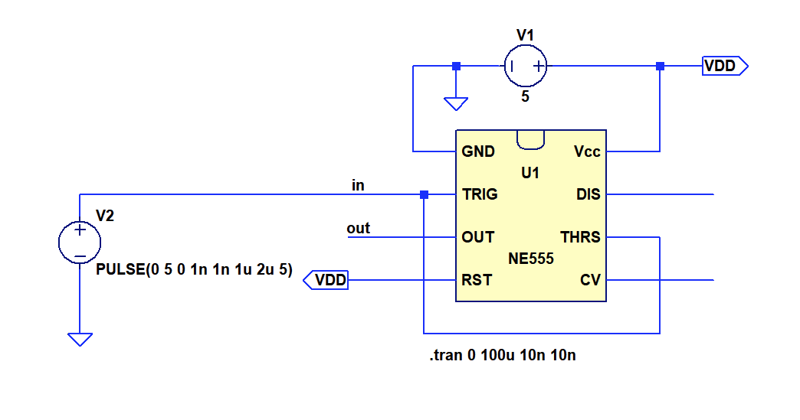

The first attempt with the model that comes with LTSpice showed correction operation of the circuit (plot below), however the timing was significantly faster than the real measurements.

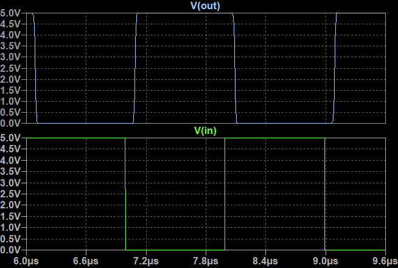

I switched to a model for CMOS version of the NE555, the TLC555, that was provided by TI. I found a modified version for LTSpice on the net. The timing looks much more simular to the real device now, although the CMOS version still seems to be about 3x faster than the original bipolar version.

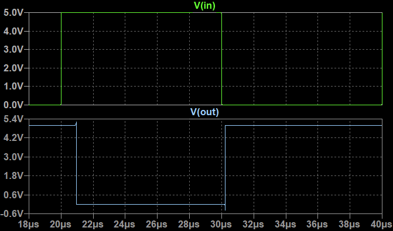

Now on to building and testing some gates

#### Inverter Implementation

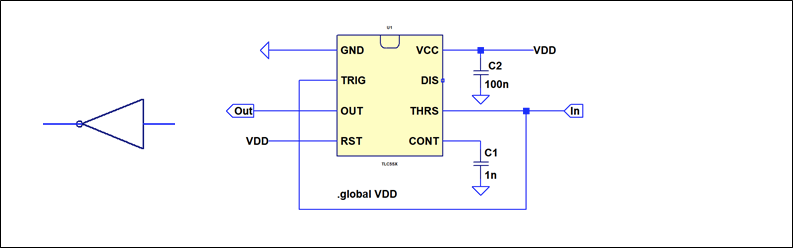

Self explanatory and tested before

#### NAND2 Implementation

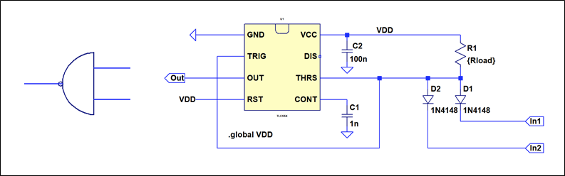

Here we are adding a wired AND at the input of the schmitt-trigger inverter formed by the NE555.

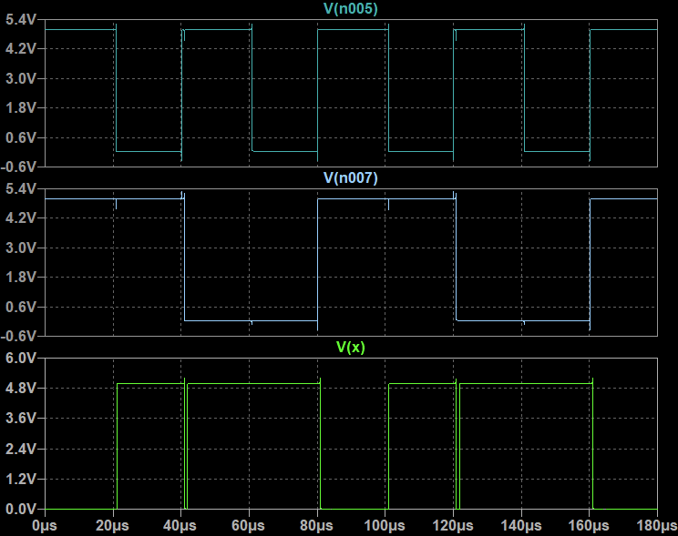

The gate works nicely, but it's obvios that the very high propagation delay of the NE555 inverters used at the input of the NAND2 lead to some glitches.

#### NOR2 implementaion

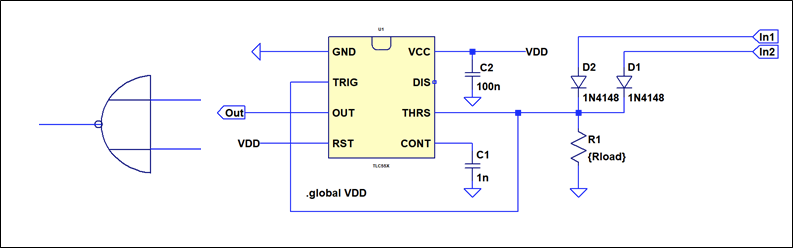

Turns out a NOR2 gate can also be implemented easily. Since the NE555 has a push-pull output we can use a wired OR at the input of the gate.

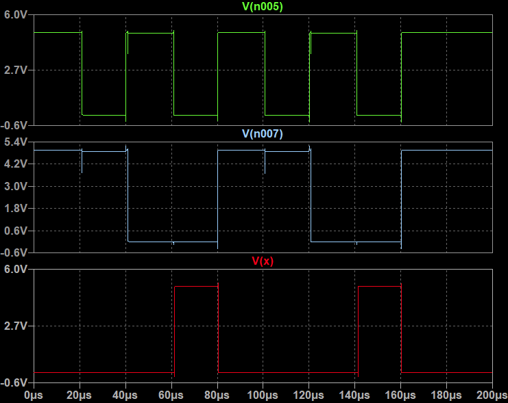

Works nicely

Edit: Turns out the NOR gate implementation is somewhat marginal. While the NE555 has a push-pull output driver, it uses darlington NPN for the pull up. This means it  cannot pull up to VCC/VDD. An additional diode in the current path, like in the wired-OR, drops too much voltage for the NOR gate to work reliabilty.

#### Conclusions

We now got a basic library of NOT, NOR2, NAND2 that can be easily explanded to wider input gates. All combinatoric gates can be formed from set of gates. Next step: Latches

### 4) NE555 based latches
<small>2021-12-05 18:00</small>

Latches and D-Flipflops have cause the biggest headache in every logic familiy I have implemented so far. This is no different with NE555 based logic. A straightfoward way would, of course, be to form a polarity hold latch out of 3 NAND2 gates. This would require 3 NE555, however, and seems to be a bit of a waste.

The NE555 has an integrated RS flipflop, meaning that a single NE555 should be sufficient for a latch. What is a bit tricky is to gate the data with the enable signal, so that the RS flip flop is either set for input=1 and EN=1 or cleared for input=0 and EN=0.

In the end I found a hacky way, using an NPN transistor as a pass gate. Since the NE555 logic is slows anyways, it does not matter that the pass gate is quite slow as well. The circuit is shown below.

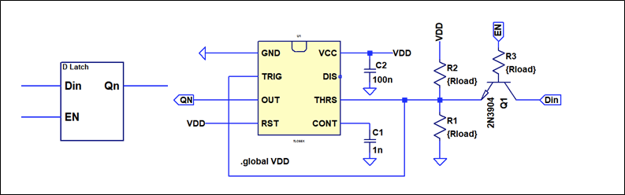

When the enable signal is low, the pass gate transistor Q1 is in a high ohmic state. The voltage divider formed by R1 and R2 will pull the input of the schmitt-trigger formed by the NE555 to VCC/2. This means that it will retain it's previous state, since neither of the switching threshold is reached. When EN goes high, the transistor becomes conductive and will pull the input high or low, depending on the state of "Din". If Din=0, the transistor is operated in reverse direction where it's hfe is rather low. Since the base current is equal to the current through R2, only a very low hfe is needed (1-2) to pull the input low.

The simulation below shows how the latch works. The lowermost trace is directly from the TRIG/THRS input of the NE555. You can see that it operates on three voltage levels, either to set, clear or keep the state of the schmitt trigger / RS flip flop.

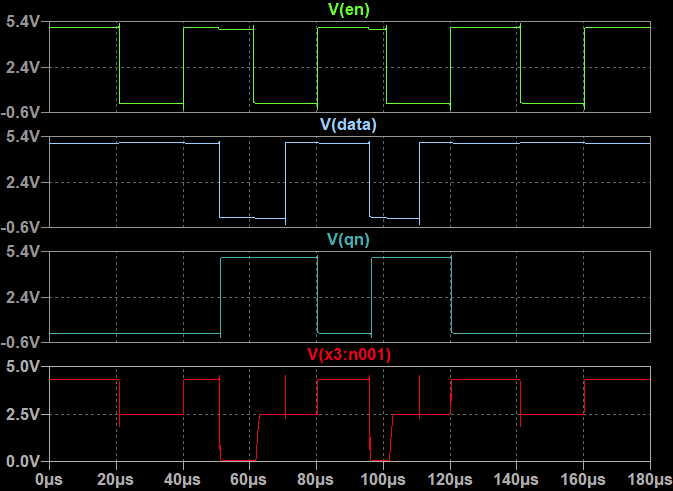

We can use two Latches and one inverter to form a full D-Flipflop.

If you feel that using a transistor is cheating: there is still the option of going to a latch with three NE555 as outlined above. 

This concludes our basic gates and we can now build both combinatoric logic and registers.

### 5) Plugging into PCBFlow - Synthesis
<small>2021-12-05 18:29</small>

Good thing I already have a design-flow to transform digital designs in exotic logic styles into PCBs: [PCBFlow.](https://hackaday.io/project/180839-vhdlverilog-to-discrete-logic-flow)

Now that all basic gates of our NE555 logic technology have been defined, I can start implementing the necessary technology description files to implement it into the flow.

The first step in the flow is the synthesis, which requires a description of the basic gates as a liberty file.  The description of NOT and NAND2 gate is found below. The area designates the number of NE555 required to implement this gate.

```json
library(SingleLogicCells) {

  cell(ne_NOT) {
    area: 1;
    pin(A) { direction: input; }
    pin(Y) { direction: output;
              function: "A'"; }
  }

  cell(ne_NAND2) {
    area: 1;
    pin(A) { direction: input; }
    pin(B) { direction: input; }
    pin(Y) { direction: output;
             function: "(A*B)'"; }
  }
}
```

I defined the following gates. including area usage: NOT(1),NAND2(1),NAND3(1),NOR2(1),NOR3(1),DFF(2.25). I assume that the inverter for the DFF is shared, therefore the area usage is only fractional.

In addition it is necessary to implement verilog black box implementations. Not shown, see file ("discrete_ne_logic_cells.v")

Our synthesis script for yosys (flow_discrete_ne.ys)

```makefile
# VHDL to NE555 logic

# elaborate VHDL code from GHDL
ghdl
hierarchy -check

# Read verilog description of cells
read_verilog -lib ../20_SYNTH/discrete_ne_logic_cells.v

# Rename top entity to 'main'. 

# Draw netlist of elaborated design
show -format pdf -prefix 200_diagramm_hdl_elaborated

# Technology mapping
techmap

proc; opt; fsm; opt; 
dfflibmap -liberty ../20_SYNTH/discrete_ne_logic_liberty.lib
abc -liberty ../20_SYNTH/discrete_ne_logic_liberty.lib
opt_clean

# Print Statistics
stat -liberty ../20_SYNTH/discrete_ne_logic_liberty.lib

# Draw netlist of optimized and mapped design
show -format pdf -prefix 201_diagramm_after_mapping

# Write out in spice format
write_spice 209_synthesized_output.sp


```

After a trivial addition to the run_20 script to add "NE" as a technology, we are now ready to synthesize the counter example:

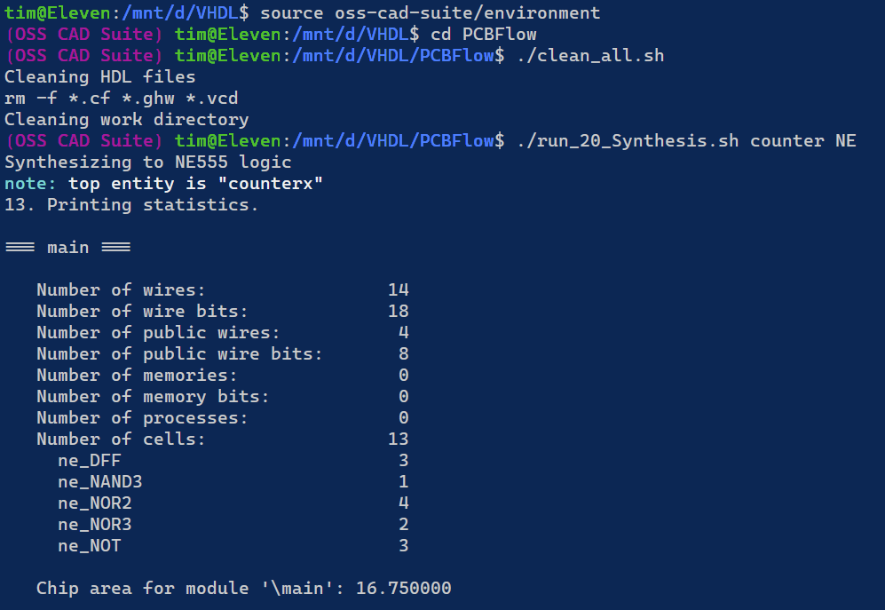

The first line sets up the environment for the [oss-cad-suite](https://github.com/YosysHQ/oss-cad-suite-build). The "clean_all" scripts cleans all intermediate files.
"run_20..." will invoke synthesis of the *counter.vhd* design into *NE.*Technology.

As we can see, the 3 bit counter takes up only 17 NE555. Let's try gates.vhd

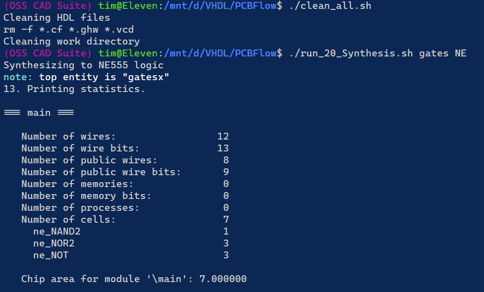

Source of gates.vhd below. It's a description of an AND gate and a full adder.

```php
library ieee;
use ieee.std_logic_1164.all;
use ieee.numeric_std.all;

entity gatesx is
    port (a,b:    in    std_logic;
          c,d:    in    std_logic;
          x,y,cout: out std_logic
    );
end;

architecture main of gatesx is
    signal adder: unsigned(1 downto 0);
begin
    x <= a AND b;

    adder <= ("0" & c) + ("0" & d);
    y <= adder(0);
    cout <= adder(1);
end;
```

Output before technology mapping:

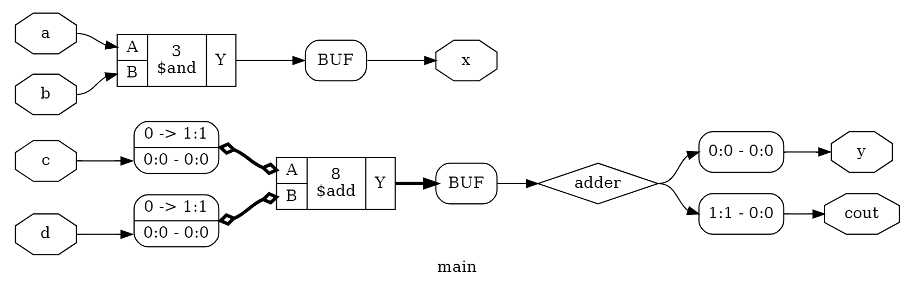

Output after technology mapping.

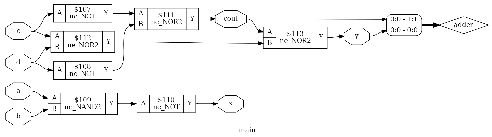

Works very nicely, thanks to the power of Yosys.

#### MCPU

Let's take a look at a full cpu, the MCPU:

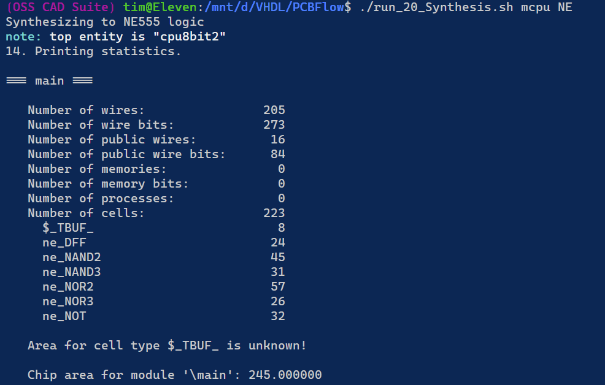

Works nicely as well. However, we are still missing the implementation of tristate buffers. Since this is not really desireable I would need to change the implementation of the MCPU a little. But it seems we need around 245 NE555 to implement a CPU. That's a lot, but not out of reach.

Ok, now we have completed the easy part of implementing NE555 logic into the design flow. The next crucial step will be to create spice models for the macro cells to simulate the synthesized design and the implementing the physical layout for the microcells on the PCBs. Especially this will be a bit tedious due to the number of different components required for NE555 logic.

### 6) Analog Simulation of Synthesized Design
<small>2021-12-07 21:24</small>

It's nice to simulate individual gates, but better the check whether they work together as well. I created a spice library describing the individual gates the I simultated in LTSpice before. The description of the NAND gate and Latch can be seen below:

```text

.SUBCKT ne_NAND2 A B Y
XU1 N001 N002 N001 VCC Y NC_01 VCC 0 TLC55X
C1 N002 0 1n
C2 VCC 0 100n
R1 VCC N001 {RL}
D1 N001 A RTL_DIODE
D2 N001 B RTL_DIODE
.ENDS ne_NAND2

.SUBCKT ne_LATCH E D QN
XU1 N001 N002 N001 VCC QN NC_01 VCC 0 TLC55X
C1 N002 0 1n
C2 VCC 0 100n
R1 N001 0 {RL}
Q1 D P001 N001 0 RTL_NPN
R2 VCC N001 {RL}
R3 E P001 {RL}
.ENDS DLATCH
```

Simulating the synthesized design turned out to be quite an ordeal. The TLC555 spice model makes extensive use of parametrised switches. This are described differently in different versions of spice, specifically LTSpice and NGSpice. I found adoption of the TLC555 spice model to both NGSpice and LTspice. Somehow I did not manage to get the full counter design to simulate properly with NGspice due to problems with the operating point analyises.

After many fruitless attempts I exported the entire netlist to LTSpice where it now resides in a testbench.

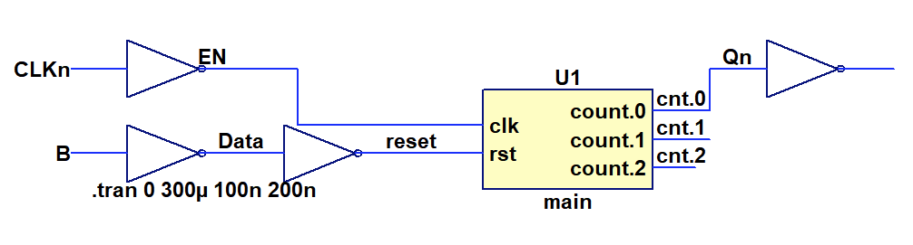

Eventually I managed to simulate the counter and was able to show that it actually works:

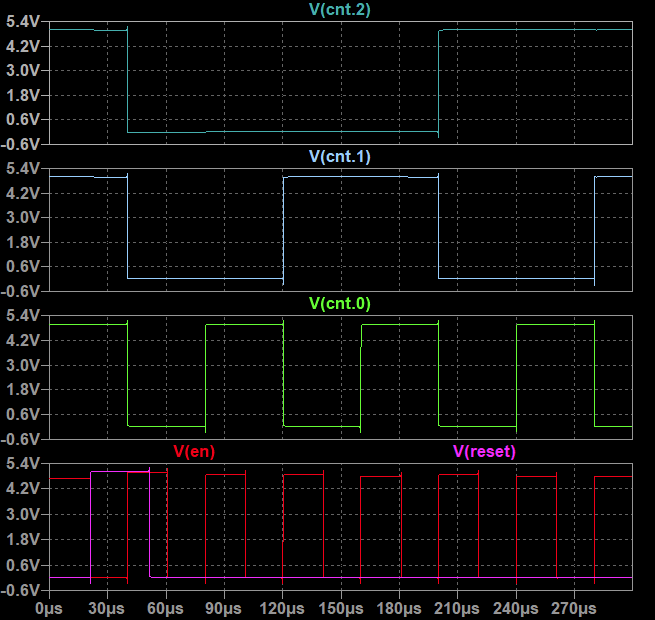

What I learned along the way: For some inexplicable reason the NOR gate implementation with wired-OR does not work if it is used within the full circuit. I was not able to identify the root cause, but solved it by excluding this gate type for now. Simulation is unfortunately taking forever due to convergence issues - Spice does not really like switches.

Nevertheless - design proven, now on to the cell library.

### 7) Microcell implementation
<small>2021-12-11 09:03</small>

Now that we managed to define the logic gate implementation and synthesis into a netlist, it is time to figure out how to implement the gates on a PCB. The placementtool PCBPlacer.py in [PCBFlow](https://github.com/cpldcpu/PCBFlow) does this by breaking down logic gates into microcells that represent very basic circuit unit. The rationale is to create a minimum set of microcells to simplify the desing. A secondary contrain is that each microcell should be roughly square shaped so that they can be arranged in a grid.

Currently supported gate types:

- NOT
- NAND2
- NAND3
- NAND4
- D-Flipflop

#### NOT-Gate / Inverter

The inverter can be directly implemented by a single NE555, hence it is not broken down further and represented by its on microcell ne_NOT.

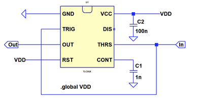

The code to place a NE555 plus decoupling capacitor on the PCB is shown below.

```python
    def insertNE555not(self, x, y, netin, netout, cellname=""):
        """Insert NE555 logic inverter """

        n_elements = self.n_board.find('elements')
        et.SubElement(n_elements, 'element', name = "Q"+cellname, library="discrete_logic_components", package="SOIC-8", value="NE555", x=str(x+1.6), y=str(y+3.7),rot="R90")
        self.countcomponent("NE555")

        self.addcontact('GND'   , "Q"+cellname, "1" ) # GND
        self.addcontact(netin   , "Q"+cellname, "2" ) # TRIG
        self.addcontact(netout  , "Q"+cellname, "3" ) # OUT
        self.addcontact('VCC'   , "Q"+cellname, "4" ) # RESET
#        self.addcontact(''     , "Q"+cellname, "5" ) # CONT
        self.addcontact(netin   , "Q"+cellname, "6" ) # THRESH
#        self.addcontact(''     , "Q"+cellname, "7" ) # DISCH
        self.addcontact('VCC'   , "Q"+cellname, "8" ) # VCC

        # always insert cap
        et.SubElement(n_elements, 'element', name = "C"+cellname, library="discrete_logic_components", package="CAP0402", value="CAP", x=str(x-1.8), y=str(y+3.7),rot="R90")
        self.countcomponent("cap")
        self.addcontact('VCC'  , "C"+cellname, "2" )
        self.addcontact('GND'  , "C"+cellname, "1" ) 
```

Resulting footprint for two inverters

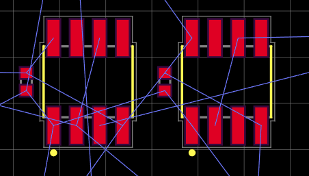

#### NAND2/NAND3/NAND4

The NAND2 gate can be broken down into a wired AND gate (resistor and diodes) and an inverter, so that each NAND gate is represented by two microcells: ne_NOT, ne_WANDx.

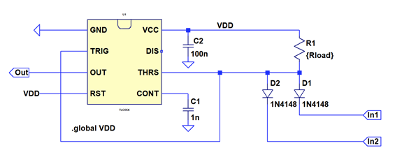

The code will automatically adjust the number of diodes according to the number of inputs

```python
    def insertNE555wand(self, x, y, netins, netout, cellname=""):
        """Insert wired and for NE555 logic """

        n_elements = self.n_board.find('elements')
        et.SubElement(n_elements, 'element', name = "R"+cellname, library="discrete_logic_components", package="RES0402", value="RES", x=str(x+3.25), y=str(y+6.1),rot="R90" )
        self.countcomponent("resistor")
        self.addcontact(netout , "R"+cellname, "1" )
        self.addcontact('VCC'  , "R"+cellname, "2" )

        xofs=0
        num=0
        for curnet in netins:
            et.SubElement(n_elements, 'element', name = "D"+cellname+str(num), library="discrete_logic_components", package="SOD-323", value="1N4148WS", x=str(x+0.75), y=str(y+1+3*1.75-xofs))
            self.countcomponent("diode")
            self.addcontact(netout , "D"+cellname+str(num), "A" )
            self.addcontact(curnet , "D"+cellname+str(num), "C" )
            self.devcounter += 1 
            xofs = xofs + 1.75
            num = num + 1
```

Resulting layout for NAND3

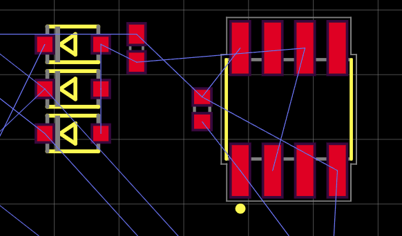

#### D-Flipflop

The D-Flipflop is implemented as a master and slave latch consisting of an inverter (for the clock) and two latches. Each latch is then broken down into a transmission gate (transistor+3x resistor) ne_TBUF and an inverter. ne_NOT.

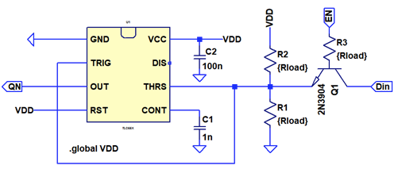

In total, each DFF is broken down into five microcells (3x ne_NOT, 2x ne_TBUF). I implemented some code to remove redundant clock inverters, so that some DFF can be reduced to four microcells. This is possible due to the push/pull output of the NE555.

The layout for one latch, consisting of ne_BUF and ne_NOT is shown below.

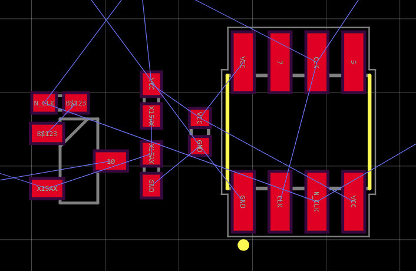

Having completed all the microcells, we can now generate a full PCB based on NE555 logic!

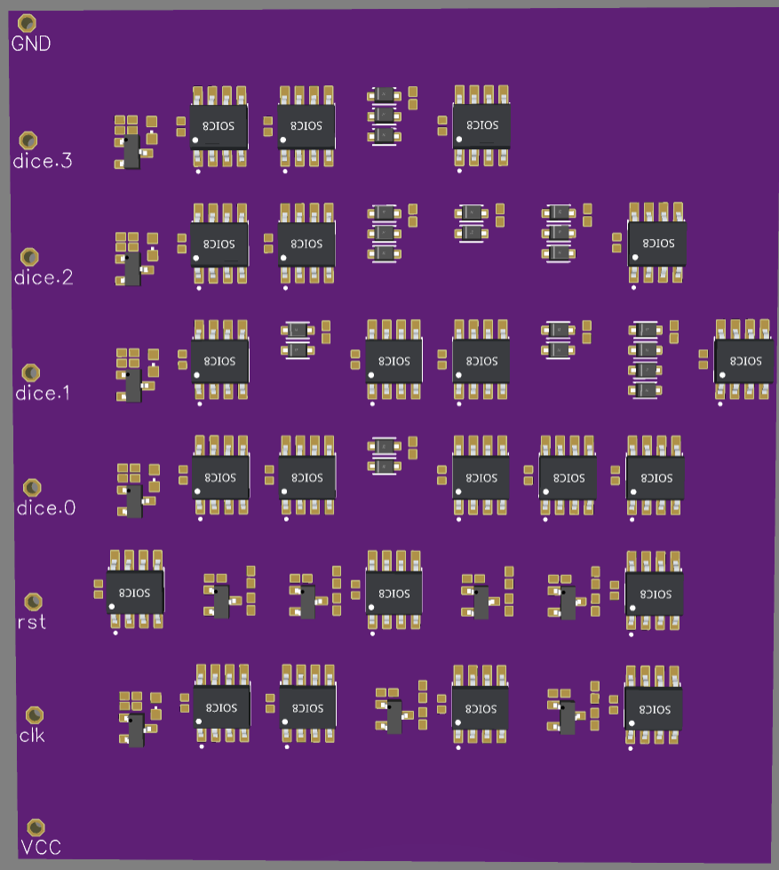

Next step: Implementing post layout verification.

### 8) Post Layout Simulation, Testing Actual Designs
<small>2021-12-11 12:13</small>

Again, it turns out that introducing post-layout simulation was a very good thing. I found a bug in the cell library that caused the counter to fail after placemenent. Everything works now!

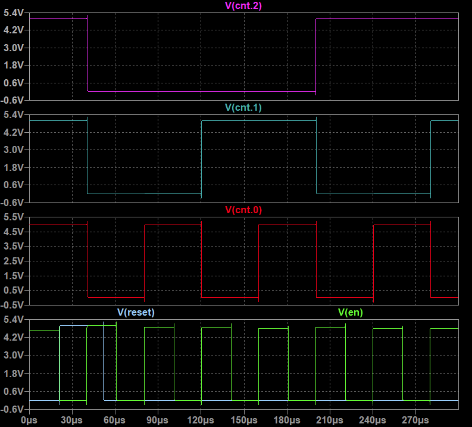

Short routing test of the counter - placement works nicely

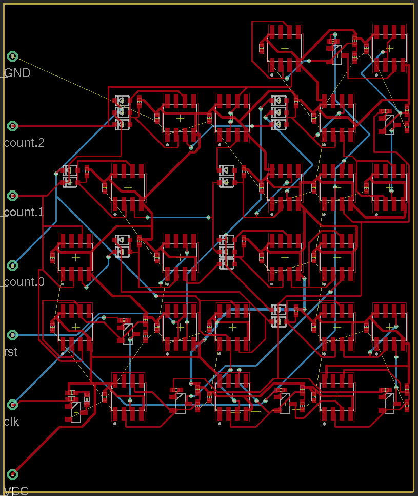

### 9) Finally - A CPU
<small>2021-12-11 13:45</small>

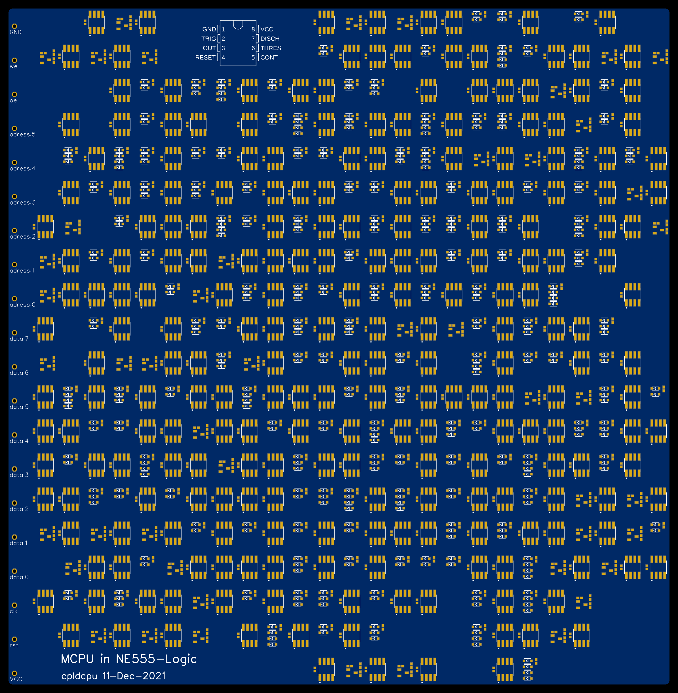

Finally, now that everything came together for the NE555 logic flow, we can use it on an actual microprocessor. Above, you can see the result of synthesizing and placing the [MCPU](https://github.com/cpldcpu/MCPU) in NE555 logic. The MPCU is quite simple, it's an 8 bit CPU with only four instructions and optimized for small size. 

Of course, any kind of discrete logic takes up a lot of PCB space and NE555 logic is a bit on the larger side. So even for this simple CPU we end up with a PCB that is about 200x200mm^2.

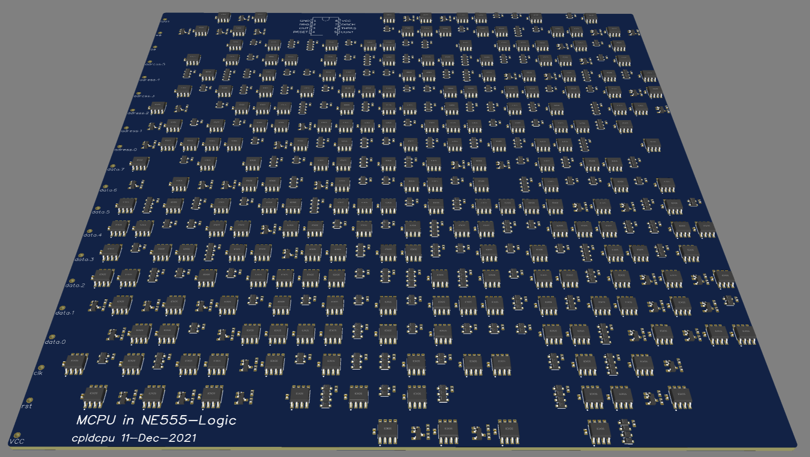

A 3D rendering out of EasyEDA above.

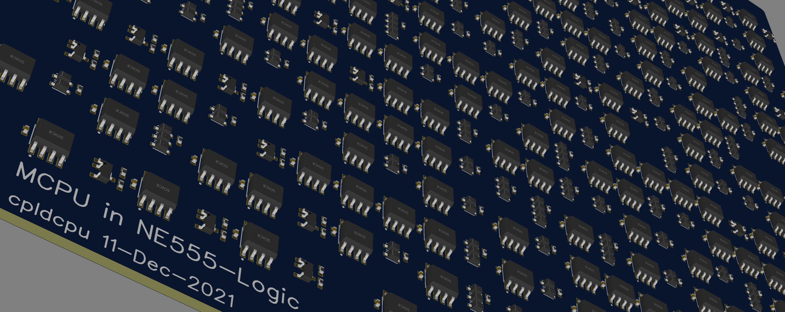

And one more.

##### The final microcell counts

```text

ne_NOT      234
ne_WAND2     72
ne_WAND3     48
ne_TBUF      48
ne_WAND4     23
IO           20
__TBUF_       8
```

##### Total component usage

```text

Component           Count
pin                 20
NE555               234
cap                 234
resistor            287
diode               380
npn transistor      48
------------------  -----
Total:              1203

```

I will not route and build the design for now, as I need to design a CPU testbed first. I have another NE555 design in preparation that I am planning to build first, but that will be in a different project.

> Exported from Hackaday.io [555ENabled Microprocessor](https://hackaday.io/project/182915-555enabled-microprocessor)
