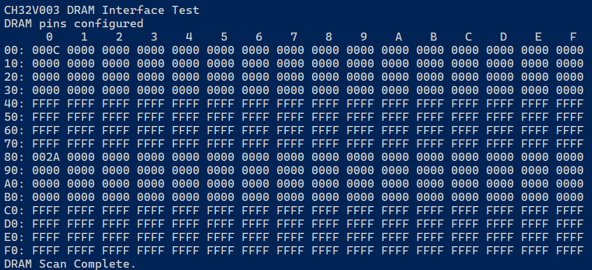
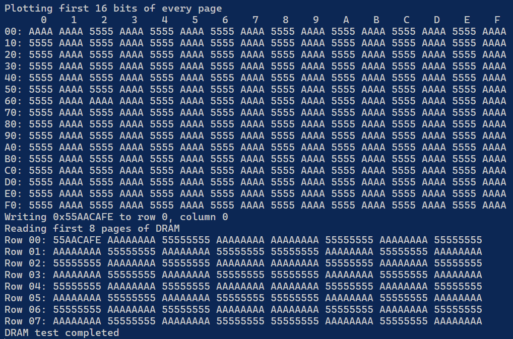

+++
title = "Compute In Memory in Ancient DRAM"
summary = "Massively parallel operations in a 64kx1 DRAM from the 1980ies"
date = "2025-05-04T00:00:00"
draft = false
hackaday_url = "https://hackaday.io/project/203030-compute-in-memory-in-ancient-dram"
featured = "featured.jpg"
showHero = true
heroStyle = "background"
layoutBackgroundBlur = false
+++
*Massively parallel operations in a 64kx1 DRAM from the 1980ies*

## Details

Compute-in-Memory (CIM) is a very active topic in current research, aiming to perform arithmetic operations directly on information stored in a memory array. There are two benefits to that: Firstly, it would enable massively parallel computation on a large amount of data at the same time. Secondly, it would save power that is usually associated with moving data through the memory hierarchy to a CPU or GPU.

While there are a myriad of approaches to addressing this objective, there is a strong interest to stay close to existing memory technologies.  A few years ago, researchers have proposed a[method to implement parallel AND and OR operations in standard DRAM](https://users.ece.cmu.edu/~omutlu/pub/in-DRAM-bulk-AND-OR-ieee_cal15.pdf). Essentially, two or more rows of memory capacitors in a DRAM are connected so that their charge can equalize. This allows implementing several  logic operations in the analog domain without adding any additional circuitry to the DRAM array.

Curiously, another group found a way to implement these operations in **off-the-shelf DRAM**(["ComputeDRAM: In-Memory Compute Using Off-the-Shelf DRAMs"](https://parallel.princeton.edu/papers/micro19-gao.pdf)) by cleverly violating the timing parameters. Earlier it was also shown how to copy data within the DRAM wihtout leaving the chip ("[RowClone: Fast and Energy-Efficient
In-DRAM Bulk Data Copy and Initialization](https://users.ece.cmu.edu/~omutlu/pub/rowclone_micro13.pdf)").

Taking these building blocks, a more recent publication even implements parts of large language model (LLM) computations in memory using this approach. (["MVDRAM: Enabling GeMV Execution in Unmodified DRAM for Low-Bit LLM Acceleration"](https://arxiv.org/abs/2503.23817)).

Now, if this isn't a glorious hack, what is?

Now, of course working with modern DRAMs is not that easy, and this reasearch required a relatively advanced setup with a modern FPGA (["DRAM Bender"](https://github.com/CMU-SAFARI/DRAM-Bender))

*But, how about using an older, slow, DRAM and pair it with a modern microcontroller? Let's see how far we get.*

## Project Logs
### 1) Experimental Set Up
<small>2025-05-05 20:40</small>

I will be experimenting with 4164 DRAMs chips which were used as main memory in many computers in the early 80ies. They are organized as 64k*1, so that eight chips are required for 64kbytes of RAM. Luckily I found a few from different vendors in my parts bin (I think I had more, but just kept one from each vendor.)

The 4164 required a single 5V supply. Their access times are rather slow, 200ns to 300ns for the devices I have. The generation rationale behind this experiment is that modern microcontrollers are vastily faster than these devices and can be used to generate timing violations required for compute-in-memory instead of having to use a FPGA.

I am going to use a CH32V003 microcontroller. These are rather low cost devices, but they come with 48MHz system clock and a RISC-V core (RV32EC), which as able to execute instructions 100-150x faster than a 1MHz 6502 from the 80ies. In addition, they offer 5V I/O which greatly simplifies interfacing to the 4164.


Some devices and the pinout are shown above. One rather **nasty** detail about these memory chips is that their supply connections are swapped compared to the standard TTL/CMOS corner layout. (Someone spent 2 hours debugging a magically self-heating chip...)

Wiring diagram and set up on breadboard shown below

```markdown
| 4164 DRAM Pin | Function | CH32V003 Pin |
|---------------|----------|--------------|
| 1             | NC       | -            |
| 2             | DIN      | PD0          |
| 3             | W/R      | PD4          |
| 4             | RAS      | PD3          |
| 5-13          | A0-A7    | PC0-PC7      |
| 8             | VCC      | 5V supply    |
| 14            | DOUT     | PD5          |
| 15            | CAS      | PD2          |
| 16            | GND      | GND          |

```


### 2) Accessing the Memory
<small>2025-05-05 21:09</small>

A classical DRAM only has few  control lines

```text

A0-A7        Multiplexed Address Lines
Din, Dout    Datain/out. These lines can be shorted together for bidirectional I/O
nWE          Write enable. When low, the selected memory cell is written to. 
nRAS         Row Access Strobe - "Open" a row in the memory array
nCAS         Column Access Strobe - selecto which bits in the row to access.
```

A 64k*1 DRAM consists of a memory array of 256 columns and 256 rows.  Each memory cell is made up of a transistor and a capacitor.

The core functionality of a DRAM is actually controlled by the RAS line. When it is pulled low ("Access"), the row indicated by the address pins is loaded from the memory arrray into the bitlines by activating the transistors in the memory cells. Since the charge on the capacitors is fairly small, the bitlines will only change their voltage slightly. However, at the same time the read amplifiers are activited, which will amplify the small voltage on the bitlines ("Sense") and pull the bitlines to up/down ("Restore").

This serves two functions: 
  1) It will amplify the bitlines voltages enough so that they can be sensed as a logical level. 
  2) At the same time, it is refreshing the charge on the memory cells.

In a next step, it is possible to complete the row access by pulling up RAS. That would complete a refresh cycle. After the RAS line is pulled up again, the "Precharge" cycle begins, where the bit lines are pulled to a reference voltage of ~0.5Vdd.

Alternativey, the RAS line can stays low and the CAS lines is pulled low in addition. This will allow reading from or writeing to one of the 256bits of the ROW.


*Image from M. Hwang et al. [https://doi.org/10.3390/electronics8080865](https://doi.org/10.3390/electronics8080865) CC BY*
I used a transimpedance amplifier to measure the current consumption of a DRAM during the row access, as shown below. We can see a spike associated with the row activation, which likely stems from charging the wordline, which is connected to the gates of all transistors of the row we want to access. While RAS is low, we can see an increase current consumption from the read amplifiers. Once the row is deactivated, we can see another current spike that is associated with pulling low the word line and precharging the bit lines.


Now this is interesting - even if we only want to access a single bit in the DRAM, we actually have to load an entire ROW of 256bits from the memory array. So, why not do something with all 256bits in parallel?

### 3) Implementing DRAM access functions
<small>2025-05-10 12:04</small>

Reading and writing can be easily implemented by bitbanging.  To meet DRAM timing requirements we have to introduce delays by introducing various NOP cycles.

```cpp
// Compile-time delay macros for exact cycle counts without loop overhead
#define DELAY_1_CYCLES() __asm volatile ("nop")
#define DELAY_2_CYCLES() __asm volatile ("nop\nnop")
#define DELAY_3_CYCLES() __asm volatile ("nop\nnop\nnop")
#define DELAY_4_CYCLES() __asm volatile ("nop\nnop\nnop\nnop")
#define DELAY_5_CYCLES() __asm volatile ("nop\nnop\nnop\nnop\nnop")

// Specific delay macros for each timing parameter
#define DELAY_RAS_CYCLES() DELAY_5_CYCLES() // ~100ns
#define DELAY_CAS_CYCLES() DELAY_5_CYCLES() // ~100ns
#define DELAY_RCD_CYCLES() DELAY_2_CYCLES()  // ~20ns
#define DELAY_RP_CYCLES()  DELAY_5_CYCLES() // ~100ns
```

The code below cycles first RAS and then CAS to read a bit from the array at the given address (designated as rows and columns).

```cpp
// Read a bit from DRAM
uint8_t dram_read_bit(uint8_t row, uint8_t col) {
    uint8_t data;

    // Ensure read mode
    GPIOD->BSHR = DRAM_WR_PIN;  // W/R high (read mode)

    // Set row address
    DRAM_ADDR_PORT->OUTDR = row;
    DELAY_2_CYCLES(); // Delay for address setup time    
    GPIOD->BCR = DRAM_RAS_PIN;  // RAS low (active)    
    DELAY_RCD_CYCLES();        // RAS to CAS delay

    // Set column address
    DRAM_ADDR_PORT->OUTDR = col;
    GPIOD->BCR = DRAM_CAS_PIN;  // CAS low (active)
    DELAY_CAS_CYCLES();        // CAS pulse width

    // Read data bit
    data = (GPIOD->INDR & DRAM_DOUT_PIN) ? 1 : 0;

    // End cycle
    GPIOD->BSHR = DRAM_CAS_PIN; // CAS high (inactive)
    GPIOD->BSHR = DRAM_RAS_PIN; // RAS high (inactive)
    DELAY_RP_CYCLES();         // RAS precharge time

    return data;
}
```

In case more than one bit needs to be read from one ROW, it is possible to use mutliple CAS cycles without opening another row.

```cpp
// Read a int32 value from DRAM using fast page mode
uint32_t dram_read_fpm(uint8_t row, uint8_t col, uint8_t bits) {
    uint32_t data=0;
    uint32_t bitcount=0;

    if (bits>32) {
        bits=32;
    }   

    // Ensure read mode
    GPIOD->BSHR = DRAM_WR_PIN;  // W/R high (read mode)

    // Set row address
    DRAM_ADDR_PORT->OUTDR = row;
    DELAY_2_CYCLES(); // Delay for address setup time    
    GPIOD->BCR = DRAM_RAS_PIN;  // RAS low (active)    
    DELAY_RCD_CYCLES();        // RAS to CAS delay

    for (bitcount=0; bitcount<bits; bitcount++) {
        // Set column address
        DRAM_ADDR_PORT->OUTDR = col + bitcount;
        GPIOD->BCR = DRAM_CAS_PIN;  // CAS low (active)
        DELAY_CAS_CYCLES();        // CAS pulse width

        // Read data bit
        if (GPIOD->INDR & DRAM_DOUT_PIN) {
            data |= (1<<bitcount);
        }

        // End cycle
        GPIOD->BSHR = DRAM_CAS_PIN; // CAS high (inactive)
        DELAY_CAS_CYCLES();        // CAS pulse width
    }

    GPIOD->BSHR = DRAM_RAS_PIN; // RAS high (inactive)
    DELAY_RP_CYCLES();         // RAS precharge time

    return data;
}

```

In the same way, it is possible to implement writes (pull R/W low). It is also possible to implement Read-Modify-Write cycles on the same row. There are quite some optimizations to improve memory throughput even on these very old DRAMs. Curiously, the old home computers do not use any of these optimizations (FPM, RMW), since their CPUs and remaining chipsets where so slow that they limited system speed.

##### Refresh

An important additional aspect is to refresh the DRAM array. The charge on the capacitors is slowly leaking away and the information will be lost after a while. To counteract this, it is  necessary to read out every row within 4 ms cycle and write it back.

For this, it is only necessary to cycle RAS.

```cpp
// Refresh a single row
void dram_refresh_row(uint8_t row) {
    // RAS-only refresh cycle
    DRAM_ADDR_PORT->OUTDR = row;  // Set row address
    GPIOD->BCR = DRAM_RAS_PIN;    // RAS low (active)
    DELAY_RAS_CYCLES();          // RAS pulse width    
    GPIOD->BSHR = DRAM_RAS_PIN;   // RAS high (inactive)
    DELAY_RP_CYCLES();           // RAS precharge time
}
```

### 4) Reset Behavior
<small>2025-05-12 20:20</small>

Now we can read and write the DRAM. To inspect the basic behavior of the memory array, i displayed the first word of every of the 256 pages after turning on the power:


All memory cells start with the same voltage on the capacitor (0V I presume, since the memory was powered off). However, half the memory cells are set to 0 and half to 1, depending on the row.

The reason for this is that the read amplifiers are actually differential amplifiers. Half of the memory cells are connected to the inverting branch and half to the noninverting branch. The purpose of this is to balance bitline capacitance by ensuring that the same number of memory cells is connected to each bitline. When the a row is activated it will either change the voltage on the inverting or noninverting bitline and hence we either get a 0 or a 1 for 0V initial charge on the capacitor.

As a rather curious observation, I found that the pattern inverts when the DRAM is left powered on (VDD=5V) for a while without refresh. I believe that in this case the voltage on the capacitors is increasing due leakage form a rail with positive to the capacitor - possible from the bitlines which are held at VDD/2 while the DRAM is inactive.



How the positive and negative rows are distributed among the rows depends on how the wordline decoder is designed. I have seen some DRAMs that alternate even and odd rows and some that even alternative bits. 

One particularily interesting case is the reset pattern of the U2164C DRAM (manufactured in East Germany during cold war times). I suppose they saved some um^2 by connecting the cells in a wild pattern?

There is a die-shot of a similar device [here](https://www.richis-lab.de/RAM08.htm), and it seems that they segmented the 64k array into several sub arrays, which may explain the weird behavior. Probably it's segmented by even and odd bits. 

Ok, on to the actual hacking.

### 5) Setting / Erasing entire rows at once
<small>2025-05-15 21:09</small>

So far I have only verified normal operation of the DRAM. Now lets move on the the hacking.

The RAS signal controls the internal operations of the DRAM, many of which are limited in their speed by internal capacitances. Since the CH32V003, which I am using to control the DRAM, is clocked at 48MHz, it can actually toggle the control signals faster than the internal signals of the DRAM can follow.

Let's first look at a situation where we pull the RAS signal low for only 40ns (two 48MHz clocks), shown as "RAS glitch low" in the scope image below.


Before the RAS signal is pulled low, the bitlines of the array are precharged to VDD/2. On the falling edge of the RAS signal, the ROW address is latched and then the wordline of the corresponding row is activated to connect the memory cells of the row to the bitlines. The cell capacitors are discharged to the bitlines. At the same time, the read amplifiers are activated. However, since we immediately pull up RAS again, the read amplifiers do not have enough time to restore logic levels on the bitlines and the discharged memory cells are not refreshed.

Let's have a look what happens when we do that.

```cpp
void dram_set_row(uint8_t row,int32_t reps) {
    // RAS-only refresh cycle
    GPIOD->BSHR = DRAM_RAS_PIN;   // RAS high (inactive)
    GPIOD->BSHR = DRAM_CAS_PIN;   // CAS high (inactive)
    DRAM_ADDR_PORT->OUTDR = row;  // Set row address
    DELAY_3_CYCLES();             // Make sure row address is latched

    for (int32_t i=0; i<reps; i++) {
        GPIOD->BCR = DRAM_RAS_PIN;    // RAS low (active)
        GPIOD->BSHR = DRAM_RAS_PIN;   // RAS high (inactive)
        DELAY_RP_CYCLES();            // RAS precharge time -> ensureds bitlines are at VDD/2
    }

    dram_refresh_row(row);             // Refresh the row to ensure stable levels on the cells
}
```

The code above will glitch RAS low for a predefined number of times and then refresh the row to ensure the levels in the cells are stable.


The log above shows the results of applying different numbers of RAS low glitches. First we write a dummy pattern into row 0 (noninverting) and row 0x40 (inverting). Then the glitch is applied 0,1,2 times.

We can see that after applying the glitch, the entire row is reset to a stable level, either 1 for the noninverting or 0 for the inverting row. In some instances it also takes two cycles to reach a stable level."***So what?  is this good for anything?"***Yes! We can now delete entire rows (256 bits) of memory at once, in less than 1us. A 1980ies CPU like the 6502, would have taken around 10 cycles per bit, totalling ~2500 cycles. Now, being able to do this in 1us would be a speedup of more than 2000x, assuming a 1 MHz 6502.

### 6) Copying Rows
<small>2025-05-17 23:08</small>

Now that we can set/erase entire rows, lets move on to another exploit: Copying rows. This approach has been outlined in [*RowClone: Fast and Energy-Efficient In-DRAM Bulk Data Copy and Initialization*](https://users.ece.cmu.edu/~omutlu/pub/rowclone_micro13.pdf) in 2013.

We are using the access pattern that I called "RAS glitch high" for this, as shown in the scope image below.


Copying rows works as follows:

1. The source row is opened by pulling RAS low.
2. The rows content is now loaded onto the bitlines and the read amplifiers will restore the charge from the array capacitors to full logic levels.
3. We set the address of the target row on the address lines
4. RAS is toggled to hi level for 40ns. This will activate the target row and connect it to the bitlines. Since the short RAS high time was not long enought to precharge the bitlines, they still contain the information from the source row. The low charge of the target row cells capacitors is not able to override this, so that the information from the source row is retained
5. The read amplifiers will amplify the voltage levels on the bitline, which are dominated by the source row, and write the information to the target row

The code for this is shown below:

```cpp
// Copy a row to another row
void dram_copyrow(uint8_t row1, uint8_t row2) {
    // Ensure read mode
    GPIOD->BSHR = DRAM_WR_PIN;  // W/R high (read mode)

    // Set row address
    DRAM_ADDR_PORT->OUTDR = row1;
    DELAY_RP_CYCLES();         // RAS precharge time
    GPIOD->BCR = DRAM_RAS_PIN;  // RAS low (active)  
    DELAY_RCD_CYCLES();         // RAS to CAS delay
    DRAM_ADDR_PORT->OUTDR = row2;
    DELAY_2_CYCLES();           // RAS to CAS delay

    // Open row2 while bitlines are still precharged with row1 content
    GPIOD->BSHR = DRAM_RAS_PIN; // RAS high (inactive)
    // violate RAS precharge time
    GPIOD->BCR = DRAM_RAS_PIN;  // RAS low (active)    

    DELAY_RAS_CYCLES();         // CAS pulse width

    // End cycle
    GPIOD->BSHR = DRAM_RAS_PIN; // RAS high (inactive)
    DELAY_RP_CYCLES();          // RAS precharge time
}
```

Test results are shown below. It is possible to copy rows between inverting and non-inverting areas of the DRAM array - the read amplifiers will ensure the correct polarity of source and target rows.


We are now able to copy a complete 256 bit or byte (assuming 8 chips in parallel) row in less than 1us! (~600ns actually). A 6502 at 1 Mhz would take around 15 cycles per byte, ~3800 cycles in total, to copy the same amount of data, around 4000 times slower!

Now, curious, that this mode was first reported in 2013 when it actually worked in 1983 DRAM as well? What would have been possible, if the home computer of that time had an ultra fast block copy ability?

### 7) Interlude: CH32V003 Instruction Timing and Limitations
<small>2025-06-09 08:56</small>

The next compute-in-memory operation to implement would be some kind of boolean operation between two or three rows. This can be achieved by aborting row loading before it has been completely refreshed and then immediately open another row, so that the charges from the first and second row can combine on the bitlines.

This requires very fast timing. Unfortunately it turned out that it is not possible to toggle GPIOs on the CH32V003 in a single cycle using bit banging, the minimum is two cycles. 

I spent quite some time investigating this issue. There are various unfortunate combinations of flash waitstates, lack of instruction buffers and bus contention that lead to this.

Experiments and more details are here:
[https://github.com/cpldcpu/DRAM_exploration/blob/master/instruction_timing/README.md](https://github.com/cpldcpu/DRAM_exploration/blob/master/instruction_timing/README.md)

So, that means I have to look for an alternative approach to generating the necessary timing.

> Exported from Hackaday.io [Compute In Memory in Ancient DRAM](https://hackaday.io/project/203030-compute-in-memory-in-ancient-dram)
