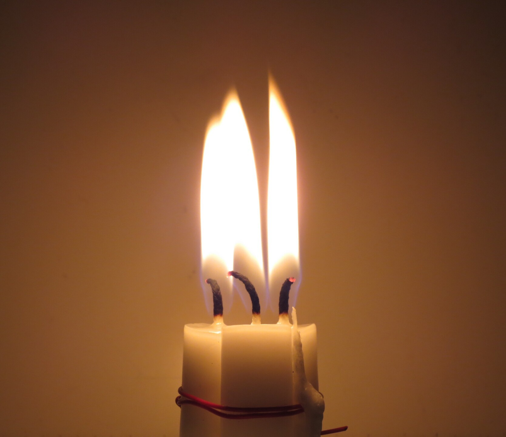
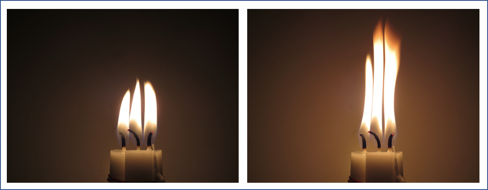
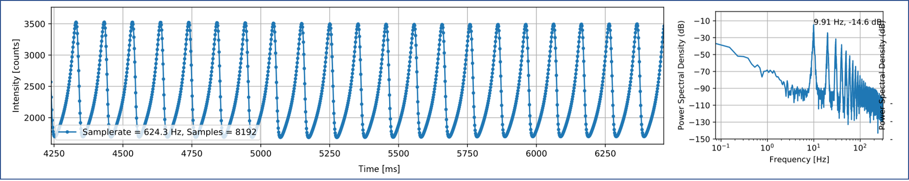
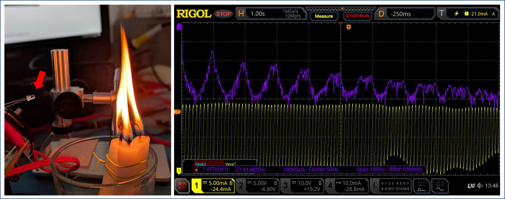
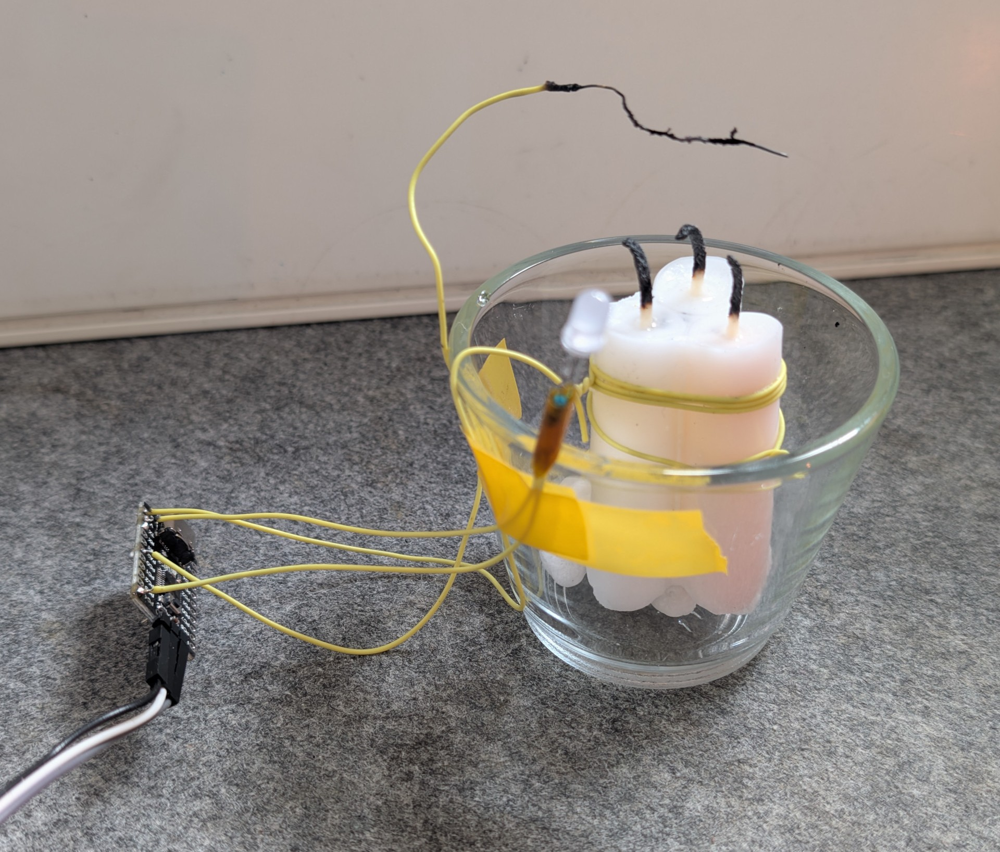
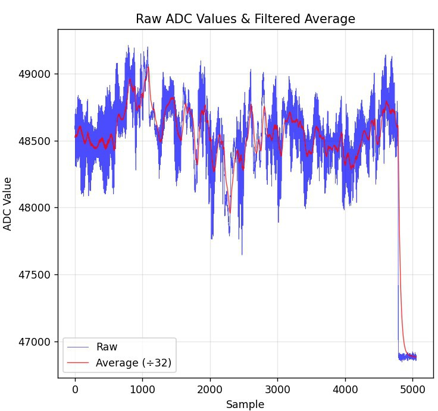
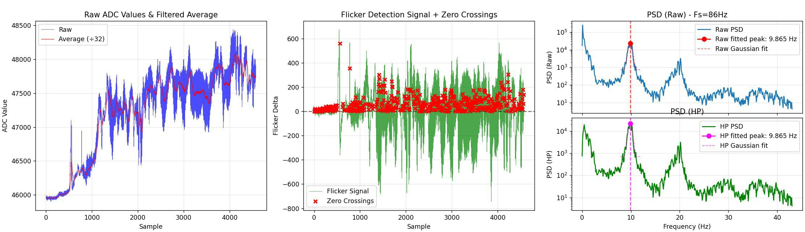
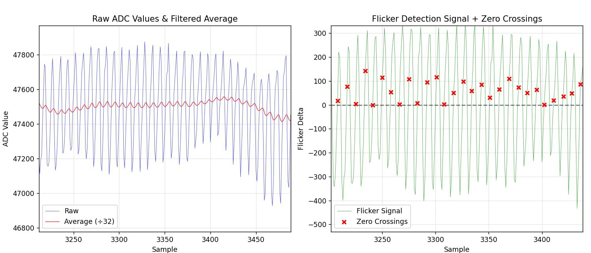

+++
title = "Deriving 1 Hz from Candle Flame Oscillations"
summary = "Using capacitive sensing to measure the oscillation of a candle flame and converting it to a 1 Hz clock"
date = "2025-08-12T00:00:00"
draft = false
hackaday_url = "https://hackaday.io/project/203763-deriving-1-hz-from-candle-flame-oscillations"
featured = "featured.jpg"
showHero = true
heroStyle = "background"
layoutBackgroundBlur = false
+++
*Using capacitive sensing to measure the oscillation of a candle flame and converting it to a 1 Hz clock*

## Details

Todays candles have been optimized **not** to flicker. But it turns out when we bundle three of them together, we can undo all of these optimizations and the resulting triplet will start to naturally oscillate. A fascinating fact is that the oscillation frequency is rather stable at ~9.9Hz as it depends mainly on gravity and diameter of the flame.

We use a rather unusual approach based on capacitive sensing with a wire to detect this frequency and divide it down to a 1 Hz clock for a time base.
**[Link to project repository.](https://github.com/cpldcpu/CandleSense)**
<!-- 
[View the logs in order](https://hackaday.io/project/203763/logs?sort=oldest)

1. [Candle Flicker is a Curious Thing - Can we control it?](https://hackaday.io/project/203763-deriving-1-hz-from-candle-flame-oscillations/log/242631-candle-flicker-is-a-curious-thing-can-we-control-it)
2. [The Candle Flame Oscillator](https://hackaday.io/project/203763-deriving-1-hz-from-candle-flame-oscillations/log/242632-the-candle-flame-oscillator)
3. [Detecting Flame Oscillations with a Wire](https://hackaday.io/project/203763-deriving-1-hz-from-candle-flame-oscillations/log/242653-detecting-flame-oscillations-with-a-wire)
4. [Putting it all together to generate a 1 Hz clock](https://hackaday.io/project/203763-deriving-1-hz-from-candle-flame-oscillations/log/242656-putting-it-all-together-to-generate-a-1-hz-clock) -->

## Project Logs
### 1) Candle Flicker is a Curious Thing - Can we control it?
<small>2025-08-12 06:40</small>

Candlelight is a curious thing. Candles seem to have a life of their own: the brightness wanders, they flicker, and they react to the faintest motion of air.

There has always been an innate curiosity in understanding how candle flames work and behave. In recent years, people have also extensively sought to emulate this behavior with electronic light sources. I have also been fascinated by this and tried to understand [real candles](https://cpldcpu.com/2016/01/05/reverse-engineering-a-real-candle/) and how [artificial candles](https://cpldcpu.com/2013/12/08/hacking-a-candleflicker-led/) work.

Now, it's a curious thing that we try to emulate the imperfections of candles. What if I told you that candle makers have worked for centuries (and millennia) on optimizing candles NOT to flicker?

In essence: The trick is that there is a very delicate balance in how much fuel (the molten candle wax) is fed into the flame. If there is too much, the candle starts to flicker even when undisturbed. This is controlled by how the wick is made.

There is a particularly fascinating effect that has more recently been the subject of publications in high-profile scientific journals^[1] ^[2]: When several candles are brought close to each other, they start to "communicate" and their behavior synchronizes.

The simplest way is to bundle three candles together - they will behave like a single large flame, as shown below.



[1] Okamoto, K., Kijima, A., Umeno, Y. & Shima, H. "Synchronization in flickering of three-coupled candle flames." *Scientific Reports* 6, 36145 (2016).

[2] Chen, T., Guo, X., Jia, J. & Xiao, J. "Frequency and Phase Characteristics of Candle Flame Oscillation." *Scientific Reports* 9, 342 (2019).

### 2) The Candle Flame Oscillator
<small>2025-08-12 07:51</small>

So, what happens with our bundle of three candles? It will basically undo millennia of candle technology optimization to avoid candle flicker. If left alone in motionless air, the flames will suddenly start to rapidly change their height and begin to flicker. The image below shows two states in that cycle.



We can also record the brightness variation over time to understand this process better. In this case, I used a high-resolution ambient light sensor to sample the flicker over time. (This was part of more comprehensive experiments I conducted a while ago, which I'll write up in detail eventually.)

Plotting the brightness evolution over time shows that the oscillations are surprisingly stable, as shown in the image below. We can see a very nice sawtooth-like signal: the flame slowly grows larger until it collapses and the cycle begins anew.

On the right side of the image, you can see the power spectral density plot of the brightness signal on the left. The oscillation is remarkably stable at a frequency of 9.9 Hz.



This is very curious. Wouldn't you expect more chaotic behavior, considering that everything else about flames seems so random?

The phenomenon of flame oscillations has baffled researchers for a long time. Curiously, they found that **the oscillation frequency of a candle flame** (or rather a "wick-stabilized buoyant diffusion flame") **depends mainly on just two variables: gravity and the dimension of the fuel source.** A comprehensive review can be found in [3].

Now that is interesting: gravity is rather constant (on Earth) and the dimensions of the fuel source are defined by the size (diameter) of the candles and possibly their proximity.

**This leaves us with a fairly stable source of oscillation, or timing, at approximately 10Hz.**

There was this 1 Hz competition? So, why don't we use our flame oscillator reference to generate a 1 Hz clock signal?

[3] J. Xia and P. Zhang, "Flickering of buoyant diffusion flames," *Combustion Science and Technology*, 2018.

### 3) Detecting Flame Oscillations with a Wire
<small>2025-08-12 18:27</small>

Now that we have a source of stable oscillations-remind you, **FROM FIRE**-we need to convert them into an electrical signal.

For my original investigations, I used an I^2C-based light sensor to sample the light signal. This provides very high SNR, but is comparatively complex.

#### Phototransistor

Looking for a simpler solution, I tried using a phototransistor. This worked quite nicely. Below you can see the setup with a phototransistor in a 3mm wired package (arrow). Since the phototransistor has internal gain, it provides a much higher current than a photodiode and can be easily picked up without additional amplification.

The phototransistor was connected via a sensing resistor to a constant voltage source, with the oscilloscope connected across the sensing resistor. The output signal was quite stable and showed a nice ~9.9 Hz oscillation.



In the next step, this could be connected to an ADC input of a microcontroller to process the signal further.

But who has a phototransistor in their parts bin anyway? There must be an even simpler solution.

#### No Parts (Capacitive Sensing)

Capacitive touch peripherals are part of many microcontrollers and can be easily implemented with an integrated ADC by measuring discharge rates versus an integrated pull-up resistor, or by a charge-sharing approach in a capacitive ADC.

While this is not the most obvious way of measuring changes in a flame, I expected to see some variations. The heated flame with all its combustion products contains ionized molecules to some degree and is likely to have different dielectric properties (permittivity) compared to the surrounding air. Measuring the capacitance between electrodes that are close to the flame or immersed in the flame should therefore allow to detect variations of the flame, which will be observed as either a change of capacitance or increased electrical loss.

A quick internet search also revealed publications on capacitance-based flame detectors.

To implement the capacitive sensor, I opted to use a CH32V003 microcontroller with the [CH32fun](https://github.com/cnlohr/ch32fun) environment. You can see the full contraption below: the microcontroller is located on the small PCB to the left. The capacitance is sensed between a wire suspended in the flame (the scorched one) and a ground wire that is wound around the candle. The setup is completed with an LED as an output.

I also made some attempts with two wires in the flame, but did not necessarily get better results and the setup was mechanically much more unstable.



Reading out the sensor was quite straightforward using the TouchADC function that is part of CH32fun. This function measures the capacitance on an input pin by charging it to a voltage and measuring voltage decay while it is discharged via a pull-up/pull-down resistor. To reduce noise, it was necessary to average 32 measurements.

```cpp
// Enable GPIOD, C and ADC
RCC->APB2PCENR |= RCC_APB2Periph_GPIOA | RCC_APB2Periph_GPIOD | RCC_APB2Periph_GPIOC | RCC_APB2Periph_ADC1;

InitTouchADC();
...

int iterations = 32;
sum = ReadTouchPin( GPIOA, 2, 0, iterations );
```

And indeed, it works! The sample trace below shows sequential measurements of a flickering candle until it was blown out at the end, as signified by the steep drop of the signal. The sampled data was transmitted as ASCII output via the console.



The signal has a lower amplitde than the optical signal and shows more baseline wander and amplitude drift-but we can work with that. Let's put it all together.

### 4) Putting it all together to generate a 1 Hz clock
<small>2025-08-12 20:41</small>

So now we have a clock source of ~9.9 Hz and a way to extract a signal from it. First, let's marvel at the result! You can see the candle flickering at 10 Hz and the LED next to it blinking at 1 Hz! The framerate of the GIF is unfortunately limited, which causes some aliasing. You can see a higher framerate version on [YouTube](https://www.youtube.com/watch?v=nNFMftN1w9s) or the [original file](https://github.com/cpldcpu/CandleSense/tree/master/media).


Let's take a quick look at how to put this all together to extract a 1 Hz clock, as desired for the challenge. All code for analysis and the microcontroller can be found in the [GitHub repository](https://github.com/cpldcpu/CandleSense).

I recorded data traces with a Python tool from the monitor output and used a separate script to analyze data and prototype the signal processing chain. The sample rate is limited to around ~90 Hz due to the overhead of printing data via the debug output, but the data rate turned out to be sufficient for this case.



The image above shows an overview of the signal chain. The raw data (after 32x averaging) is shown on the left. The signal is filtered with an IIR filter to extract the baseline (red). The middle figure shows the signal with baseline removed and zero-cross detection. The zero-cross detector will tag the first sample after a negative-to-positive transition with a short dead-time to prevent it from latching to noise. The right plot shows the PSD of the overall and high-pass filtered signal, showing that despite the wandering input signal, we get a sharp ~9.9 Hz peak for the main frequency.

A detailed zoom-in of raw samples with baseline and HP filtered data is shown below.



The inner loop code is shown below. Implementation of IIR filter, HP filter, and zero-crossing detector are demonstrated. Conversion from 9.9 Hz to 1 Hz is implemented using a fractional counter. The output is used to blink the attached LED. This shows the concept nicely! An advanced implementation using a software-implemented DPLL might provide a bit more stability in case of excessive noise or missing zero crossings, but that's for later...

```php
const int32_t led_toggle_threshold = 32768;  // Toggle LED every 32768 time units (0.5 second)
const int32_t interval = (int32_t)(65536 / 9.9); // 9.9Hz flicker rate
...

sum = ReadTouchPin( GPIOA, 2, 0, iterations );

if (avg == 0) { avg = sum;} // initialize avg on first run
avg = avg - (avg>>5) + sum; // IIR low-pass filter for baseline
hp = sum -  (avg>>5); // high-pass filter

// Zero crossing detector with dead time
if (dead_time_counter > 0) {
    dead_time_counter--;  // Count down dead time
    zero_cross = 0;  // No detection during dead time
} else {
    // Check for positive zero crossing (sign change)
    if ((hp_prev < 0 && hp >= 0)) {
        zero_cross = 1;  
        dead_time_counter = 4;  
        time_accumulator += interval;  

        // LED blinking logic using time accumulator
        // Check if time accumulator has reached LED toggle threshold
        if (time_accumulator >= led_toggle_threshold) {
            time_accumulator = time_accumulator - led_toggle_threshold;  // Subtract threshold (no modulo)
            led_state = led_state ^ 1;  // Toggle LED state using XOR

            // Set or clear PC4 based on LED state
            if (led_state) {
                GPIOC->BSHR = 1<<4;  // Set PC4 high
            } else {
                GPIOC->BSHR = 1<<(16+4);  // Set PC4 low
            }
        }
    } else {
        zero_cross = 0;  // No zero crossing
    }
}

hp_prev = hp;
```

That's all for the journey from undoing millennia of candle-flicker-mitigation work to turning this into a clock source that can be sensed with a bare wire and a microcontroller.

Back to my decade-long quest to build a perfect electronic candle emulation...



> Exported from Hackaday.io [Deriving 1 Hz from Candle Flame Oscillations](https://hackaday.io/project/203763-deriving-1-hz-from-candle-flame-oscillations)
