+++
title = "Discrete NMOS Logic in 2020"
summary = "Optimizing NMOS logic gates made of discrete transistors"
date = "2020-09-25T00:00:00"
draft = false
hackaday_url = "https://hackaday.io/project/175015-discrete-nmos-logic-in-2020"
+++
*Optimizing NMOS logic gates made of discrete transistors*

## Details

[NMOS logic](https://en.wikipedia.org/wiki/NMOS_logic) was what made higly integrated digital circuits in the 70ies and early 80ies tick. In contrast to [logic based on bipolar transistors](https://hackaday.io/project/170697-evaluating-transistors-for-bipolar-logic-rtl) it never found widespread commercial use as discrete implementation where transistors and resistors in single packages are used.

However, due to it's simplicity and robustness, discrete NMOS logic is an excellent candidate to build discrete logic circuits for educational purposes and fun.

This project explores transistor selection and optimization of discrete NMOS logic.
<!-- 
Click here to see all logs in order: [https://hackaday.io/project/175015/logs?sort=oldest](https://hackaday.io/project/175015/logs?sort=oldest) -->

## Project Logs
### 1) NMOS Logic and Discrete MOSFET Types
<small>2020-09-25 20:26</small>

The most basic NMOS gate, an inverter, consists of a load resistor and an N-MOSFET as shown below. NAND and NOR gates can easily be formed by using two N-MOSFETS, more complicated gates are formed by combinations thereof.

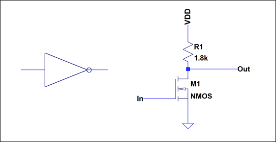

Some benefits compared to Resistor-Transistor-Logic are:

- Lower component count since no base resistor is required
- Since no current flows into the gate, the fan-out behavior is much more forgiving. It is not necessary to scale the load resistor according to the number of gate connected.
- Stacking of transistors to form NAND gates is easily possible. In contrast to RTL, no issues with load instability or parasitic current paths are observed.
- The logic levels are well defined by the threshold voltage of the NMOS.

In short, it is much easier to realize discrete logic circuits without spending a lot of thought on analog circuit design.

#### 

#### The Catch

There is a drawback, isn't there? Two things stand out:

1. The MOSFET is a four terminal device. To build fany circuits like [pass-transistor logic](https://en.wikipedia.org/wiki/Pass_transistor_logic) or [cross coupled XOR gates](https://hackaday.io/project/8449-hackaday-ttlers/log/150147-bipolar-xor-gate-with-only-2-transistors) we also need to to control the substrate contact.
2. Somehow it seems that all practical examples of discrete NMOS circuits are very very slow, as evidenced by the [Megaprocessor](http://www.megaprocessor.com/) and the [Monster6502](https://monster6502.com/). Let's figure out what to do about this.

#### 

#### Types of discrete MOSFETS

Although often no distinction is made by the circuit symbol, there are actually several different types of MOSFETS.

##### Planar MOSFET

The basic type of MOSFET that is also used in integrated circuits (at least up to the 32 nm node) is called the *planar MOSFET*. A cross section is shown below.

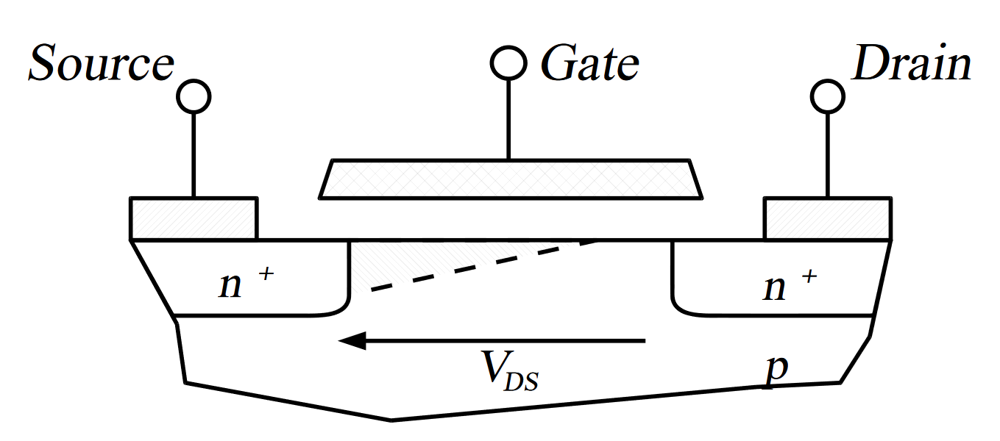

*By Cyril BUTTAY, CC BY-SA 3.0, [https://commons.wikimedia.org/w/index.php?curid=671256](https://commons.wikimedia.org/w/index.php?curid=671256)*

Both source and drain contact are accessible from the top of the device, while bulk contact can be established by contacting the subtrate by a p+ region at the bottom or next to the S/D junction.

##### Power MOSFET

DIscrete MOSFET are often used as switch for high currents. These applications are typically addressed by a functionallity similar, but differently constructed device called the *[Power-MOSFET](https://en.wikipedia.org/wiki/Power_MOSFET).*A cross-section of the basic structure is shown below. Note that there are many variants and refinements of this devices. Each power-MOS consists of many of the cells as shown below.

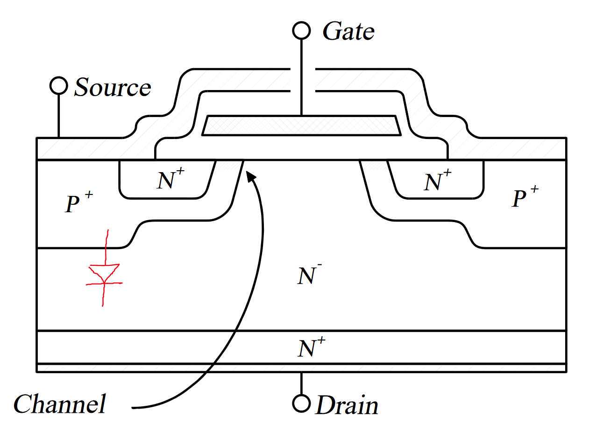

*CC BY-SA 3.0, [https://commons.wikimedia.org/w/index.php?curid=538889](https://commons.wikimedia.org/w/index.php?curid=538889)*
Compared to the planar device, the current flow through the power-MOS is vertical. The source is at the top and the drain is at the bottom. The bulk is directly connected to the source. Due to this, it is not possible to control the bulk contact independently anymore and a PN-Diode is formed between source and drain. This is given by design and is not a disdavantage for most application. It does, however, prevent us from using these devices in a pass gate configuration.

### 2) A Quick Survey of Discrete Planar MOSFETs
<small>2020-09-25 21:06</small>

As outlined before, a planar n-channel MOSFET in a discrete package, such as SOT23, would be the perfect device to build NMOS logic. Unfortunately, it turns at that these are so rare that it does not even make sense to benchmark them. I spend quite some time digging for candidates, so they are listed here for reference.

##### CD4007

The CD4007 is a 14pin IC from the 4000 series of CMOS logic gates. It contains three pairs for discrete p- and n-channel devices with the substrate connected to the supply.

Suprisingly, the CD4007 is still in production at Texas Instruments ([datasheet](https://www.ti.com/lit/ds/symlink/cd4007ub.pdf)). It's a nice device to do some experiments with discrete mosfets. There are some nice ideas in the[analog devices wiki](https://analog-staging.dw1.cosmocode.de/university/courses/alm1ks/alm-lab-28).

Unfortunately these are really old and slow transistors with switching times in the 100s of ns, possibly still manufacutred in metal gate CMOS. Also the form factor is not very well suited to build discrete logic. Coupled with a relatively high price, the 4007 is not a good candidate to build larger circuits.

##### Siltronix SD5000 series

This is a family of product with four lateral n-channel transistors in a package with a common substrate contact. I believe some of these are used in the Monster6502 in places where transmission gates are needed.

The performance looks quite good with fast switching times. Unfortunately these devices are out of production and can only be obtained in low numbers for obscene prices. Maybe good for some experimentes but not a larger design.

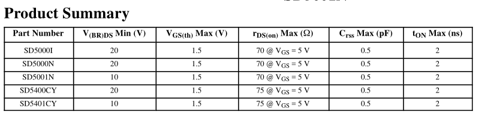

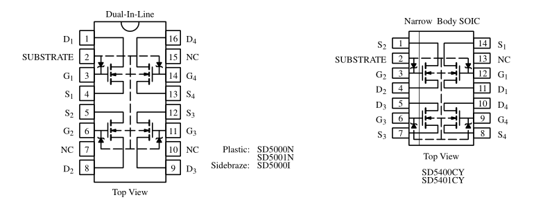

**BSS83**

Not to be mixed up with the BSS83**P**, the BSS83 is a single n-channel mosfet with separate bulk connection in a small SOT23-like SMD package (SOT143). The switching time is <5ns and the input capacatiance only 1.5pF. A very suitable device that was once made by Infineon and Nexperia. But alas, it is out of production...

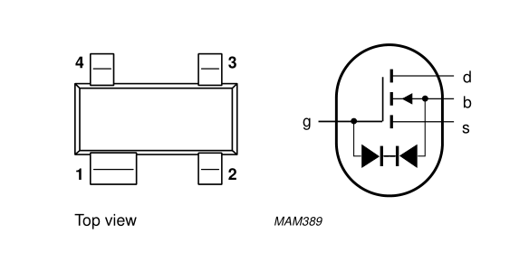

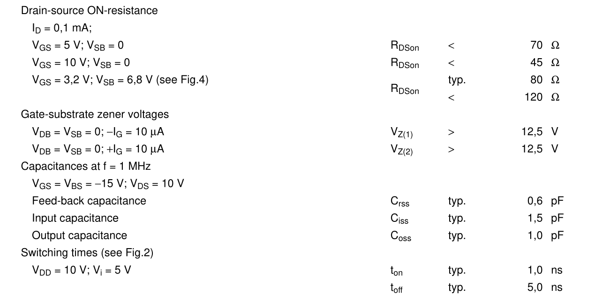

##### Linear Systems DMOS Portfolio

[Linear Systems](http://www.linearsystems.com) is a small semiconductor manufactor that seems to have acquired some of the product lines that were discontinued at Siltronix. They have an entire portfolio of discrete [lateral MOSFETs](http://www.linearsystems.com/product.html?category=dmoshss). (LDMOS is a type of planar power device. It's not entirely symmetric in the sense that source and drain are fully exchangable, but it can still be used as a pass-gate when not driven at too high voltage when a separate bulk contact as available.)

One suitable device in their portfolio seems to be the SST214.

Although these devices are technically still available, it seems that linear systems only sells via rather obscure distributors. I can only presume that the prices will also not be very suitable for designs with a high number of transistors.

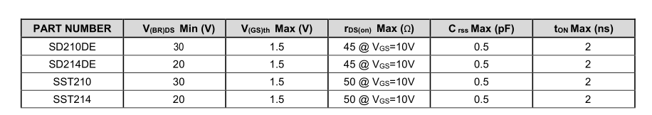

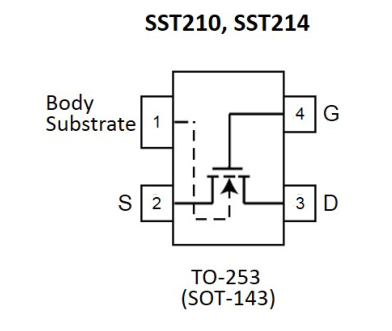

#### Conclusions

In summary, the availability of planar n-channel mosfets it rather limited. There are a few options, but apart from the CD4007 they all look rather pricey with uncertain supply availability.

It looks like we have to settle with Power-MOSFETS with integrated body-diode for any practical purposes.

### 3) MOSFET Selection
<small>2020-11-26 06:44</small>

Now that we settled on having to use power mosfets to build our NMOS gates, the question still remains which of the transistors that are available is best to use.

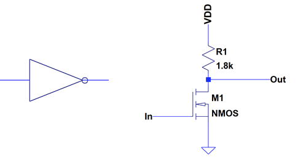

The basic NMOS gate is an inverter, as shown above. As a rough guideline, we would like to optimize the following criteria:

1. Acceptable Power consumption
2. High speed
3. High noise margin (Voltage difference between switching levels and logic levels)

The practical implementations of these requirements can be easily explained by the NMOS inverter circuit.

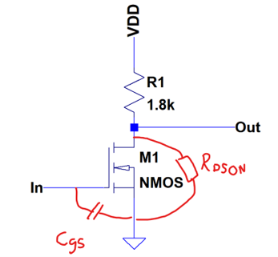

Given the simplified inverter circuit above, we can derive the relevant parameters like this:

$$
V_{\mathrm{out,H}} = V_{DD}
$$
Output high voltage [V]

$$
V_{\mathrm{out,L}} = V_{DD}\,\frac{R_{\mathrm{DS(on)}}}{R_1 + R_{\mathrm{DS(on)}}}
$$
Output low voltage [V]

$$
V_{\mathrm{out,L}} \approx V_{DD}\,\frac{R_{\mathrm{DS(on)}}}{R_1}
$$

$$
V_{LH} = V_{HL} = V_{th}
$$
Input switching threshold [V]

$$
V_{\mathrm{margin}} = V_{th} - V_{\mathrm{out,L}} \approx V_{th} - V_{DD}\,\frac{R_{\mathrm{DS(on)}}}{R_1}
$$
Logic level noise margin [V]

$$
I_{\mathrm{static}} = \frac{V_{DD}}{R_1 + R_{\mathrm{DS(on)}}} \approx \frac{V_{DD}}{R_1}
$$
Static load current [A]

$$
t_{pd}^{\mathrm{LH}} \approx C_{gs}\,R_1
$$
Propagation delay low-to-high [s]

$$
t_{pd}^{\mathrm{HL}} \approx C_{gs}\,R_{\mathrm{DS(on)}}
$$
Propagation delay high-to-low [s]

Firstly, it is obvious that there is a speed/power tradeoff when chosing the load resistors R1. I picked 1.8 kOhm since I used this before. This leads to a static consumption of about 3 mA, which is only acceptable for small designs (or when you build a 60ies style supercomputer).

Typical values for Vth are 1-2 V. Therefore we want out output low level to be significantly below this. For VDD=5V, it follows that 10 * RDSON < R1. Hence RDSON should be lower than 180 Ohm, which is quite high.

Finally, to optimize speed, we would pick a transitor with a Cgs as small as possible. Since the gate capacitance of a DMOS transistor is highly dependent on gate voltage it is not possible to assign fixed large signal capacitance. Instead typical the cumulative charge needed to turn on the transistor is quoted as gate charge Qg.

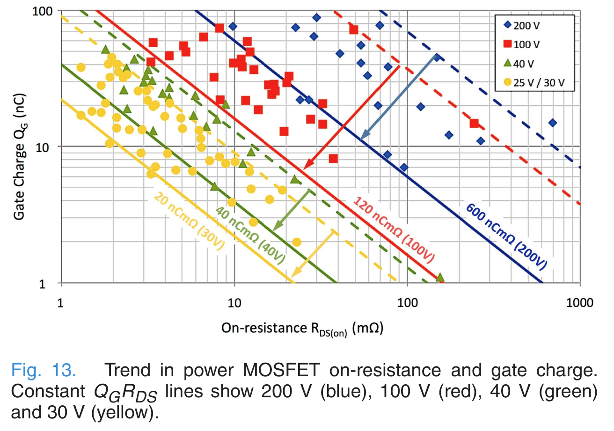

There is a catch again, as gate charge and RDSon are not independent, as shown in the figure above (taken from the execellent review [here](https://ieeexplore.ieee.org/document/7862948)). Most power MOSFETS are optimized for low RDSon. As a consequence the Gate charge is increased. Since we only need an RDSon of a few tens of ohms, it would in principle be possible to reduce gate charge significantly by accepting a much higher RDSon. But alas, such a device does not exist on the market.

To summarize, we need a power mosfet with the following properties:

- $R_{\mathrm{DS(on)}} < 100\ \Omega$
- $Q_g$ as small as possible
- $V_{\mathrm{DS,max}} > 5\ \mathrm{V}$
- $V_{th}$ in the range $1\text{–}2\ \mathrm{V}$

A list of candidate devices is shown below. Most of these are variants of the ancient 2N7002. The FDV301N is a device targeted at replacing digital bipolar transistors and therefore appears to be especially suitable.

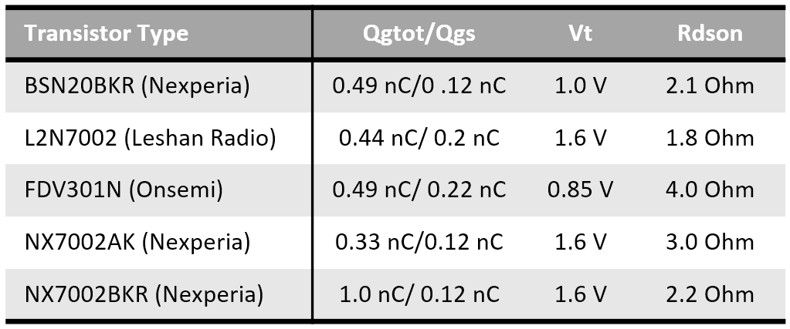

### 4) Ring Oscillator Measurements
<small>2020-11-28 11:29</small>

A good way of assessing performance of discrete inverterer is to [build ring oscillators](https://hackaday.io/project/170697-evaluating-transistors-for-bipolar-logic-rtl/log/175351-how-to-assess-switching-speed).I built 5 stage ring oscillators from the five candidate transistors.

The image below shows one of the PCBs with a five stage ring oscillator plus one additional inverter as output buffer. The load resistor was always 1.8 kohm.

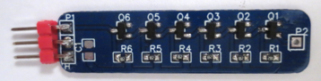

You can see two examples of scope traces below. The actual voltages are 10x higher (forgot to correct for 1:10 probes). As expected, one can see that the rise time is much slower than the fall time due to the different impedances involved in pulling the input up- or down.

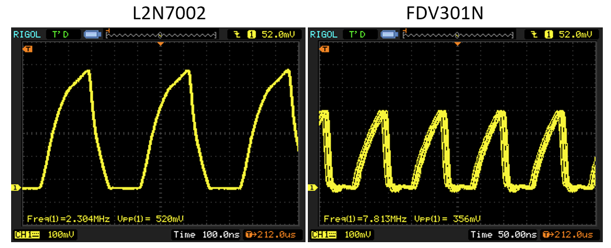

The images below show the ring oscillator frequency and current in dependence of supply voltage. We can see that there is quite some spread in frequency between candidate transistors. The spread in supply current is comparatively lower, since the current consumption is rather defined by the load resists..

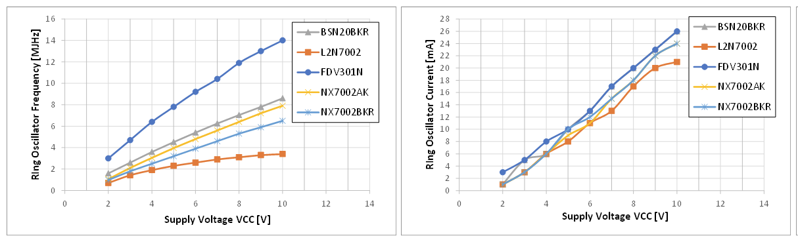

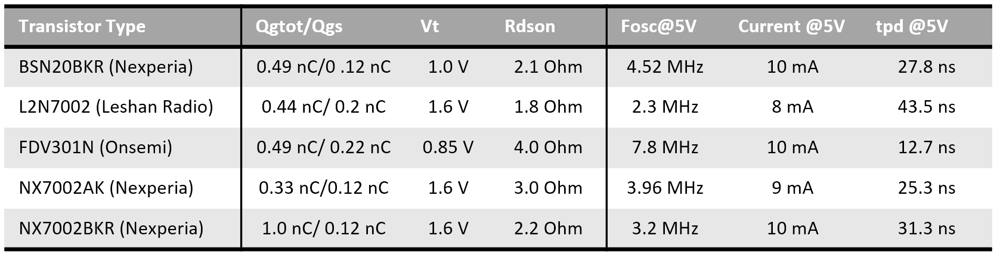

The table above lists inverter properties at 5V supply for different transistors. Generally, the propagation delay mostly correlated with threshold voltages. The lower Vth, the lower the propagation delay. This is intuitively obvious, since L->H transition is limiting tpd and a lower Vth means that the gate will swith at an earlier time during the rising edge. This relationships does not hold true for all devices though and there is no clear correlation to gate charge.

The FDV301N is by far the fastest transistor, there is no other contender. The off-brand L2N7002 is the slowest device at quite some margin.

#### Conclusions

As was already clear from the difficulty of identifying suitable N-MOSFETS for building discrete NMOS-Logic, there is no perfect transistor available. The performance of the NMOS ring-oscillators does not really compare to the [performance achievable with suitable bipolar switching transistors](https://hackaday.io/project/170697-evaluating-transistors-for-bipolar-logic-rtl).

In many cases, however, the simplicity and robustness of NMOS may be more relevant than the speed of bipolar logic. In that case it would be advised to pick the Onsemi FDV301N for the best possible trade-off. If the goal is just to build functional NMOS logic, the 2N7002 and clones are available for very little money and in many package sizes and are probably a good choice if optimizing for speed is not of relevance.

> Exported from Hackaday.io [Discrete NMOS Logic in 2020](https://hackaday.io/project/175015-discrete-nmos-logic-in-2020)
