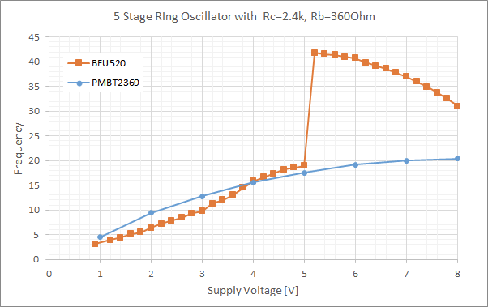

+++
title = "Evaluating Transistors for Bipolar Logic (RTL)"
summary = "Experiments on optimizing discrete logic gates based on bipolar transistors"
date = "2020-04-01T00:00:00"
draft = false
hackaday_url = "https://hackaday.io/project/170697-evaluating-transistors-for-bipolar-logic-rtl"
featured = "featured.jpg"
showHero = true
heroStyle = "background"
layoutBackgroundBlur = false
+++
*Experiments on optimizing discrete logic gates based on bipolar transistors*

## Details

I highlighted [the importance of the choice of the transistor](https://cpldcpu.wordpress.com/2020/02/14/what-made-the-cdc6600-fast/) for bipolar discrete saturation logic before. The relevant parameters were already well understood in the 1960ies and devices like the 2N709 were devised, based on the technology that was available back then.

What about 2020, sixty years later? Clearly, discrete logic is not within the focus of any transistor manufacturer anymore, so we have to pick what is available. What are important criteria (to me)?

1. Speed - low propagation delay.
2. Availability - I don't want to work with NOS bought from some obscure vendor. Availability at PCB assemblers would be the best case.
3. Package size - SMD is a must. Packages smaller than SOT23 would be perfect.

The last two criteria can be easily evaluated from datsheets and vendors listings. It turns out that the first criterion, speed, is not so easy to asses and merits actually testing things with real hardware.

Click [here](https://hackaday.io/project/170697/logs?sort=oldest) to view project logs in order.

## Project Logs
### 1) How to assess switching speed
<small>2020-04-01 05:51</small>

Why is it so difficult to identify the fastest transistor for our application from merily looking at the datasheets?

One issue is that many transistor types are not characterized for saturation switching operation anymore and hence little information about that use case is available in the datasheet. As it turns out, many newer transistor types are not optimized for this operational mode either...

A second issue is that most datasheets only list maximum and minimum values. These usually represent garuanteed test limits, but they are not necessarily representative for the typical performance of the device.

In an ideal world, all of this could be solved by simulation. Unfortunately, I had very mixed results using spice models provided by different vendors. In some cases this may be, because the spice model is not finetuned to switching operations.

In the end, the only way is to actually test various candidate devices. The tool of the trade is the [ring oscillator.](https://en.wikipedia.org/wiki/Ring_oscillator)

The images above shows a single RTL inverter including design settings. I used a 2.4 kOhm collector resistor and 360 Ohm base resistor for all investigations. To form an oscillator, an odd number of inverters have to be connected in a circular fasion.

The picture above shows the design I used for most of my investigation. The first five inverters form the ring oscillator, the sixth inverter is used as an output buffer to make sure there is a well defined load on the oscillator.

Btw - the wire was used to fix a flaw in the first revision of the PCB.

The image above shows a smaple measurement from the article i linked above. By changing supply voltage it is possible to investigate the behavior it difference current settings. The propagation deleay of individual gates can be easily deduced from the oscillator frequency by tpd=1/(2*5*fosc).

### 2) Fast switching transistors: PMBT2369 vs. MMBT2369
<small>2020-04-01 06:15</small>

As [outlined earlier](https://cpldcpu.wordpress.com/2020/02/14/what-made-the-cdc6600-fast/) there are still two fast switching transistor types on the market: The PMBT/MMBT2369 and the BVS52. Both are offered by Nexperia and On Semi.

The PMBT2369 is Nexperias offer, my guess is that the "P" stands for Philips. Nexperia was carved out of NXP, which used to be Philips semiconductor branch. Similarily the "M" in MMBT2369 is most likely related to Motorola, which On Semi belonged to a long time ago. The BVS52 seems to be basically the same device at both vendors, so I did not bother investigating it.

I compared On Semis and Nexperias flavors of the 2369. As you can see in the table above, their datasheet values are basically the same. I measured hfe and found the onsemi device to have slightly higher gain.

The plot above shows a comparison of both devices. It appears that the PMBT2369 is quite a bit faster. The MMBT2369 shows a maximum at around 5V supply. At higher voltage (current), the saturation charge seems to dominate switching behavior. This trend can only be seen at >8V for the PMBT2369.

Minimum tpd of the MMBT2369 based RTL inverter is 6.8 ns, that of the PMBT2369 based inverter is 4.8 ns.

It's quite difficult to asses the actual origin of the speed difference, just speculating: The higher current gain will increase the miller capacitance of the MMBT2369. However this is mostly relevant while the device is turned on. The critical condition is the storage time of the saturation charge, which flows out of the base when VBE is already zero and the miller capactance plays no role.

The PMBT2369 definitly appears to be the faster of the two. In fact, the PMBT2369 seems to be the fastest bipolar switching transistor that is still available in high volume today.

Why even look at other devices? Unfortunately it seems that the PMBT2369 is only available in the relatively large SOT23 package. To build dense discrete logic (yes, it makes no sense, I know), it would be of interest to use much smaller packages such as SOT523 or SOT723.

#### Update 2024

[Richies Lab](https://www.richis-lab.de) has analyzed the two transistor types used in this experiment. You can find the [PMBT2369 here](https://www.richis-lab.de/BipolarA59.htm) and the [MMBT2369 here](https://www.richis-lab.de/BipolarA58.htm).

There are slightly differences in base area and the PMBT2369 uses slightly larger base contacts than the MMBT2369, but it is not immediately obvious why the PMBT2369 is faster than the MMBT2369.

PMBT2369: 390x240um^2

MMBT2369:310x310um^2

### 3) Digital Transistors
<small>2020-04-01 13:09</small>

Digital transistors look extremely appealing to build discrete logic: They come with integrated resistors so the bias emitter in an RTL gate can be omitted. Furthermore, they are available from many manufacturers in basically any package type, down to chip scale packages, at very lost cost.

There is a nice introduction to digital transistors by Rohm [here](https://www.rohm.com/electronics-basics/transistors/principles-digital-transistors).

The internal circuit of such a device is shown above. A wide variety of value for R1 and R2 are available. Unfortunately, the minum value for R1 is 1 kOhm, which will already limits switching currents significantly.

Furthermore, although many different variants are listed, not all of those are available. I picked four devices at random from different suppliers.

The candidates are listed above. What is alarming about these devices is that basically no information about transient behavior and switching applications is listed. A few devices liste transistion frequencies, which are rather unimpressive.

Ring oscillator results are shown above. Basically all devices enter an operational range where they are limited by saturation charge already at very low voltage. Practical gate propagation delays are in the 500-1500 ns range, a hundred times slower than the PMBT2369!  There is a very small voltage range where the saturation charge does not dominate and the devices are slightly faster, but it seem impractical to bias devices into that regime. 

These results are honestley a bit surprising to me, since I always though the main application of digital transistors would be switching? Well, maybe cost is more important than speed here. 

Verdict: Digital transistors are not suitable for discrete logic, unless you are fine with clockspeeds in the kHz range.

### 4) Standard switching transistors: 2N3904 and copies
<small>2020-04-01 13:22</small>

The [2N3904](https://www.onsemi.com/pub/Collateral/2N3903-D.PDF) is one of the most widely spread switching transistors. There are countless SMT variants available from at least 15+ different vendors in all kinds of packages. Mouser lists more than 50 variants, LCSC more than 80. 
I picked four devices in SOT23 package at random, trying to balance between more established manufacturers and lesser known chinese sources. Ironically the Nexperia part was the cheapest.

The table above lists the four devices and their respective datasheet values. Siko admits to having a slightly slower device while the other datasheets look like they were copied from each other.

Ring oscillator results are shown above. Minimum tpd is 20ns for the Nexperia device. The others achieve around 40ns, while Toshiba is dead last with >200ns at typical operating conditions.

The extreme spread of these results is quite irritating - it shows how devices can easily differ by factors despite being specified the same. The only consolation is that Nexperias device is again the fastest, confirming that it may be a good idea to stick to better known vendors.

On the other hand, the performance of the Toshiba candidate is utterly irritating, as it will hardly be able to meet datasheet specs. I double checked the package marking. The only sane explanation could be that this is a counterfeit device.

In general, the PMBT3904 also seems to be a good candidate for bipolar logic. It is about 2-3x slower than the PMBT2369, but also 4x cheaper and available in smaller packages. More attention needs to be spent on correct biasing though, since the device is far less forgiving than the PMBT2369 when driven into saturation.

### 5) LTSpice Simulations
<small>2020-04-25 16:32</small>

In parallel to building the ring oscillator models I also implemented the same in LTspice. You can find the files files on the [project page](https://hackaday.io/project/170697-evaluating-transistors-for-bipolar-logic-rtl). Please find a very brief summary below.

I implemented a 5-stage ring oscillator with an output buffer. Same circuit as on the PCB.. Using the transient function, it is possible to investigate frequency and waveform.

To test the transfer function, I used the DC sweep function in the circuit below. Since the loading of the output has a significant influence on the output voltages of an RTL gate I looked at both loaded and unloaded output.

Sweep output shown below.

An inverter circuit is shown below. As you note, I also did some experiments with a reach through capacitor.

#### Resistor variation on the PMBT2369 based inverter

I used the ring oscillator model to investigate the impact of base and collector resistor on ring-oscillator frequency and hence propagation delay. the graph below shows the collector resistance on the x-axis and various plots as a function of base resistance. 

Impact on logic levels.

### 6) Optimizing Resistors in the PMBT2369 Ring Oscillator
<small>2020-05-04 21:29</small>

To speed up the propagation time of the inverters in the ring-oscillator further, I built up samples with smaller base and collector resistors.

| Sample   | Rb       | Rc       |
|----------|----------|----------|
| Sample 1 | 360 Ω    | 2.4 kΩ   |
| Sample 2 | 180 Ω    | 1.8 kΩ   |
| Sample 3 | 180 Ω    | 470 Ω    |

The figure above shows the relationship between supply voltage and oscillator frequency. Reduction of both base and collector resistor increases speed at the same voltage. It is somewhat obvious since availability of more current will allows faster switching up to the point when the saturation charge storage limits the turn-off time. Since the PMBT2369 is engineered to reduce charge storage time, it increases switching speed up to a fairly high current. However at some point this is not sufficient anymore and the speed begins to reduce again. This is visible for Sample 3 (Rc=470, Rb=180), which has a maximum at around 3V. Also sample 2 starts to get slightly slower beyond 8V.

This trend is confirmed when plotting supply current vs. voltage. There is a big gap between sample 2 and sample 3, I probably should have added settings in between...

Things get much more interesting when plotting the ring oscillator frequency versus supply current. It shows that all samples follow the same relationship, so that supply current is the only governing factor to control inverter propogation delay.

Calculating the propagation delay from the ring oscillator frequency shows that a minimum tpd of around 3.5 ns is achived at around 30 mA of supply. Since RTL gates only draw current when their input is "high", only half of the six gates (5 ringo + 1 buffer) are active at any time. This means that the bias current per gate is approximately 30mA/(6/2) = ~ 10mA.

It appears that this is smack dab on the operating point settings that are used in the [CDC6600](https://cpldcpu.wordpress.com/2020/02/14/what-made-the-cdc6600-fast/): It sits at Ic=10mA, Ib=1mA with a maximum tpd target of 5ns. The CDC6600 uses a supply of 6V and apparantly Rb=150 Ohm, Rc=680 Ohm for fan-out of 1. This is in between the resistor settings in Sample 2 and Sample 3.

So, in conclusion: It seems we can recreate the timing properties of the ancient CDC6600 using components that are still available today. However, this also requires bias current settings as high as those used back in the 60ies...

### 7) Pushing RTL to <2 ns Propagation Delay
<small>2020-05-04 21:46</small>

So, we established that the PMBT2369 is the fastest saturation-switching transistor available today and that it achieves a minimum propagation delay of 3.5 ns at a bias current level of 10 mA. How can we go further from there? Obviously, more brute forcing by changing resistor values and increasing currents is not the way to go. Alternatively we can add components to the basic RTL gate.

There are two approaches: Adding a reach-through capacitor in parallel to the base resistor and adding a [baker clamp](https://en.wikipedia.org/wiki/Baker_clamp).

#### Simulation

The panel above shows circuits of both options individually and in combination including the resulting waveformt of the ring oscillator.

The reach through cap basically shorts the base resistor for high frequency components of the input signal; the rising and falling edge. For the critical case of a falling edge of the input signal it will lead to negative biasing of the base, which will help to remove the saturation charge. You can see above, that it even leads to a negative spike of the output signal due to coupling to the collector.

The baker clamp prevents saturation of the transistor by shorting the base with the collector if the base potential is too high. The choice of the diode is quite critical here: A schottky diode is needed to minimize forward voltage and the capacitance needs to be lower than CBC of the transistor to avoid excessive miller capacitance that could limit the turn-on time. Since the baker clamp shorts the base to the collector, also the low voltage level is increased to about 0.4V. Therefore, noise margin is drastically reduced for this solution, something that is not preferrable considering the already low noise margin of RTL.

Spice simulation of the ring oscillator at a supply of 5V shows that both options improve switching speed and the combination of both measures is cumulative. All options use a 180 Ohm base resistor.

The reach through cap works best, when the voltage drop across the base resistor is high, because this leads to a stronger negative overdrive of the base. This condition is optimizated when Rb is large compared to Rc, as is evident  for the strong increase in frequency for lower collector resistance in the plot above.

#### Hardware testing

Due to lack of suitable schottky diodes I was only able to test the reach-through cap in real hardware.

Comparing an RTL oscillator with and without reach-through cap reveals quite dramatic differences. The yellow and blue graphs above are from an oscillator with the same Rb and Rc. The blue one has a 68 pF reach-through cap added in parallel. Due to negative base overdrive, no local maximum of switching speed is observed anymore and the oscillator frequency continues to rise for higher supply voltage/current. 

A scope trace shows that, despite the high frequency, there is still fully saturated switching. The signals looks a bit smoothed, which may be caused by bandwidth limitations of my probe and the scope (100 MHz):

Finally, looking at the bias current / tpd trade off, we can see that the seemingly unsurmountable trend of pure RTL has truely been beaten and less than 2 ns tpd is achieved at  higher current. Quite an astonishing result for discrete saturation logic! 

There are some caveats: Keep in mind that the full oscillator is supplied with more than 1 W of power at this operating point, almost 200 mW per gate. Collector bias of a single gate is ~30 mA and the PCB is getting notably hot. Furthermore, since the input to the gate is basically a high-pass, the propagation delay of the gate will be dependent of the slew rate of the incoming signal. This adds another dimension to the complexity of logic design.

### 8) Using a LED as base Resistor / Chaotic Ring Oscillator
<small>2020-06-12 12:33</small>

#### Introduction

Out of curiosity I tried replacing the base resistor in my 5-stage ring oscillator with a red LED. Why would I do that? Well, first of all the footprint of the LED and resistor exactly matched on the PCB. So why not?

There was a bit more rationale behind this, though: The LED will increase switching voltage and should improve noise margin, similar to what I did with "[LTL](https://hackaday.io/project/169948/logs)". Since LEDs have a non-negligible internal capacitance, I was also hoping that the LED would act in a similar way as the reach-through capacitors in parallel to the base resistor, a[s I tried earlier](https://hackaday.io/project/170697-evaluating-transistors-for-bipolar-logic-rtl/log/176980-pushing-rtl-to-2-ns-propagation-delay).

What started as a quick experiment turned into quite a curious feat, as you will notice later.

The schematics are shown above. Please ignore the resistor values, I used 470 Ohm collector resistors in all cases. I built two versions: One with [PMBT2369](https://hackaday.io/project/170697-evaluating-transistors-for-bipolar-logic-rtl/log/175352-fast-switching-transistors-pmbt2369-vs-mmbt2369) and one with [PMBT3904](https://hackaday.io/project/170697-evaluating-transistors-for-bipolar-logic-rtl/log/175365-standard-switching-transistors-2n3904-and-copies).

#### PMBT2369 based RINGO5

Results for a voltage sweep of the PMBT2369 based ring-oscillator are shown above in green, in comparison with previous results. Two things are apparent:

1. Oscillations are only observed at a much higher operating voltage of ~2.2V instead of 1V for the others devices.
2. The frequency is continuously rising with the voltage, no maximum is visible within the voltage range.

An increased operating voltage is expected since the additional voltage drop over the LED increases the turn on voltage of each inverter. The larger swing of the logic levels also leads to a reduction of propagation delay and hence oscillator frequency.

The absence of a frequency maximum and the higer maximum frequency compared to the normal ring oscillator without reach-through capacitor (orange) suggest that the LED capacitance does indeed act in a similar way as the parallel capacitor.

It seems that both initial assumptions have been confirmed. Does it mean that RTL with LED-instead-of base-resistor is the way to go? Probably not, as there will be serious issues with device matching when multiple gates are connected in parallel due to variation of LED forward voltage and transistor VBE. This is addressed in the [LTL gate](https://hackaday.io/project/169948/logs), however.

#### PMBT3904 based RINGO5 with LED instead of base resistor

Ok, let's repeat the same experiment with the "standard" switching transistor PMBT3904.

The plot above shows the ring oscillator frequency when sweeping the voltage up to 7V and then down again. There were quite a few surprises. First, the maximum frequency is above 50MHz, far above anything I had measured with the PMBT3904 before. Then, and this is even more suprising, above 5 V  the frequency suddely drops to a very low value below 0.5 MHz - 100 times lower. When the voltage is lowered to below ~3.5 V, the frequency increases again.

The low frequency region is shown in more detail in the figure above. 

It is clear that the frequency shows a hysteretic behavior in respect to the voltage sweep. This means that the circuit has two stable operating points between 3.5 V and 5 V - one at low oscillating frequency and one at high frequency. Some waveforms details are shown below.

Waveform of the high frequency oscallating mode.

Waveform of the low frequency oscillating mode. You can clearly see fully saturated switching.

Waveform in the high frequency operating point close to the switching point. One can see that several frequencies are superimposed and the oscilation gets instable.

This result is quite weird.  In one mode, the oscillator is much faster than any PMBT3904 based oscillator i built before, in the other mode it is incredibly slow. What is the exact mechanism behind the metastability? Can it be used for something?

#### Spice Simulations

I set up a Spice model in LTSpice to understand better what is going on. See below for the schematics. One big source of inaccuracy is the LED model itself. I took a model for a similar LED from the OSRAM OS homepage and modified it to fit the LED I used (some noname 0603 SMD LED). However, I am certain that there are lots of inaccuracies. I doubt there are many spice model for LEDs out there that exactly model transient behavior.

For this circuit, the most relevant parameter in the LEDs seemed to be the junction capacitance **Cj**, hence I modified this throughout my investigation.

I set up the model as a transient simulation that sweeps VDD. You can see the result above. The upper pane shows the voltage at the input and output of one of the inverters withing the ring oscaillator. The lower panel shows the supply voltage over time.

The metastable behavior is also reproduced in Spice. There is a clear distinction between fast and slow oscillating mode and the transition voltages between these depend on sweep direction.

Looking at the detailed input-output relationship of the inverter already shows some differences: When the input goes hi, the output is immediately pulled to low, both in fast and slow oscillation mode. Things are quite different for that falling edge of the input signal: In slow mode, that output rises with a delay of almost 1us, while it almost immediately risis in fast oscillation mode.

This suggest that the slow oscillation mode is dominated by base saturation charge storage time, while this is somehow eliminated for the fast mode. Please note that also in the fast mode, there is full saturation switching going in, the transistor is fully turned on and off as can be seeen from the voltage swing.

Looking at the base potential and current suggests the reason for the much faster switching in fast mode: A falling edge on the input is fed directly via the capacitance of the LED to the base and pushes it to deeply negative bias. Since the VF of the LED is quite high, no current will flow through the LED to compensate for the negative bias at the base. The negative bias at the base helps to significantly speed up saturation charge removal and therefore switching off of the transistor. This is also evident from the base current. 

This is not the case for the slow oscillation. An addtion, the positive base current is much higher for slow oscillation, which means that even more saturation charge is build up.

These results seem to explain the bahavior from a phenomenological point of view. It is not quite clear, however, what compels the circuit to switch into one mode or another? One reason could be that the fast oscillating mode needs a high frequency input signal to avoid build up of too much saturation charge and for the negative overdrive to work. Since the circuit is circular, this operational mode is self sustaining.

As an interesting addendum: One critical factor for the behavior of the oscillator is the junction capacitance of the LED. I assumed a junction capacitance of 40pF for the simulations above, which may be on the high side for a 0603 SMd LED.

A smaller junction capacitance increases the frequency of the fast oscillation, while a larger does decrease it. Furthermore, a larger capacitance improves the stability region of the fast oscillation mode.

When reducing Cj to 6 pF (first panel above) or 4 pF (second panel), a notable region of instability with several frequency components is observed close to the transition, similar to what I observed in the actual circuit. This behavior appears to be unpredictable and could point to chaotic behavior of the system, as observed, for example, in the [van der pol oscillator](https://en.wikipedia.org/wiki/Van_der_Pol_oscillator). Varying the junction capacitance to other values has somewhat unpredictable results. It is not quite clear to me, what the governing parameters of this system are. More simulations would be needed.

#### Summary

Using a LED instead of a base resistors help increasing the switching threshold and had a speed-up effect on the ring oscillator for the PMBT2369 and the PMBT3904. It was, however, observed that the PMBT3904 ring oscillator had two or more metastable operating conditions that are interesting, but not completely understood, and could introduce instability into any circuit using this approach. This would be especially relevant of the input signal is not well controlled. Using a LED instead of a bases resistor is therefore not really recommendable.

The PMBT3904 ring oscillator exhibits a region of instability that may point to chaotic behavior, the underlying effects are not understood so far.

#### Addendum - Trajectory Plots

I used the X-Y functionality of my oscilloscope to plot the trajectories at different supply voltages to test the hypothesis that the ring oscillator is not only metastable, but also a chaotic system, as also suggested [on uC.net by Andreas](https://www.mikrocontroller.net/topic/498002#6300503).

The test setup is shown above, for the sake of completeness. I tapped into two output nodes that were spaced two inverters apart. Assuming that the phase delay through the entire ring oscillator is 180 deg, we shold observe a phase shift of 2*180 deg/5=72 deg, which means that we shold see a slightly elliptic circle if the oscillator generated a pure sine. In the investigations above, I connected the oscilloscope via an output buffer (rightmost inverter on the PCB) to create a constant loading.

Since I needed to tap two places in this case, I have to directly probe the oscillator. The additional capacitive loading of the two probes on the ring oscillator led to a shift of the transition voltage from high to low frequency mode to above 7V. The general characteristics of the setup remained the same, though.

The plot above shows trajectories from 2 V to 5 V supply voltage in steps of 100 mV overlaid. In this range, the oscillator shows stable operation with limited noise. The shape of the trajectory changes due to a change in rise- and fall-times with voltage and due to smoothing caused by the limited bandwidth of the oscilloscope.

Things start to get interesting at 5.3V. Here we can see that the oscillation becomes instable, looking like noise is overlaid. However, at 5.7 V and 6.1 V we can see two stable complex trajectories that suggest the presence of [limit cycles](https://en.wikipedia.org/wiki/Limit_cycle). 6.2 V is unstable again, 6.5 V shows a drastically changed trajectory.

Again, clear limit cycles at 6.8 V, 7.1 V and 7.3 V. At 7.5 V the oscillator finally switches to the low frequency mode.

All in all, even though I am not an expert for nonlinear systems, this looks very much like a chaotic oscillator to me.

There are many other chaotic circuit out there, like [Chuas circuit](https://en.wikipedia.org/wiki/Chua%27s_circuit). Typically nonlinearity is introduced by a nonlinear resistive element, like a diode. What seems intriguing about the ring oscillator investigated here, is that it appears to introduce a nonlinear timing element in form of the base saturation charge.

### 9) Ring-Oscillator with RF transistor BFU520
<small>2023-11-01 16:48</small>

So far I have mostly looked at lower cost transistors that are optimized for switching operation. The only exception was the MMBTH10, which is an older RF transistor. [https://hackaday.io/hacker/1315984-kimstik](https://hackaday.io/hacker/1315984-kimstik)

[Kimstik](https://hackaday.io/hacker/1315984-kimstik) commented in this project showing [simulations of ring oscillators](https://hackaday.io/project/170697-evaluating-transistors-for-bipolar-logic-rtl/log/175352-fast-switching-transistors-pmbt2369-vs-mmbt2369/discussion-193104), indicating that more mdern RF transistors may beat the trusty PMBT2369 in switching speed.

I had some [BFU520](https://www.nxp.com/docs/en/data-sheet/BFU520W.pdf) transistors left over that I purchased for some HF experiments. These are NPN silicon transistors with an ft of 11 Ghz. There are faster transistors around, but the benefit of the BFU520 is that it still allows for fairly high voltages. More modern SiGe transistors break down at below 5V. Still, the BFU520 is 10x more expensive than a PMBT2369. Maybe too much for large logic circuit, but ok for a quick ring oscillator test.

**The ring oscillator PCB**

**Results of Voltage vs. Frequency Measurements for BFU520 and PMBT2369**

The behavior of the BFU520 ringoscillator is quite curious. At low voltages it shows performance that is comparable to that of the PMBT2369. At 5V there is a sudden shift to a different oscillation frequency twice as high. (I did not record results beyond 8V, but the frequency did monotonically decrease)

What is going on? Some more details can be seen in the waveforms:

**Waveform in the low frequency branch at 5V**

We can see that the shape of the waveform indicates normal switching behavior of an RTL inverter. The high->low transition, when the output transistor is turned on, is very steep. The lower voltage actually reaches zero, indicating that the transistors  VCE is ~0V and the transistor is in saturiation. The low->high transition is much slower as the transistor has to switch off from saturation.

**Waveform in the high frequency branch at slightly above 5V**

The behavior is quite different in the high frequency  branch. We can see a more symmetric waveform and the voltage newer reaches zero, indicating that the transistor is not fully saturation. Indeed it is more acting as a linear amplifier in this mode and this explains the much higher frequency. Increasing the length of the ring oscillator to e.g. 9 stages would most likely eliminate this behavior as there would be enough time to transition to saturation.

Unfortunately, this operating mode is not suitable for saturation logic families such as RTL.

#### Discussion

The BFU520 performs quite well at switching as it is almost on par with the PMBT2369 at lower voltgage. This is most likely because some of the optimization of RF devices (thin base with drift field, small parasitics) also help optimizing the switching speed. It is unlikely that carrier lifetime engineering (gold doping) is used here, as in the PMBT2369, as this would degrade noise figure and hfe. The BFU520 is optimized for operation as a linear amplifier and this is why we see it is prone to the small-signal oscillation mode.

It's not clear whether the behavior observed above can also be seen in simuation, as the BFU520 is not among the transistors simulated by Kimstik. It is however likely that the switching behavior is not defined well in the models provided by NXP, because this is not an anticipated operating mode of the transitor, and therefore the simulation may look quite different. Note that also no switching times are provided in the datasheet.

I believe i built enough ring oscillators for now.

> Exported from Hackaday.io [Evaluating Transistors for Bipolar Logic (RTL)](https://hackaday.io/project/170697-evaluating-transistors-for-bipolar-logic-rtl)
> Exported from Hackaday.io [Evaluating Transistors for Bipolar Logic (RTL)](https://hackaday.io/project/170697-evaluating-transistors-for-bipolar-logic-rtl)
