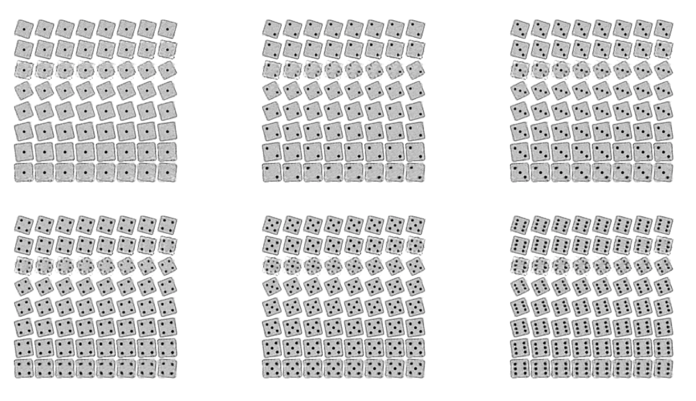

+++
title = "Generative AI on a Microcontroller"
summary = "The Electronic Die of the Future"
date = "2023-11-04T00:00:00"
draft = false
hackaday_url = "https://hackaday.io/project/193478-generative-ai-on-a-microcontroller"
featured = "featured.jpg"
showHero = true
heroStyle = "background"
layoutBackgroundBlur = false
+++
*The Electronic Die reinvented*

## Details

After many retro projects, it is time to look into the future! It's the year 2023 and the biggest technology trend (hype) is generative AI. Typically this is associated with high performance GPUs. But maybe we can make use of it on a lowly microcontroller? And maybe we can use it to implement just another incarnation of an electronic die?

<!-- # Table of contents

1. [Goal and Plan](https://hackaday.io/project/193478-generative-ai-on-a-microcontroller/log/224915-goal-and-plan)
2. [Training Dataset Generation and Evaluation Model](https://hackaday.io/project/193478-generative-ai-on-a-microcontroller/log/224924-training-dataset-generation-and-evaluation-model)
3. [Options for Generative AI Models](https://hackaday.io/project/193478-generative-ai-on-a-microcontroller/log/224935-options-for-generative-ai-models)
4. [CVAE: Condititional Variational Autoencoder](https://hackaday.io/project/193478-generative-ai-on-a-microcontroller/log/225058-conditional-variational-autoencoder-cvae)
5. [CVAE: Minimizing the VAE Memory Footprint](https://hackaday.io/project/193478-generative-ai-on-a-microcontroller/log/225064-minimizing-the-vae-memory-footprint)
6. [CVAE: Improving Image Quality (More Layers!)](https://hackaday.io/project/193478-generative-ai-on-a-microcontroller/log/225117-improving-quality-more-layers)
7. [Tiny Inference Engines for MCU deployment](https://hackaday.io/project/193478-generative-ai-on-a-microcontroller/log/225316-tiny-inference-engines-for-mcu-deployment)
8. [Building my own Inference Engine](https://hackaday.io/project/193478-generative-ai-on-a-microcontroller/log/229157-building-my-own-inference-engine)

## [View all logs in order](https://hackaday.io/project/193478/logs?sort=oldest) -->

## Project Logs
### 1) Goal and Plan
<small>2023-11-04 23:28</small>

#### Goal

The goal of this project is to build an electronic die using generative AI on a microcontroller. And of course it is a nice opportunity for me to play a bit with ML.

Pushing a button shall initiate the roll of a dice and a random result is shown on a display. Instead of using 7 LEDs and logic circuit, as in a [traditional circuit project](https://hackaday.io/project/183938-circuit-golf-electronic-dice-edition), we shall use a small display (e.g. SSD1306) and a microntroller (TBD - not sure how low we can go.).

- The display shall show a picture of the die as rolled.
- The number of pips should be clearly indicated.
- The graphics shall be generated in real time by a generative AI algorithm.
- Everything should be light-weight enough to run on a MCU.

#### Plan

1. Since we want to employ a machine learning / AI algorithm, we first need to create a suitable set of training and test data.
2. Once that is solved, we need to look intro a suitable approach for the generative AI model and test it. An important aspect will be to asses computational- and memory-footprint
3. Train generative AI model and assess its performance.
4. Pick a target platform that can meet the requirements derived in step 2.
5. Implementation on the MCU

So far so good.

The first hunch for step 1) was to use AI image generators to create a set of synthetic training images. Curiously enough, creating pictures of dice seems to be a weak spot of current state-of-the-art models (why?`). Some examples are shown below. So we have to got for a simpler approach...


Top row: Dall-E 3 with the prompt: *"a close up photo of a six-sided die on a table, looking straight from top, showing three pips on top".*Bottom row: Stable diffusion with JuggernautXL (V6) and the same prompt.

Obviously, both can create great looking images of dice, but displaying the right number of pips is very difficult to control just with prtompting. It appears SDXL knows a great number of alien role playing dice, though...

### 2) Training Dataset Generation and Evaluation Model
<small>2023-11-05 10:08</small>

#### Training dataset

Since the capabilities of the target platform are somewhat limited, I elected to create a simplified synthetic dataset for training. I chose 1x32x32 greyscale as target resolution for the images, as this fits into 1kb footprint. The resolution can be increased later, and we can obviously also use a fancier looking die image at a later time.

I need labeled images showing die-rolls with 1-6 pips. There should also be some variation, because otherwise using generative AI is quite pointless.

I used GPT4 to generate a Python program to generate images of dice and later refined it iteratively with copilot in vscode. While all the attention is on GPT, copilot chat got impressively useful in the mean time. It's much easier to interact with specific parts of your code, while this is a hazzle in GPT4.

Images are created in 128x128 and then downscaled to 32x32 to introduce some antiailiasing. The die images are rotated by an arbitraty angle to introduce variation. It should be noted that rotation of the dies requires them to be scaled down, so they are not clipped. This will introduce also a variation in scaling to the dataset.

Example outputs are shown below.


I will push the code to github later.

##### Evaluation Model CNN

As a first test, I trained a small CNN using PyTorch that can later be used to automatically evaluate the output of the generative AI model. I did not specifically try to optimize the CNN architecture. In first tests, it was able to identify the labels with 100% accuracy on a 4000/1000 training/test data set. Obviously too easy, as there is limited variation in the dataset.

```ruby
class Net(nn.Module):
    def __init__(self):
        super(Net, self).__init__()
        self.conv1 = nn.Conv2d(in_channels=1, out_channels=8, kernel_size=3, stride=1, padding=1)
        self.conv2 = nn.Conv2d(in_channels=8, out_channels=16, kernel_size=3, stride=1, padding=1)
        self.fc1 = nn.Linear(in_features=16*16*16, out_features=256)
        self.fc2 = nn.Linear(in_features=256, out_features=6)

    def forward(self, x):
        x = self.conv1(x)
        x = nn.functional.relu(x)
        x = self.conv2(x)
        x = nn.functional.relu(x)
        x = nn.functional.max_pool2d(x, 2)
        x = torch.flatten(x, 1)
        x = self.fc1(x)
        x = nn.functional.relu(x)
        x = self.fc2(x)
        output = nn.functional.log_softmax(x, dim=1)
        return output
```

To enable the network to also identify lower quality images, I augmented the dataset by introducing some distortion to the test images

- The center of the die is randomly shifted in X/Y, potentially leading to only a part of the die being visible
- Images are blurred with 50% probability and varying extend
- Various levels of noise are added, again on a randomly chosen 50% subset.

The image below shows examples from the augmented dataset to train the evaluation model. Obviously we are not going to use this for training of the GenAI, as we would like to generate clean images.


The accuracy on the test dataset dropped to 98% now (984/1000). The 25 images with the highest loss are shown below. Obvsiously, adding a lot of noise and blur makes it difficult to detect the number of pips. But there are also some suprising outliers.


Ok, obviously I spent quite some time fiddling around with the settings, but this looks like an acceptable starting point now. On to the next step.

### 3) Options for Generative AI Models
<small>2023-11-05 21:28</small>

Since our goal is to generate images, we need to select a suitable artifical neural network architecture that is able to generate images based on specific input.

Typically, three architectures are discussed in this context as of today (2023):

1. [Generative Adversarial Networks](https://en.wikipedia.org/wiki/Generative_adversarial_network) (GAN)
2. [Conditional Variational Autoencoders](https://en.wikipedia.org/wiki/Variational_autoencoder) (VAE)
3. [Diffusion Models](https://en.wikipedia.org/wiki/Diffusion_model)

Diffusion models are the newest of the bunch and are at the core of the AI image generators that are creating a lot of hype currently. Latent diffusion, the architecture at the core of Stable Diffusion, is actually a combintion of a diffusion model and a VAE.

Obviously, a diffusion model may be the most interesting to implement. Therefore I will start with that. There may be a risk that it turns out too heavyweight for a microcontroller though, even when the problem is as simplified as we made it already.

Variational Autoencoders may be a good alternative for a simpler architecture with a higher probability of it being able to fit to be deployed on a small device. Therefore this is second priority, at least as a backup.

Generative Adversarial Networks were the most lauded approach before diffusion models stole the show. Since they basically train a decoder that could be used in a very similar way as a VAE, they may also be an interesting option to create a lightweight model. Compared to VAEs, they may be better suited to create novel images. But that is something to find out. Unfortunatley, it appears that training GANs is less easy than the other two options. Therefore I will park this for now, maybe to be revisited later.

Generally, it has to be assumed that the problem of generating images requires more processing power and larger neural networks than a model that only does image recognition (a discriminator). There are plenty of examples of running MNIST infererence on an Arduino. Does it work for generative NN as well? That remains to be seen...

#### Next Steps

**1) Investigate diffusion models**

**2) look into variational autoencoders**

### 4) Conditional Variational Autoencoder (CVAE)
<small>2023-11-09 20:27</small>

After dabbling a bit with both diffusion models and VAEs, I decided to focus on CVAEs first, instead. As it seems the main problem is not the training of the network, but finding a smooth way to implement it on a MCU. So I'd rather deal with a simple architecture first to tackle the MCU implementation.

VAEs were originally introduced in [2013 in this paper.](https://arxiv.org/abs/1312.6114) There is a very good explanation of VAEs [here](https://towardsdatascience.com/understanding-variational-autoencoders-vaes-f70510919f73).

A VAE consists of an encoder and a decoder part. The encoder is a multilayer artificial neural network (usually a CNN) that reduces the input data  to a latent representation with fewer parameters. The decoder does the opposite and expands the latent representation to a high resolution picture. The network is trained to exactly reproduce the input image on the output. In addition, there is a clever trick (the "reparamerization trick") that ensures that the latent representation is encoded in a way, where similar images are grouped. After the network is trained, we can use only the decoder part and feed in random numbers to generate new images.

Since we also want to control the number of pips on the die, we also need to label the data that is fed in - that is where the conditional part in the CVAE comes from.

##### The Model:Encoder

```php
        self.encoder = nn.Sequential(
            nn.Conv2d(1 + num_classes, dim1, kernel_size=3, stride=2, padding=1),
            nn.ReLU(),
            nn.Conv2d(dim1, dim2, kernel_size=3, stride=1, padding=1),
            nn.ReLU(),
            nn.Conv2d(dim2, dim3, kernel_size=3, stride=2, padding=1),
            nn.ReLU(),
            nn.Conv2d(dim3, dim3, kernel_size=3, stride=2, padding=1),
            nn.ReLU(),
        )

        self.fc_mu = nn.Linear(dim3*4*4 + num_classes, VAE_choke_dim)
        self.fc_var = nn.Linear(dim3*4*4 + num_classes, VAE_choke_dim)

```

I used a simple CNN with only four layers as the encoder. The number of channels is configurable (dim1-dim3) and I will use this to investigate size/quality trade offs of the network. The dimensions are reduced from 32x32 to 4x4 in the CNN and then further to VAE_choke_dim (variable) using a fully connected network. "mu" and "var" are the expected value and the variance used in the reparameterization trick. The labels are fed into the first layer of the cnn and then again into the fully connected layer with one hot encoding. Usually one would use pooling layers and not just higher stride for dimensionality reduction, but since the encoder does not do much, this worked quite well.

##### The Decoder

```ruby
        self.fc_decode1 = nn.Linear(VAE_choke_dim + num_classes, dim4*4*4)

        self.decoderseq = nn.Sequential(
            nn.ConvTranspose2d(dim4, dim3, kernel_size=3, stride=2, padding=1, output_padding=1),
            nn.ReLU(),
            nn.ConvTranspose2d(dim3, dim2, kernel_size=3, stride=2, padding=1, output_padding=1),
            nn.ReLU(),
            nn.ConvTranspose2d(dim2, dim1, kernel_size=3, stride=1, padding=1, output_padding=0),
            nn.ReLU(),
            nn.ConvTranspose2d(dim1, 1, kernel_size=3, stride=2, padding=1, output_padding=1),
            # nn.ReLU(),
            nn.Sigmoid()  # Remove sigmoid to simplify inference
        )

    def decoder(self, z):
        z = self.fc_decode1(z)
        z = nn.functional.relu(z)
        z = z.view(-1, dim4, 4, 4)
        return self.decoderseq(z)
```

The decode is basically the inverse of the encoder: a fully connected layer followed by 4 convolutional layers. The input of the decoder are the labels in one hot encoding and the latent variables that can be use to samples from the distribution.

##### Forward pass

```ruby
    def reparameterize(self, mu, logvar):
        std = torch.exp(0.5*logvar)
        eps = torch.randn_like(std)
        return mu + eps*std * 0.5

    def forward(self, x, labels, angles):
        labels = torch.nn.functional.one_hot(labels, self.num_classes).float()
        x = torch.cat((x, labels.view(-1, self.num_classes, 1, 1).expand(-1, -1, 32, 32)), dim=1)
        h = self.encoder(x)
        h = h.view(h.shape[0], -1)
        h = torch.cat((h, labels.view(-1,self.num_classes)), dim=1)

        mu, logvar = self.fc_mu(h), self.fc_var(h)

        if VAE_reparameterize:
            z = self.reparameterize(mu, logvar)
        else:
            z = angles.unsqueeze(1).float()

        z = torch.cat((z, labels), dim=1)
        return self.decoder(z), mu, logvar
```

Just some plumbing here. Note that i scaled the the width of the sampling gaussian to limit the distribution of the latent variables to roughly to [-1:1]. There is an option to skip the reparametrization and instead just introduce another labels (angles). In that case, only the decoder is trained, since the encoder output is unused.

#### Testing and Tweaking

As a first start, I used a relatively large network with the dim parameters set to 32,32,128,128 and 10 latent variables. The network has around weights in this configuration, already requiring significant memory


Above you can see pairs of original test images and reconstructed images from the output after training the model for 400 epochs. The reconstruction is almost pixel perfect.


To generate images with the VAE we can feed random class labels and random latents into the decoder. The plot above shows some samples of generated images. Unfortunatley we, see many example of blurry or ghosted images now. Not all of them are properly recognized as die anymore by the evaluation CNN (see previous log), only 90.8% of 500 images were recognized properly.

The problem seems to be that I am sampling intermediate locations in the latent space. There are also not 10 variables needed to parametrize the appearance of each die, since I am basically only rotating and scaling the test images. (the class is provided as a label). One dimension is enough.

##### Sampling in one dimension

Changing the deminsion of the latent variable space to 1 improved generation quite a bit, with 93% passing samples. However, there were still a few outliers.


The plot above shows a scan through the entire latent variable from -1 to 1 (TL to BR) for 3 pips. We can see that the ordering is not strictly following the angle, but some other criteria. Due to this, there are a few transitional regions, where ghost images are created that look like a superposition of multiple angles instead of a smooth transition.

#### Simply inputting the angle as latent variable

It felt like cheating, but I resorted to simply inputting the angle of the die as a variable. This ensures that the varible is learned in a sensible order. Since the encoder is bypassed, only the decoder is trained. Stricty speaking, we do not have a VAE anymore. However, since I already have the architecture in place I could use it for other training sets later than do not have to rely on such a strict ordering. (There are also better ways of sampling by relying on the learned distribution - but i wanted to keep it simepl).


The plot above shows samples if images generated with the trained decoder. The accuracy with the evaluation network is now 100%. (500/500).


A latent space scan for the classes 4,5,6 is shown above. As expected, the rotation of the dies is encoded in order now.

### 5) Minimizing the VAE memory footprint
<small>2023-11-09 23:18</small>

To implement the VAE on a microcontroller with small SRAM and Flash footprint it is necessary to minimize the size of the network weights themselves and also consider the SRAM footprint required for evaluation.

1. The size of the model in the flash is defined by the total number of parameters. I assume that it will be possible to quantize the model to 8 bit, so the model must be reduced to a few thousand of parameters to fit into the flash of a small MCU.
2. The SRAM consumption is defined by the parameters that need to be stored temparily during inference. Assuming that we evaluate the net layer by layer, then we should limit the maximum memory footprint of one layer. There may also be some optimization posssible by evaluating the CNN part of the decoder tile by tile. (depth first)


A rough sketch of the decoder model is shown above. I kept the model structure constant and changed the number of channels per layer (Dim1 to Dim4) to modify the size of the network. The last layer was intentionally chosen as an upsampling layer to recuce memory footprint during inference. 


The table above shows a representative sample of test runs alogn with the results. The left part shows the channel configuration used in the model (Dim1-Dim4). The middle columns show the number of parameters in the model (CNN, fully connected layer and the sum of both). The model was trained on 8192 images for 400 epochs - overfitting does not seem to be an issue for this use case.

The rightmost columns show the evaluation results. I used two criteria:

1. The LMS error of test images vs. generated images (loss).
2. The fraction of correctly identified images after passing generated images through the evaluation model.

The first criterium can be seen as indicative for the visual quality of the generated image. The second criterium judges whether the number of pips of the generated die images can be deciphered. (And the evaluation model is quite good at it).

Lets have a look how these parameters relate to network size:


The figure above shows a log-log plot of number of parameters vs. reconstruction loss for all test runs. We can see that they roughly follow a line with a slope of -2/3, regardless of chosen network structure. This is quite fascinating and basically indicates that any added parameter improves the image quality and the image quality is inversely proportional to the number of parameters. There are diminishing returns, of course.


Looking closer (this is a lin-lin plot, zooming into the smaller models) we can see that there is a (weak) impact of parameter distribution. Increasing the size of dim4, which influences both the fc layer size and the number of channels in the 4x4 convolutional layer, leads to improvements that are slightly worse than the trend. In general, it appeared to be less beneficial to increase the number of channels by a large factor from one layer to another. Weights are more efficiently used, if each layer has a a similar number of channels.


The plot above shows the accuracy for all smaller models. We can see that it is close to 100% when the number of parameters is >~900. Below it quickly reduces, meaning that no coherent images are generated anymore.


### 6) Improving Quality (More Layers!)
<small>2023-11-12 11:52</small>

So far, I avoided introducing convolutional layers at the full image resolution of 32x32. This is because it would  drive up the SRAM memory footprint signficantly. However, since no convolution takes place in 32x32, there are limitations to the image quality.

Depth first/tiled inference of the CNN may help to reduce memory footprint. So we should not immediately discard adding more layers.


The table above shows results of model modifications where I added between 1 and 3 convolutional layers on the 32x32 step. The number of channels for the 32x32 is the same as in Dim1. These do only add a limited number of weights, as 3x3 kernels are used. However, we can see that there are drastic improvements when one or two layers are added. There are diminishing returns or even degradation with three layers.


This is even more evident in the plot above. Adding one or two hires layers beats the trend of the old model (line) and creates a better tradeoff for loss vs. number of weights. (However, at the expensive of significantly more computational and memory footprint at inference time).


The improvements are even more impressive when looking at the visual quality. The 8_8_8_8+two hires layers combination provides generated image very close to the original at less than 4000 weights. However, at these settings, 16kb of SRAM would be needed to store the temporary data of the hires layers during inference.

Very encouraging, let's see what we can do about the memory footprint at inference time.

### 7) Tiny Inference Engines for MCU deployment
<small>2023-11-19 15:36</small>

The big question is now how to implement our trained model on a microcontroller. Ideally that should be a solution that works with PyTorch (since I trained the models in it) and that minimized SRAM and Flash footprint also on very small devices (No point in having a 6k parameter model if your inference code is 30k).

I spent quite some time searching and reviewing various options. A short summary of my findings:

##### Tensorflow based

[Tensorflow](https://www.tensorflow.org/lite/microcontrollers)[lite](https://www.tensorflow.org/lite/microcontrollers)
[TinyEngine](https://github.com/mit-han-lab/tinyengine) from MCUNet. Looks great, targeting ARM CM4.
[CMSIS-NN](https://github.com/ARM-software/CMSIS-NN)-  ARM centric. [Examples](https://github.com/ARM-software/ML-examples). They also have an example for a [pytorch](https://github.com/ARM-software/ML-examples/blob/main/pytorch-to-tflite/README.md)[to](https://github.com/ARM-software/ML-examples/blob/main/pytorch-to-tflite/README.md)[tflite](https://github.com/ARM-software/ML-examples/blob/main/pytorch-to-tflite/README.md)[converter via](https://github.com/ARM-software/ML-examples/blob/main/pytorch-to-tflite/README.md)[onnx](https://github.com/ARM-software/ML-examples/blob/main/pytorch-to-tflite/README.md)
[TinyMaix](https://github.com/sipeed/TinyMaix) -  Very minimalistic, can also be used on RISC-V. 
[Nnom](https://github.com/majianjia/nnom) - Relatively active project. Small footprint and portable.

##### Pytorch based

[PyTorch](https://pytorch.org/blog/pytorch-edge/)[Edge /](https://pytorch.org/blog/pytorch-edge/)[Executorch](https://pytorch.org/blog/pytorch-edge/) - The answer to Tensorflow lite from PyTorch. Seems to target intermediate systems. Runtime is 50kb...
[microTVM](https://tvm.apache.org/docs/topic/microtvm/index.html). Targeting CM4, but claims to be platform agnostic.

[MAX7800X Toolchain](https://github.com/MaximIntegratedAI/ai8x-synthesis/tree/develop) and [Documentation](https://github.com/MaximIntegratedAI/MaximAI_Documentation) (proprietary) This is a proprieteray toolchain to deploy models to the MAX78000 edge NN devices.

- Uses pytorch for quantization aware training with customized convolutions.  (ai8x-training)
- Checkpoint is then quantized ([https://github.com/MaximIntegratedAI/ai8x-synthesis/blob/develop/izer/quantize.py](https://github.com/MaximIntegratedAI/ai8x-synthesis/blob/develop/izer/quantize.py))
- Checkpoint is then converted to c with the network loader ([https://github.com/MaximIntegratedAI/ai8x-synthesis/blob/develop/izer/izer.py](https://github.com/MaximIntegratedAI/ai8x-synthesis/blob/develop/izer/izer.py))
- Highly prioprietary toolchain

[Meta Glow](https://ai.meta.com/tools/glow/) Machine learning compiler, seems to target rather medium to large platforms.

- Generates IR which is then compiled to target architecture with LLVM. C++ frontend.

##### ONNX based

[DeepC](https://github.com/ai-techsystems/deepC). Open source version of [DeepSea](https://www.ai-tech.systems/deepsea/). Very little activity, looks abandoned
[onnx2c](https://github.com/kraiskil/onnx2c) - onnx to c sourcecode converter. Looks interesting, but also not very active.
[cONNXr](https://github.com/alrevuelta/cONNXr) - framework with C99 inference engine. Also interesting and not very active.

#### The Dilemma

The diversity of different solutions, and also the number of seemingly abandoned approaches, shows that deployment on tiny MCUs is far from a one-fits-all solution.

Most of the early solutions for edge inference / TinyML are based on tensorflow lite, PyTorch only seems to be catching up more recently. There are also some solutions that convert models from the ONNX interchangeable format to C code.

The issue is clearly that it is very hard to combine the requirements of easy deployment, flexibility and very small footprint into one. To optimize small models, they need to be trained taking the limitations of the inference code into account (quantization aware training). This means that training and inference cannot be implemented completely independently.

An attractive workaround that seem to gain more traction is to use compilers that create specific infrence code, such as **microTVM** and **Glow.** Both of those seem to be used for slightly more powerful microcontrollers (CM4 and up).

In terms of very small inference engines, **onnx2c**, **tinymaix** and **nnom** seem to be quite interesting. The last two are unfortunately based on tensorflow lite. **TinyEngine**seems to be the most optimized MCU inference engine, but is highly reliant on the ARM architecture.

#### Plan/Next steps

- Take a more detailed look at tinymaix and onn2x. If no useful solution emerges, revert to a handcrafted approach.

### 8) Building my own Inference Engine
<small>2024-04-22 17:58</small>

Nothing has happened for a while in this project. The reason is somewhat obvious from the previous entry: There are many solutions for edge inference, but none that is really fitting my purpose.

To be honest, it is not a problem that is easy to solve, because a lot of flexibility (aka complexity) is required to address all possible types of NN-models people come up with. In addition there is a tendency trying to hide all the complexity - and this adds even more overhead. 

When it comes to really low end edge devices, it seems to be simpler to build your own inference solution and hardwire it to your NN-architecture.

... and that is what I did. You can find the project here:

[https://github.com/cpldcpu/BitNetMCU](https://github.com/cpldcpu/BitNetMCU)

Detailed write up

[https://github.com/cpldcpu/BitNetMCU/blob/main/docs/documentation.md](https://github.com/cpldcpu/BitNetMCU/blob/main/docs/documentation.md)

I learned a lot about squeezing every last bit out of the weights during training and make the inference as lean as possible. I used the well-known MNIST dataset and a small CH32V003 microcontroller as a test vehicle and achieved >99% test accuracy. This is not a world record, but beats most other MCU based applications I have seen, especially on a MCU with only 16kb flash and 2kb sram. (Less than an Arduino UNO).

So far, I got away with only implementing fc-layers, normalization and ReLU. But to address "GenAI" i will also have to implement other operators, eventually. We'll see...


### 9) Putting this on hold for now
<small>2025-08-17 12:56</small>

##### Just to somehow wrap this up:

I did prototype several diffusion models (DDIM, flow matching) with small(ish) u-net and conditional VAEs that could be implemented on a microcontroller, see examples below. But somehow none of the solutions did really "click" where I felt it made sense to go through the pains of implementing this on a MCU. 

One thing is that for these extremely small models, the effective data compressione is not very efficient and very little is gained. Yes, we need [scale!](http://www.incompleteideas.net/IncIdeas/BitterLesson.html)

The most realistic option for this use case is simply a trained decoder for image compression and I discussed this already in earlier logs.

As much as I hate loose threads, I will leave this hanging for now. I may pick this up again, once I can think of a way of turning this into an interesting challenge.

##### Flow matching


##### Conditional Decoder CNN



> Exported from Hackaday.io [Generative AI on a Microcontroller](https://hackaday.io/project/193478-generative-ai-on-a-microcontroller)
