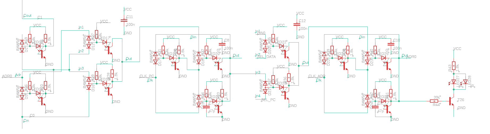

+++
title = "LCPU - A CPU in LED-Transistor-Logic (LTL)"
summary = "This projects tracks my efforts to develop discrete LED-Transistor logic building blocks and designing a CPU from them."
date = "2020-02-14T00:00:00"
draft = false
hackaday_url = "https://hackaday.io/project/169948-lcpu-a-cpu-in-led-transistor-logic-ltl"
featured = "featured.jpg"
showHero = true
heroStyle = "background"
layoutBackgroundBlur = false
+++
*This projects tracks my efforts to develop discrete LED-Transistor logic building blocks and designing a CPU from them.*

## Details

Many years ago I completed the challenge to fit a CPU into the smallest available CPLD on the market - the [MCPU](https://github.com/cpldcpu/MCPU). Ever since then I have been pondering about a new challenge in minimalism in CPU-Design. I had completed a TTL-based CPU even before the MCPU. Clearly, the only direction left is to go fully discrete and build a minimal CPU out of discrete transistors.

To make things interesting and add a modern twist, I decided to investigate a logic family that uses light emitting diodes (LEDs) as an active element. LTL is a logic family from a past that never happened. It combines 1950s transistor logic with low current green InGaN LEDs that were invented in the 1990s.

I already completed the design up to a prototype of a sub-system (see header image) and will use this project to document the steps I have taken to get there.

<!-- Start with the first log [**by using this link**](https://hackaday.io/project/169948-lcpu-a-cpu-in-led-transistor-logic-ltl/log/173872-rtl-vs-dtl-vs-ltl) or use [this link](https://hackaday.io/project/169948/logs?sort=oldest) to view all project logs on one page. -->

## Project Logs
### 1) RTL vs. DTL vs. LTL
<small>2020-02-14 14:55</small>

#### RTL versus DTL

Both RTL (Resistor Transistor Logic) and DTL (Diode Transistor Logic) were common logic families in the early days of transistors. The image above shows inverters in both logic families.

RTL is the simpler of the two, but it suffers from many issues: The L->H threshold is defined by the forward voltage of the base-emitter junction of the transistor and is hence rather low, around 600mV for a typical silicon transistor. Furthermore, if the input is at high level it will sink current which is supplied by the collector resistor of the preceding gate. To maintain consistent logic levels it is therefore necessary to adjust all resistors according to fan-out. Besides that, there is also a lot of nastiness in dynamic operation.

DTL addresses these shortcoming by introducing additional diodes: When the input is high, all the base current will be supplied by the base resistor (R5) and there is no current flowing into the gate. When the input is low, current is sourced from the gate, which is sunk into the transistor of the preceding gate. Since the transistor is fairly low-ohmic when it is turned on, there is much less limitation in fan-out. Furthermore, it is not necessary to adjust gate resistors depending on fan-out. This allows using the same resistor values throughout the entire circuit.

A second improvment in DTL is to lift the L->H threshold to a higher voltage. It is now defined by Vbe+Vd2+Vd1-Vd3, which is roughly 1.3V depending on the compenents used.

#### From DTL to LTL

The image above shows the circuit of an LTL inverter. At the first glance it looks very straightforward: We replace the two silicon diodes with a LED. Since the LED has a much higher forward voltage (depending on LED type), only a single diode is sufficient. This is nice, because it saves one component, but is it actually a good idea?

### 2) Optimizing the LTL gate
<small>2020-02-15 10:42</small>

Replacing the base diodes in an DTL gate with an LED saves one component. One very interesting side effect is that the LED also emits light. Modern LEDs are already quite bright at around 1mA of current, so the normal base current will be sufficient to turn it on.

But what is the impact on the circuit behavior? Usually we would like to use fast switching diodes for any logic circuit. Switching diodes are optimized for low capacitance and low recovery time to be able to switch very fast between forward and reverse operation. Here I am using a BAW56 dual diode, which has a capacitance of 2pF and 6ns reverse recovery time, as the input diode. LEDs are not optimized for switching operation. They typically have a fairly high capacitance of around ~40pF and take long time to be switched off. Therefore, using an LED in place of D2, the input diode, would slow down the gate significantly.

The base diode is, however, never in reverse operation. Therefore the bad switching properties of the LED are not an issue. In addition, the higher capacitance helps to pull down the base potential quicker if the transistor is to be turned off. You sometimes see intentional reach-through capacitors in parallel to the base diode in DTL gates.

Some attention has to be paid to the terminal between D1 and Q1 base. If the transistor is turned off, this terminal is pulled to negative voltage and is basically floating, since the base-emitter diode is reverse biased. I found that this can lead to a shift of switching voltage depending on duty cycle and frequency of the incoming signal. It may be advised to use a bleeder resistor to conntect this node to the ground. Due to simplicity, I omitted this and made sure to design glitch free logic instead...

I spent quite some time optimizing the basic gate in LTspice. To measure switching speed, I simulated a 5 stage ring oscillator. One crucial choice was to pick the right transistor, as I also outlined in [greater detail here](https://cpldcpu.wordpress.com/2020/02/14/what-made-the-cdc6600-fast/).

You can see simulation results for several different configurations above. I also tried various configurations with reach through caps and baker clamps but found that chosing the right transistor, the PMBT2369, yielded much better results that all other options. The PMBT2369 is available in a SOT23 SMD package for around $0.02, so there is really no reason to use the  BC847 or MMBT3904 over it.

Final parameters of the simulated inverter are shown above. The relatively high L->H delay is owed to the use of a relatively large collector resistor. Note that the threshold voltages are almost centered between the 5V supply and ground, maximizing noise marging and making the gate compatible to CMOS logic levels.

### 3) Characterizing a NAND2 gate
<small>2020-02-15 16:03</small>

I designed a neat breadboardable LTL-NAND2 gate to test the design in hardware. You can find the PCB layout and a photo of the finished product above. I use a BAW56 dual-diode in a SOT23 package for the input diode. This form factor is much easier to handle than single diode SMD packages and there is no cost disadvantage. You can see the LED in the center of the PCB. I made a few variation with different LEDs: green (high Vf) and red (lower Vf) and different collector resistors.

Transfer characteristics were measured by using the DAC and ADC of an ATtiny416. You can see that different LEDs can be used to adjust the threshold levels of the NAND2 gate. Red with a low forward voltage leads to a L->H threshold around 1.65 V while green as it 2.24/2.33V depending on collector resistor.

To build up more complex circuits it is also important to study the effect of output loading. The figure above shows the NAND2 gate with floating output and with another NAND2 gate connected to it. The threshold is slightly shifted for the loaded output, but not to a level of concern.

The scope picture above shows the transient switching behavior of a loaded NAND2 output with green LED and 8.2k collector resistor. One can see that there are actually two elements to the rising edge. Initially, the voltage rises quickly and is then followed be a slower slope. During the initial part, the 3.4k base resistor of the connected gate helps pulling up the output. However, after the threshold voltage is reached, the current from the base transistor flows into the base of the transistor and the output is only pulled up by the 8.2k collector resistor.

The behavior of the NAND2 gate with 1.8k collector resistor, as shown above, is more consistent and shows a fast rising edge up to Vhigh. I therefore decided to focus on using 1.8k as a collector resistor.

### 4) Characterizing LTL ring oscillators
<small>2020-02-15 17:33</small>

After characterizing a basic NAND2 gate, the next step is to measure the timing properties of the LTL gate. For this purpose I built a ring oscillator based on five gates. The PCB design is shown above. I added one additional inverter as an output buffer to avoid loading of the oscillator while measuring its frequency.

I built two versions of the ring oscillator: One with red LED and one with green LED, both using 1.8k collector resistors.

The scope screenshot shows the input (yellow) and output (turquoise) waveform of one inverter in the ring oscillator (green led). The falling edge is steep since it is actively pulled down by the transistor. The rising edge is, again, separated into two regions depending on wether only collector resistor or base and collector resistor are involved in pulling up the node.

The diagram above shows measurements of ring oscillator frequencies versus supply voltages. The blue line corresponds to the inverter with green LED, the orange line to a red LED. There is a clear trend towards higher frequency for higher supply, which can be explained by the availability of more switching current. The red LED LTL gate has a lower threshold voltage and does therefore switch earlier and faster.  Since this design is based on the PMBT2369 switching transistors, no dominant influence of base saturation is observered. LTL gates with normal small signal transistores should exhibit a speed-supply relationship similar to [what I observed with RTL](https://cpldcpu.wordpress.com/2020/02/14/what-made-the-cdc6600-fast/).

The supply current shows a linear relationship with supply voltage, as expected for a resistor-loaded gate.

The table above summarizes the charactization of the LTL gates. There is a tradeoff between high noise margin (green LED) and speed (red LED). All in all, the propagation delay looks very acceptable for discrete logic. At tp=6.9ns, the red LTL gate is almost as fast as the [RTL gate in a CDC6600](https://cpldcpu.wordpress.com/2020/02/14/what-made-the-cdc6600-fast/) and still much faster than the BC847 based DTL gates used in the [MT-15](http://www.6502.org/users/dieter/mt15a/mt15a_3.htm), while maintaining full 5V CMOS/TTL logic level compatibility.

Did I mention that each gate comes with its own blinkenlight?

### 5) Basic Gates in LTL
<small>2020-02-16 19:09</small>

After successful validation of the LTL concept in real hardware I started to build up a library of common gates in LTspice as a foundation for the design of a CPU.

The basic gate of LTL is the **NAND2 gate**. Symbol and circuit shown above. In my final design I used gates with different threshold level so I added a "G" to a high threshold device with a green LED.

Every gate was tested in a simple testbench in LTspice. I arbitrarily chose a fan out (FO) of 7 for the test case, although this does not occur in the real design.

Test waveforms for the NAND2 gate are shown above - nothing peculiar. There is a little crosstalk between the inputs of the gates if one input is high and the other one is pulled low. This is due to the extremely high slew-rate of the falling edge on the output. In a physical implementation this will hopefully be reduced a bit by additional parasitic capacitances to the power plane.

Next is the **NOR2 gate**. This can be easily realized by a wired AND of two LTL inverters. A minor but very important detail: If a gate uses a wired AND at the output, neither of the LEDs will be representative of the output signal. In practice this means that additonal indicator-LEDs may have to be added to monitor certain nodes.

Last one is the **AOI2 gate** ([AND OR INVERT](https://en.wikipedia.org/wiki/AND-OR-Invert)). You may not be familiar with this kind of gate, but it is a very useful building block due to it's simple implementation. For example, it can be used as a multiplexer or as part of an ALU.

Finally, a list of part counts for each gate. Since my intention is to build a CPU with a minimal amount of discretes, it is important to keep track of this.

Not too exciting, so let's get to the more special building blocks next...

### 6) XOR Gates
<small>2020-02-18 21:07</small>

As a next step we will look into options to design XOR2 gates in LTL.

A straightforward approach is to build a XOR2 gate from 4 NAND gates. This is simple and robust, but results in a propagation delay of three NAND2 equivalent. Not perfect for fast circuits. Also, the component consumption is quite high.

Another option is to use an [AOI2 gate](https://hackaday.io/project/169948-lcpu-a-cpu-in-led-transistor-logic-ltl/log/173945-basic-gates-in-ltl) and two inverters. The number of components is almost the same as the NAND2 implementation, but now the propagation delay is only two gates. Furthermore, often inverted signals are alrady available as output from a previous stage. In that case, the inverters can be omitted.

One approach that has been [discussed at length at the hackaday TTLers](https://hackaday.io/project/8449-hackaday-ttlers/log/150147-bipolar-xor-gate-with-only-2-transistors) is to use a cross coupled transitor pair, as shown above in a XNOR2 gate. This method is really tricky and drastically reduces the part count. In context of LTL there are a few challenges, though: The gate above is basically an RTL gate and will sink current when the input is high, which leads to a reduced fan-out. The threshold voltage is not defined relatively to ground, but in reference to the second input. The gate switches when the voltage difference between both inputs is equal to Vbe (~0.7V) - very different from the normal LTL threshold. Also, the output low level is 2xVCEsat instead of 1xVCEsat. The combination of all these effects leads to some headaches when designing circuits with several of these XNOR2 gates as they will start to influence each other and the noise margin degrades. A few changes have to be introduced to make this type of gate a bit more compatible to LTL.

An LTL version of a XOR2 gate based on a cross coupled transistor pair is shown above. First, this device has an output inverter to restore the low level. An input diode and resistor is added to avoid current sinking during high. To fix the threshold levels, two additional diodes were added (D1, D3). LEDs cannot be used in this place, because there are other elements in the current path (D1,D2, output transistor from preceding gate) that add to threshold voltage. The threshold level is still defined by the differential voltage between two inputs. This is still of concern, but a little less relevant now since the output levels have been restored. Assuming the input low level is 1xVCEsat, the threshold level is equal to VD1-VD3+VBE+D2+VCESat: 0.7+0.7+0.2 ~ 1.6V. This is much higher than the 0.7V of the bare transistor, however still not the same as the LTL threshold levels.

The three options are summarized above. Using a 3T XOR2 gate allows to reduce compenent count drastically, but still comes with some potential to screw up signal integrity. In practice often both inverted and noninverted input signals are available. In that case using an AOI2 gate is the most straightforward option and only adds 9 components.

### 7) Flip Flops / Latches
<small>2020-02-19 20:23</small>

Now to the last category of building blocks: Flip Flips.

If you grew up learning about digital electronics in the advanced CMOS era, like me, you will most likely be accustomed to using edge triggered flip flops for everything. Unfortunately, it turns out that proper edge triggered flip flop require at least 6 NAND gate equivalents, unless you have dynamic CMOS logic at your disposal.

For those of us who were suddenly beamed into the discrete LTL age, latches are a much more part count efficient solution, as they only consume about half as many components as a static edge triggered flip flop.

A commonly known minimal representation of a gated D-latch in NAND2 is shown above. See also [Wikipedia article](https://en.wikipedia.org/wiki/Flip-flop_(electronics)#Gated_D_latch). A nice propery of this design is that it only requires a single clock input and has both inverted and non-inverted data outputs. Data from Din is forwarded to the output while Clk is high. The state of the latch is frozen on the high->low transition of the clk and held while clk is low.

When using this design in high speed circuits it becomes apparent that it has a nasty habit of generating glitches. The origin of this effect is the NAND2 gate in the lower left. The clock signal arrives on one input directly and on the other it is delayed through the NAND2 gate in the top left.

This effect can be somewhat reduced by tweaking the propagation delay of the logic gates. In LTL this is easily possible by changing the LED color to change threshold voltage. In this case I introduced a faster "red" (hence the R) gate with lower threshold as the top left gate.

There is also a way to reduce gate count to three by replacing one of the NAND2 gates with a wired AND. This is described in a [now expired patent](https://patents.google.com/patent/EP0092663A2/en). (A similar design is described in [this patent](https://patents.google.com/patent/EP0219907A1/en))

The patent also describes to work around the aforementioned glitch by introducing one faster gate. A disadvantage of this design is that it is only has an inverted output. The clock input is also inverted compared to the previous design: Data will be forwarded for clk='0' and held for clk='1'.

One very important point of learning came out of actually simulating a full design including the latch and observing dynamic operation. To do this, it is necessary to perform a transient simulation in Spice - LTspice was used here. 

The figure above shows simulation results and modifications to the latch design that were applied as a result of the observations. The latch was used as part of a program counter here. The first line (in red) of the simulation traces shows the fourth bit (A3), the second line shows the sixth bit (A5). 

The leftmost column shows the results of the unmodified circuit. A3 looks nice and clean. However, A5 shows a series of negative spikes when the output is high. Interestingly, this behavior changes over time. It should be noted that this is mostly a cosmetic issue at this point, because the glitches are far away from the clock edge were the data is latched. Elminitating this effect should still be a priority as the additional noise may snowball into actual bit errors when the timing gets more tight. 

The culprit is the gate indicated by the red box, which receives a clock signal that is partially delayed by another gate. The lowermost trace shows the node directly at the base of the gates transistors. This node is basically floating when the gate is turned off, since both the LED and the base junction are reverse biased. You can see that it assumes a deeply negative potential. It appears that some of the charge on the node trickles away over time, making the gate more sensitive to spikes on the inputs. 

A solution to this issue is to make the gate in question "weaker", so it becomes less sensitive to transient conditionts at the inputs. I tried two ways of doing so: Increasing the base resistor (middle column) and by adding a small capacitor (right column). Ultimately I settled on the additional capacitor, because increasing the base resistor would reduce the current through the LED which makes the LED Vf unpredictable and reduces blinkyness (important!).

A case in point: Don't underestimate the trouble with latches. I settled on the design above for now, but would most likely look into further options when starting another design with LTL.

### 8) The Architecture
<small>2020-02-22 00:17</small>

Now that all the gates have been designed and tested, let's discuss the CPU architecture. I spent quite some time pondering about a minimal architecture that is catered to a LTL implementation. To make a long story short: I essentialy ended up at the [MCPU](https://github.com/cpldcpu/MCPU) architecture again. 

There are some ways to simplify the ISA or the datapath, for example by replacing the ADD instruction with something else (think Brainfuck) or reducing datapath width. All of these lead to an explosion in number of instructions needed to perform even the simplest operation, which will in turn increase memory size requirements and hence address path width. A nice example of this extreme are designs like the [Qibec](http://mircad.com/q/index.html), which is a very nicely done implementation of an "invert bit and branch" one bit [OISC](https://en.wikipedia.org/wiki/One_instruction_set_computer). While it reduces the datapath to one bit, the address path needs to be increased to 16 bit to allow any meaningful program. 

I may rant more about this at a later time, but in essence there seems to be little overall gain for these trade offs and all of them come at a great disadvantage in usability of the instruction set architecture.
I noticed way too late that I was actually not the first to implement the MCPU as a discrete CPU: The [ED-64](https://hackaday.io/project/7669-ed-64-a-discrete-8-bit-computer) is a very great looking implementation based on core memory. Kudos to Andrew for this great effort!

The original MCPU architecture is shown above. There are separate flows for the address and data-path. The state machine is not shown. Since this design is catered for a CPLD, it assumes edge triggered flip-flops for all registers.

The MCPU programmers model is based on two registers: Accumulator and PC. The ISA consists of four instructions in a fixed encoding that is based on a two bit opcode and a six bit memory address. This ISA can be directly mapped to the datapath shown above with minimal control overhead. See [MCPU link](https://github.com/cpldcpu/MCPU) for more information including assembler, emulator and example code.

In LTL it is much simpler to use latches instead of edge triggered flip flops. Introducing latches requires changing the design in some places to avoid race conditions where the input of the latch is dependent on its output. This is, for example, the case for the accumulator. The diagram above shows a latch-based architecture. The main modification is the addition of a data latch. The data latch is used to prevent race conditions for memory loads and accu-accu operations.

For implementation, I divided the design into three sections: The address path, the datapath and control. This modular architecture allows some freedom to modifify the CPU at a later time and add more instructions. Both data paths will be implemented in a bitslice architecture. This allows reconfiguring the CPU from 8 (data)/6 (address) to other configurations like 16/12 by just adding more slices.

### 9) Design of the address-datapath
<small>2020-02-22 10:29</small>

Implementation of the address path is straightforward based on the previously designed gates.

The first design of the adress path is shown above. A half adder is needed to increment the PC. Since the gates are relatevely fast, I used a ripple carry adder. There are two latches for address and PC respectively. An AOI2 gate is used as multiplexer between PC and external address. The address latch can be loaded with zeros by pulling both control inputs of the MUX to low. This can be used to reset the PC.

The image above shows the design after some optimization to reduce part count. Each slice consists of 12 NAND equivalents and 56 components total. Note that the carry delay was increased to two gates.

Six of the bit slices were combined in a testbench to test the design of the full width datapath. A two phase clock is needed to alternatingly clock both latches. In this setting the circuit is configured to reset the PC and then increment it with each clock cycle.

Output traces of clock, reset and the first two output bits are shown above. Everything works nicely.

### 10) Address-Datapath PCB Design
<small>2020-02-22 11:25</small>

Designing PCBs with regular structures using free tools turned out to be surprisingly tedious. In the end I used the free version of Eagle due to it's block feature which allowed replicating of circuit and layout units. The other options I looked at were EasyEDA and KiCad.

Unfortunately, the free version of Eagle is limited to a single sheet, so I ended up transferring my nice hierachical LTspice implementation into a single paged mess of a schematic. The image above shows a one bit slice.

Curiously enough, none of the many LEDs in the LTL gates represented the actual state of the address output pins. Therefore I introduced two additional indicator LEDs.

The final PCB layout is shown above. I managed to fit a four bit wide slice of the adress path into one 8,5x7cm^2 PCB.

A populated PCB is shown above. Since I am not too fond of placing all those parts by hand, I used an SMD assembly service. The finals stats are: 52 transistors, 48 diodes, 24 capacitors, 56 LEDs and  88 resistors.

### 11) Blinking action - testing the hardware
<small>2020-02-22 17:17</small>

Above you can see the an image of the hardware while it is operating. The red LEDs are part of the low threshold gates in the latches, while all other gates use green LEDs to set the threshold to ~2.3V.

A size comparison with a TTL ICs. The gate density on the PCB in NAND equivalants is slightly lower than what would be achieved with 7400 NAND gates. Something to be addressed for later iterations...

The scope image above shows the A0 and A2 output of the address unit with SEL_DATA=0 and SEL_PC=1. In this configuration, the PC is increased with every clock cycle. Here, a clock of 2 MHz clock was applied. Operation was also successful at 4 MHz. I was not able to test any higher due to limitations on the generator side. Obviosuly this would reduce when more 4 bit slices of the adress path are combined, because the length of the carry chain would increase. One can see from the signal shape that the operating speed is very much limited by the rising edge. Right now, the collector current is limited to 2mA. Increasing the collector current further would allow even higher clock rates at the expense of power. Introducing push-pull output drivers may also be an option.

Finally some blinking action, clocked at 2 Hz! Higher resolution [here](https://www.youtube.com/embed/OZjtm083uA4). The red LEDs on the left side of the PCB indicate the state of the address lines and are not part of any gate. You can see how the PC is counting up.

Btw, only after looking at this animation, I realized that the fast (red) gates actually reflect the output state of the latch, even though they are not connected to the output. So, next time I can omit additional indicator LEDs.

### 12) The data-datapath design
<small>2020-03-04 06:25</small>

Time for another update. Mind you, at this point I am not documenting work that was already done in the past, but am following my actual development in real time. Therefore updates will be spaced much further apart, depending on how much time I can devote top this project.

After finishing the adress-datapath design, it is time for the data-datapath.

The data-dapath encompasses the left side of the system design. The original M-CPU ALU was rather simple and only supported the two operations that were needed directly by the ISA: (Y,Cout)=A + B, Y=A NOR B.

However, I changed the datapath a little to allow use of latches in the design. As a consequence, all reads are directed through the ALU. Storing the accumulator to memory also requires data to pass throught the ALU. Therefore, in addition to the operations above, also Y=A and Y=B have to be supported. When looking at the detailed logic, this adds quite some overhead.

I lot of deliberation followed, also considering to merge accu+data latch into one edge triggered register as done in the original MCPU. The problem is, in that case an additional data input latch has to be added to the address-datapath. In the end it turned out to be more part-count efficient to stay with the latch based architecture.

Two different designs were evaluated in detail.

A first implementation option for a single bit of the data-datapath is shown above. This design implements a full adder consisting out of two XNOR2 gates, an inverter and an AOI2 gate. Y=A/Y=B/Y=A OR B is realized with an AOI3 based multiplexer in the first stage. The carry line can be fixed to zero or one by using the Sinv and Sadd control inputs. This allows configuring the second XNOR gate to invert the result, resulting in Y=A NOR B.

The table above shows the individual component usage. The total part count for this option is 80 per bit.

The second option I looked into is a bit more universial and uses an AND-OR-INVERTER based multiplexer for the first stage of the ALU. (EDIT: 20/03/28, updated to fixed version.) By using the four control signals, it is possible to generate any boolean functions, offering the possibility to extend the instruction set of the CPU at a later time. This design is, of course, heavily inspried from the [MT-15 ALU](http://www.6502.org/users/dieter/mt15a/mt15a_5.htm). Since the first stage is now also able to implement NOR, it was possible to remove the Sinv control signal. Instead only Sadd is present, which will inhibit carry generation if set to 0.

Component requirements are shown in the table above. The total number of components is 82, only two more than the less versalite first option. Therefore I elected to go with this option, since it allows more flexibility.

The design functionality was tested in the test bench above.

The image above shows carry propagation through all stages. The carry is low active. The carry propagation delay is approximately 11 ns per stage (45 ns total for 4 stages). Although this will propably increase in the real circuit due to more parasitics, it is a very reasonable result and suggests that an acceptably high clockspeed can be achieved even without resorting to a more elaborate carry chain architecture.

### 13) ALU board PCB Design
<small>2020-03-18 19:22</small>

The ALU board is quite a bit more complex than the datapath board. To still be able to meet a <10x10cm^2 footprint, the layout had to be densified compared to the adress-datapath board.

The circuit of one slice of the ALU board is shown above. The number if dual-diodes is quite high in this design due to wide-input AOI gates used as multiplexers for the boolean units. The XNOR gate on the right side is based on a cross coupled transistor pair. No LED could be used here due to stacking of several PN junctions in the current path.

Eagle was used for the layout, making extensive use of the block functionality. Since only a two layer PCB is used, a good strategy is needed to make the layout as tight as possible.

As a general rule, I used the front side for local interconnects and the power rails. Each slice was layouted with a fixed height of 0.65", which allows placing two gates between the power rails. Copper fill on both front and rear side is used for the ground plane. The rear side is only used for global routing (I/O and control signals).

After doing some estimations regarding copper line resistivity I noticed that it was possible to go to much smaller line widths.

The image above shows a comparison of the old and new polarity hold latch layout. The new layout is much more dense and takes 30% less PCB space. One interesting observation was that going from 0603 to 0402 resistors did increase the layout area, since it was not possible to pass connections below the components anymore. Therfore I stayed with 0603 passives. Using smaller transistor packages was not an option either, since I was not able to source the transitor in a smaller package.

The full layout, excluding ground plane, is shown above. Again, it was possible to fit four bit-slices on one board. In contrast to the previous design, I decided to include buffers for the control signals, located at the top. The fan out of the clock signal on this board is 8 gates. Combining several boards requires a clock tree for proper drive-ability.

The total PCB size is 10x7 cm^2, only marginally larger than the adress-board. Due to the more dense layout it contains 379 devices (75xT, 95xD, 67xLED, 122xR, 20xC) , 41% more than the datapath board.

Board render is shown above. The populated boards should arrive in a few weeks.

### 14) Testing the ALU Board
<small>2020-03-28 17:53</small>

Thanks to express shipping, the populated PCBs arrived less then a week after ordering them. A top down photo of one ALU board with 4 bitslices is shown below.

The dual-input diodes for the boolean unit multiplexer line up neatly in one row.

I tested the board using an ATMega168 to generate stimulus signals. Unfortunately, I found a small mistake I made earlier in the design: The generate term in the carry chain should not have an additional carry input, see below. Luckily it was easily possible to fix this by removing one diode per slice from the board. You can see the unpopulated pads in the center of the top down image.

Removing this signal would have allowed to densify the layout significantly and also add the carry-chain inverter to the output, so the carry signal is non-inverting. But well, next time...

The list below shows the control signal configurations that were tested. Only the first three cases apply to operations that are used by the MCPU ISA. In addition, Y=B is needed for address loading.
The other operations would allow for a later extension of the instruction set.

Clockspeed was tested up to 2 MHz. Even for the worst case (ADD with carry in=1), the signal integrity looked excellent, suggesting that also 4 MHz and higher may pass. One limitation seems to be in the pull-up capability of the clock driver with a fan-out of 8. It may be a good idea to reduce the collector resistor on high fan-out drivers or to design a push-pull driver.

Finally, the ALU board in action, repeating a sequence of ADD A,3 and NEG A:

### 15) Designing the Control Unit
<small>2020-04-27 20:30</small>

Designing the control unit is one of the more complex tasks in MCU design. What used to be a few lines of VHDL turns out to be a tedious task when boiling it down to discrete gates. Or maybe I need a better design flow...

Lets look at the problem at hand. The final LCPU will consist of an 8 Bit datapath and an 8 Bit adresspath. The upper two bits of the addresspath will be used for the opcode. Since both the data and the ALU board are 4 bits wide, two of each ports have to be used.

To complete the CPU, we need a control unit that outpus the right control signals in depends of opcode and state machine cycle.

The original MCPU has a rather simple control unit that consists of a state machine that is directly mapped to opcodes. Decoding of the states is localized at the datapath. Since the LCPU uses a bitslice approach, it is more efficient to also include decoding of states into control signal in a centralized control unit. Generally, that is a design choice that allows for extending of the design and easier bugfixing. In terms of robustness it would be better to do localized state decoding to reduce the number of control signals.

There are 8 ALU board control inputs (Carry In, CLK_ACCU, CLK_DAT, Aluctrl[4:0]) and one output (Carry Out). The address board has 4 control inputs (SEL_PC, SEL_DATA, nCLK_PC, nCLK_ADR) and two outputs (OPC1,OPC0 -> A[7:6]. 

The control board itself has a few internal registes for carry and states and inputs for a two phase clock (phi1,phi2) and reset.

As a first step, I mapped all control signals to states and clock sub-cycles. The LCPU is still able to execute every instruction in a maximum of two clockcycles, despite switching from edge-triggered FF to latches.

ALU control signal encoding in dependence of Opcode and state.

Many of the simpler control signal encodings could be directly mapped to single gates. In additional you can find three latches for Carry signal and state enconding here, in what could best be described as "sea of gates". Very tedious to layout on the PCB, but straightforward in implementation by using the building blocks I designed earlier.

Of much more interest is the AND-OR-INVERT logic array that is used to decode the more complex signals, specifically the opcode into ALU control signals. You can see the circuit below.

Instead of using double diodes I switched to single diodes to allow layout in a regular matrix. Input signals are routed vertically on the rear side,  output terms vertically on the front side. Typically both the inverted and non-inverted inputs signals are provided by means of the inverters on the left side. Each column represents a multiple input AND-gate (Minterm). By connecting the diodes not at all or to the positive or negative input signal it is possible to crate any convolution of AND-operation. The opon collecter inverters at the bottom perform a "NOR" operation on any number of input terms. By combining these, it is possible to implement any boolean operation with only minimal changes in the layout. I decided to populate also unused diodes in the matrix to allow for later fixability.

The full layout of the logic array is shown above. As you can see, the schematic represents the arrangement of the layout quite well. The density is quite good, the full layout is just 45x33mm^2. Even though the array itself does not use LEDs, the input and output inverters are true LTL gates, so that blinkyness is garuanteed!

For the sake of completness, the full schematics for the board level implementation are shown above. 

You can see the full board with a few annotations above. (This feels like annotating an IC...). Total size is 78x50mm^2. Off to manufacturing...

### 16) Testing the Control Unit
<small>2020-05-31 22:43</small>

The assembled control unit already arrived a while ago, but I only got around testing it today.

You can see a photograph of the PCB above. Unfortunately I already noticed a stupid mistake at this level: I forgot to route the reset signal to the I/O header. Since this was a circuit level mistake, no DRC caught this. Well, luckily that's easily fixed with an additional wire directly to the reset-driver.

Due to the construction of the logic array, there is a LED for every row (input) and column (minterm/output), creating a very nice regular structure. Every mintern has an output inverter and uses wired-AND as a combiner. See previous log on control unit design.

Verifying the control unit is not that easy due to the high number of outputs with irregular behavior in combination with several internal states. I used an ATMega168 microcontroller to exercise every possible sequence and record the outputs. 

Each of the four instructions is tested individually, once for carry high and once for carry low. The state of the carry flag only plays a role for the branch instruction. Each instruction test sequence consists of three cycles: In the first cycle reset is high to reset the state registers, then the instruction is clocked for two cycles to exercise both possible instruction states. (I also tested longer sequences to make sure the state machine jumps back to S0)

The full sequences are listed below. The output was verified in the true-and-tested "visual inspection of output waveforms" method, that is still completely ok for designs of this size. 

There is a slight misbehvaior of nCLKaddr during the first test sequence, but this is inconsequential and seems to be related to an issue with the test setup. Apart from that, everything was tested to work fine.

You can see the control unit in action above. Due to it's irregular pattern, this truely seems to be "peak blinkenlight".

The test of the control unit concludes the design of all major functional units of the LCPU: ALU, Adress path and control unit. 

Now on to a slightly more annoying part: Designing the backplane board. I still have no idea how to do it in a way that does not obscure all the nice LEDs. Apart from that, the backplane needs to hold the memory and I need to find a way to integrate bootloading and output in an efficient manner.

> Exported from Hackaday.io [LCPU - A CPU in LED-Transistor-Logic (LTL)](https://hackaday.io/project/169948-lcpu-a-cpu-in-led-transistor-logic-ltl)
