+++
title = "LED Coupled Logic (LCL)"
summary = "Reaching sub 1 ns propogation delay with LEDs and bipolar transistors."
date = "2020-11-30T00:00:00"
draft = false
hackaday_url = "https://hackaday.io/project/176107-led-coupled-logic-lcl"
+++
*Reaching sub 1 ns propogation delay with LEDs and bipolar transistors.*

## Project Logs
### 1) LED Coupled Logic
<small>2020-11-30 22:48</small>

I'll try to keep it brief. You have seen me investigate several [different style](https://hackaday.io/project/175015-discrete-nmos-logic-in-2020)s of [discrete logic](https://hackaday.io/project/170697-evaluating-transistors-for-bipolar-logic-rtl), including the weird DTL derivative [LTL](https://hackaday.io/project/169948-lcpu-a-cpu-in-led-transistor-logic-ltl).

One obvious omission was emitter coupled logic, ECL.

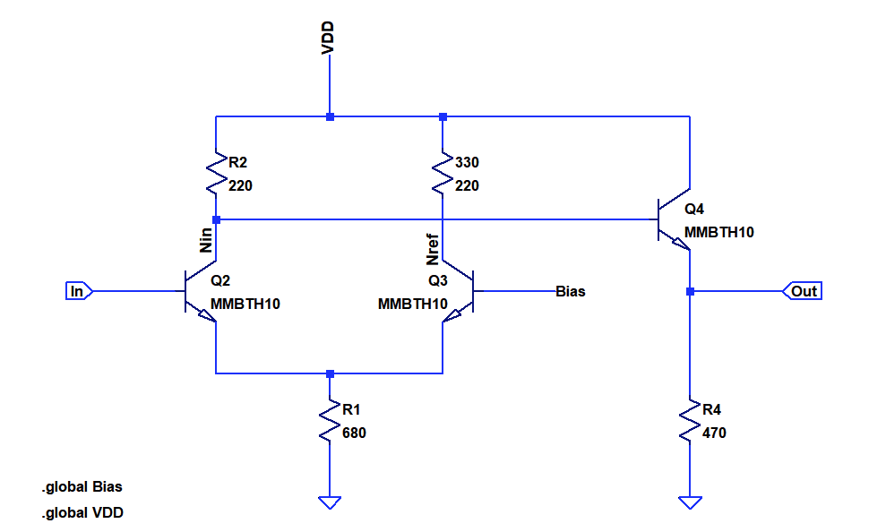

A basic ECL inverter is shown above. The key is the long-tailed pair on the left side, which acts as a saturating differential amplifier. The emitter follower formed by Q4 is used as a voltage buffer and sets proper input logic levels. The non-input branch of the input pair is typically tied to a reference voltages which is in-between logic low and high levels. Since ECL does not drive the transitors in saturation, it can be extremely fast. Due to high static biasing it is also extremely power hungry, roughly 10 mA per gate. The Cray 1, one of the most famous supercomputers was entirely based on integrated ECL logic.

Let's ponder about the right side of the differential pair (Q3). It does not only consist of a resistor and transistor, we need a static bias reference in addition. This adds a lot of components to what could be a simple RTL or NMOS inverter.

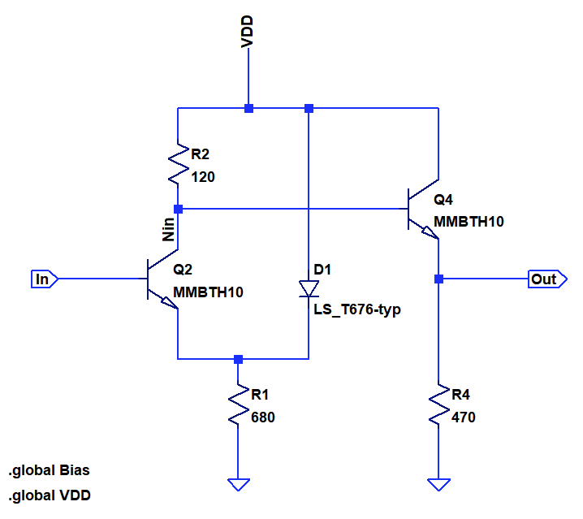

But who says we have to form a differential pair from two identical transistors? The circuit above shows an inverter formed from an assymmetric differential pair consisting of a LED and a bipolar transitor. The benefit of this is that it saves one transitor, one resistor and the bias reference.

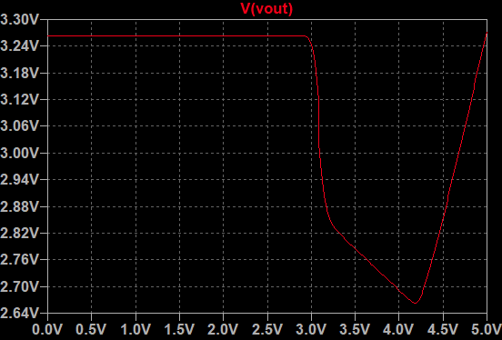

The plot above shows the input-output relationship of the inverter. The threshold level is at 3.0V, the high level is at 3.25V, while the low level is at 2.8V. The output voltages increases again if the input is driven far above Vh. This  behavior is similar to ECL.

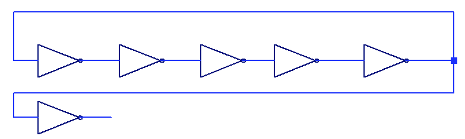

To test the propagation delay, I simulated a simple 5 stage ring oscillator.

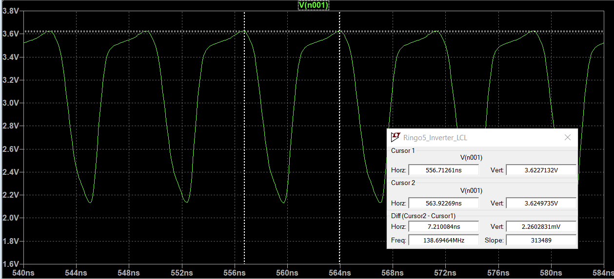

Oscillator frequency is 138.7 MHz, which means that the tpd is 720ps. There is some overshoot, which appears to increase voltage swing. 

Just like for ECL and RTL, the basic gate for this logic style is a NOR gate. The output buffer allows combing the outputs of several gates to form a wired AND.

### 2) PCB
<small>2020-12-01 22:42</small>

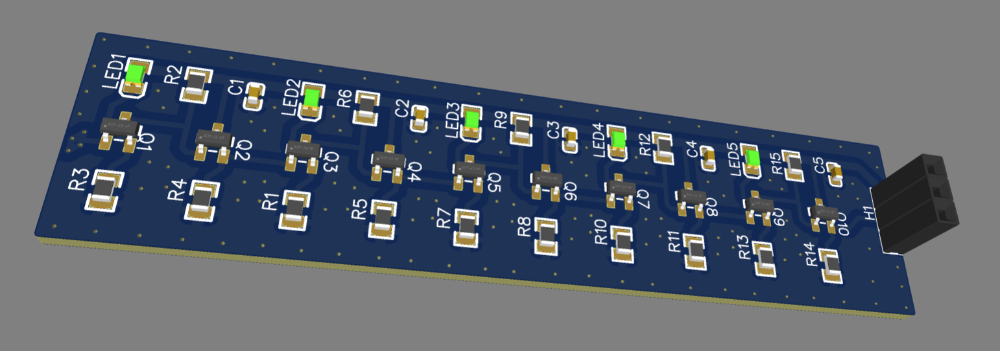

Should arrive in a couple of weeks, fully assembled.

### 3) RINGO5 Characterization
<small>2020-12-12 12:59</small>

The assembled PCBs arrived after just 11 days. This is a short summary of the circuit characterization.

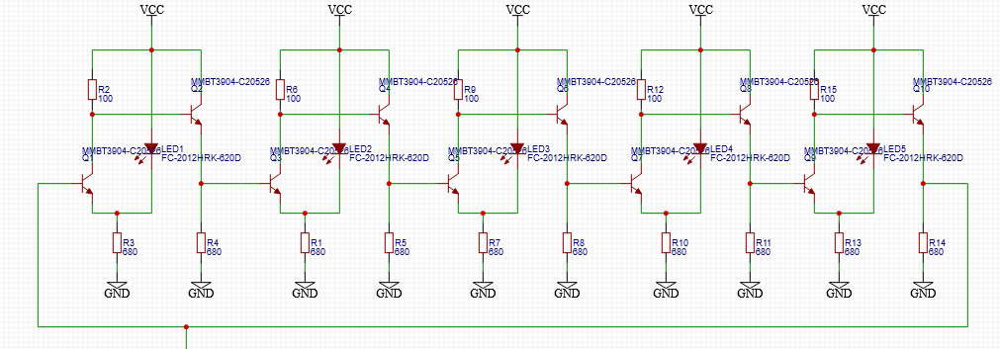

The full circuit of the five stage ring oscillator is shown above. I used MMTBH10 HF-Transistors in the actual built instead of the MMBT3904 that are shown in the circuit diagram. Since the source follow provides a low impedance output, I did not add an additional output driver and attached the scope directly to the output of the rightmost inverter.

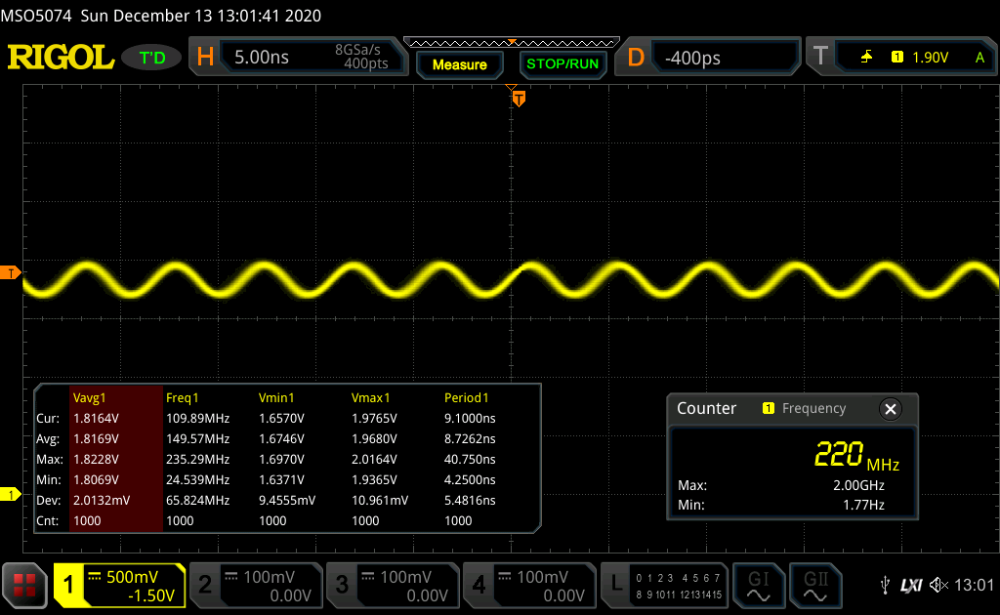

The two trace above show the ring oscillator at VDD=2.7V, the minimum voltage where it oscillates and at 5V.

| Vdd [V] | Idd [mA] | Vavg [V] | Vmin [V] | Vmax [V] | Swing [V] | Freq [MHz] | tpd [ns] |
|---------|----------|----------|----------|----------|-----------|------------|----------|
| 2.7     | 18       | 1.81     | 1.68     | 1.95     | 0.27      | 222        | 0.45     |
| 3       | 22       | 2.08     | 1.92     | 2.25     | 0.33      | 213        | 0.46     |
| 3.5     | 28       | 2.57     | 2.41     | 2.72     | 0.31      | 176        | 0.56     |
| 4       | 35       | 2.96     | 2.65     | 3.25     | 0.6       | 144        | 0.69     |
| 4.5     | 42       | 3.38     | 2.9      | 3.85     | 0.95      | 115        | 0.86     |
| 5       | 47       | 3.82     | 3.08     | 4.54     | 1.46      | 100        | 1        |

Detailed measuremt results are shown in the table above. A minimum of 2.7V is needed for the oscillator to start oscillating. This seems to be governed by the forward voltage of the (red) LEDs. At this supply voltage there is very little voltage swing at the summing node of the differential pair, meaning that the inverter essentially works as a common emitter amplifier. At 450 ps, the extracted tdp is quite low, but it's arguable wether we are seeing digital switching. The output looks like a clean sine. One issue may be that the impedance of the scope probe is too low at the harmonics and is remove any edges. I need to look into an impedance matched set up.

Going to higher frequencies we see an increase in output voltage swing, but a reduction of frequency. At 5V the tpd is still at a respectable 1000 ps.

### 4) RINGO9 Characterization
<small>2020-12-12 13:56</small>

I used 9 inverters from two RINGO5 boards to build a single ring oscillator with 9 stages. Due to the lower oscillating frequency, the individual inverters are able to reach a more steady state during switching.

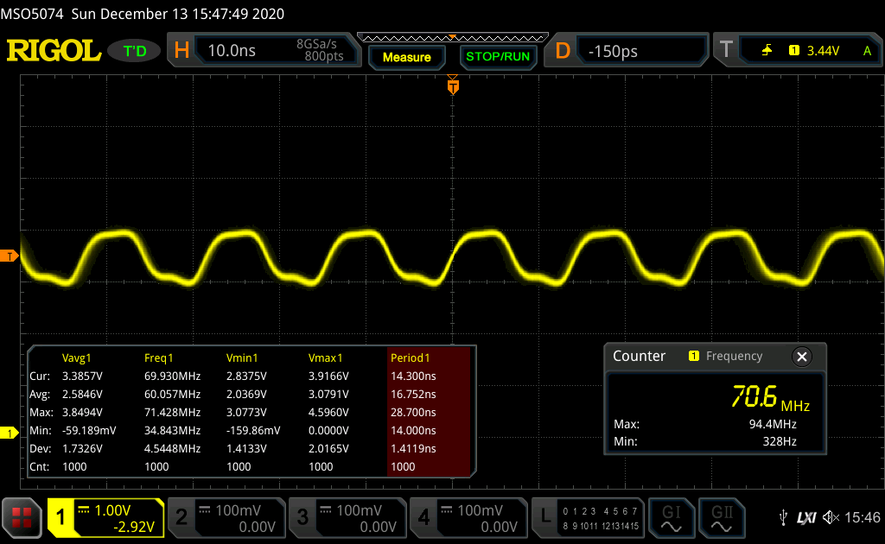

The output at VDD=4.5 V is shown above. The waveform does now rather resemble a digital switching signal.

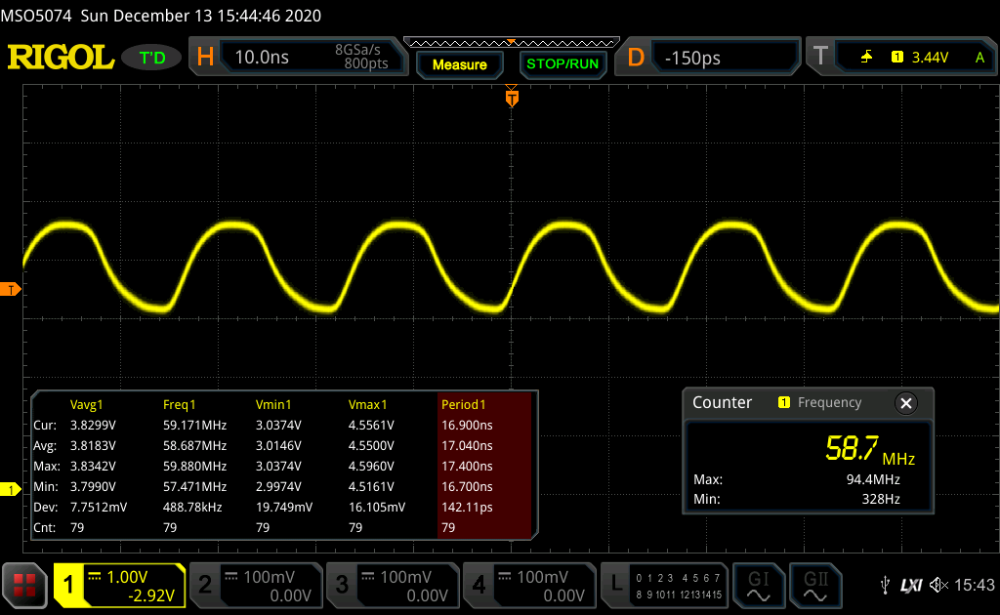

The output for VDD=5 V is above.

| Vdd [V] | Idd [mA] | Vavg [V] | Vmin [V] | Vmax [V] | Swing [V] | Freq [MHz] | tpd [ns] |
|---------|----------|----------|----------|----------|-----------|------------|----------|
| 4.5     | 80       | 3.36     | 2.86     | 3.83     | 0.97      | 70.7       | 0.78     |
| 5       | 92       | 3.81     | 3.01     | 4.54     | 1.53      | 58.6       | 0.94     |

The tpd and logic levels are very similar for the RINGO5 and RINGO9 confirming sub 1ns tpd for the LCL inverter.

### 5) Current Mode Logic with Transistor/Diode Pairs
<small>2021-02-24 07:09</small>

Found in the Motorola High Speed Switching Transistor Handbook from 1963. Looks like LCL was pre-anticipated by implementations with germanium transistors and diodes.

The book is extremely interesting - the best book on discrete bipolar logic I have seen so far. It goes way down into theory and device physics:

[https://archive.org/details/High-speedSwitchingHandbook](https://archive.org/details/High-speedSwitchingHandbook)

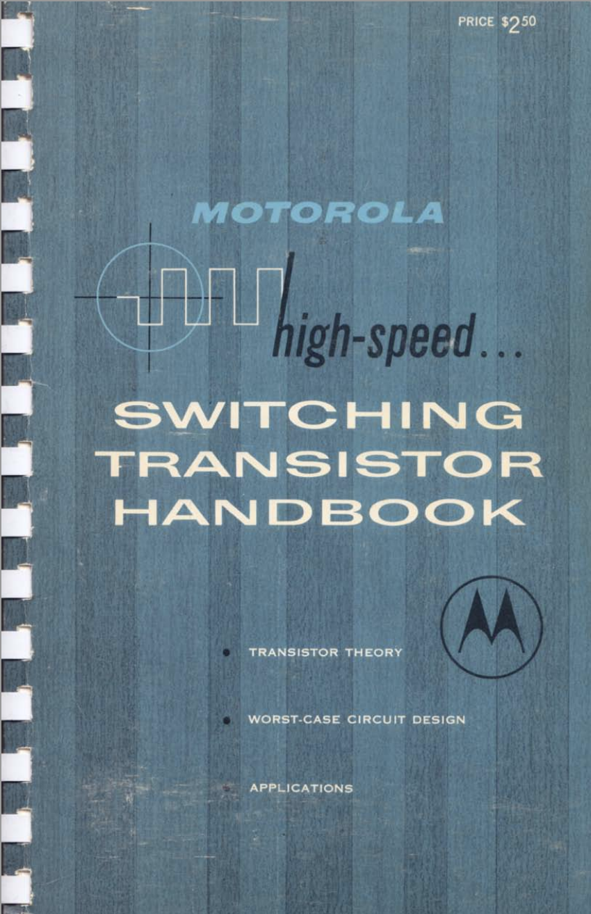

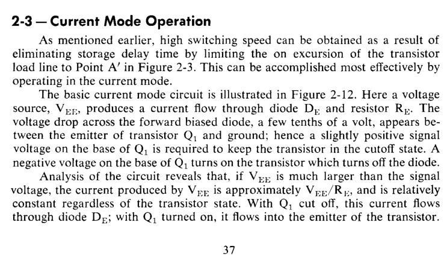

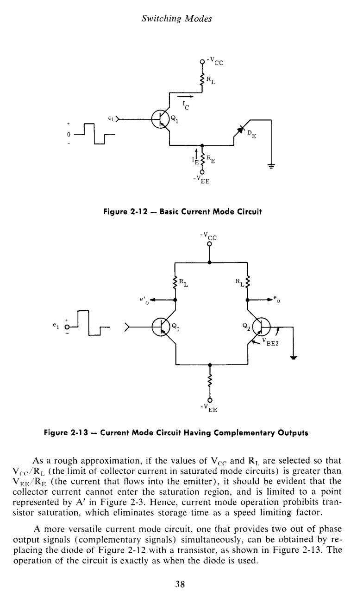

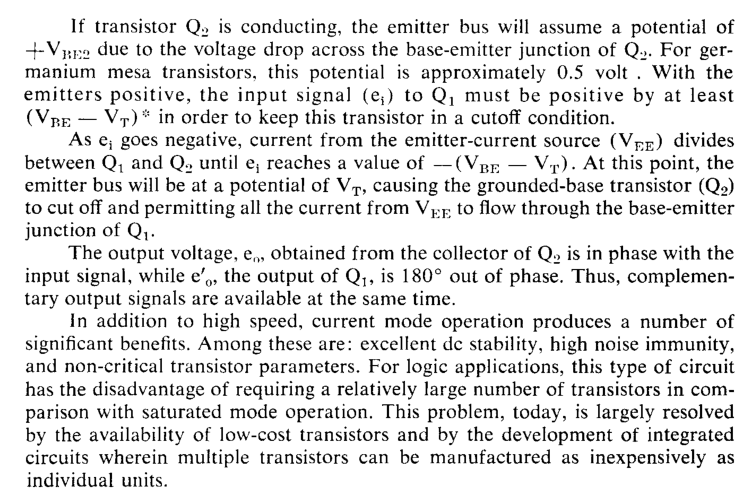

> Exported from Hackaday.io [LED Coupled Logic (LCL)](https://hackaday.io/project/176107-led-coupled-logic-lcl)
