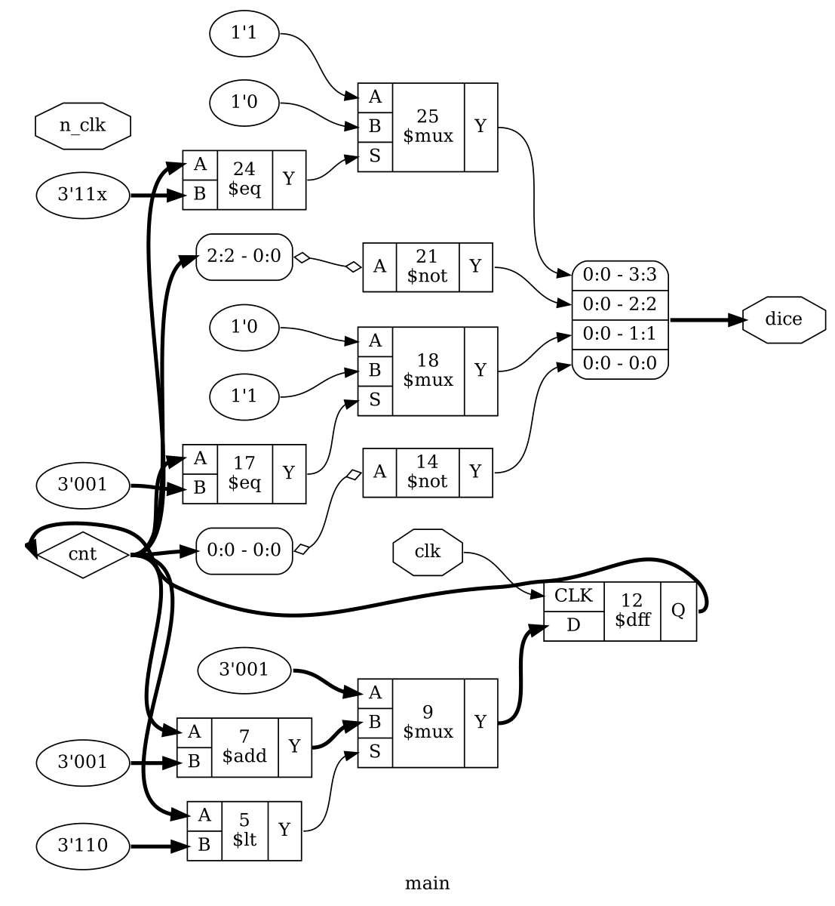
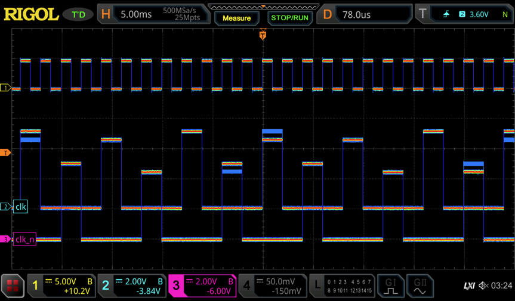

+++
title = "NE555 Dice Inversion"
summary = "A modern-day reimagining of the NE555/CD4017 electronic dice"
date = "2021-12-12T00:00:00"
draft = false
hackaday_url = "https://hackaday.io/project/183038-ne555-dice-inversion"
featured = "featured.png"
showHero = true
heroStyle = "background"
layoutBackgroundBlur = false
+++
*A modern-day reimagining of the NE555/CD4017 electronic dice*

## Details

**This is for the [NE555 "timer" contest](https://hackaday.io/contest/182830-555-timer-contest)**

You  probably came across electronic dice do-it-yourself kits many times. The design of those has remained virtually unchanged for decades. All of them are based on exactly two ICs: A NE555 and a CD4017.


*Two examples found on the internet*

The CD4017 is a counter that is used to cycle through the states. The counter output is converted to the die pattern using a combination of diodes, resistors and transistors. An oscillator based on a  NE555 generates counting pulses when the die is activated.

Isn't that a bit limiting? The NE555 surely can do more than being a sidekick to the CD4017. In this project we will bring the NE555 to it's full potential and implement the entire dice using only NE555s. Along the way I also found a nice new job for the CD4017 as a two phase clock generator.

This is a companion project to the [NE555 microprocessors](https://hackaday.io/project/182915-555enabled-microprocessor) to actually test the logic style in real hardware.

# *The 2021 NE555 Electronic DICE*


## Project Logs
### 1) The Design
<small>2021-12-20 22:26</small>

Bringing the NE555 into the future also means using modern tools. We'll describe the functionality of the dice in VHDL and use [PCBFlow](https://github.com/cpldcpu/PCBFlow) to synthesize the digital description into an implementation based on [NE555 logic](https://hackaday.io/project/182915-555enabled-microprocessor).

At the same time this will also be the first "real life" test of NE555 logic, as the MCPU is a bit too complex and large to detect basic errors with the logic style.

```ruby
library ieee;
use ieee.std_logic_1164.all;
use ieee.numeric_std.all;

--  1     2     
--  3  0  3
--  2     1

-- Encoding:
-- 001  1
-- 010  2
-- 011  1,2
-- 100  2,3
-- 101  1,2,3
-- 110  2,3,4

entity dice555 is
    port (clk:    in    std_logic;
          n_clk:    in    std_logic;
          dice: out std_logic_vector(3 downto 0)

    );
end;

architecture main of dice555 is
    signal  cnt:    unsigned(2 downto 0);
begin
     process (clk,n_clk)
    begin
        if rising_edge(clk) then
            if cnt < 6 then
                cnt <= cnt + 1;
            else
                cnt <= "001";
            end if;
        end if;
    end process;

-- drive inverted LEDs
dice(0) <= NOT cnt(0);
dice(1) <= '1' when (cnt = "001") else '0';
dice(2) <= NOT cnt(2);
dice(3) <= '0' when (cnt = "11X") else '1';

end;
```

The VHDL source of the dice is shown above. Basically it consists of a counter, counting from 1 to 6 and repeating, and an encoder for the dice pattern.


```javascript
   Number of cells:                 18
     ne_DFF                          3
     ne_NAND2                        7
     ne_NAND3                        2
     ne_NOT                          6

   Chip area for module '\main': 39.000000
```

Logic after synthesis:



```css
.SUBCKT main clk n_clk dice.0 dice.1 dice.2 dice.3
X0 cnt.0 dice.0 ne_NOT
X1 cnt.2 dice.2 ne_NOT
X2 cnt.1 1 ne_NOT
X3 cnt.2 cnt.1 dice.3 ne_NAND2
X4 cnt.0 dice.3 2 ne_NAND2
X5 dice.0 cnt.1 3 ne_NAND2
X6 dice.2 1 4 ne_NAND2
X7 dice.3 3 4 5 ne_NAND3
X8 5 6 ne_NOT
X9 cnt.0 1 7 ne_NAND2
X10 3 7 8 ne_NAND2
X11 dice.3 8 9 ne_NAND2
X12 9 10 ne_NOT
X13 cnt.0 dice.2 1 11 ne_NAND3
X14 11 dice.1 ne_NOT
X15 clk 6 cnt.2 ne_DFF
X16 clk 2 cnt.0 ne_DFF
X17 clk 10 cnt.1 ne_DFF
.ENDS main

```

### 2) Simulating the circuit and introducing a two phase clock
<small>2021-12-20 22:31</small>

So far, so good. Unfortunately I ran into some issues here, as the circuit proved quite glitchy during spice simulation. A lot of digging revealed that the setup and hold times of the NE555 latches were somewhat unpredicatable due to the slow speed and under some circumstances the register was not updated during a clock cycle. Each register is implemented by a master-slave flip-flop and simply using an normal and inverted clock signal proved to be unreliable.

In the end I managed to fix this by introducing a non-overlapping two phase clock, driving master and slave latch of each register separately. The simulation below shows the functionality of the dice, cycling through all six die patterns. The two clock signals (clk and n_clk) are shown at the bottom


### 3) Finally a use for the CD4017: A clock generator
<small>2021-12-20 22:34</small>

Well, now that the job of the CD4017 in the dice is taken by the NE555, what can we do with the CD4017? Indeed, there is a perfect match for using it has a generator for the two non-overlapping clocks:


### 4) Placement and PCB Layout
<small>2021-12-20 22:40</small>

Now that the design topics have been fixed and the circuit works in simulation, we can continue to generate a layout. Again, using PCBflow will output a preliminary PCB with placed components:


```php
Microcell counts:
ne_NOT      21
ne_WAND2     7
ne_TBUF      6
ne_WAND3     2
```

Component usage

```bash
Component           Count

pin                 8
NE555               21
cap                 21
resistor            27
diode               20
npn transistor      6
------------------  -----
Total:              103
```

Well, i'd say it's a bit more than a dice with the old role-models of NE555 and CD4017 require, but who are we to judge? Still small enough to comfortably build and test.

Still some work to do manually: Add the LEDs for the dice, add the CD4017 clock generator footprint, add groundplane and let the autoroute do its (admittedly gut-wrenching) job.

And here we are, with a nice simulation of the full PCB. A modern rendition of the classic NE555/CD4017 based electronic dice.


### 5) One more thing: NE555 ANDN2 Logic
<small>2021-12-20 23:04</small>

I was made aware of [Erics earlier work on NE555](http://www.paleotechnologist.net/?p=530) based logic. He actually came up with a pretty neat trick to turn the NE555 into more than just a boring inverter by also using the reset input of the NE555. This results in a logic function based on an AND-gate with one inverted input:


The naming of this type of gate is debatable, but I call it "ANDN2" in my library. It is actually fairly easy to implement this gate in PCBflow as well. I made a version of the dice where I enforced the AND2 and NOT gate to be the only type of logic gate being used:

```javascript
   Number of cells:                 19
     ne_ANDN2                       10
     ne_DFF                          3
     ne_NOT                          6

   Chip area for module '\main': 31.000000
```

Turns out the area is even smaller than withe the Diode/NE555 gates I used before. The reason for that is that no additional space is needed for diodes.

Unfortunately I had a lot of trouble simulating this logic style with spice. So instead of debugging issues with operating point I decided to take the pragmatic way and turn this into a board to test it rather in hardware.  A rendering of the board is shown below. (I miss-spellt the gate type on the silk screen).


```diff
=== Component usage ===

Component           Count

pin                 8
NE555               22
cap                 22
npn transistor      6
resistor            18
------------------  -----
Total:              76
```

This logic style requires a slightly higher count of NE555, 22 instead of 21. Not a bad trade-off, because many diodes are saved.

I should be able to test both versions in about two weeks.

### 6) Validating Actual Hardware
<small>2022-01-02 04:05</small>

#### The PCB in all its glory


#### Validation

First step is to test the clock generation. The scope image below shows how the CD4017 generates the nonoverlapping two phase clock (clk and clk_n) from the input clock signal. It appears that the CD4017 is able to operate only up to ~1.3 MHz, so maximum generated output clock is around 300 kHz. This is not a big issue since this is still far beyond the capabilities of NE555 logic.




Apart from raising the voltage, another fix would be to increase the base resistor value of the pass-gate devices in the latch or introducing some NE555 as clock drivers. Of course, a much cleaner way would be to construct latches from diodes and NE555 [like mike has done in his project](https://hackaday.io/project/183172-an-8-bit-binary-counter-made-from-555-timer-chips). But this would raise the number of NE555 further.

#### Dice action!

All said and done, see below for a short clip of the dice operating in NE555 logic!


And another logic type proven in practice! Would I use it for other designs? Probably not. The area consumption is huge, cost is quite high, power consumption is higher than even RTL (~70 mA for the dice) and it is by far the slowest logic type I ever investigated.

Unfortunately the version I built based on ANDN2 gates does not seem to work properly. Some more debugging is needed to figure out the root cause.

### 7) And one more thing II
<small>2022-01-08 11:48</small>

[Yann](https://hackaday.io/whygee) pointed out in a comment that a Johnson counter may be a good way to save some gates in the logic implementation of the dice. Currently a simple binary counter is used.

To be honest, it seems that I mistakenly thought of Johnson counters being simple ring counter with one flipflop per state, when in fact they are a nice concept to reduce the number of flipflops needed for a counter by two compary to a ring counter. Even the [Wikipedia entry throws Johnson counter and ring counters into one category](https://en.wikipedia.org/wiki/Ring_counter), which is a bit confusing.

A fairly nice property of a Johnson counter implementation is that it is possible to implement a counter that comes with a natural sequence length of 6, exactly what we need for the dice. So, in contrast to the binary counter, no additional logic is needed to limit the sequence length.

Some caveats

1. The sequence is not in order, since it does not follow binary encoding
2. The sequence contains "000", which is currently not decoded as a valid face figure on the die.
3. There are illegal states of the counter, so it has to be initialized

1) is not really an issue, since we want to randmize the die anyways. So we just accept that the sequence is different. 2) can be solved by inverting the middle bit. See below. 3) requires is to add a reset input. But the NE555 comes with a reset input anyways, so that is almost for free.

```nginx
Sequence    johnson counter      middle bit inverted    dice pattern
Seq1            000                     010                 2    
Seq2            001                     011                 3
Seq3            011                     001                 1
Seq4            111                     101                 5
Seq5            110                     100                 4
Seq6            100                     110                 6
```

Here comes the VHDL implementation of the modified dice:

```ruby
architecture main of dice555johnson is
    signal  cnt:    unsigned(2 downto 0);
begin
     process (clk,n_clk,nreset)
    begin
        if nreset = '0' then
            cnt <= "000";
        elsif rising_edge(clk) then
            cnt <= cnt(1 downto 0) & NOT cnt(2);
        end if;
    end process;

--  1     2     
--  3  0  3
--  2     1

-- Encoding:
-- 011  0
-- 000  1
-- 001  0,1
-- 110  1,2
-- 111  0,1,2
-- 100  1,2,3

-- drive inverted LEDs
dice(0) <= NOT cnt(0);
dice(1) <= '1' when (cnt = "011") else '0';
dice(2) <= NOT cnt(2);
dice(3) <= '0' when (cnt = "100") else '1';

end;
```

And here are the design stats after synthesis:

```javascript
   Number of cells:                  9
     ne_DFF_clear                    3
     ne_NAND3                        2
     ne_NOT                          4

   Chip area for module '\main': 23.000000
```

Spice netlist

```css
.SUBCKT main clk n_clk nrst dice.0 dice.1 dice.2 dice.3
X0 cnt.1 1 ne_NOT
X1 cnt.2 dice.2 ne_NOT
X2 cnt.0 dice.0 ne_NOT
X3 1 cnt.2 dice.0 dice.3 ne_NAND3
X4 cnt.1 dice.2 cnt.0 2 ne_NAND3
X5 2 dice.1 ne_NOT
X6 clk nrst dice.2 cnt.0 ne_DFF_clear
X7 clk nrst cnt.0 cnt.1 ne_DFF_clear
X8 clk nrst cnt.1 cnt.2 ne_DFF_clear
.ENDS main
```

Compared to the stats of the original implementation with binary counter:

```javascript
   Number of cells:                 18
     ne_DFF                          3
     ne_NAND2                        7
     ne_NAND3                        2
     ne_NOT                          6

   Chip area for module '\main': 39.000000
```

Quite impressive! Thanks for the tip, Yann. Will I build this? Probably not, I trust that it would work and I think owning one NE555 based electronic dice is already enough :)

Edit: Digital simulation output is shown below. Please note, that the dice output is inverted since the LEDs are active low. I found a tiny bug, which is fixed above.


> Exported from Hackaday.io [NE555 Dice Inversion](https://hackaday.io/project/183038-ne555-dice-inversion)
