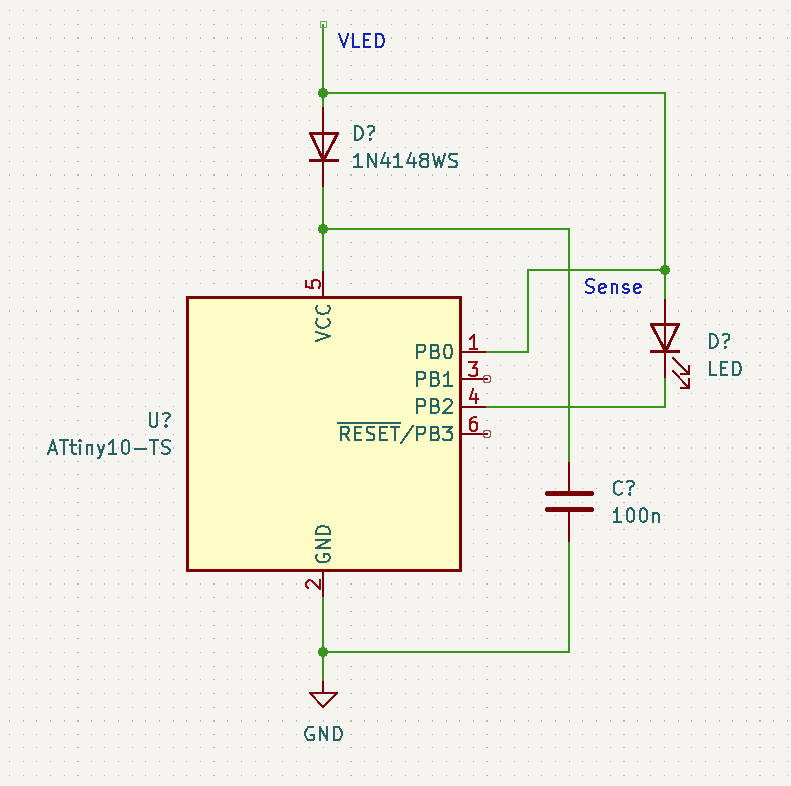

+++
title = "Powerline Controlled LED Strings"
summary = "Analysis of a RGB LED string and recreating its functionality"
date = "2022-01-23T00:00:00"
draft = false
hackaday_url = "https://hackaday.io/project/183709-powerline-controlled-led-strings"
featured = "featured.jpg"
showHero = true
heroStyle = "background"
layoutBackgroundBlur = false
+++
*Analysis of a RGB LED string and recreating its functionality*

## Project Logs
### 1) Emulating the powerline control scheme with a MCU
<small>2022-01-24 18:00</small>

This is a simple approach how to emulate the behavior of the LEDs with a microcontroller.



Data is sent by pulling VLED to GND for a few us. While VLED is at GND, the diode is in revese direction and the remaining charge from the capacitor will power the microcontroller. The capacitor is recharged after VLED is pulled to positive voltage again.

The Sense input on PB0 can directly sense the signal from VLED. In case there are concerns because of V(PB)>VCC, another diode may be inserted. But the voltage differential is only ~0.6V, which should still be acceptable.

The LED is driven by PB2. When VLED is pulled to GND it will turn off. A resistor for current limiting should be added as well.

If you are very adventerous, you could also omit the diode. In that case, the MCU will be powered by the ESD diode on PB0, which should also charge the capacitor via the VCC pin.

### 2) Nasty Hack: A Powerline Controlled LED with an ATtiny10
<small>2022-01-30 21:25</small>

After outlining an idea how to implement powerline control with an ATtiny10 in the previous log, I did of course have to try it. Especially since a rather nasty hack is involved.

#### The Hardware

**The objective** is to create a two terminal device with an LED that receives both power and control information via a single line.


My test setup is shown above. The top is a breakout board with an ATMega328P and USB to serial converter (Sometime also known as "Arduino Nano Clone"). The bottom breadboard contains the target circuit with an ATtiny10, a capacitor, LED and series resistor.

Note that there are only two connections to the lower board: **VLED** (connected to PB0/D8 of the ATMega328) and **GND**.


The full circuit of the lower board is shown above. Notice the mistake? There is no connection to the power input pin VCC!

Well, of course this is the "Nasty Hack". The ATtiny10 has an internal diode connecting PB2 to VCC (shown in red). The purpose of this diode is to short ESD pulses to the power rail. It is also the reason why you are not supposed to apply voltages higher than VCC+0.5V to any input pin. Operating the MCU like this can have nasty side effects, and I am pretty certain that Atmel Microchip will not endorse it at all.

When VLED is larger than VCC plus the diode voltage, it will charge the parallel capacitor. When VLED is pulled low, the diode will be in reverse direction and the microcontroller can be supplied from the capacitor.

Apart from abusing PB2 to power the MCU, it will also be used to sense the logic level of VLED. PB1 is used as output to control the LED. Note that the LED is supplied from VLED and not the capacitor and hence will only light up when VLED is high.

#### The Software

To keep things simple we will limit the functionality to only turning the LED on and off. During normal operation, VLED will be "High", pulling it down for a short time shall toggle the LED.

```cpp
/*
* Attiny10 Powerline LED
* Created: 30.01.2022 18:49:11
* Author : tim
*/ 

#include <avr/io.h>
#include <avr/interrupt.h>

int main(void)
{    
    DDRB |= _BV(PB1);  // Set PB1 as output. LED is connected to PB1

    EICRA |= _BV(ISC00) | _BV(ISC01); // Activate INT0 on rising edge
    EIMSK |= _BV(INT0); // Enable INT0 in mask register

    sei();

    while (1) 
    {
    }
}

ISR(INT0_vect, ISR_NAKED)
{
    PINB |=_BV(PB1);    // Toggle LED on PB1
    reti();
}
```

The **ATtiny10 firmware** is shown above. I am using INT0 to detect a rising edge on PB2 (which INT0 is connected to) and call the interrupt handler. The interrupt handler uses the pin toggle function of the ATtiny10 to turn the LED on or off. Note that I did not change the clock setting at all, meaning that the ATtiny10 is clocked at its default 1 Mhz.

Firmware for ATMega328 (controller board on top):

```cpp
// Generate pulses on PB0/ D8

#include <avr/io.h>
#include <util/delay.h>

void sendpulse(void);

int main(void) {
    DDRB |= _BV(PB0);

    while (1) 
    {
    sendpulse();
    _delay_ms(1);
    }
}

#define basetime_us 10

void sendpulse(void) {
        PORTB &= ~_BV(PB0);
        _delay_us(basetime_us);
        PORTB |= _BV(PB0);
        _delay_us(basetime_us);    
}

```

The **ATMega328p firmware** simply sends low pulses with a duration of 10uS to PB0, where VLED is connected.

#### 

#### Testing the Contraption

As a first test, I connected an additional power line to VCC of the ATtiny10 to ensure that the software works.


The yellow trace ("vsig") on top corresponds to VLED. We can see that it is mostly in Hi state with short low pulses. Every pulse toggles the state of the LED, as intended. The voltage at VCC is 4.6V - apparently there is some voltage drop in the ATMega328 board and/or the USB port that is used to power it.


Repeating the same experiment without the connection to VCC releals exactly the same behavior. The ATtiny10 is powered only by the parasitic supply through PB2 and the capacitor now. Yay, it works!

The voltage on VDD dropped to 3.8V now, corresponding to a ~0.8V voltage drop in the ESD circuit, the internal diode. 


Zooming a bit further in, we can see that the voltage on VCC is dropping when VLED is low, because the MCU is only supplied from the capacitor. It is quickly recharged after VLED returns to high level. There is a short delay between the rising edge of VLED and toggling of the LED due to interrupt latency.

The voltage drop on the 100nF capacitor is around ~75mV for the entire 10uS pulse.

Since Ivcc = (C * DeltaV) / t we get 100 nF * 75 mV / 10 uS=**Ivcc = 0.75 mA.**This is reasonably close to the datasheet value for the current consumption of the ATtiny10, which is 0.6mA for 5V. It may be advisable to reduce the clock speed of the ATtiny10 further to minimize current draw from the capacitor.

If the control signal consists of pulse trains with equal High and Low timing, then the capactior should be recharged faster than it is discharged. Right now, recharging takes around 25us, which is still too long.


Trying the same without external capacitor failed. We can see that VCC quickly drops down to approximately 1V, where the ATtiny 10 stops operation. Understandibly, the remaining parasitic capacitance in the micrcontroller is not able to supply a current of 0.75mA for very long. The MCU may be able to operate without external capacitor when reducing the current draw, by lowering clock speed, and reducing the maximum allowable pulse time to the minimum. The minimum pulse time still needs to be longer than one IO clock cycle, as otherwise the interrupt logic will not be able to latch the rising edge, though.

#### Conclusions

Seems that the Hack works and we can abuse an ATtiny10 as a powerline LED controller with minimal external components. This is obviously just a proof of concept. As a next step it would be of interest to implement a more elaborate communication protocol that allows connecting multiple devices.

Of course, we could also use an external Schottky-Diode, so we don't have to abuse the ESD device. The benefit would be that the MCU is stressed less and the capacitor is recharged faster. But where is the fun in that?

> Exported from Hackaday.io [Powerline Controlled LED Strings](https://hackaday.io/project/183709-powerline-controlled-led-strings)
