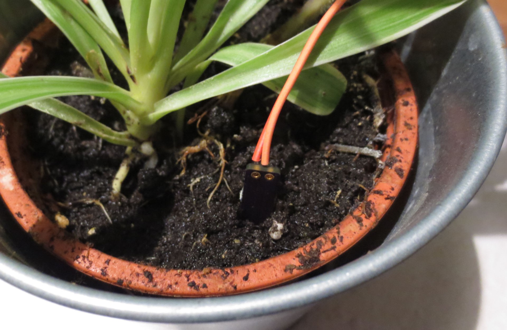

+++
title = "Sensors Based on the Padauk RFC Peripheral"
summary = "Exploring the undocumented Resistance to Frequency Converter (RFC) peripheral of the Padauk PFS173 Microcontroller"
date = "2020-09-14T00:00:00"
draft = false
hackaday_url = "https://hackaday.io/project/174822-sensors-based-on-the-padauk-rfc-peripheral"
featured = "featured.png"
showHero = true
heroStyle = "background"
layoutBackgroundBlur = false
+++
*Exploring the undocumented Resistance to Frequency Converter (RFC) peripheral of the Padauk PFS173 Microcontroller*

## Project Logs
### 1) Identifying Undocumented I/O Registers
<small>2020-09-14 22:38</small>

Padauk is a Taiwanese supplier of ultra-low cost microcontrollers, notorious for the ["3 cent MCU"](https://cpldcpu.wordpress.com/2019/08/12/the-terrible-3-cent-mcu/). The supplier itself only offers a closed tool chain with a proprietary C-style language. In the mean time, an [open sourced and independently created tool-chai](https://free-pdk.github.io/)n, partially based on reverse engineering, became available.

There are still some areas that are not completely understood. One topic is the initial state of the I/O registers. The behavior of the real device is somewhat inconsistent to the datasheet, which may be due to an errata or due to different behavior of the proprietary and open toolchain.

To investigate this behavior in detail on the Padauk PFS173-S16,  a small program was used to copy the entire I/O space to the RAM directly after startup. Since no indexed access of the I/O registers is possible, individual instructions had to be generated to copy each address.

After proper initialization of the MCU peripherals, the I/O area back up is dumped via the serial port.


### 2) Investigating the RFC
<small>2020-09-14 23:22</small>

The [documentation found earlier](http://www.htsemi.com/xiazai.aspx?aa=/include/upload/download/_20180709113738742.pdf&bb=PTBO165CXXS) by [JS](https://www.eevblog.com/forum/blog/eevblog-1144-padauk-programmer-reverse-engineering/msg3231126/#msg3231126) provides a basic functional explanation and has a list of registers, but is a bit light on details. Nothing that can't be investigated...


The image above shows my interpretation of the "C-type" operation of the RFC. Basically it consists of a  schmitt trigger  and a ground switch. If an RC-couple (as shown) is connected between the IO-pin and the positive supply, the input voltage will slowly increase according to the RC time constant. If a certain trigger voltage is reached, the ground switch will short the input to ground until the lower trigger voltage is reached. Each time this happens, the counter increases by one. Effectively, this circuit forms a [relaxation oscillator](https://en.wikipedia.org/wiki/Relaxation_oscillator). 

By evaluating the number of counts during a fixed interval, it is possible to measure changes in the capacitance or resistance.


The table above shows the register mapping. The control register allows selecting the specific pin. Bit 4 needs to be written to to start and stop the counter.

```cs
__sfr __at(0x2d)          _rfcc;
__sfr __at(0x2e)          _rfccrh;
__sfr __at(0x2f)          _rfccrl;

#define RFCC              _rfcc
#define RFCCRH            _rfccrh
#define RFCCRL            _rfccrl
```

Register mapping is shown above.  Using the RFC is rather simple, as shown below:

```cpp
RFCC = 0xc0 | 0x08 | 0x02 ; // Select PB6, set to C-Mode, enable output

uint16_t result;
RFCC|= 1<<4; // start RFC
_delay_ms(50);
RFCC&=~(1<<4); // stop RFC
result=(RFCCRH<<8)|RFCCRL;
```

The scope picture shows the voltage on the RFC pin during operation. In this case a 100nF capacitor and 10 kOhm resistor were connected in parallel to VDD.


It can be cleary seen that the charging of the RC element follows an exponential. The upper trigger voltage is 4V, the lower trigger voltage is ~700 mV. The origin of the ringing at the lower voltage is not clear to me, it seems to be an artifact of the RFC peripheral.

The impedance of the ground switch seems to be relatively high. In this case, with the 100nF capacitor, it takes about 11 us to discharge.


When using a lower capacitor value, the counting frequency increases propertionally. The minimum discharge time seems to be 1 IHRC cycle (IHRC was 16 MHz in this device = 62.5 ns). In that case a voltage undershoot to 0V is observed. It is clear that operation of the RC oscillator will be instable when the reset voltage is not properly defined. It seems to be advised to adjust the capacitance value so that the reset time is either below one IHRC cycle (reset voltage will be 0V), or significantly above (reset voltage will be 700 mV).


An additional parameter of interest would be how the oscillator frequency changes with supply voltage.

I measured the frequency of an oscillator with R=10 kOhm and C=100nF for different values of VDD.


Great, looks like the RFC works exactly as (not) advertised. What can we use it for?

### 3) Light Sensor based on an LED
<small>2020-09-14 23:31</small>

Using [LEDs as light sensors](https://en.wikipedia.org/wiki/LED_circuit#LED_as_light_sensor) is a hack tried by many. If operated under reverse bias conditions, LEDs act as photodiodes. Due to their small size, the generated photocurrent is extremely small, so some tricks have to be employed to measure it.


The RFC allows for a very simple implementation. The circuit is shown above - the LED is connected with the anode to the RFC pin and the cathode to VDD. During the reset, the ground switch will charge the junction capacitance of the LED to 0.8xVDD negative bias. The photocurrent generated in the LED will slowly discarge this capacitance until the upper threshold is reached. The photocurrent is directly proportional to the number of counts within a certain time internal.


I tested the concept with a red 5mm LED. Counting time was 500 ms. With these settings it was clearly possible to discern different light level from total darkness to direct bright light as shown in the table above.

Since the GPIO can be reconfigured, it would be possible to use an LED in dual function as a light detector and indicator without having to add additional parts.

A quick estimation how much current we are measuring:

- Total charge in the charge LED is given by Q=C*V. Then we can calculate the Photocurrent by Iph=Q/tcnt, where tcnt = twindow/cnts, the time for a single count.
- => Iph = cnts*C*V/twindow
- The total discharge voltage is 5* (0.8-0.2) = 3V (Upper-lower trigger voltage)
- Let's assume 50pF for the LED junction capacitance + parasitic capactiance of the breadboard.
- Twindow= 500ms

=> Iph = cnts * 50pF*3V/500ms = cnts * 300 pA

One count corresponds to only 300 pA of photocurrent!

Of course, there are numerous imperfections in this set up, including leakage currents and nonlinear C(V) behavior, so we cannot expect a highly linear light sensor from this. But it should be sufficient if only a threshold needs to be detected.

### 4) Capacitive Soil Moisture Sensor
<small>2020-09-14 23:32</small>

One curious type of sensor that can be realized with simple means is a soil moisture sensor to monitor wether plants need to be watered. A simple way of achieving this is to measure the soil resistivity with two electrodes. Unfortunately that is not very reliable due to corrosion of the electrodes.

A much better approach is a capacitive sensor, for example as shown [here](https://www.switchdoc.com/2020/06/tutorial-capacitive-moisture-sensor-grove/). The sensing principle exploits the fact that water has a much higher (~80) relative dielectric constant than dry sol or air (~1). The sensing element consists of a planar capacitor that is directly inserted into the soil. This can be very easily realized by copper traces on a PCB that is insulated with solder resist. Coincidentally I found a sensing element that I designed years ago. The layout is shown here:


Below you can see how it is inserted into a potted plant.



Since this sensor is essentially a variable capacitor, it can be easily read out with the RFC peripheral. Since the capacitance of the sensor is relatively low, I chose a resistor of 47 kOhm to achieved a reasonably low frequency.

Of course, the resistor does also directly influence current consumption of the oscillator, hence choosing a larger resistor is sensible. 


The table above shows counts for a counting time of 40ms. The sensor capacitance vs. air is only about twice as high as the parasitic capacitance on the breadboard ("no sensor"). The counts strongly decrease in presence of water and its easy to distinguish a freshly watered plant from one that already dried up slightly.


One bonus experiment to verify that the sensing principle is indeed capacitive: I deposited a drop of isopropyl alcohol on the sensor and monitored counts over time as shown above. Isopropyl alcohol has a dielectric constant between that of air and water and is well isolating. Accordingly, the counts sharply drop after application of the drop due to an increase of sensor capacitance. The alcohol slowly evaporates which leads to a steady increase of counts over time proportional to the loss of volume.

In summary, the RFC seems to be well suited for this application. Time for a design project?

> Exported from Hackaday.io [Sensors Based on the Padauk RFC Peripheral](https://hackaday.io/project/174822-sensors-based-on-the-padauk-rfc-peripheral)
